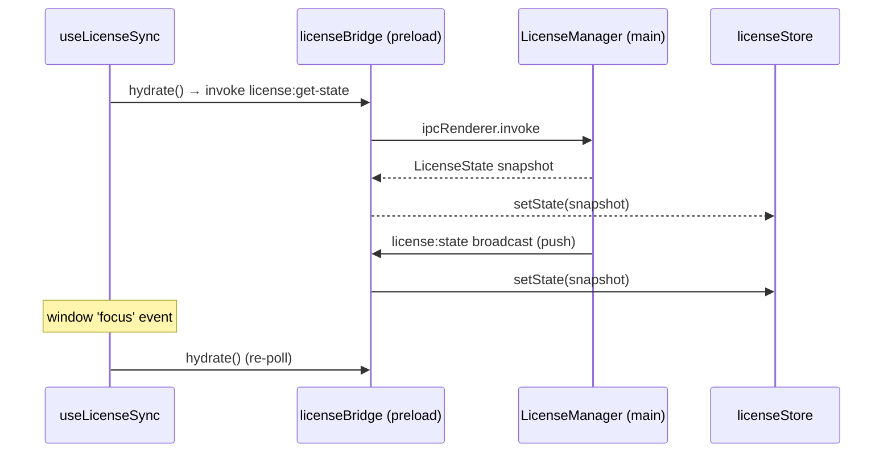

# useLicenseSync

> Source: `src/hooks/useLicense.ts`

## Overview

`useLicenseSync` keeps `licenseStore` in sync with the main process's
authoritative license state. The renderer never owns license logic — it
hydrates once on mount, listens for push updates over IPC, and re-polls
when the window regains focus (e.g. laptop wake-from-sleep).

## Hook signature

```ts
function useLicenseSync(): void;
```

The hook returns nothing; consumers read the resulting state via
`useLicenseStore(selector)`.

## Behavior

### Boot path

```ts
useEffect(() => {
  void hydrate();
  const unsub = licenseBridge.onChange(setState);
  const onFocus = () => void hydrate();
  window.addEventListener('focus', onFocus);
  return () => {
    unsub();
    window.removeEventListener('focus', onFocus);
  };
}, [hydrate, setState]);
```



### Why focus polling

`LicenseManager` re-evaluates state every minute and broadcasts on
change. After laptop sleep, the timer can miss a tick and the renderer
holds a stale state until the next change. Hooking `focus` covers that
gap — when the user comes back to the window, we re-hydrate
unconditionally.

### Mount placement

The hook is called from `WorkspaceLayoutInner`, the topmost component
inside `EditorProvider` / `SidebarProvider`. Mounting deeper would
risk multiple subscriptions if the component re-mounted.

## Underlying bridge

The `@/lib/license-bridge` module wraps `window.apolloMapStudioLicense`
exposed via `electron/preload.cts`:

```ts
licenseBridge.getState(); // → Promise<LicenseState>
licenseBridge.activate(code); // → Promise<ActivationResult>
licenseBridge.deactivate(); // → Promise<LicenseState>
licenseBridge.onChange(handler); // → unsubscribe fn
```

When running in the browser (no Electron preload), the bridge falls
back to a stub that yields a permissive trial state — so the web build
never sees a license gate.

## Examples

### Reading status anywhere

```tsx
import { useLicenseStore } from '@/store/licenseStore';

function StatusBadge() {
  const status = useLicenseStore((s) => s.state.status);
  const canEdit = useLicenseStore((s) => s.state.canEdit);
  return (
    <span>
      {status} {canEdit ? '✓' : '✗'}
    </span>
  );
}
```

### Imperative activation

```ts
import { licenseBridge } from '@/lib/license-bridge';
import { useLicenseStore } from '@/store/licenseStore';

const result = await licenseBridge.activate(code.trim());
useLicenseStore.getState().setState(result.state);
```

The `ActivationDialog` does exactly this.

## Related

- [licenseStore](/api/store/license-store)
- [Activation dialog](/api/components/activation-dialog)
- [License banner](/api/components/license-banner)
- [Electron license manager](/api/electron/license-manager)
- [Electron preload](/api/electron/preload)
