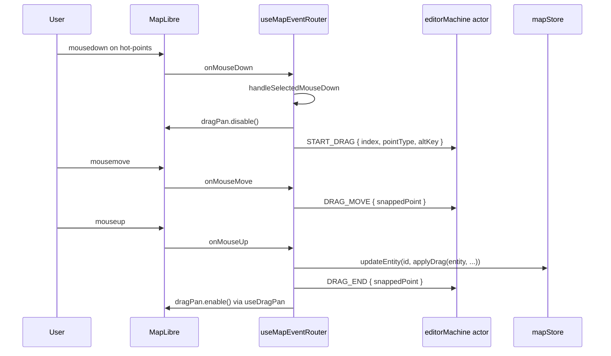

# useMapEventRouter

> Source: `src/hooks/useMapEventRouter.ts`

## Overview

`useMapEventRouter` is the single conduit between MapLibre canvas
events and the editor FSM. It captures `mousedown` / `click` /
`mousemove` / `mouseup` / `dblclick` / `zoomend` / `keydown`, runs
state-aware logic (snap, hit-test, drag, dblclick dedup, connect-mode
click), and dispatches the result as FSM events. Helpers split out
into `mapEventRouter/` keep each concern small enough to unit-test.

## Hook signature

```ts
function useMapEventRouter(
  mapRef: React.RefObject<maplibregl.Map | null>,
  actorRef: ActorRefFrom<typeof editorMachine>,
  bridgeRef: React.RefObject<SpatialWorkerBridge | null>,
): void;

// Re-exported for tests
export { isDuplicateInput };
```

## Behavior

### Local state per mount

```ts
let mouseDownScreenPos: { x: number; y: number } | null = null;
let centerGrabOffset: [number, number] | null = null;
let lastDrawInput: InputSample | null = null;
const cursorScheduler = createCursorScheduler();
```

| Variable             | Purpose                                                                             |
| -------------------- | ----------------------------------------------------------------------------------- |
| `mouseDownScreenPos` | Distinguish click vs. drag via pixel threshold                                      |
| `centerGrabOffset`   | Lock cursor-to-center delta during center drag                                      |
| `lastDrawInput`      | Dedupe near-simultaneous mousedown / click that the browser fires before `dblclick` |

### Event mapping (by FSM state)

| Event       | `idle`                  | `selected`                           | `editingPoint`                 | drawing states                |
| ----------- | ----------------------- | ------------------------------------ | ------------------------------ | ----------------------------- |
| `click`     | hitTest → SELECT_ENTITY | hot-points → ignore; else hitTest    | ignored                        | MOUSE_DOWN with snapped point |
| `mousedown` | —                       | selectionDrag (vertex/handle/center) | —                              | (drawBezier only) MOUSE_DOWN  |
| `mousemove` | clear snap target       | hover-grab cursor on hot-points      | DRAG_MOVE                      | MOUSE_MOVE                    |
| `mouseup`   | —                       | —                                    | DRAG_END + commit via mapStore | MOUSE_UP                      |
| `dblclick`  | DOUBLE_CLICK            | DOUBLE_CLICK                         | DOUBLE_CLICK                   | DOUBLE_CLICK                  |
| keyboard    | see `keyboard.ts`       |                                      |                                |                               |
| `zoomend`   | uiStore.setCurrentZoom  |                                      |                                |                               |

### dblclick dedup

::: warning Footgun: native dblclick double-fires
The browser fires `mousedown → click → mousedown → click → dblclick`
on a real double-click. Without dedup, our draw FSM would receive two
extra MOUSE_DOWN events and add ghost vertices on either side of the
final commit point. The router uses `isDuplicateInput(prev, next)`
from `mapEventRouter/inputDedup.ts` — if a sample is within
4px / 350ms of the previous, we drop it.
:::

```ts
const sample = sampleInput(e);
if (isDuplicateInput(lastDrawInput, sample)) {
  lastDrawInput = sample;
  return;
}
lastDrawInput = sample;
actorRef.send({ type: 'MOUSE_DOWN', point: applySnap(toLngLat(e)) });
```

`onDblClick` resets `lastDrawInput = null` so the next click after a
commit isn't dropped.

### Click vs. drag classification

`onClick` checks the pixel distance between `mouseDownScreenPos` and
the click event. If it's larger than `CLICK_THRESHOLD_PX`, we suppress
the click — it was actually a drag, not a tap.

### Selection drag

`handleSelectedMouseDown` (from `selectionDrag.ts`) decides whether a
`selected`-state mousedown should:

- Drag a vertex / handle (`hot-points` hit) — sets `START_DRAG` with
  the vertex index.
- Drag the entity body (`hot-fill` hit) — sets `START_DRAG` with
  `pointType = 'center'`, `index = -2`, and returns the
  `centerGrabOffset` so the entity follows the cursor delta instead of
  snapping its center under the pointer.
- Alt+click a vertex — fires `TOGGLE_SMOOTH` and toggles bezier handle
  symmetry via `entityMutations.toggleSmooth(...)`.

### Snap during edit

`applySnap(map, actorRef, lngLat, excludeId)` only snaps when:

- `uiStore.snapEnabled` is true, and
- FSM state is `editingPoint` or any drawing state.

`excludeId` is the currently-edited entity — we never snap to our own
geometry, otherwise the vertex would refuse to leave its origin.

### Double-click commit

```ts
const onDblClick = (e: maplibregl.MapMouseEvent) => {
  e.preventDefault();
  lastDrawInput = null;
  actorRef.send({ type: 'DOUBLE_CLICK', point: applySnap(toLngLat(e)) });
};
```

`e.preventDefault()` prevents MapLibre's built-in double-click zoom.
`useMapLibreInit` also constructs the map with `doubleClickZoom: false`
as belt-and-suspenders.

### Sequence diagram — vertex drag



### Connect-mode click

The first thing `onClick` checks (after the threshold filter) is
`handleConnectModeClick(...)`. If connect-mode is active, the lane
hit-test runs and the handler may exit early with `true` — preventing
the rest of `onClick` from emitting select/draw events. See
[connectMode internals](/api/hooks/map-event-router-internals).

### Subscribers

```ts
map.on('mousedown', onMouseDown);
map.on('click', onClick);
map.on('mousemove', onMouseMove);
map.on('mouseup', onMouseUp);
map.on('dblclick', onDblClick);
map.on('zoomend', onZoomEnd);
window.addEventListener('keydown', onKeyDown);

const unsubSnap = useUIStore.subscribe((s, prev) => {
  if (prev.snapEnabled && !s.snapEnabled && s.currentSnapTarget) {
    useUIStore.getState().setSnapTarget(null);
  }
});
```

The snap-toggle subscription clears the indicator the instant the user
disables snap — without it, the last ring would linger until the next
mousemove.

## Examples

### Mounting

```tsx
useMapEventRouter(mapRef, actorRef, bridgeRef);
```

`bridgeRef` must point at an active `SpatialWorkerBridge` for hit-test
to resolve — otherwise `workerHitTest` returns `null` and click never
selects an entity.

### Disabling dblclick zoom (already done)

```ts
new maplibregl.Map({ ...opts, doubleClickZoom: false });
```

This belongs in `useMapLibreInit` — `useMapEventRouter` assumes it.

## Related

- [Map event router internals](/api/hooks/map-event-router-internals)
- [editorMachine FSM](/api/core/editor-machine)
- [Spatial worker bridge](/api/core/spatial-bridge)
- [entityMutations](/api/components/map-canvas)
- [Snap module](/api/core/geometry-snap)
- [uiStore](/api/store/store-ui)
