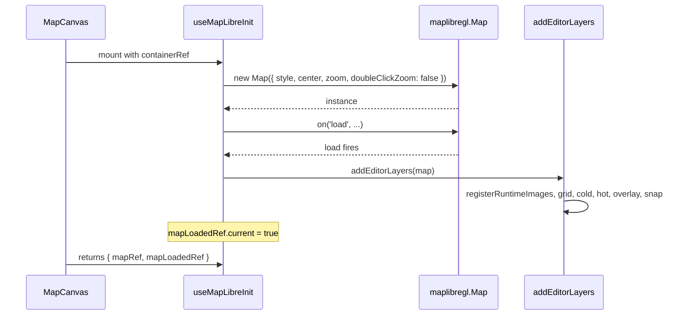

# useMapLibreInit

> Source: `src/hooks/useMapLibreInit.ts`

## Overview

`useMapLibreInit` constructs the MapLibre `Map` instance, binds it to a
container DOM node, registers all editor-owned sources and layers
(grid, cold, hot, overlay, snap), and exposes refs the rest of the
canvas hooks consume. It also keeps a few runtime style properties in
sync with `settingsStore` (e.g. `cold-lane-arrows.symbol-spacing`).

## Hook signature

```ts
function useMapLibreInit(containerRef: React.RefObject<HTMLDivElement | null>): {
  mapRef: React.MutableRefObject<maplibregl.Map | null>;
  mapLoadedRef: React.MutableRefObject<boolean>;
};
```

`mapRef` is non-null after the effect runs; `mapLoadedRef` flips to
`true` inside the map's `'load'` callback. Other hooks read both — the
`mapLoadedRef` guard is what keeps cold-layer / overlay writes from
firing before MapLibre has painted its first frame.

## Behavior

### Initialization

```ts
const map = new maplibregl.Map({
  container: containerRef.current,
  style: DARK_STYLE,
  center: readMapCenter(),
  zoom: readMapZoom(),
  doubleClickZoom: false,
});

map.on('load', () => {
  mapLoadedRef.current = true;
  addEditorLayers(map);
});
```

| Option            | Source                                                |
| ----------------- | ----------------------------------------------------- |
| `container`       | Caller-provided container ref                         |
| `style`           | Inline `DARK_STYLE` (see `mapLibreInit/assets.ts`)    |
| `center`          | `readMapCenter()` from `settingsStore`                |
| `zoom`            | `readMapZoom()` from `settingsStore`                  |
| `doubleClickZoom` | `false` — required so the FSM owns dblclick semantics |

### Layer setup

`addEditorLayers(map)` (from `mapLibreInit/layers.ts`) calls in order:

1. `registerRuntimeImages(map)` — install `zebra-stripe`, `red-hatch`,
   `lane-arrow` SDF icon, plus async `registerMapIcons(map)` for all
   action / element icons.
2. `addGridLayer(map)` — `grid` source + `grid-line` layer (initially
   `visibility: 'none'`).
3. `addColdLayers(map)` — the eight `cold-*` layers driven by
   `COLD_LAYER_FILTERS`.
4. `addHotLayers(map)` — `hot-fill`, `hot-line`, `hot-points`.
5. `addOverlayLayers(map)` — `overlay-fill`, `overlay-line`,
   `overlay-points`, `overlay-handles`, `overlay-handle-lines`.
6. `addSnapLayers(map)` — `snap-ring` and `snap-dot`.

::: tip Why no basemap tiles
The studio has no online basemap dependency. The `DARK_STYLE` is a
single `background` layer painted `#1a1a2e`. The grid and Apollo data
are the only spatial reference. This keeps offline operation sound
and avoids tile-server latency at the cost of self-orientation cues.
:::

### Settings-driven layout properties

```ts
const laneArrowSpacing = useSettingsStore((s) => s.laneArrowSpacing);
useEffect(() => {
  const map = mapRef.current;
  if (!map || !mapLoadedRef.current) return;
  map.setLayoutProperty('cold-lane-arrows', 'symbol-spacing', laneArrowSpacing);
}, [laneArrowSpacing]);
```

The lane-direction arrow density is a settings field. Changing it in
the SettingsPanel updates the `cold-lane-arrows` layout immediately
without a full layer rebuild.

### Cleanup

```ts
return () => {
  map.remove();
  mapRef.current = null;
  mapLoadedRef.current = false;
};
```

`map.remove()` tears down the WebGL context, GeoJSON workers, and any
event handlers. The two refs are reset so the parent component can
re-mount cleanly.

## Sequence diagram



## Examples

### Hosting in MapCanvas

```tsx
const containerRef = useRef<HTMLDivElement>(null);
const { mapRef, mapLoadedRef } = useMapLibreInit(containerRef);

return <div ref={containerRef} className="w-full h-full" />;
```

### Reading the map after load

```ts
useEffect(() => {
  if (!mapLoadedRef.current) return;
  console.log('zoom', mapRef.current?.getZoom());
}, [mapLoadedRef.current]); // not actually reactive — see useColdLayer for the pattern
```

`mapLoadedRef.current` is not reactive. Sister hooks use `map.once('load', fn)` or check the ref inside RAF callbacks to handle the
race between mount order and MapLibre's `load` event.

## Related

- [Map event router internals (mapLibreInit submodules)](/api/hooks/map-event-router-internals)
- [coldLayerConfig](/api/components/map-canvas)
- [settingsStore](/api/store/settings-store)
- [mapIcons](/api/lib/map-icons)
