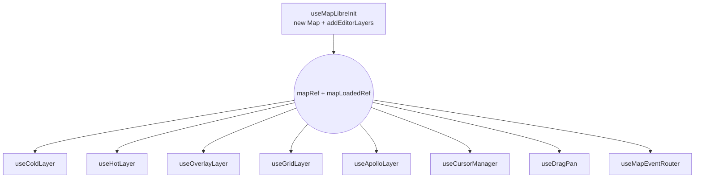

# useMapLibreInit

> 源码：`src/hooks/useMapLibreInit.ts` · 子模块：`src/hooks/mapLibreInit/{layers,assets}.ts`

`useMapLibreInit` 是地图运行时的引导器：

1. `new maplibregl.Map(...)` —— 用 `DARK_STYLE` 构造单例。
2. `map.on('load')` —— 标记 `mapLoadedRef.current = true`，调用 `addEditorLayers(map)`
   注册 grid / cold / hot / overlay / snap 五组 source + layer。
3. `addEditorLayers` 内部首先 `registerRuntimeImages` 注册三个运行时贴图（`zebra-stripe`、`red-hatch`、`lane-arrow`），随后调用 `registerMapIcons` 注入 PNG 图标集。
4. 提供 `mapRef` / `mapLoadedRef` 两个 ref，把后续所有 hook 的副作用挂到这一对句柄上。
5. 反应式订阅 `settingsStore.laneArrowSpacing`，把它落到 `cold-lane-arrows` 的 `symbol-spacing`。

它对调用方暴露的契约非常窄 —— `useMapLibreInit(containerRef)` 即可，
其它所有 hook 都消费 `{ mapRef, mapLoadedRef }`。

## 取景常量

`readMapCenter()` 与 `readMapZoom()`（`@/store/settingsStore`）从用户偏好
中读取上次保存的视口。新用户首次启动时给出默认值（北京附近的某个测试地标），
保证 startup 不会在大洋中迷路。

## 单例 vs 多实例

当前架构假设全应用只有一个 MapLibre 实例 —— `MapCanvas` 单挂载，
`useMapLibreInit` 内部用空依赖 effect 创建。如果未来引入"对比视图"
或多视图编辑，需要：

- 把 `useMapLibreInit` 的内部状态参数化为 caller-supplied id。
- 让 `useColdLayer` 等所有消费方接受多个 mapRef。
- spatial worker bridge 需要支持多 map 路由（worker 端 RBush / cache 按 mapId 分桶）。

短期没有需求，文中不展开。

## 签名

```ts
function useMapLibreInit(containerRef: React.RefObject<HTMLDivElement | null>): {
  mapRef: React.RefObject<maplibregl.Map | null>;
  mapLoadedRef: React.RefObject<boolean>;
};
```

## 参数

| 名称           | 类型                                | 角色                                        |
| -------------- | ----------------------------------- | ------------------------------------------- |
| `containerRef` | `RefObject<HTMLDivElement \| null>` | DOM 容器；`MapCanvas` 渲染的 `<div>` 引用。 |

## 返回值

| 字段           | 类型                                | 说明                                                     |
| -------------- | ----------------------------------- | -------------------------------------------------------- |
| `mapRef`       | `RefObject<maplibregl.Map \| null>` | 单例引用；卸载后为 `null`。                              |
| `mapLoadedRef` | `RefObject<boolean>`                | `map.on('load')` 触发后置 `true`，卸载时复位为 `false`。 |

## 副作用

| 副作用                                                                          | 触发时机                | 清理                         |
| ------------------------------------------------------------------------------- | ----------------------- | ---------------------------- |
| `new maplibregl.Map({...})`                                                     | mount                   | `map.remove()`               |
| `map.on('load', ...)` 设置 `mapLoadedRef = true` 并 `addEditorLayers`           | mount + load            | 通过 `map.remove()` 一并销毁 |
| `addEditorLayers(map)`                                                          | `load`                  | 不主动撤销                   |
| `map.setLayoutProperty('cold-lane-arrows', 'symbol-spacing', laneArrowSpacing)` | `laneArrowSpacing` 变化 | —                            |

## 初始化序列

```
mount
  ├── 容器存在？是 → new Map(container, DARK_STYLE,
  │                           center=readMapCenter(),
  │                           zoom=readMapZoom(),
  │                           doubleClickZoom=false)
  ├── map.on('load', ...) →
  │     ├── mapLoadedRef.current = true
  │     └── addEditorLayers(map)
  │           ├── registerRuntimeImages(map)
  │           │     ├── addStripeImage(zebra-stripe)
  │           │     ├── addStripeImage(red-hatch)
  │           │     ├── addImage(lane-arrow, sdf=true)
  │           │     └── registerMapIcons(map)  // PNG 图标
  │           ├── addGridLayer
  │           ├── addColdLayers
  │           ├── addHotLayers
  │           ├── addOverlayLayers
  │           └── addSnapLayers
  └── mapRef.current = map

useEffect (laneArrowSpacing)
  └── if mapLoaded: setLayoutProperty('cold-lane-arrows', 'symbol-spacing', spacing)

unmount
  ├── map.remove()
  ├── mapRef.current = null
  └── mapLoadedRef.current = false
```

## 不变量

### 单次初始化

```ts
// useMapLibreInit.ts:11-35
useEffect(() => {
  if (!containerRef.current) return;
  const map = new maplibregl.Map({...});
  // ...
}, []);  // eslint-disable-next-line react-hooks/exhaustive-deps
```

依赖列表故意为空。`containerRef` 是 ref（非反应式），且地图初始化代价昂贵
（`new Map` 同时启动 GPU context），不能在 props 变化时重做。

### `doubleClickZoom: false`

```ts
// useMapLibreInit.ts:19
doubleClickZoom: false,
```

绘制状态用 `dblclick` 作为 CONFIRM 边界，必须禁用 maplibre 的双击缩放。

### `addEditorLayers` 是一次性的

`registerRuntimeImages`、`addGridLayer`、`addColdLayers` 等内部函数
通过 `map.addImage` / `map.addSource` / `map.addLayer` 注册资源；
maplibre 不允许重复 ID。所以这些只能在 `map.on('load')` 触发时调用一次，
后续的图层 mutate 由其他 hook（cold/hot/overlay/grid/snap layer hooks）负责。

## `DARK_STYLE`

```ts
// mapLibreInit/assets.ts:9-21
export const DARK_STYLE: maplibregl.StyleSpecification = {
  version: 8,
  name: 'dark-blank',
  glyphs: 'https://demotiles.maplibre.org/font/{fontstack}/{range}.pbf',
  sources: {},
  layers: [{ id: 'background', type: 'background', paint: { 'background-color': '#1a1a2e' } }],
};
```

完全空白的暗色背景。基于 Apollo HD 地图编辑场景下，没有底图也是一种"底图"
—— 减少干扰，让用户专注于自己绘制的车道线。

## 运行时贴图

| 名称           | 用途                        | 生成方式                                              |
| -------------- | --------------------------- | ----------------------------------------------------- |
| `zebra-stripe` | 人行横道斑马线 fill-pattern | `addStripeImage` 生成 16×16 RGBA tile                 |
| `red-hatch`    | clear-area 斜纹填充         | `addStripeImage` 对角斜线                             |
| `lane-arrow`   | lane 方向箭头（SDF）        | `createArrowSDF` 用 canvas2D 绘制然后 `sdf:true` 注册 |

注册 SDF 后，`cold-lane-arrows` layer 才能用 `icon-color` 给箭头着色。

## 反应式 `laneArrowSpacing`

```ts
// useMapLibreInit.ts:37-42
const laneArrowSpacing = useSettingsStore((s) => s.laneArrowSpacing);
useEffect(() => {
  const map = mapRef.current;
  if (!map || !mapLoadedRef.current) return;
  map.setLayoutProperty('cold-lane-arrows', 'symbol-spacing', laneArrowSpacing);
}, [laneArrowSpacing]);
```

设置面板里调节"箭头间距"时，本 effect 把新值落到样式上 —— 不需要重新
生成 GeoJSON。Layer 注册时也使用 `useSettingsStore.getState().laneArrowSpacing`
作为初值（`mapLibreInit/layers.ts:133`）。

## 调用点

```tsx
// src/components/map/MapCanvas.tsx:33
const { mapRef, mapLoadedRef } = useMapLibreInit(containerRef);
```

`MapCanvas` 持有 `containerRef`，把返回的两个 ref 传给后续所有图层 hook：
`useColdLayer`、`useHotLayer`、`useOverlayLayer`、`useGridLayer`、`useApolloLayer`、`useCursorManager`、`useDragPan`。

## 错误模式

| 现象               | 根因                                             | 修复                                                                  |
| ------------------ | ------------------------------------------------ | --------------------------------------------------------------------- |
| 图层全部不显示     | `addEditorLayers` 在 `map.on('load')` 之前被调用 | 始终通过 `mapRef.current` + `mapLoadedRef.current` 两个守门做条件判断 |
| 双击触发地图缩放   | `doubleClickZoom` 没禁掉                         | 见 line 19                                                            |
| 箭头变细 / 黑色    | `lane-arrow` 注册时漏了 `sdf:true`               | 见 `assets.ts:74`                                                     |
| `font` 加载报 CORS | `glyphs` 用了第三方 CDN                          | 把 `glyphs` 改成自己 host 的 fontstack                                |

## 参见

- [`useColdLayer`](./use-cold-layer.md)
- [`useGridLayer`](./use-grid-layer.md)
- [Settings store](../store/settings-store.md)
- [`mapIcons`](../lib/map-icons.md)

## 与其它 hook 的协同



所有 layer hook 都期望 `addEditorLayers` 已经把对应的 source / layer 注册
完毕；调用顺序在 `MapCanvas.tsx` 中固定为：

1. `useMapLibreInit` — 创建 map + 安装 layers
2. `useDrawCommit` — 不依赖 mapRef
3. `useMapEventRouter` — 订阅 map 事件
4. cold / hot / overlay / grid / apollo layer hooks — 写 source 数据
5. `useCursorManager` / `useDragPan` — 修改 maplibre 行为

## glyph CDN 提醒

`DARK_STYLE.glyphs` 当前指向 `https://demotiles.maplibre.org/font/...`。
生产环境推荐：

- 自托管 fontstack（避免被第三方 CDN 限速 / 下线）
- 或者把 `glyphs` 移除（如果 cold layer 不渲染文字 symbol）

当前 cold-labels 用 `icon-image` 而非文字符号，因此 glyphs 实际只在
maplibre 内部 attribution 时偶发使用，影响有限。

## 源码索引

| 关注点                        | 行号                             |
| ----------------------------- | -------------------------------- |
| Map 实例创建                  | `useMapLibreInit.ts:14-20`       |
| `load` handler                | `useMapLibreInit.ts:22-25`       |
| `mapRef` cleanup              | `useMapLibreInit.ts:28-32`       |
| `laneArrowSpacing` 反应式同步 | `useMapLibreInit.ts:37-42`       |
| `DARK_STYLE`                  | `mapLibreInit/assets.ts:9-21`    |
| `createArrowSDF`              | `mapLibreInit/assets.ts:23-38`   |
| `addStripeImage`              | `mapLibreInit/assets.ts:40-69`   |
| `registerRuntimeImages`       | `mapLibreInit/assets.ts:71-76`   |
| `addGridLayer`                | `mapLibreInit/layers.ts:8-25`    |
| `addColdLayers`               | `mapLibreInit/layers.ts:27-144`  |
| `addHotLayers`                | `mapLibreInit/layers.ts:146-183` |
| `addOverlayLayers`            | `mapLibreInit/layers.ts:185-232` |
| `addSnapLayers`               | `mapLibreInit/layers.ts:234-268` |
| `addEditorLayers` 总入口      | `mapLibreInit/layers.ts:270-277` |
