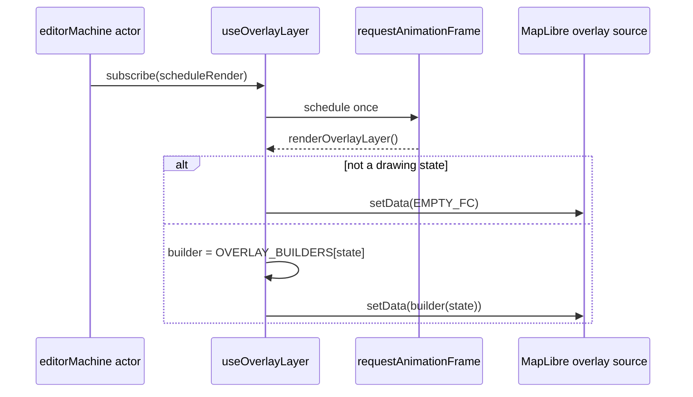

# useOverlayLayer

> Source: `src/hooks/useOverlayLayer.ts`

## Overview

`useOverlayLayer` renders the **drawing-tool overlay** — the live
preview shown while the user is sketching a new entity but before
commit. It mirrors the FSM's `drawPoints` / `bezierAnchors` /
`previewPoint` state into the `overlay` GeoJSON source, with a
per-state builder for each draw tool.

A second nested hook, `useSnapIndicatorLayer`, drives the standalone
`snap` source so the snap ring can appear during vertex drag too,
not only during draw.

## Hook signature

```ts
function useOverlayLayer(
  mapRef: React.RefObject<maplibregl.Map | null>,
  mapLoadedRef: React.RefObject<boolean>,
  actorRef: ActorRefFrom<typeof editorMachine>,
): void;
```

## Behavior

### Render state shape

```ts
export type OverlayRenderState = {
  currentState: string; // FSM state value
  drawPoints: LngLat[]; // committed click points
  previewPoint: LngLat | null; // current cursor point (rubber-band)
  bezierAnchors: BezierAnchor[]; // bezier-only anchor objects
};
```

Equality is checked by reference for the array fields and value for
`currentState` / `previewPoint` — `mapStore` and the FSM both replace
arrays on update, so reference equality short-circuits no-op renders.

### Per-state builders

The hook dispatches via a builder map:

```ts
const OVERLAY_BUILDERS: Record<string, OverlayBuilder> = {
  drawPolyline: buildPolylineFeatures,
  drawCatmullRom: buildCatmullRomFeatures,
  drawBezier: buildBezierFeatures,
  drawArc: buildArcFeatures,
  drawRotatedRect: buildRotatedRectFeatures,
  drawPolygon: buildPolygonFeatures,
};
```

Each builder takes the render state and emits an array of
`GeoJSON.Feature`. Splitting them out keeps each function tractable
and the dispatch table the source of truth for "which states render
an overlay".

| Builder                    | Geometry                                                     | Notes                                          |
| -------------------------- | ------------------------------------------------------------ | ---------------------------------------------- |
| `buildPolylineFeatures`    | LineString + vertex points                                   | Includes preview cursor as last point          |
| `buildCatmullRomFeatures`  | Smoothed polyline via `catmullRom()`                         |                                                |
| `buildBezierFeatures`      | Cubic bezier via `cubicBezier()` + handle visualization      | Each anchor renders its handles + handle lines |
| `buildArcFeatures`         | 3-point circular arc via `threePointArc()`                   | Falls back to LineString for partial input     |
| `buildRotatedRectFeatures` | Rotated rectangle polygon via `rectCorners()` + axis preview |
| `buildPolygonFeatures`     | Closed polygon                                               | Falls back to LineString while < 3 points      |

### Render scheduling



### Snap indicator

`useSnapIndicatorLayer` is mounted unconditionally inside
`useOverlayLayer`. It subscribes to `uiStore.currentSnapTarget` and
writes a single point feature into the `snap` source whenever a snap
target is active. The `snap-ring` and `snap-dot` layers (defined in
`mapLibreInit/layers.ts`) read `properties.kind` to color-code vertex
vs. edge snaps.

The snap source is independent so the indicator can show during vertex
drag (not a drawing state) — the `applySnap` helper in
`mapEventRouter/snap.ts` writes to `currentSnapTarget` for both draw
and edit flows.

## Pure helper exports

For tests and bench harnesses:

```ts
export function samePoint(a: LngLat | null, b: LngLat | null): boolean;
export function sameOverlayRenderState(
  a: OverlayRenderState | null,
  b: OverlayRenderState,
): boolean;
export function buildOverlayFeatures(renderState: OverlayRenderState): GeoJSON.Feature[];
```

`buildOverlayFeatures` is the public entrypoint to all per-state
builders, exposed so unit tests can pin the geometry contract without
mounting the hook.

## Examples

### Mounting

```tsx
useOverlayLayer(mapRef, mapLoadedRef, actorRef);
```

The hook drives both the `overlay` source (drawing preview) and the
`snap` source (snap indicator) — no separate hook needed.

### Tweaking a builder

If you want a new visualization for, say, `drawArc`, edit
`buildArcFeatures` in this file. The dispatch table picks it up
automatically — no other touch points.

## Related

- [editorMachine FSM](/api/core/editor-machine)
- [Geometry: interpolate](/api/core/geometry-interpolate)
- [useDrawCommit](/api/hooks/use-draw-commit) — fires on draw → idle
- [useMapEventRouter](/api/hooks/use-map-event-router) — emits `MOUSE_MOVE` / `DOUBLE_CLICK`
- [Snap module](/api/core/geometry-snap)
