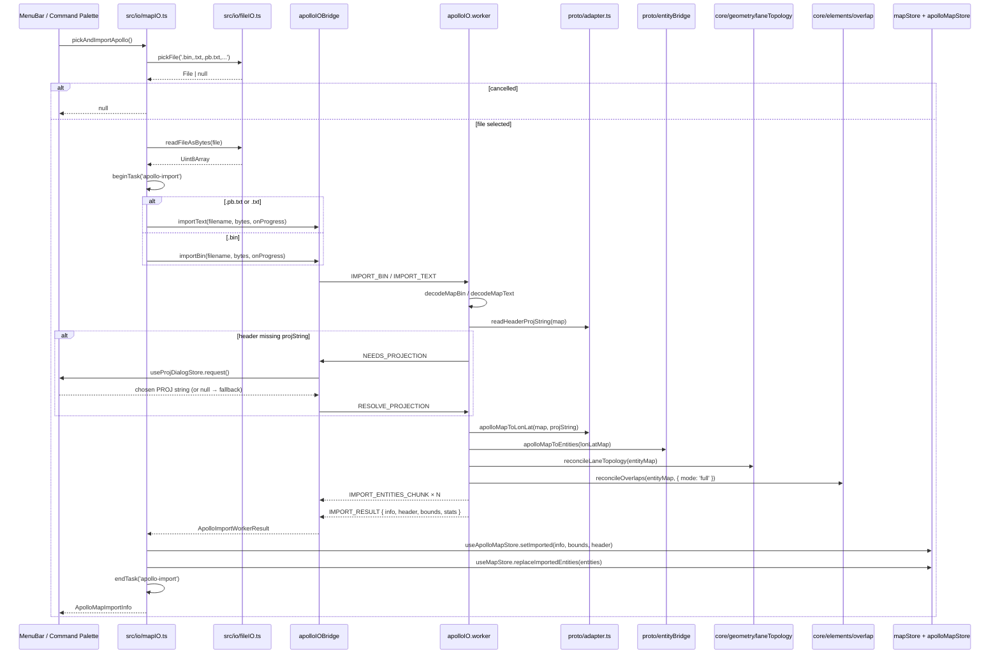

# Import / Apollo Base Map

> 编辑器**没有**单独的 `parseBaseMap()` 函数。当前导入入口是
> `src/io/mapIO.ts` 的 `pickAndImportApollo`，会通过 `apolloIOBridge`
> 把解码、投影、entity 桥接、reconcile 全程派到 worker 里。

## 公开符号

```ts
// src/io/mapIO.ts
export function pickAndImportApollo(): Promise<ApolloMapImportInfo | null>;

// src/store/apolloMapStore.ts
export interface ApolloMapImportInfo {
  filename: string;
  counts: Record<string, number>;
  projString: string;
  importedAt: number;
}
```

返回 `null` 表示用户取消文件对话框；导入失败也返回 `null`，错误
通过 `apolloMapStore.setError` 记录。

> Source: `src/io/mapIO.ts:54-73`

## 完整流程



## `ApolloImportStats`

worker 上报的子阶段时长：

| 字段         | 含义                                       |
| ------------ | ------------------------------------------ |
| `decodeMs`   | protobuf decode 时间                       |
| `projectMs`  | UTM ENU → WGS84 投影时间                   |
| `bridgeMs`   | `apolloMapToEntities` 时间                 |
| `topologyMs` | `reconcileLaneTopology` 时间（full 模式）  |
| `overlapMs`  | `reconcileOverlaps({ mode: 'full' })` 时间 |
| `totalMs`    | runImport 总时间                           |

5 万实体规模的实测约 1.5–2.5s，主线程不被阻塞。

## 投影对话框

`Header.projection.proj` 缺失时，worker 主动发 `NEEDS_PROJECTION`：

- `apolloIOBridge` 拿到后通过 `useProjDialogStore.request()` 弹出
  Projection 选择器（包含 sunnyvale / beijing / shanghai / shenzhen
  presets，以及自定义 PROJ.4 字符串输入）；
- 用户选择 → `RESOLVE_PROJECTION`；
- 用户取消 → 默认 `UTM_PRESETS.beijing`（fallback）。

## 异常处理

- 文件选择取消 → 返回 `null`，不弹错误；
- decode 失败 / verify 失败 → worker 发 `ERROR`，bridge reject，
  `mapIO` catch → `setError('Import failed: ${msg}')`；
- 超时 → bridge 内部 `DEFAULT_TIMEOUT_MS = 10 * 60_000`（10 分钟），
  超过则 reject。
