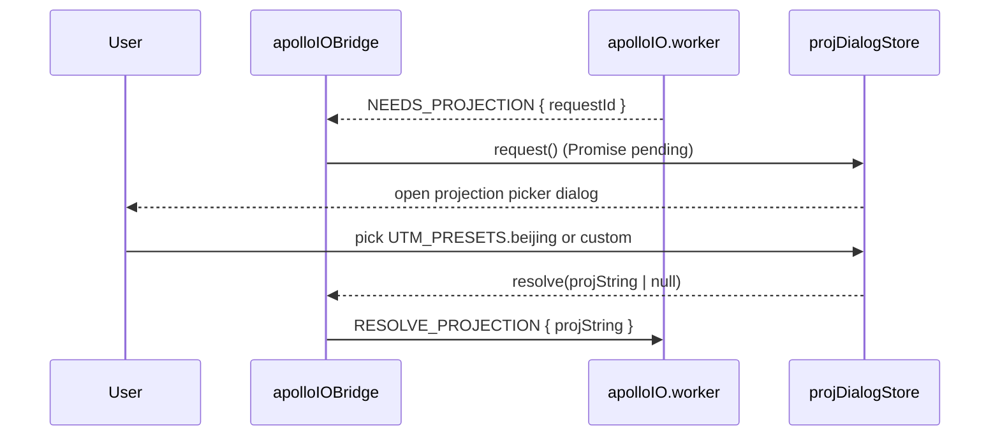

# Apollo IO Bridge

> Source: `src/io/apolloIOBridge.ts`

## Overview

`apolloIOBridge` is a lazy-singleton main-thread proxy that mediates every
import / export round-trip against the Apollo IO Web Worker
(`src/io/apolloIO.worker.ts`). It is the public surface of `io/` for the
rest of the app — `mapIO.ts` is the only intended caller, and its
`pickAndImportApollo` / `exportApolloBin` / `exportApolloText` flows are
expressed entirely in terms of `apolloIOBridge` methods.

The bridge is intentionally narrow: it owns the worker handle, request
correlation, chunked transfers, timeouts, and progress reporting, but it
holds **no app state**. Decoded entities live in `mapStore`, projection
metadata in `apolloMapStore`, and user-visible task labels in
`taskProgressStore`.

::: tip Why a worker
Apollo `base_map.bin` files are 50–200 MB and decode into hundreds of
thousands of nested protobuf messages. Performing that on the main
thread freezes MapLibre rendering for seconds. The worker boundary
turns the import into a streamed, cancellable, progress-reporting
operation while keeping the editor interactive.
:::

## Exports

### `apolloIOBridge` (singleton)

The default export is a single instance of the internal `ApolloIOBridge`
class. Always import the instance — there is no need to construct one.

```ts
import { apolloIOBridge } from '@/io/apolloIOBridge';
```

### `ApolloImportWorkerResult`

```ts
export interface ApolloImportWorkerResult {
  info: ApolloMapImportInfo; // filename, counts, projString, importedAt
  header: ApolloMapHeader | null; // raw Apollo Map.header dictionary
  bounds: ApolloMapBounds | null; // [[minLng, minLat], [maxLng, maxLat]]
  entities: MapEntity[]; // parsed editor entities (concatenated)
  stats: ApolloImportStats; // decode/project/bridge/topology/overlap/total ms
}
```

### Methods

| Method       | Signature                                                             | Purpose                                              |
| ------------ | --------------------------------------------------------------------- | ---------------------------------------------------- |
| `importBin`  | `(filename, bytes, onProgress?) => Promise<ApolloImportWorkerResult>` | Import an Apollo binary protobuf (`.bin`).           |
| `importText` | `(filename, bytes, onProgress?) => Promise<ApolloImportWorkerResult>` | Import an Apollo text protobuf (`.txt` / `.pb.txt`). |
| `exportBin`  | `(entities, projString, onProgress?) => Promise<Uint8Array>`          | Encode `MapEntity[]` to Apollo binary.               |
| `exportText` | `(entities, projString, onProgress?) => Promise<Uint8Array>`          | Encode `MapEntity[]` to Apollo text-proto.           |
| `clear`      | `() => Promise<void>`                                                 | Drop the worker-side cached map (reset GC).          |

`onProgress` receives `ApolloIOProgress` objects (`{ label, detail?,
progress }`). Progress is sparse — there is no contract that it tick
monotonically, only that it stays within `[0, 1]` or `null` for
indeterminate phases.

## Behavior

### Lazy worker spawn

The worker is created on first use and reused for the lifetime of the
page. `ensureWorker()` is the only construction site, and it wires a
single `onmessage` dispatcher plus an `onerror` handler that rejects
**every** pending request on a worker crash. After the crash the worker
is terminated and discarded, so the next request recreates a fresh one.

### Request correlation

Every request carries a `requestId` generated by `nextRequestId(prefix)`
(monotonic counter, prefixed `import_*`, `export_*`, or `clear_*`). The
bridge stores a `PendingEntry` keyed by that id; the worker echoes the
id on every response. The bridge dispatches by id, never by sender —
multiple imports / exports can be in flight simultaneously without
interleaving each other's results.

### Timeout

Each pending entry installs a 10-minute (`DEFAULT_TIMEOUT_MS`) safety
timer. If the worker never responds, the timer fires, drops the entry,
and rejects the promise with a timeout error. Successful responses
clear the timer in `handleMessage` before resolving.

### Progress events

`PROGRESS` responses are routed to the entry's `onProgress` callback
without resolving the request. The worker reports progress for
projection, decode, bridge, topology, and overlap phases; the bridge
adds a final 0.9 → 0.95 ramp during entity-chunk receipt.

### Projection round-trip

When the worker decodes a Map whose `header.projection.proj` is missing
or malformed, it sends `NEEDS_PROJECTION`. The bridge responds by
opening the projection picker dialog through `useProjDialogStore`:



If the user cancels (`null`), the bridge falls back to
`UTM_PRESETS.beijing` so import still completes. Callers that want a
hard failure should validate post-import via
`useApolloMapStore.getState().info.projString`.

### Chunked entity transfer

Both directions stream entities to keep `postMessage` payloads under a
few thousand objects per copy:

- **Export**: `postEntityChunks` slices `entities[]` into 2 000-entity
  chunks (`EXPORT_ENTITY_CHUNK_SIZE`). Between chunks the bridge yields
  to the main thread (`setTimeout(0)`) so the UI thread can paint. After
  all chunks are sent, a single `FINISH_EXPORT` triggers the worker to
  encode and respond with `EXPORT_BIN_RESULT` / `EXPORT_TEXT_RESULT`.
- **Import**: the worker emits one or more `IMPORT_ENTITIES_CHUNK`
  messages while it bridges proto → entity. The bridge accumulates
  them into the pending entry's `entities` array, then the
  `IMPORT_RESULT` message carries the metadata (`info`, `header`,
  `bounds`, `stats`) and resolves the promise with the assembled
  `ApolloImportWorkerResult`.

### Transferable buffers

`importBin` / `importText` mark `bytes.buffer` as transferable so the
main thread releases the file payload after the post. Export bytes
returned from the worker are NOT transferable in the result message —
`mapIO.ts` defensively `Uint8Array.set`-copies them before constructing
the download `Blob`.

### Cancellation semantics

There is no first-class cancel API. Reload the page or call `clear()`
to drop the worker-side cache. A new request after a crash creates a
fresh worker because `onerror` disposed the previous handle.

## Examples

### Import flow as used by `mapIO.pickAndImportApollo`

```ts
const file = await pickFile('.bin,.txt,.pb.txt');
const bytes = await readFileAsBytes(file);
const result = await apolloIOBridge.importBin(file.name, bytes, (p) =>
  reportProgress('apollo-import', p),
);

useApolloMapStore.getState().setImported(result.info, result.bounds, result.header);
useMapStore.getState().replaceImportedEntities(result.entities);
```

### Export with progress wiring

```ts
const entities = Array.from(useMapStore.getState().entities.values());
const projString = useApolloMapStore.getState().info!.projString;

const bytes = await apolloIOBridge.exportBin(entities, projString, (p) =>
  useTaskProgressStore.getState().updateTask('apollo-export', {
    label: p.label,
    detail: p.detail,
    progress: p.progress,
  }),
);

const blob = new Blob([bytes.buffer.slice(0)], { type: 'application/octet-stream' });
downloadBlob(blob, 'base_map.bin');
```

### Tearing down between sessions

```ts
await apolloIOBridge.clear(); // drops worker-side cached map
```

## Related

- [Apollo IO Protocol](./apollo-io-protocol.md) — message contracts that
  flow over the worker boundary.
- [File IO](./file-io.md) — browser-side file pick / download helpers.
- [Map IO](./map-io.md) — the orchestration layer that uses the bridge.
- [Projection helpers](/api/io/proto-projection) — `UTM_PRESETS` fallback.
- [Apollo Map Store](/api/store/apollo-map-store) — destination of the
  decoded `info` / `header` / `bounds` payload.
- [Task Progress Store](/api/store/task-progress-store) — sink for the
  `onProgress` callbacks.
- [/architecture/state-management](/architecture/state-management) —
  where the bridge sits in the data flow.
