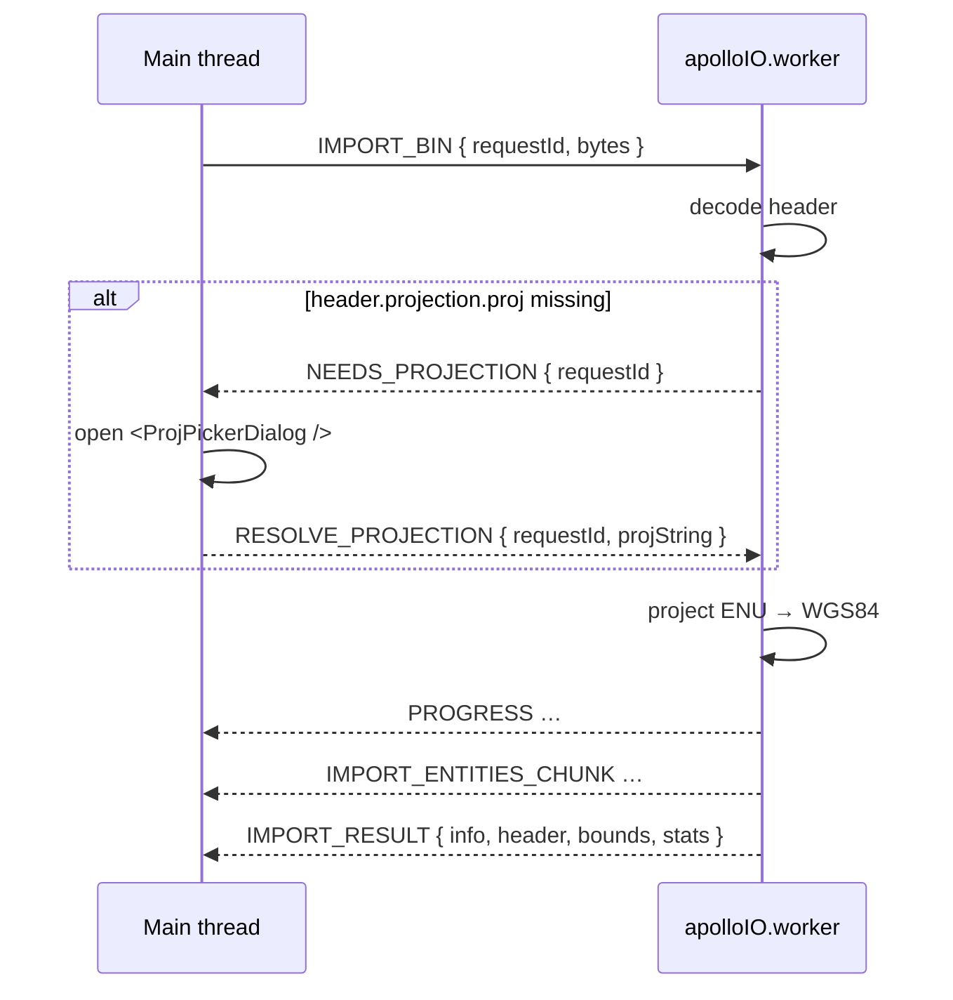

# Apollo IO Protocol

> Source: `src/io/apolloIOProtocol.ts`

## Overview

`apolloIOProtocol.ts` is a pure type module that defines the wire
contract between the main-thread `apolloIOBridge` and the
`apolloIO.worker` Web Worker. There is no runtime code — only
discriminated-union message types, progress payload shape, and the
import-stats record.

Both sides import the same module, which guarantees that
`postMessage` payloads stay in lockstep across compilation units. Any
change to a message variant is a synchronous compile error on the
opposite side.

## Exports

### `ApolloIOProgress`

```ts
export interface ApolloIOProgress {
  label: string; // user-visible task label (e.g. "Importing Apollo map")
  detail?: string; // optional finer-grained sub-step ("Decoding header")
  progress: number | null; // [0,1] or null for indeterminate phases
}
```

Producers must clamp into `[0, 1]` (the bridge's `taskProgressStore`
defensively re-clamps). `null` is the canonical "spinner / indeterminate"
sentinel.

### `ApolloImportStats`

```ts
export interface ApolloImportStats {
  decodeMs: number; // protobufjs decode/parse
  projectMs: number; // ENU → WGS84 projection
  bridgeMs: number; // raw proto tree → MapEntity[]
  topologyMs: number; // lane topology reconcile
  overlapMs: number; // overlap reconcile
  totalMs: number; // wall-clock of the import
}
```

Surfaced through `ApolloImportWorkerResult.stats` for telemetry, the
import toast, and the bench script.

### `ApolloExportFormat`

```ts
export type ApolloExportFormat = 'bin' | 'txt';
```

### `ApolloIORequest`

Discriminated union of every message the main thread can send:

| `type`                  | Payload                                | Direction                                      |
| ----------------------- | -------------------------------------- | ---------------------------------------------- |
| `IMPORT_BIN`            | `requestId, filename, bytes`           | main → worker                                  |
| `IMPORT_TEXT`           | `requestId, filename, bytes`           | main → worker                                  |
| `RESOLVE_PROJECTION`    | `requestId, projString`                | main → worker (response to `NEEDS_PROJECTION`) |
| `BEGIN_EXPORT`          | `requestId, format, projString, total` | main → worker                                  |
| `EXPORT_ENTITIES_CHUNK` | `requestId, entities, offset, total`   | main → worker                                  |
| `FINISH_EXPORT`         | `requestId`                            | main → worker                                  |
| `CLEAR`                 | `requestId`                            | main → worker                                  |

### `ApolloIOResponse`

Discriminated union of every message the worker can send back:

| `type`                  | Payload                                  | Notes                                                                                       |
| ----------------------- | ---------------------------------------- | ------------------------------------------------------------------------------------------- |
| `PROGRESS`              | `requestId, progress`                    | Repeated; does not resolve the request.                                                     |
| `NEEDS_PROJECTION`      | `requestId`                              | Fired when `header.projection.proj` is absent. Bridge must reply with `RESOLVE_PROJECTION`. |
| `IMPORT_ENTITIES_CHUNK` | `requestId, entities, offset, total`     | Streamed during decode; bridge accumulates.                                                 |
| `IMPORT_RESULT`         | `requestId, info, header, bounds, stats` | Final import metadata; bridge resolves with chunks + this.                                  |
| `EXPORT_BIN_RESULT`     | `requestId, bytes`                       | Final encoded `.bin`.                                                                       |
| `EXPORT_TEXT_RESULT`    | `requestId, bytes`                       | Final encoded `.txt`.                                                                       |
| `CLEARED`               | `requestId`                              | Acknowledges `CLEAR`.                                                                       |
| `ERROR`                 | `requestId, message, stack?`             | Bridge converts into a rejected promise.                                                    |

## Behavior

### Discriminator strategy

Every message carries a string `type` literal. The bridge dispatches via
a `switch` on `type`; TypeScript narrows automatically inside each
branch, so adding a new variant forces every dispatcher to handle it.

### Request id namespacing

`requestId` is generated once by the bridge per public API call and
echoed verbatim on every response, including streamed `PROGRESS` and
`IMPORT_ENTITIES_CHUNK` events. The worker never invents an id.

### Why the import flow is multi-phase

A 200 MB Apollo map decodes into hundreds of thousands of nested
messages. Sending them as one `IMPORT_RESULT` payload would block the
worker's encoder for several hundred ms producing a structured clone
that the main thread then has to walk. Splitting into
`IMPORT_ENTITIES_CHUNK` events:

1. Lets the bridge surface progress mid-flight.
2. Keeps each `postMessage` payload small enough that the structured
   clone cost is amortised across many short pauses instead of a single
   long one.
3. Ensures the worker can free per-chunk buffers between sends.

### Why the export flow is multi-phase

Mirrored reason: the main thread holds the entity Map; sending it as
one `BEGIN_EXPORT` payload would clone all entities up front. Instead:

1. `BEGIN_EXPORT` carries only the format + projection + total count so
   the worker can pre-size buffers and send `PROGRESS` 0%.
2. `EXPORT_ENTITIES_CHUNK` ferries 2 000 entities at a time
   (`EXPORT_ENTITY_CHUNK_SIZE` in the bridge).
3. `FINISH_EXPORT` tells the worker to assemble + encode the proto and
   respond with the final bytes.

### `NEEDS_PROJECTION` flow

Apollo `header.projection.proj` can be absent (synthetic test maps),
empty, or contain Apollo's `{}` template placeholders that proj4
rejects. Rather than guessing, the worker asks the user via:



::: warning Proto2 fidelity invariant
Round-trip preservation depends on the worker re-emitting the SAME
`projString` it imported with. Callers that overwrite `info.projString`
mid-session are responsible for re-projecting any unchanged geometry.
:::

## Examples

### Sending an import request

```ts
const requestId = nextRequestId('import');
worker.postMessage(
  { type: 'IMPORT_BIN', requestId, filename: file.name, bytes },
  [bytes.buffer], // transferable — main thread releases the buffer
);
```

### Worker-side progress emission

```ts
self.postMessage({
  type: 'PROGRESS',
  requestId,
  progress: { label: 'Importing Apollo map', detail: 'Decoding lanes', progress: 0.4 },
});
```

### Discriminated dispatch on the bridge

```ts
function handleMessage(msg: ApolloIOResponse) {
  switch (msg.type) {
    case 'PROGRESS':
      /* forward to onProgress */ break;
    case 'NEEDS_PROJECTION':
      /* open dialog */ break;
    case 'IMPORT_ENTITIES_CHUNK':
      /* accumulate */ break;
    case 'IMPORT_RESULT':
      /* resolve */ break;
    case 'EXPORT_BIN_RESULT':
    case 'EXPORT_TEXT_RESULT':
      /* resolve bytes */ break;
    case 'CLEARED':
      /* resolve void */ break;
    case 'ERROR':
      /* reject */ break;
  }
}
```

## Related

- [Apollo IO Bridge](./apollo-io-bridge.md) — main-thread proxy that
  speaks this protocol.
- [Map IO](./map-io.md) — orchestration layer that drives the bridge.
- [Apollo Map Store](/api/store/apollo-map-store) — sink for the
  `IMPORT_RESULT` payload.
- [Proj Dialog Store](/api/store/proj-dialog-store) — modal store that
  resolves `NEEDS_PROJECTION`.
- [/architecture/state-management](/architecture/state-management) —
  end-to-end IO ↔ store data flow.
