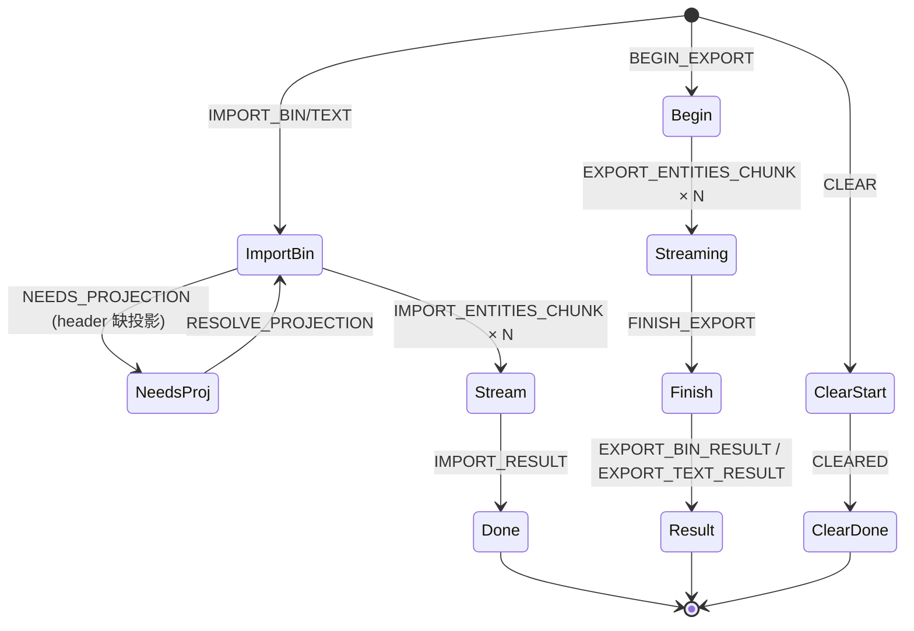

# io / apollo-io-protocol

`src/io/apolloIOProtocol.ts` 是 apolloIO worker 的 IPC 契约。它定义
`ApolloIORequest`（主线程 → worker）与 `ApolloIOResponse`（worker →
主线程）两组 discriminated union，让 bridge 与 worker 双方都能被
TypeScript 严格穷尽检查。

## 基础类型

```ts
export interface ApolloIOProgress {
  label: string;
  detail?: string;
  progress: number | null; // 0..1，null 表示 indeterminate
}

export interface ApolloImportStats {
  decodeMs: number;
  projectMs: number;
  bridgeMs: number;
  topologyMs: number;
  overlapMs: number;
  totalMs: number;
}

export type ApolloExportFormat = 'bin' | 'txt';
```

## Request 集合（main → worker）

```ts
export type ApolloIORequest =
  | { type: 'IMPORT_BIN'; requestId: string; filename: string; bytes: Uint8Array }
  | { type: 'IMPORT_TEXT'; requestId: string; filename: string; bytes: Uint8Array }
  | { type: 'RESOLVE_PROJECTION'; requestId: string; projString: string }
  | {
      type: 'BEGIN_EXPORT';
      requestId: string;
      format: ApolloExportFormat;
      projString: string;
      total: number;
    }
  | {
      type: 'EXPORT_ENTITIES_CHUNK';
      requestId: string;
      entities: MapEntity[];
      offset: number;
      total: number;
    }
  | { type: 'FINISH_EXPORT'; requestId: string }
  | { type: 'CLEAR'; requestId: string };
```

## Response 集合（worker → main）

```ts
export type ApolloIOResponse =
  | { type: 'PROGRESS'; requestId: string; progress: ApolloIOProgress }
  | { type: 'NEEDS_PROJECTION'; requestId: string }
  | {
      type: 'IMPORT_ENTITIES_CHUNK';
      requestId: string;
      entities: MapEntity[];
      offset: number;
      total: number;
    }
  | {
      type: 'IMPORT_RESULT';
      requestId: string;
      info: ApolloMapImportInfo;
      header: ApolloMapHeader | null;
      bounds: ApolloMapBounds | null;
      stats: ApolloImportStats;
    }
  | { type: 'EXPORT_BIN_RESULT'; requestId: string; bytes: Uint8Array }
  | { type: 'EXPORT_TEXT_RESULT'; requestId: string; bytes: Uint8Array }
  | { type: 'CLEARED'; requestId: string }
  | { type: 'ERROR'; requestId: string; message: string; stack?: string };
```

> Source: `src/io/apolloIOProtocol.ts:1-73`

## 消息状态机



任何状态都可以跳到 `ERROR`（带 `message + stack?`）。

## 不变量

- `requestId` 必须由 caller（主线程 bridge）唯一生成，不能被 worker
  改写；
- `IMPORT_BIN / IMPORT_TEXT` 的 `bytes.buffer` 是 transferable，
  worker 持有后主线程不可读；
- `EXPORT_BIN_RESULT / EXPORT_TEXT_RESULT` 的 `bytes` 也是 transferable，
  worker 发完之后自己也不可读；
- `IMPORT_ENTITIES_CHUNK` 的 `entities[i]` 经 structuredClone（postMessage
  默认）跨边界 —— 不要在 worker 内部 mutate 后期望主线程看到，必须
  通过新 chunk 显式发出。
