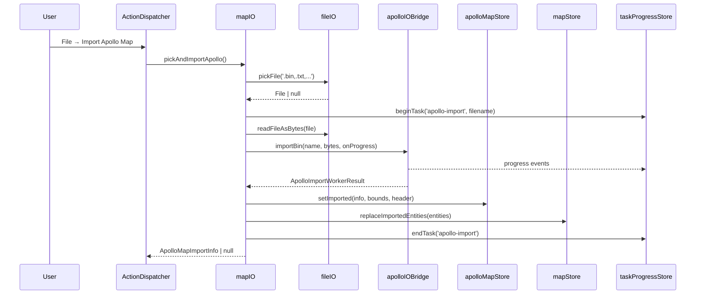

# Map IO

> Source: `src/io/mapIO.ts`

## Overview

`mapIO.ts` is the orchestration layer that ties the entire Apollo IO
stack together. It is the only `io/` module the rest of the app imports
directly: menu actions, the import dialog, and the export commands all
delegate to its three public entry points.



The module owns three concerns and only three:

1. **Routing** by filename suffix (`.pb.txt` / `.txt` → text codec,
   everything else → binary).
2. **Task progress** lifecycle (`beginTask` / `updateTask` / `endTask`).
3. **Store commit** ordering on success (`apolloMapStore.setImported`
   first, then `mapStore.replaceImportedEntities`) and **error surface**
   on failure (`apolloMapStore.setError`).

It does NOT decode bytes (that's `apolloIOBridge`), pick projections
(that's `projDialogStore`), or render map layers (that's MapLibre +
the cold layer pipeline).

## Exports

| Symbol                | Signature                                    | Purpose                                                           |
| --------------------- | -------------------------------------------- | ----------------------------------------------------------------- |
| `pickAndImportApollo` | `() => Promise<ApolloMapImportInfo \| null>` | Single-dialog importer that auto-routes by filename.              |
| `exportApolloBin`     | `() => Promise<void>`                        | Export current entities as Apollo binary; downloads the file.     |
| `exportApolloText`    | `() => Promise<void>`                        | Export current entities as Apollo text-proto; downloads the file. |

There are no class instances, no factories, and no React hooks — every
function is a free async function.

## Behavior

### Suffix routing

```ts
const isText = /\.(pb\.txt|txt)$/i.test(file.name);
const result = isText ? await importApolloTextFile(file) : await importApolloBinFile(file);
```

The accept string passed to `pickFile` is
`.bin,.txt,.pb.txt,application/octet-stream,text/plain`. Both branches
read bytes via `readFileAsBytes` and dispatch to either
`apolloIOBridge.importText` or `apolloIOBridge.importBin`.

### Task ID constants

Two reserved task ids:

- `'apollo-import'` for the import flow.
- `'apollo-export'` for both binary and text export.

These ids are stable contracts with `taskProgressStore`. The
StatusBar / progress overlay subscribe to `activeTask?.id` to render
the right label.

### Visibility delay

```ts
useTaskProgressStore.getState().beginTask({
  id,
  label,
  detail,
  progress: null,
  visibleAfterMs: 1000,
});
```

`visibleAfterMs: 1000` means the progress UI only mounts if the task
runs for more than 1 second. Imports of fixture-sized maps complete
faster than that and never flash the spinner.

### Suggested filename

`suggestedFilename(originalName, ext)` strips the original extension
(`.bin` / `.txt` / `.pb.txt`), inserts a 14-character UTC timestamp
(`YYYYMMDDHHMMSS`), and appends the new extension:

```
borregas_ave/base_map.bin → base_map-20260502123045.bin
```

### Defensive byte copy on export

```ts
const copy = new Uint8Array(bytes.byteLength);
copy.set(bytes);
const blob = new Blob([copy.buffer], { type: 'application/octet-stream' });
```

The bytes coming back from the worker may sit in a transferable buffer.
`Blob` constructor on a detached buffer throws. Copying first is the
simplest, allocation-cheap fix.

### Store commit ordering

Imports MUST commit `apolloMapStore.setImported` BEFORE
`mapStore.replaceImportedEntities` because:

- `apolloMapStore.info` is the source of truth for `projString`, used
  on the next export.
- `mapStore.replaceImportedEntities` triggers cold-layer recompilation;
  the layer reads `apolloMapStore.bounds` to fit the viewport.

Reversing the order races the viewport-fit logic against an empty
`apolloMapStore`.

### Error surface

Both import and export wrap the bridge call in `try/catch/finally`:

- On error → `apolloMapStore.setError(\`Import failed: \${msg}\`)`and`console.error('[mapIO] import failed', error)`. The function
resolves `null` (import) or returns silently (export); it never
  rejects.
- On success → `setError(null)` is called by `setImported` itself.
- `finally` always runs `endTask(id)` so the spinner clears regardless
  of outcome.

::: tip Worker progress for free
Both bin and text export route through the same worker. The text codec
is implemented in `textCodec/encoder.ts` (a pure protobufjs walker),
but `mapIO` doesn't care — `apolloIOBridge.exportText` returns bytes
just like `exportBin`, with the only difference being the MIME type
on the resulting `Blob`.
:::

## Examples

### Wired into the action registry

```ts
// src/core/actions/registry.ts (excerpt)
{
  id: 'file.importApollo',
  label: 'Import Apollo Map',
  category: 'file',
  menu: 'file',
  shortcut: 'Cmd+Shift+I',
  run: () => pickAndImportApollo(),
},
{
  id: 'file.exportApolloBin',
  label: 'Export As Apollo Binary',
  category: 'file',
  menu: 'file',
  run: () => exportApolloBin(),
},
{
  id: 'file.exportApolloText',
  label: 'Export As Apollo Text',
  category: 'file',
  menu: 'file',
  run: () => exportApolloText(),
},
```

### Manual call from a component

```tsx
import { pickAndImportApollo } from '@/io/mapIO';

function ImportButton() {
  return (
    <button
      onClick={async () => {
        const info = await pickAndImportApollo();
        if (info) toast(`Imported ${info.filename}`);
      }}
    >
      Import
    </button>
  );
}
```

### Pre-export check

`exportApolloBin` and `exportApolloText` short-circuit when nothing has
been imported:

```ts
function currentExportContext() {
  const { info } = useApolloMapStore.getState();
  if (!info) {
    useApolloMapStore.getState().setError('Nothing to export - import a map first.');
    return null;
  }
  const entities = Array.from(useMapStore.getState().entities.values());
  return { info, entities };
}
```

The ApolloMapStore's `lastError` becomes a banner in the UI.

## Related

- [Apollo IO Bridge](./apollo-io-bridge.md) — worker proxy this module
  drives.
- [File IO](./file-io.md) — `pickFile` / `readFileAsBytes` /
  `downloadBlob` helpers.
- [Apollo Map Store](/api/store/apollo-map-store) — destination of
  imported metadata.
- [Map Store](/api/store/map-store) — destination of imported entities
  via `replaceImportedEntities`.
- [Task Progress Store](/api/store/task-progress-store) — sink for the
  `onProgress` callbacks.
- [/architecture/state-management](/architecture/state-management) —
  end-to-end flow.
