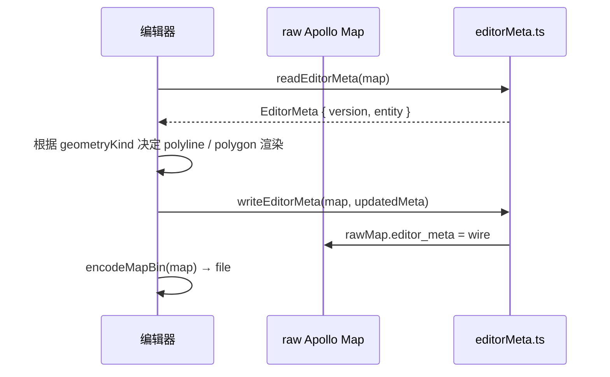

# io / proto-editor-meta

`src/io/proto/editorMeta.ts` 提供对 Apollo Map 上 `editor_meta`
（field number 1000）的读写。这是编辑器自定义的扩展字段，用于
持久化「这条折线在编辑器里到底是 LineString 还是 closed Polygon」
之类的语义提示。Apollo runtime 不识别该字段，但 proto2 的"未知字段
保留"语义会让它在 round-trip 时不丢失，所以同一份 `.bin` 既能给
Apollo 跑也能给编辑器读。

## 公开符号

```ts
export type EditorGeometryKind = 'LINESTRING' | 'POLYGON';

export interface EditorEntityMeta {
  /** Forces editor to render points as polyline vs closed polygon. */
  geometryKind?: EditorGeometryKind;
}

export interface EditorMeta {
  version: number;
  entity: Record<string, EditorEntityMeta>;
}

export const EDITOR_META_VERSION: 1;

export function readEditorMeta(rawMap: Record<string, unknown>): EditorMeta;
export function writeEditorMeta(rawMap: Record<string, unknown>, meta: EditorMeta): void;
export function entityKey(entityType: string, id: string): string;
```

> Source: `src/io/proto/editorMeta.ts:1-84`

## 数据形态

wire 上的字段名是 snake_case + 数字 enum：

```proto
message EditorMeta {
  optional uint32 version = 1;
  map<string, EditorEntityMeta> entity = 2;
}
message EditorEntityMeta {
  optional EditorGeometryKind geometry_kind = 1;
}
enum EditorGeometryKind {
  EDITOR_GEOMETRY_KIND_UNSPECIFIED = 0;
  LINESTRING = 1;
  POLYGON = 2;
}
```

`readEditorMeta` / `writeEditorMeta` 处理 `keepCase: true` 模式下的
snake_case + 数字 enum 与编辑器内部 camelCase + 字符串 enum 的转换。

## `readEditorMeta(rawMap): EditorMeta`

```ts
const wire = rawMap.editor_meta as EditorMetaWire | undefined;
const entity: Record<string, EditorEntityMeta> = {};
if (wire?.entity) {
  for (const [key, raw] of Object.entries(wire.entity)) {
    entity[key] = decodeEntity(raw);
  }
}
return { version: wire?.version ?? EDITOR_META_VERSION, entity };
```

`decodeEntity` 把 `geometry_kind: number` 反查 `NUM_TO_KIND[1] =
'LINESTRING'`、`NUM_TO_KIND[2] = 'POLYGON'`，未知值忽略。

## `writeEditorMeta(rawMap, meta)`

```ts
const wire: EditorMetaWire = {
  version: meta.version,
  entity: Object.fromEntries(Object.entries(meta.entity).map(([k, v]) => [k, encodeEntity(v)])),
};
rawMap.editor_meta = wire;
```

`encodeEntity` 把 `geometryKind` 字符串走 `KIND_TO_NUM` 反向映射回
数字。注意：未指定 `geometryKind` 时**不**写 `geometry_kind: 0`，
保持 wire fidelity。

## `entityKey(entityType, id)`

```ts
return `${entityType}:${id}`;
```

`EditorMeta.entity` 用 `entityType:id` 作 key，避免不同类型同 id 冲突。

## 典型工作流



## 限制

- 当前只支持 `geometryKind`，未来加新字段需要 bump
  `EDITOR_META_VERSION` 并提供 forward-compat 处理；
- 编辑器导入旧 Apollo `.bin`（无 editor_meta）时 `wire.version` 取默
  认值 `EDITOR_META_VERSION`；
- Apollo runtime 不读这个字段；如果用户在 Apollo 模拟器里跑，无视
  即可。
