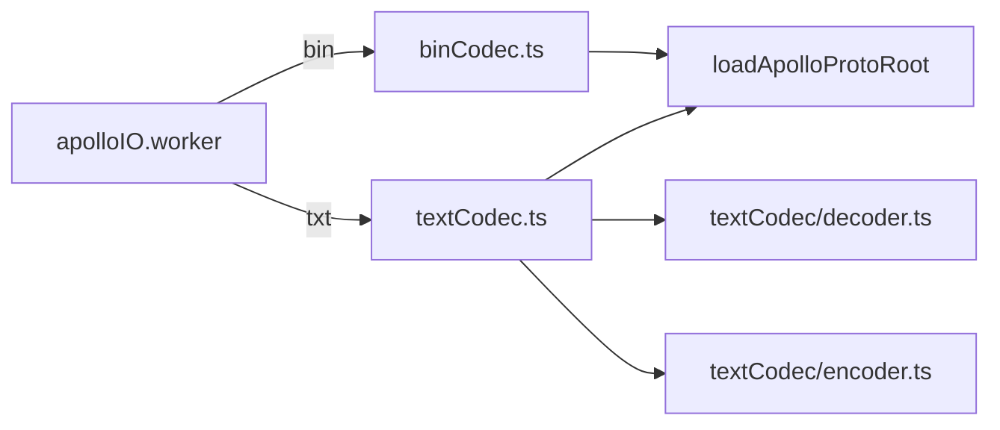

# Proto / Codec

Apollo HD-map 在磁盘上有两种格式：

- `*.bin` — 二进制 protobuf（生产部署用）；
- `*.txt` / `*.pb.txt` — protobuf text format（人工调试用）。

编辑器对这两种格式提供统一的 4 个入口，全部在
`src/io/proto/binCodec.ts` 与 `src/io/proto/textCodec.ts`：

```ts
export function decodeMapBin(bytes: Uint8Array): Promise<Record<string, unknown>>;
export function encodeMapBin(obj: Record<string, unknown>): Promise<Uint8Array>;
export function decodeMapText(text: string): Promise<Record<string, unknown>>;
export function encodeMapText(obj: Record<string, unknown>): Promise<string>;

// 低层 API（textCodec 内部）：
export function decodeMessage(type: protobuf.Type, text: string): Record<string, unknown>;
export function encodeMessage(type: protobuf.Type, msg: unknown, level?: number): string;
```

> Source: `src/io/proto/binCodec.ts:1-23` 与 `src/io/proto/textCodec.ts:1-16`

## `decodeMapBin(bytes): Promise<Record<string, unknown>>`

调 `getMapType()` 拿到 `apollo.hdmap.Map` 类型，`Map.decode(bytes)` 后
`Map.toObject(msg, { longs: Number, enums: Number, defaults: false,
arrays: true, objects: true })`：

- `longs: Number` — int64 → JS number（Apollo 实际不存超大整数）；
- `enums: Number` — 数字枚举（与 entityBridge 的 `*_INV` 表一致）；
- `defaults: false` — 不写入未设置字段（保留 wire 缺省 → 写入 fidelity）；
- `arrays / objects: true` — repeated / sub-message 即使为空也建容器
  （让下游遍历不必 null guard）。

## `encodeMapBin(obj): Promise<Uint8Array>`

执行链：

```ts
const Map = await getMapType();
const err = Map.verify(obj);
if (err) throw new Error(`Map.verify failed: ${err}`);
const msg = Map.fromObject(obj);
return Map.encode(msg).finish();
```

`Map.verify` 在 schema 不匹配时抛错（类型错误、enum 越界等）；
`fromObject` 把 plain object 转成 protobufjs message instance，再 `encode().finish()`
得到 `Uint8Array`。

## `decodeMapText(text): Promise<Record<string, unknown>>`

走 `decodeMessage(Map, text)` —— 使用我们自己写的 protobuf text format
解析器。`textCodec/decoder.ts` 与 `tokenStream.ts` 的实现细节见
[io/proto-codec-text](/api/io/proto-codec-text)。

只解析 schema 已声明的字段；未知字段静默跳过（`skipFieldValue`）。
Apollo 文本里常见的 `#` 行注释会被 `skipWhitespaceAndComments`
直接吃掉。

## `encodeMapText(obj): Promise<string>`

走 `encodeMessage(Map, obj, 0)` —— 输出 Apollo 风格的 text protobuf：

- 缩进 = 2 空格；
- nested message 用 `name { … }` 而非 `name: { … }`；
- enum 输出 symbolic name（fallback 到数字字符串）；
- bytes / string 用 latin1 转义；
- `inf` / `-inf` / `nan` 数值；

## 调用图



## 异常处理

- `Map.verify` 抛错：输入对象含非法字段。常见原因：手工拼出来的对象
  忘了 wrap id 字段（`{ id: 'x' }` 而不是 `{ id: { id: 'x' } }`），或
  enum 字符串未走 `*_INV` 表。
- 文本解析错误：`stream.expect` 抛 `Expected ${kind} ..., got ...
near pos ${pos}`，给出输入光标位置便于排错。
- 字节转换错误：`bytes` 字段在文本里以 latin1 转义出现，包含非
  printable 时需要 `\xHH` 形式；正常 Apollo 输出不会触发。
