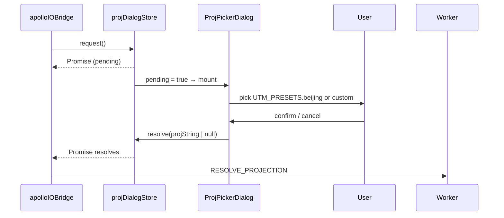

# Store / projDialogStore

Source: `src/store/projDialogStore.ts`.

`projDialogStore` is a small promise-resolver store used when an
imported Apollo map lacks `header.projection.proj`. It bridges the
`NEEDS_PROJECTION` worker message to the modal `<ProjPickerDialog />`
and back.

## State Shape

```ts
interface ProjDialogState {
  pending: boolean;
  resolver: ((value: string | null) => void) | null;
}

interface ProjDialogActions {
  request(): Promise<string | null>;
  resolve(value: string | null): void;
}
```

## Actions

### `request()`

```ts
request() {
  const prev = get().resolver;
  if (prev) prev(null);  // cancel any prior in-flight request
  return new Promise((resolve) => set({ pending: true, resolver: resolve }));
}
```

Sets `pending = true` and stores the promise resolver. If a previous
request is still in flight, it is silently rejected with `null` first
so the dialog never stacks.

### `resolve(value)`

Called by the dialog OK / Cancel buttons. Resolves the stored promise
with a PROJ string or `null`, then clears state.

## Flow



Cancellation surfaces as `null`; `apolloIOBridge` falls back to
`UTM_PRESETS.beijing`.

## Examples

```ts
// Inside apolloIOBridge.handleMessage:
if (msg.type === 'NEEDS_PROJECTION') {
  const picked = await useProjDialogStore.getState().request();
  const projString = picked ?? UTM_PRESETS.beijing;
  this.post({ type: 'RESOLVE_PROJECTION', requestId: msg.requestId, projString });
}

// Inside the dialog component:
const { pending, resolve } = useProjDialogStore();
if (!pending) return null;
return (
  <Dialog>
    <Button onClick={() => resolve(UTM_PRESETS.beijing)}>Beijing UTM 50N</Button>
    <Button onClick={() => resolve(null)}>Cancel</Button>
  </Dialog>
);
```

## Related

- [/api/io/apollo-io-bridge](/api/io/apollo-io-bridge) — caller of
  `request()`.
- [/api/io/proto-projection](/api/io/proto-projection) —
  `UTM_PRESETS`.
- [/api/components/proj-picker-dialog](/api/components/proj-picker-dialog)
  — primary consumer.
