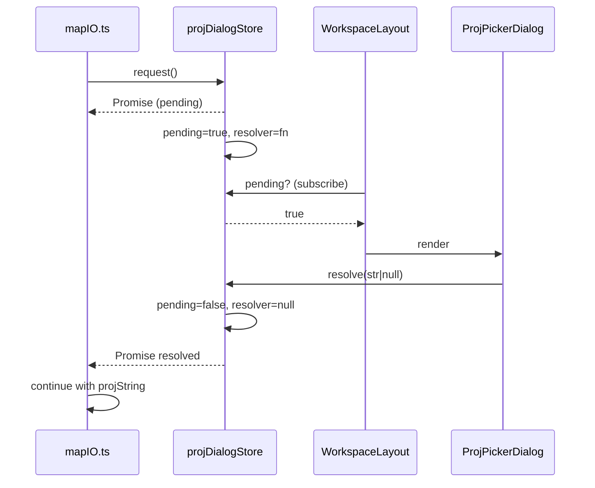
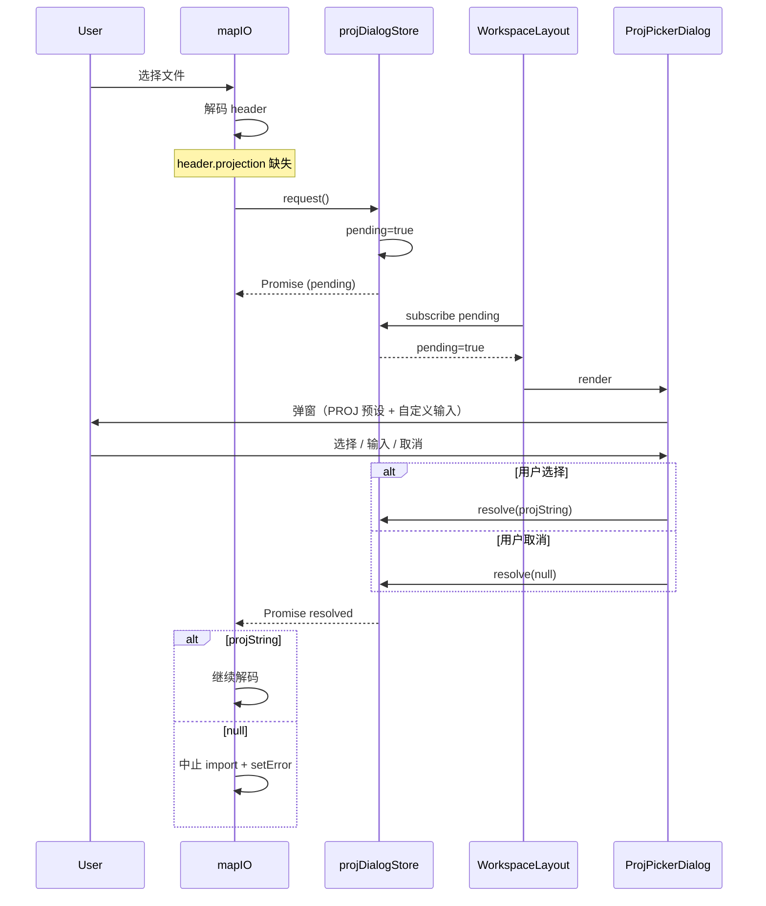

# `projDialogStore` — PROJ.4 字符串选择弹窗

> 源码：`src/store/projDialogStore.ts` · 44 行 · 不参与撤销

## 用途

Apollo 地图的 `header.projection.proj` 是 PROJ.4 字符串。但实测中很多手工导出的 base_map 没有这个字段——直接拒绝导入会让用户没有出路，自动猜测又风险高。所以编辑器走一条交互路径：

```
mapIO 解码 header → header.projection 缺失 → projDialogStore.request()
   ↓
WorkspaceLayout 检测到 pending=true → 渲染 ProjPickerDialog
   ↓
用户选择预设或输入自定义串 → resolver(str)
   ↓
mapIO 用 promise 解析得到字符串后继续解码
```

`projDialogStore` 把这个"组件外发起、组件内回答、调用方 await"的桥接关系封装成 Promise。

## 公共 API

| 符号                 | 类型   | 签名                                        | 摘要                           |
| -------------------- | ------ | ------------------------------------------- | ------------------------------ |
| `useProjDialogStore` | hook   | `() => ProjDialogState & ProjDialogActions` | Zustand store                  |
| `request()`          | action | `() => Promise<string \| null>`             | 由 `mapIO` 调用；返回 Promise  |
| `resolve(value)`     | action | `(string \| null) => void`                  | 由弹窗组件调用，settle Promise |
| `pending`            | state  | `boolean`                                   | 是否有 in-flight 请求          |
| `resolver`           | state  | `((value: string \| null) => void) \| null` | 当前 Promise resolver（私有）  |

## 详细条目

### `interface ProjDialogState`

```ts
interface ProjDialogState {
  pending: boolean;
  resolver: ((value: string | null) => void) | null;
}
```

`resolver` 暴露在 state 上是为了 store 内部的 race-condition guard（见下），不建议外部读。

### `request(): Promise<string | null>`

```ts
request() {
  const prev = get().resolver;
  if (prev) prev(null);   // 抢占式取消旧请求
  return new Promise<string | null>((resolve) => {
    set({ pending: true, resolver: resolve });
  });
}
```

特别注意：**抢占式取消**——若已有 in-flight 请求，先用 `null` 解析掉它（视为 cancel），避免两个弹窗叠在一起。这是面向"用户连续打开两个文件"的边界场景。

### `resolve(value)`

```ts
resolve(value) {
  const { resolver } = get();
  if (resolver) resolver(value);
  set({ pending: false, resolver: null });
}
```

由 `ProjPickerDialog` 在用户点 OK / Cancel 时调用：

- OK → `resolve(projString)`
- Cancel → `resolve(null)` —— mapIO 收到 null 后取消整个导入

## 时序



## 内部实现

- `request()` 抢占式取消的设计避免了两个 dialog 同时出现。`resolver` 字段存储在 state 上有点不太常规，但比 closure capture 更易调试（DevTools 直接看得到）。
- 弹窗组件用 `pending` 触发渲染，不直接读 `resolver`——保证封装。
- 没有 timeout——如果用户永远不 resolve，promise 永远 pending；mapIO 调用方应在 unmount 时调用 `resolve(null)`。

## 副作用

- 无 IPC、无 LS、无定时器。
- 仅持有 closure 引用的 `resolve` 函数。

## 测试覆盖

无独立测试。被 `mapIO.test.ts` 在测试缺投影路径时间接覆盖（mock `request` 返回固定串）。

## 调用方

- `src/io/mapIO.ts` — 解码后发现 header 缺 proj 时 `await request()`
- `src/components/layout/WorkspaceLayout.tsx` — `useProjDialogStore(s => s.pending)` 触发挂载
- `src/components/dialogs/ProjPickerDialog.tsx` — 调用 `resolve`

## 源码索引

| 行    | 内容                |
| ----- | ------------------- |
| 14–18 | `ProjDialogState`   |
| 20–23 | `ProjDialogActions` |
| 25–43 | store 工厂          |

## 使用模式

最佳实践：

```ts
// mapIO.ts
async function resolveProjString(header: ApolloMapHeader | null): Promise<string | null> {
  const proj = (header?.projection as { proj?: string } | undefined)?.proj;
  if (proj) return proj;
  // 头部缺投影，问用户
  return useProjDialogStore.getState().request();
}
```

调用方应理解 `request()` 返回 `null` 的语义——用户取消，整个导入流程应中止。

## 调用链路



## 与 unmount 的协作

如果调用方在 dialog 还未关闭时被卸载（用户切换路由 / 关窗口），调用方应主动 `resolve(null)` 关闭所有 in-flight 请求：

```tsx
useEffect(() => {
  return () => {
    if (useProjDialogStore.getState().pending) {
      useProjDialogStore.getState().resolve(null);
    }
  };
}, []);
```

否则 Promise 会永远 pending，调用方的内存被持有。

## 与 zustand 的非典型用法

把 Promise resolver 存在 zustand state 上是非常规做法——一般来说 zustand 只放序列化数据。这里的考量：

1. **DevTools 可见**：能直接看到当前 resolver 是否就位，调试容易
2. **抢占式取消**：多个 in-flight 请求时，preempt 逻辑需要看到当前 resolver
3. **没有备选**：closure 内部捕获 resolver 的话，preempt 逻辑没有访问入口

代价：`resolver` 字段本身不应被外部 mutate；用 TS 私有约束 + 注释来弱执行。

## 参见

- [`apolloMapStore`](./apollo-map-store.md) — 选定的 PROJ 串最后落到 `info.projString`
- `mapIO.importBaseMap` — 真正的发起方
- `src/components/dialogs/ProjPickerDialog.tsx` — 弹窗组件
- `src/components/layout/WorkspaceLayout.tsx` — 挂载层
