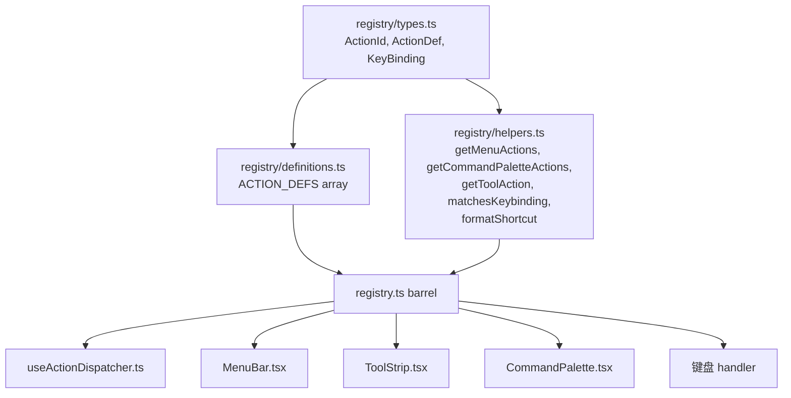
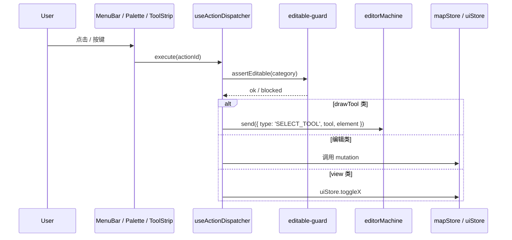

# Action Registry

`src/core/actions/registry.ts` 是所有用户可执行动作的 **唯一注册中心** (R5 闭环)。
菜单栏、命令面板、工具条、键盘快捷键、未来的语音 / API 触发器都从这同一张表读取
元数据，避免文案 / 快捷键 / 图标在多处漂移。

## 1. 设计目的与不变量

::: tip 设计目标

- 一处声明，多处消费 (MenuBar / ToolStrip / CommandPalette / 键盘 handler)。
- 增加一个动作 = 改一行 + 在 dispatcher 里添加 case。
- 类型安全：`ActionId` 是 literal union，写错就编译失败。
- 平台敏感：Mac glyph (⌘⇧⌥⌃) 与 Win/Linux 文本 (Ctrl+ Shift+ Alt+) 自动转换。
  :::

::: warning 不变量

- 任何 menu 项 / 工具按钮 / palette 条目都必须背靠一条 `ActionDef`，不允许"裸字符串
  - 直接 setState"。
- `useActionDispatcher` 是唯一应该 import `ACTION_DEFS` 的 hook；UI 组件读
  `ACTION_MAP` / `getMenuActions` / `getCommandPaletteActions`，不直接遍历。
- 调用任何编辑类 action 之前，dispatcher 都要走 `assertEditable()` (license + read-only 拦截)。
  :::

## 2. 模块地图



## 3. ActionDef 形状

```ts
// registry/types.ts:29-43
export interface ActionDef {
  id: ActionId; // literal union
  label: string; // UI 文案
  category: ActionCategory; // 'file' | 'edit' | 'view' | 'tool' | 'selection'
  shortcut?: string; // Mac glyph 形式 e.g. '⇧⌘Z'
  keybinding?: KeyBinding; // 实际事件匹配
  icon?: IconType; // react-icons/fa6
  inCommandPalette: boolean;
  menu?: string; // 'File' | 'Edit' | 'View'
  menuOrder?: number;
  isToggle?: boolean;
  drawTool?: DrawTool; // 自动派发 SELECT_TOOL
  uiSlot?: ToolStripSlot; // 'selection' | 'view'
  uiOrder?: number;
}
```

`KeyBinding`:

```ts
// registry/types.ts:45-51
export interface KeyBinding {
  key: string;
  ctrl?: boolean;
  shift?: boolean;
  alt?: boolean;
  global?: boolean; // 在 input/textarea focus 时仍然触发
}
```

## 4. 公共表面 (导出)

| 符号                       | 出处                         | 职责                                             |
| -------------------------- | ---------------------------- | ------------------------------------------------ |
| `ACTION_DEFS`              | `registry/definitions.ts:22` | 定义数组 (单一事实源)                            |
| `ACTION_MAP`               | `registry/helpers.ts:10`     | `Map<ActionId, ActionDef>` —— O(1) 查找          |
| `getActionsByCategory`     | `:12`                        | 按 category 过滤                                 |
| `getMenuActions`           | `:16`                        | 按 menu 名过滤 + menuOrder 排序                  |
| `getMenuNames`             | `:22`                        | 推导出现过的 menu 名 (顺序按 ACTION_DEFS 出现序) |
| `getCommandPaletteActions` | `:30`                        | 仅 inCommandPalette = true 的                    |
| `getKeyBindingActions`     | `:34`                        | 仅有 keybinding 的                               |
| `getToolAction`            | `:38`                        | 给定 DrawTool 反查 ActionDef                     |
| `getToolStripSlotActions`  | `:42`                        | 按 uiSlot 过滤 + uiOrder 排序                    |
| `matchesKeybinding`        | `:48`                        | 把 KeyboardEvent 与 KeyBinding 匹配              |
| `formatShortcut`           | `:98`                        | Mac → Win/Linux 字符串转换                       |
| `isMacPlatform`            | `:69`                        | UA 嗅探 (memoised)                               |

## 5. 当前 ACTION_DEFS 全量 (摘要)

| ActionId               | label                    | shortcut | category  | menu | drawTool / uiSlot        |
| ---------------------- | ------------------------ | -------- | --------- | ---- | ------------------------ |
| `importApollo`         | Import Apollo Map...     | —        | file      | File | —                        |
| `exportApolloBin`      | Export Apollo Map (.bin) | ⌘S       | file      | File | —                        |
| `exportApolloText`     | Export Apollo Map (.txt) | ⇧⌘S      | file      | File | —                        |
| `settings`             | Settings                 | ⌘,       | file      | File | —                        |
| `undo`                 | Undo                     | ⌘Z       | edit      | Edit | —                        |
| `redo`                 | Redo                     | ⇧⌘Z      | edit      | Edit | —                        |
| `delete`               | Delete Selection         | ⌫        | edit      | Edit | —                        |
| `toggleGrid`           | Toggle Grid              | ⌘G       | view      | View | uiSlot=view              |
| `toggleSnap`           | Toggle Snap              | —        | view      | View | uiSlot=view              |
| `resetLayout`          | Reset Layout             | —        | view      | View | —                        |
| `commandPalette`       | Command Palette          | ⌘K       | view      | —    | —                        |
| `defaultMode`          | Default (Pan)            | H        | selection | —    | —                        |
| `connectLanes`         | Connect Lanes            | C        | edit      | Edit | —                        |
| `tool:drawPolyline`    | Draw Polyline            | P        | tool      | —    | drawTool=drawPolyline    |
| `tool:drawBezier`      | Draw Bezier              | B        | tool      | —    | drawTool=drawBezier      |
| `tool:drawArc`         | Draw Arc                 | A        | tool      | —    | drawTool=drawArc         |
| `tool:drawRotatedRect` | Draw Rectangle           | R        | tool      | —    | drawTool=drawRotatedRect |
| `tool:drawPolygon`     | Draw Polygon             | G        | tool      | —    | drawTool=drawPolygon     |
| `tool:drawCatmullRom`  | Draw CatmullRom          | —        | tool      | —    | drawTool=drawCatmullRom  |

## 6. 派发序列图



## 7. 内部细节

### 7.1 平台敏感快捷键

注册时写一种形式 (`⌘S` / `⇧⌘Z`)。`formatShortcut` 在 Mac 直接返回原字符串；
在 Win/Linux 把 `⌘`/`⌃` → `Ctrl+`、`⇧` → `Shift+`、`⌥` → `Alt+`。匹配逻辑 (`matchesKeybinding`) 把 `ctrlKey || metaKey` 视作同一修饰键，因此 dispatcher 不需要平台分支。

### 7.2 MenuBar 渲染

```ts
const menus = getMenuNames(); // ['File', 'Edit', 'View']
for (const m of menus) {
  const items = getMenuActions(m); // 按 menuOrder 排序
  // 渲染 <DropdownMenu> ...
}
```

### 7.3 CommandPalette

```ts
const actions = getCommandPaletteActions();
// 与 cmdk 的 <Command.Item value={id}> 一一对应；
// keyboard navigate + execute(id)
```

### 7.4 ToolStrip 工具按钮

`ToolStrip.tsx` 用 `getToolAction(currentDrawTool)` 反查当前激活的 ActionDef，给按钮加
"selected" 高亮；`getToolStripSlotActions('view')` 渲染 grid/snap 切换按钮。

### 7.5 键盘 handler

`useActionDispatcher` 在 `useEffect` 里挂全局 `keydown`，遍历 `getKeyBindingActions()`
找第一个 `matchesKeybinding(e, action.keybinding)` 命中的，preventDefault → execute。
`global: true` 表示即使焦点在 `<input>` 内仍然处理 (例如 Ctrl+S 永远 export)。

## 8. 添加一条新动作 SOP

1. 在 `ActionId` literal union (`registry/types.ts:6-25`) 加 ID。
2. 在 `ACTION_DEFS` (`registry/definitions.ts:22`) 加一项。
3. 在 `useActionDispatcher.execute` switch 里加 case (绘制工具不需要，直接通过
   drawTool 转发到 FSM SELECT_TOOL)。
4. 若是 tool 且需要新元素类型，更新 `core/elements.ts`。
5. 若涉及 toggle 状态，给 dispatcher 实现 `getToggleState(id)`。
6. 跑 `pnpm typecheck && pnpm test`。

::: tip 命名约定

- `tool:*` 前缀专用于 draw tool。
- `category` 应该匹配 menu 名 (除非该 action 不进 menu)。
  :::

## 9. 与其他子系统的关系

| 子系统          | 接触面                                                                       |
| --------------- | ---------------------------------------------------------------------------- |
| FSM             | `drawTool` 字段 → `SELECT_TOOL` 事件                                         |
| mapStore        | undo / redo / delete / import / export 调到 store actions                    |
| uiStore         | toggleGrid / toggleSnap / connectLanes                                       |
| WorkspaceLayout | resetLayout / settings / commandPalette 走 prop pipe (因为这些不在 store 里) |
| License         | dispatcher 内部的 `assertEditable()`                                         |

## 10. 常见陷阱

::: danger 在 UI 直接 import ACTION_DEFS
组件应该读 `getMenuActions`/`getCommandPaletteActions`，不直接遍历数组。原因：
未来若把 registry 改成异步加载 (例如 plugin)，遍历数组的代码全部要改。
:::

::: danger menuOrder 重复
两个 menu item 共用一个 menuOrder 时排序顺序未定义。约定：步长 10 (10, 20, 30...)，
中间留 buffer。
:::

::: danger 写错 keybinding 的 key
`key` 必须是 `KeyboardEvent.key` 的小写 (`'s'`, `'z'`, `'k'`, `'delete'`, `','`)。
写成 `'KeyS'` 是 `code` 属性，不会匹配。
:::

::: danger 漏 inCommandPalette: false
不希望出现在 palette 的 action (例如 Cmd+K 自身) 必须显式置 `false`，否则
`getCommandPaletteActions` 会列出它，导致用户在 palette 里再按一次 Cmd+K 关闭 palette。
:::

## 11. Source map (file:line refs)

- `src/core/actions/registry.ts:1-22` — barrel
- `src/core/actions/registry/types.ts:1-52` — 类型与 ID union
- `src/core/actions/registry/definitions.ts:22-222` — ACTION_DEFS
- `src/core/actions/registry/helpers.ts:1-108` — 全部 helper
- `src/hooks/useActionDispatcher.ts` — 派发与 R1 CANCEL
- `src/components/layout/MenuBar.tsx` — 消费 `getMenuActions`
- `src/components/layout/ToolStrip.tsx` — 消费 `getToolAction`/`getToolStripSlotActions`
- `src/components/layout/panels/CommandPalette.tsx` — 消费 `getCommandPaletteActions`

## 12. dispatcher 内部职责拆解

```mermaid
flowchart TB
  Exec[execute(actionId)] --> Lookup[ACTION_MAP.get(actionId)]
  Lookup --> Cat{action.category}
  Cat -- file --> File[importApollo / exportApolloBin / settings]
  Cat -- edit --> Guard[assertEditable]
  Guard --> Edit[undo/redo/delete/connectLanes]
  Cat -- view --> View[toggleGrid / toggleSnap / resetLayout / commandPalette]
  Cat -- tool --> Tool[FSM.send SELECT_TOOL]
  Cat -- selection --> Sel[FSM.send DESELECT or 切回 idle]
```

- `assertEditable()` 拦截 license expired 或 read-only 模式。
- undo / redo 走 R1 CANCEL 协议。
- `tool:*` 自动转 FSM event，dispatcher 不持有具体绘制状态。

## 13. getToggleState 实现

某些 action 是 toggle 形式 (Grid / Snap / Connect Lanes / Default Pan)，UI 需要知道
当前是开 / 关。`getToggleState(id)` 在 dispatcher 中按 ID 返回 boolean：

```ts
// 概念示意（详见 useActionDispatcher.ts）
function getToggleState(id: ActionId): boolean | undefined {
  switch (id) {
    case 'toggleGrid':
      return useUIStore.getState().gridEnabled;
    case 'toggleSnap':
      return useUIStore.getState().snapEnabled;
    case 'connectLanes':
      return useUIStore.getState().connectMode.active;
    case 'defaultMode':
      return useSelector(actorRef, (s) => s.value === 'idle');
    default:
      return undefined;
  }
}
```

## 14. CommandPalette 与 fuzzy 搜索

`cmdk` 内置 fuzzy match (基于 contiguous 匹配 + 字符权重)。我们没有自己写 fuzzy；
所有 `ActionDef.label` 即 palette 候选项。

::: tip 命名建议
`label` 应包含动词 + 宾语 (`Toggle Grid` 而非 `Grid`)，让 fuzzy match 命中率更高。
:::

## 15. 国际化备注

当前 `label` 是英文硬编码 (memory: i18n 未实现)。未来切到 i18next 时建议：

- `label` 字段改为 i18n key (`'action.toggleGrid'`)；
- helpers 增加一个 `t()` 步骤把 key 翻译。
  不在本期 scope。

## 16. ToolStrip 槽位 (uiSlot)

ToolStrip 把按钮分为若干槽位 (slot)，每个槽位独立排序：

| `uiSlot`    | 出现按钮                         | uiOrder  |
| ----------- | -------------------------------- | -------- |
| `view`      | toggleGrid (10), toggleSnap (20) | 渲染顺序 |
| `selection` | (尚未实装)                       | reserved |

`getToolStripSlotActions('view')` 返回 [toggleGrid, toggleSnap] 排好序。新增 view 类
toggle 时只需写 `uiSlot: 'view'` + 合适的 `uiOrder`。

## 17. 将 Action 关联到 lib/editable-guard

```ts
// lib/editable-guard.ts (片段)
const PROTECTED_CATEGORIES: Set<ActionCategory> = new Set(['edit', 'tool']);

export function assertEditable(actionOrCategory: ActionDef | ActionCategory): boolean {
  const cat = typeof actionOrCategory === 'string' ? actionOrCategory : actionOrCategory.category;
  if (!PROTECTED_CATEGORIES.has(cat)) return true;
  return useLicenseStore.getState().state.canEdit;
}
```

dispatcher 在执行任何 edit / tool action 前调一次。view / file / selection 不拦截。
（导入 / 导出走 file 类，license 检查在 IO 路径自身。）

## 18. See also

- [架构总览](./overview.md)
- [FSM 设计](./fsm-design.md) — SELECT_TOOL / drawTool
- [状态管理](./state-management.md) — undo / redo
- [工作区布局](./workspace-layout.md) — Settings / Reset / Palette 入口
- [License 系统](./license-system.md) — assertEditable
