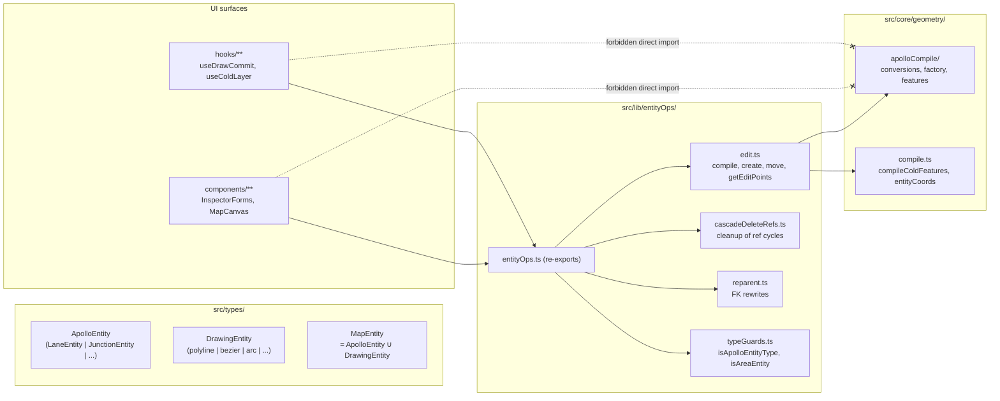
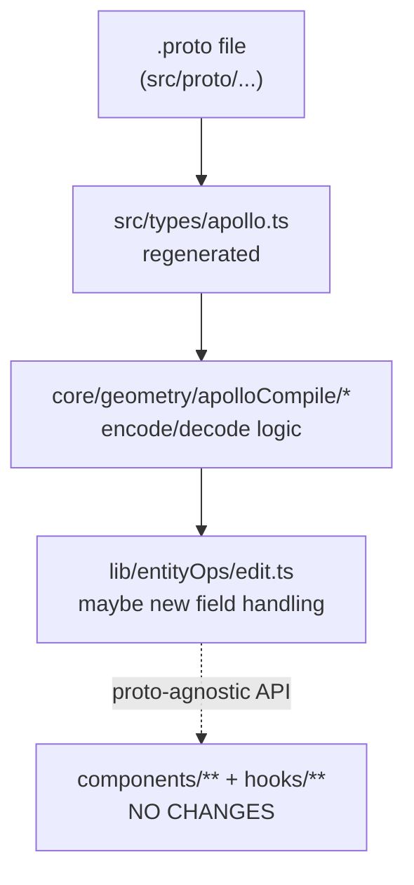

# Anti-Corruption Layer

The Apollo proto types live in `src/types/apollo.ts`. Without insulation, a
proto v2 → v3 upgrade would cascade through every UI file that read
`ApolloEntity` directly. The fix — risk **R2** in the architecture audit —
is `src/lib/entityOps.ts`: a single module that collects all proto-aware
operations behind proto-agnostic `MapEntity` helpers.

UI code imports from `@/lib/entityOps`, never directly from
`@/core/geometry/apolloCompile`.

## ApolloEntity vs MapEntity



The `ApolloEntity` union mirrors Apollo `.proto` definitions byte-for-byte —
so a proto v2 → v3 schema rewrite would change every Apollo entity type. If
UI code reached into those fields directly, every form, every canvas
interaction, and every undo handler would need touching.

`MapEntity` is the editor-facing shape:

```ts
type MapEntity = ApolloEntity | DrawingEntity;
```

UI code only ever sees `MapEntity`. It branches on `entityType` (a
discriminator string) and asks `entityOps` to perform proto-aware operations
on the entity it's holding.

## What entityOps hides

The facade in `src/lib/entityOps.ts` re-exports a flat surface from four
implementation submodules:

| Submodule              | What it owns                                                                                                                       | Apollo internals it touches                                                                                        |
| ---------------------- | ---------------------------------------------------------------------------------------------------------------------------------- | ------------------------------------------------------------------------------------------------------------------ |
| `cascadeDeleteRefs.ts` | Removing references to a deleted entity from any other entity that points to it                                                    | Apollo `LaneEntity.predecessorIds`, `JunctionEntity.overlapIds`, signal/junction lane references, etc.             |
| `edit.ts`              | `compileEntity`, `createEntity`, `getEditPoints`, `setEditPoint`, `setAllEditPoints`, `moveEntity`, `deleteVertex`, `entityCoords` | proto-specific point-array shapes (centralCurve.segment[].lineSegment.point, polygon.point, leftBoundary.curve, …) |
| `reparent.ts`          | Moving a child under a different parent — `lane → road`, `lane → junction`, `signal → junction`, `subsignal → signal`              | each FK field on the child entity                                                                                  |
| `typeGuards.ts`        | `isApolloEntityType`, `isAreaEntity`, `isDrawingEntity`, `isPolygonEditEntity`                                                     | the `entityType` discriminator union                                                                               |

::: info entityOps is the only safe consumer of `apolloCompile`
The geometric compiler (`src/core/geometry/apolloCompile/*.ts`) emits Apollo
proto-shaped data structures. `lib/entityOps` is its only first-party caller.
A new submodule for, say, "compute centroid" must live under
`src/lib/entityOps/` — never under `src/components/` or `src/hooks/`.
:::

## Why proto v2 → v3 should never ripple

When Apollo upstream changes a proto field — say, `LaneBoundary` gains a new
`color` field, or `Lane.length` is renamed — the change ripples like this:



The blast radius stops at `entityOps`. A field rename never propagates above
that boundary because UI code never reads the renamed field directly.

A field **addition** propagates only as far as the inspector schema — see
[Inspector System](./inspector-system.md) for how schemas in
`src/lib/schemas.ts` declare which fields are editable.

## entityOps subfile walkthrough

### `cascadeDeleteRefs.ts`

```ts
// src/lib/entityOps.ts re-exports:
export {
  cascadeDeleteRefs,
  cascadeDeleteRefsFull,
  type CascadeDeleteResult,
} from './entityOps/cascadeDeleteRefs';
```

When the user deletes a lane, every entity that references that lane needs
its FK array rewritten. `cascadeDeleteRefsFull(idsToDelete, allEntities)`
returns:

- `changes: Map<id, MapEntity>` — entities whose FK arrays were rewritten,
  not deleted themselves.
- `cascadeRemoved: Set<id>` — entities that lost their last meaningful link
  and should be removed entirely (e.g. an `OverlapEntity` whose participants
  all got deleted).

The function is invoked from `mapStore.removeEntity` at
`src/store/mapStore.ts:160-167`. It is pure — given the same inputs, it
always returns the same diff.

### `edit.ts`

The dense one. `compileEntity(entity)` produces the entity's GeoJSON features.
`getEditPoints(entity)` returns the draggable control points the canvas
overlay shows when an entity is selected. `setEditPoint(entity, idx, pt)`
returns a new entity with one control point moved. `moveEntity(entity, dx, dy)`
shifts every control point by a delta.

Each of these functions branches on `entityType` and dispatches to the
matching apolloCompile helper for Apollo entities or to the basic-shape
math (`catmullRom`, `cubicBezier`, `threePointArc`, …) for drawing entities.

::: tip Why a single facade rather than per-type files?
The discriminated union approach means new entity types add one branch in
each function rather than a new file in N directories. As of this writing,
`MapEntity` has 18 variants and `edit.ts` is ~250 lines — a manageable single
file. If it grows past ~500 lines, the planned split is by operation
(`getEditPoints/`, `setEditPoint/`, …) not by entity type.
:::

### `reparent.ts`

Reparenting is the operation `LayerTree` uses when a user drags a `lane` from
under one `road` to another. The complication is that some children-parents
have multiple FK paths (`lane.junctionId` vs `road.junctionId` vs
`pncJunction.passageGroup[].lane[]`).

`reparent(child, target, allEntities)` returns:

```ts
type ReparentResult = {
  changes: Map<id, MapEntity>; // entities whose FKs were rewritten
  rejected?: string; // if the move would violate invariants
};
```

`canReparent(child, target)` is the lighter-weight predicate the LayerTree
uses to enable/disable the drag target before the user lets go.

### `typeGuards.ts`

Pure type predicates. `isApolloEntityType(t)` distinguishes Apollo proto
entities from drawing entities. `isAreaEntity(e)` decides whether the entity
should render as a polygon (filled) vs a polyline (stroked) — used by both
the cold layer compile and the [Hit Test](./spatial-index.md) priority tier.

## Concrete walkthrough: lane width edit

A user drags the inspector's "Lane half width" slider:

```
1. InspectorForms/lane.tsx           — react-hook-form onChange
2. ↓ form watcher in <LaneForm>
3. mapStore.updateEntity(id, next)   — ↓ via facade
4. lib/entityOps.compileEntity(next) — ↑ called from somewhere?
```

That fourth step is where the boundary holds. The inspector form does not
read the new lane's `leftBoundary.curve.segment[0].lineSegment.point[]`
directly. Instead it sets the scalar `leftWidth` on the form values, the
form's resolver converts back to a partial entity patch, and then the
mutated entity is fed to `mapStore.updateEntity`. The store, in turn,
asks `entityOps.compileEntity` (indirectly via the spatial worker) to
recompile the geometry from scratch.

Result: the inspector code did not import `apolloCompile` at any point. The
proto field tree of `LaneEntity` could change tomorrow and the inspector
would not need touching.

## The audit in CI

::: warning Pre-merge audit
Before any PR that adds a new component or hook merges:

```bash
git grep "from '@/core/geometry/apolloCompile'" \
  -- 'src/components/**' 'src/hooks/**'
```

A non-empty result is a leak. The fix is to:

1. Identify which `entityOps` operation is missing (or extend an existing one).
2. Add it to `src/lib/entityOps/<area>.ts`.
3. Re-export it from `src/lib/entityOps.ts`.
4. Replace the leaking import.
   :::

The lint rule from [Layered Architecture](./layered-architecture.md) is the
machine-checkable form, queued behind ESLint 9 flat-config support in
`eslint-plugin-import`.

## Why this is risk **R2**

The architecture audit notes (P9 synthesis, 2026-04-11) flagged the lack of
an anti-corruption layer as the second-largest risk after R1 (FSM/undo
closure, since fixed at `src/hooks/useActionDispatcher.ts:104-110`).

The fix — `lib/entityOps` — was completed before this doc page was written.
The audit grep above is the regression guard. As long as it stays empty, R2
is closed.

## See also

- [Layered Architecture](./layered-architecture.md) — the broader rule
  `entityOps` participates in.
- [Inspector System](./inspector-system.md) — schemas as the form-side
  boundary.
- [State Management](./state-management.md) — `mapStore` consumes `entityOps`
  for `removeEntity` cascade and for reparenting.
- `/api/entityOps` — the per-function reference (other agents own that page).
