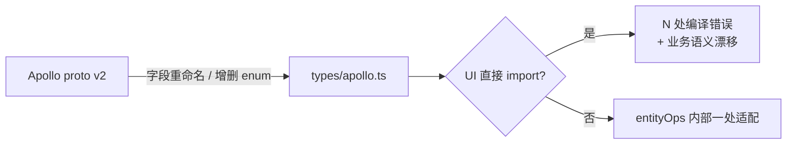
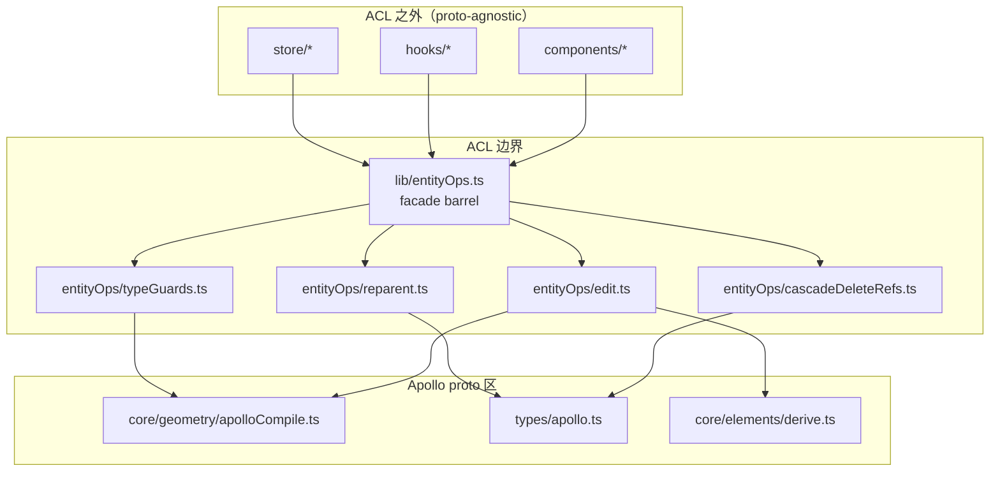
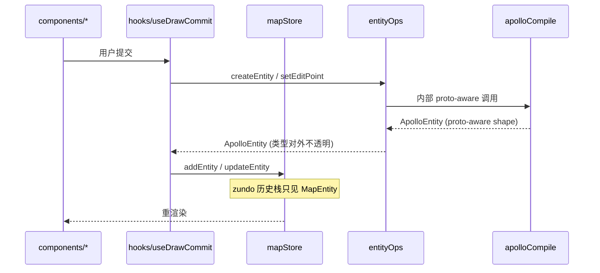

# 反腐败层

Apollo proto 类型 (`src/types/apollo.ts`) 是工程 **最易被外部变更"腐蚀"** 的部分：
Apollo HD-map proto 由上游车场仓库维护，schema 演进不归我们控制。一旦 UI / 状态层
直接访问 proto 字段 (例如 `entity.boundaryType[0].types`)，proto v2 → v3 的字段重命名
就会 **波及每一份 React 组件**。本页论述这一风险 (审计中标记为 **R2**)，介绍我们
采用的 adapter 模式 (`src/lib/entityOps`)，并给出 CI 拦截脚本草案。

## 1. 设计目的与不变量

::: tip 设计目标

- 将 Apollo proto schema 的"知识"局限在 `core/geometry/apolloCompile.ts` +
  `lib/entityOps/*` 两个目录内。
- 上层 (`store/`、`hooks/`、`components/`) 只见到一组 proto-agnostic 的 helper：
  `getEditPoints`, `setEditPoint`, `compileEntity`, ...
- 任何未来的协议升级 → 修改 entityOps 内部一处即可，UI 零改动。
  :::

::: warning 不变量

- 反腐败红线：`src/components/**` 与 `src/hooks/**` 不得 import
  `@/core/geometry/apolloCompile` 或 `@/types/apollo` 的具象字段。
- `lib/entityOps` 之外的 `lib/*` 也不得直接 import apolloCompile (否则反腐败被旁路)。
- proto schema 升级 PR 必须同时更新 entityOps 子模块的 typeguard / cascadeDelete
  字段列表。
  :::

## 2. 为什么需要 ACL —— R2 风险叙事



**审计前** (假设场景)：

- `LaneInspector.tsx` 直接读 `lane.predecessorIds`。
- `LaneDeleteCascade.ts` 直接遍历 `lane.successorIds`。
- proto v2 把 `predecessorIds` 拆成 `topology.predecessor.id[]`。
- 结果：30+ 文件需要并发改，merge conflict 与回归 bug 几率显著。

**审计后** (现在)：

- 上层只调 `getEditPoints` / `cascadeDeleteRefsFull` / `reparent`。
- proto v2 升级时，只改 `lib/entityOps/cascadeDeleteRefs.ts` 与 `apolloCompile.ts`。
- 其余文件无需变动。

## 3. 模块地图



## 4. 公共表面契约

外层只依赖 `@/lib/entityOps` barrel 导出的 12 个符号 (详见
[entityOps 模块](./entityops.md))。这构成 ACL 的 **正式公共契约** —— 任何修改这 12 个
符号签名的 PR 等同于"修改公共 API"，需要在评审中显式标注 breaking change。

| 类别     | 导出符号                                                                                                                           |
| -------- | ---------------------------------------------------------------------------------------------------------------------------------- |
| 类型     | `MapEntity`, `ApolloEntity`, `DrawingEntity`, `GeoPoint`, `BezierAnchorData`                                                       |
| 编辑     | `compileEntity`, `createEntity`, `getEditPoints`, `setEditPoint`, `setAllEditPoints`, `moveEntity`, `deleteVertex`, `entityCoords` |
| 级联     | `cascadeDeleteRefs` (deprecated), `cascadeDeleteRefsFull`                                                                          |
| reparent | `reparent`, `canReparent`                                                                                                          |
| guard    | `isApolloEntityType`, `isAreaEntity`, `isDrawingEntity`, `isPolygonEditEntity`                                                     |

## 5. 内部 adapter 模式

每个 entityOps 子模块都是一个 **strategy / adapter** 集合：

- `edit.ts`：根据 `isApolloEntityType` 走 `apolloCompile` 或 lib 自身分支。
- `cascadeDeleteRefs.ts`：根据 entityType 走 `cleanupLane` / `cleanupRoad` /
  `cleanupPNCJunction` / `decideOverlap` 等独立 cleanup 函数。
- `reparent.ts`：以 `${childType}:${targetKind}` 作 key 的 HANDLERS map。

这个模式有几个好处：

1. **可单元测试**：每个 cleanup 函数 pure，可独立 fuzz。
2. **新元素类型不爆改**：增加 `signal:junction` reparent 只需加一行 HANDLERS。
3. **proto 字段改名局部化**：`cleanupLane` 列出 lane 的所有 topology 字段；改名只动这一处。

## 6. 审计 grep recipe

```bash
# 6.1 红线：UI 不得 import apolloCompile
git grep "from '@/core/geometry/apolloCompile'" -- 'src/components/**' 'src/hooks/**'

# 6.2 红线：UI 不得 import 任何 lib/entityOps 子模块（应只走 barrel）
git grep -nE "from '@/lib/entityOps/(edit|cascadeDeleteRefs|reparent|typeGuards)'" -- 'src/components/**' 'src/hooks/**'

# 6.3 lib 中除 entityOps/* 外，不得直接 import apolloCompile
git grep "from '@/core/geometry/apolloCompile'" -- 'src/lib/' | grep -v 'entityOps/'

# 6.4 store 中不得直接读 Apollo proto 类型字段（lint 工具尚未自动化，先靠人工）
git grep -nE "(predecessorIds|successorIds|leftNeighborForwardIds)" -- 'src/store/**' 'src/components/**'
```

::: tip 任意一条返回非空 = 阻止合并
建议落入 GitHub Action 的 PR check：用 `git diff --name-only HEAD origin/main` 缩小
搜索范围以加速。
:::

## 7. CI 拦截方案 (proposed P2)

```yaml
# .github/workflows/ci.yml (草案)
- name: Anti-corruption layer audit
  run: |
    set -e
    fail() { echo "::error::ACL violation: $1"; exit 1; }
    git grep -q "from '@/core/geometry/apolloCompile'" -- 'src/components/**' 'src/hooks/**' \
      && fail "UI imports apolloCompile directly" || true
    git grep -nqE "from '@/lib/entityOps/(edit|cascadeDeleteRefs|reparent|typeGuards)'" -- 'src/components/**' 'src/hooks/**' \
      && fail "UI bypasses entityOps barrel" || true
    git grep -q "from '@/core/geometry/apolloCompile'" -- 'src/lib/' \
      | grep -v 'entityOps/' \
      && fail "lib outside entityOps imports apolloCompile" || true
    echo "ACL audit passed."
```

## 8. ACL 与撤销 / FSM / Worker 的关系



worker 边界天然帮我们做了第二道反腐败 ——- worker 内的 `featureCache`、`junctionGraph`
都用 entity id 与 GeoJSON Feature 通信，从不传 ApolloEntity 对象。

## 9. 与 entityOps 模块文档的分工

- 本页：**为什么** 要 ACL、风险叙事、审计与 CI。
- [entityOps 模块](./entityops.md)：**怎么** 实现 ACL，每个符号的细节。
  两者交叉引用。

## 10. 常见陷阱

::: danger UI 偷懒：通过 `keyof MapEntity` 拿 proto 字段
即使 import 来自 `@/lib/entityOps`，写 `entity.predecessorIds` 仍然把 proto
字段名硬编码进 UI。规则是 **任何业务字段都得有对应 helper**；如果没有，添加它，
而不是从 entity 上取。
:::

::: danger lib/entityOps 子模块互相 import 时跨过 facade
子模块内部互相 import 没问题 (`edit.ts` import `typeGuards.ts`)，但子模块绝不
import `entityOps.ts` 自身 —— 否则形成 barrel 循环依赖。
:::

::: danger derive 引擎被 UI 直接调用
`applyDerive` 是 `entityOps/edit.ts` 的私有合同。UI 直接调它会让
`entityOps.setEditPoint` 的"必跑 derive"承诺被绕开。
:::

::: danger types/apollo.ts re-export 进 entities.ts
`types/entities.ts` re-export Apollo 类型时要给 alias 或显式不可访问 (`type-only`)
导出，避免外层模块通过 `@/types/entities` 拿到 proto 字段。
:::

## 11. ROI 与维护成本

R2 (反腐败) 在 P9 架构审计中评分 ~3.5/5。它的成本是：

- 每个新 Apollo 实体类型需要在 `entityOps/cascadeDeleteRefs.ts` 添加 cleanup 函数。
- 每条 reparent 规则需要在 HANDLERS 加一行。

但带来的好处是：

- proto 升级时改动量从 O(N 个 UI 文件) → O(1 个 cleanup 函数)。
- 反腐败成为审计 PR 的硬门槛，新人 PR 由 grep 卡住，不需要人脑负担。

## 12. Source map (file:line refs)

- `src/lib/entityOps.ts:1-39` — facade barrel
- `src/lib/entityOps/edit.ts` — 编辑入口
- `src/lib/entityOps/cascadeDeleteRefs.ts` — 删除级联
- `src/lib/entityOps/reparent.ts` — 重新挂载
- `src/lib/entityOps/typeGuards.ts` — 类型守卫
- `src/core/geometry/apolloCompile.ts` — proto-aware 编译器 (内部)
- `src/types/apollo.ts` — proto schema 类型
- `ARCHITECTURE.md:43-61` — 反腐败层段落

## 13. proto 升级 SOP

1. 拉取上游 `.proto` 与 commit hash 到 `src/proto/` 对应子目录。
2. 确认 `src/io/proto/loader.ts` 的 `import.meta.glob('/src/proto/**/*.proto', { query: '?raw' })`
   能覆盖新增文件，并检查 `root.load('map_msgs/map.proto', { keepCase: true })` 是否仍是入口。
3. 用 `git diff src/proto/**/*.proto` 审查字段、package、import 路径变化。
4. 在 `src/types/apollo.ts` 同步 TS 类型。
5. 在 `src/lib/entityOps/cascadeDeleteRefs.ts` 与 `apolloCompile.ts` 内部更新读写路径。
6. 跑 `pnpm typecheck && pnpm test`。如果只触发 entityOps / apolloCompile 内部的
   测试 → 反腐败成功生效；如果触发 UI 测试 → ACL 有泄漏，立即修。

## 14. ACL 与 worker 的关系

worker 边界传输的是 `MapEntity` (proto-aware shape) 与 GeoJSON Feature。worker 内部
的 `featureCache`、`junctionGraph` 都用 entity ID 与 Feature 通信，从不传
ApolloEntity 引用。worker 自身视作 **第二条 ACL**：它对外暴露 `WorkerRequest` /
`WorkerResponse` 协议，对内才知道 proto 字段。

## 15. ACL 与 Inspector 自动表单

`InspectorForms` 通过 `lib/schemas.ts` 的 zod schema 自动生成表单字段。schema 也是
proto-aware 的，但它只在 lib 内部组合。组件只看到 `EntityForm`，不接触 schema 内部。
这意味着 proto 字段重命名时，**schema 与 inspector 表单是同一处修改点**，与
entityOps 的 cleanup 函数齐平。

## 16. ACL 边界的演进路线

| 阶段 | 状态       | 说明                                                |
| ---- | ---------- | --------------------------------------------------- |
| P1   | ✅ 完成    | entityOps facade 落地，UI 不再 import apolloCompile |
| P2   | 🚧 backlog | CI grep 拦截脚本                                    |
| P3   | 🚧 backlog | 自定义 ESLint 规则取代 grep                         |
| P4   | 💡 future  | proto schema 自动生成 entityOps 子模块骨架          |

## 17. ACL 失败案例对比

### 17.1 反例：组件直读 lane 拓扑字段

```tsx
// ❌ 反 ACL
import type { LaneEntity } from '@/types/apollo';

function PredecessorList({ lane }: { lane: LaneEntity }) {
  return (
    <ul>
      {lane.predecessorIds.map((id) => (
        <li>{id}</li>
      ))}
    </ul>
  );
}
```

**问题**：proto 把 `predecessorIds` 拆成 `topology.predecessor.id[]` 时，组件编译失败；
即使重命名也意味着每个看 lane 拓扑的组件都要改。

**修法**：

```tsx
// ✅ 正 ACL
import { getPredecessors } from '@/lib/entityOps';

function PredecessorList({ entity }: { entity: MapEntity }) {
  const ids = getPredecessors(entity); // entityOps 内部封装
  return (
    <ul>
      {ids.map((id) => (
        <li>{id}</li>
      ))}
    </ul>
  );
}
```

(若 `getPredecessors` 尚未存在，添加之，而不是直读字段。)

### 17.2 反例：lib/foo.ts 取巧 import apolloCompile

```ts
// ❌ ACL 旁路
import { compileLane } from '@/core/geometry/apolloCompile';
```

**问题**：lib 层除 entityOps 外不应感知 proto。一旦多处 lib 模块各自调
apolloCompile，反腐败的"单一收口"就被破坏。

**修法**：把需要的能力暴露到 `entityOps`，让 `lib/foo.ts` import 它。

## 18. ACL 与团队协作

::: tip 新成员入门 checklist

- 读完 `ARCHITECTURE.md` 与本页。
- 跑一遍 §6 的 grep，确认环境无遗留违规。
- 尝试一次 "在某个组件展示 lane.predecessorIds" 的需求 —— **不允许直接读 proto 字段**；
  通过 entityOps 解决。
- 看一遍 `entityOps/cascadeDeleteRefs.ts` 的 cleanupLane 实现，体会"字段名局部化"的
  好处。
  :::

::: warning code review 重点

- 任何 PR 在 `components/` / `hooks/` 引入 `from '@/core/geometry/`，必须答辩。
- 任何 PR 给 `entityOps` 加新导出，请同步更新本页与 [entityOps 模块](./entityops.md)
  公共表面表。
- 任何 PR 修改 cleanup 函数或 HANDLERS，请附上 cascade / reparent 的回归测试。
  :::

## 19. See also

- [entityOps 模块](./entityops.md) — 子模块细节
- [架构总览](./overview.md)
- [分层架构](./layered-architecture.md) — ACL 与五层规则的交集
- [状态管理](./state-management.md) — mapStore 如何借 entityOps 写入
- [FSM 设计](./fsm-design.md) — useDrawCommit 中调 createEntity
- [Worker 协议](./worker-protocol.md) — 第二条 ACL
