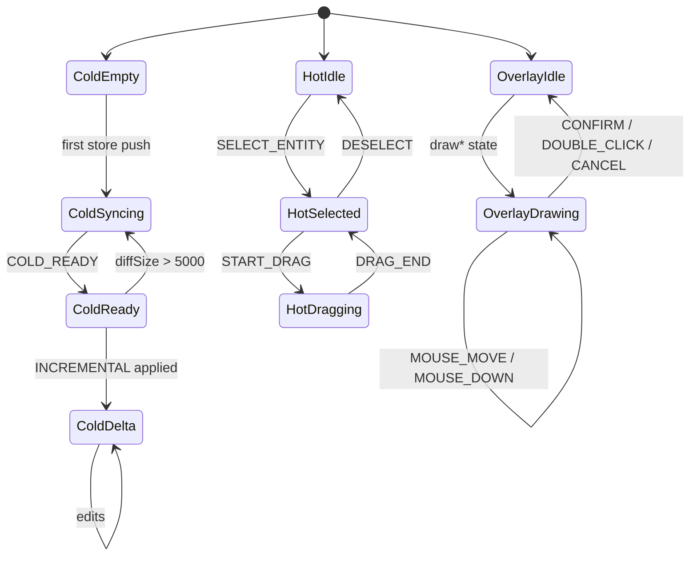
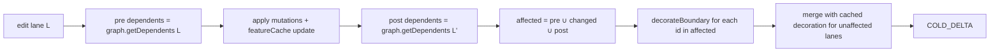
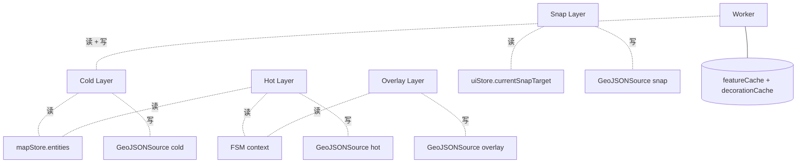

# 冷热分层（Cold / Hot Layers）

把"千万级实体的稳态渲染"和"60fps 的交互预览"放在同一画布里，最朴素
的思路是 React + GeoJSON diff 全量重渲；但在万级实体之上这条路一定
会卡顿。Apollo Map Studio 的解法是**冷/热/覆盖三层物理隔离**，每层
有不同的数据源、不同的渲染频率与不同的同步原语。本页给出严格定义。

## 一、三层定义

| 层                    | Source                   | 数据源                                              | 写入方                    | 读取方         | 频率上限                |
| --------------------- | ------------------------ | --------------------------------------------------- | ------------------------- | -------------- | ----------------------- |
| **冷层（cold）**      | `cold` GeoJSON source    | `mapStore.entities`（已落盘）                       | `useColdLayer`（唯一）    | MapLibre paint | 60fps（实测稳态 ~5fps） |
| **热层（hot）**       | `hot` GeoJSON source     | FSM `selectedEntityId` + `dragCurrentPoint`         | `useHotLayer`（唯一）     | MapLibre paint | 每 mousemove            |
| **覆盖层（overlay）** | `overlay` GeoJSON source | FSM `drawPoints` / `bezierAnchors` / `previewPoint` | `useOverlayLayer`（唯一） | MapLibre paint | 每 mousemove            |

> 紧附两层（grid 与 snap）行为接近覆盖层，但**它们订阅 uiStore，不参
> 与冷/热分流**，单独成节讨论。

## 二、读写权限矩阵

| 资源                | 写权限归属                                                       | 备注                                         |
| ------------------- | ---------------------------------------------------------------- | -------------------------------------------- |
| `mapStore.entities` | `mapStore.addEntity / updateEntity / removeEntity`               | undo 由 zundo `partialize` 锁定到该字段      |
| `cold` source       | `useColdLayer` 内 `setColdSourceData` / `applyColdDeltaToSource` | 任何其他模块禁止 `getSource('cold').setData` |
| `hot` source        | `useHotLayer`                                                    | drag/edit 预览                               |
| `overlay` source    | `useOverlayLayer.renderOverlayLayer`                             | 进行中绘制                                   |
| `selectedEntityId`  | FSM `SELECT_ENTITY` / `DESELECT` event                           | UI 不直写                                    |
| `currentSnapTarget` | snap 流程 `applySnap`                                            | 由 mapEventRouter 在 mousemove 时回写        |

任何对这些资源的"绕过式写入"都视为缺陷 —— 例如在 InspectorForms 中
直接调用 `map.getSource('cold').setData()` 会破坏 `entityFeatureCache`
与 `decorationCache` 的一致性，下一次 INCREMENTAL 必然出现 ghost
features。

## 三、生命周期对比



## 四、性能 tradeoff

| 维度     | 冷层                                  | 热层                            |
| -------- | ------------------------------------- | ------------------------------- |
| 数据规模 | 万级                                  | 1（最多 1 个选中实体）          |
| 编译位置 | Worker（`compileColdFeatures`）       | 主线程（`entityToHotFeatures`） |
| 同步原语 | RAF + worker round-trip               | RAF                             |
| 失败模式 | 卡顿 / 主线程 long task               | 帧率掉                          |
| 优化抓手 | INCREMENTAL delta + `decorationCache` | RAF + render-state dedup        |

不把热层放进 worker 的根本原因：**postMessage 克隆延迟（5–15ms）大于
单实体编译时间（< 0.5ms）**。所以 60fps 的 mousemove 路径必须留在主
线程。

## 五、Phase E：增量装饰（incremental decoration）

Phase E 是 2026-04 的一次冷层优化里程碑，背景：在 1k+ lane 的地图上
每次 INCREMENTAL 都跑一遍全量 `decorateBoundary`（每 lane ~3ms），
即使只是改了一个 lane 的中心线 —— 总耗时撑到 ~3 秒。修复方案三件套：

1. **`decorationCache: Map<lane_id, Feature[]>`**：worker 把每条 lane
   的 boundary decoration features 缓存下来。
2. **`LaneJunctionGraph`**：维护"端点 → lane 集合"反查，
   `getDependents(id)` 在 O(K) 时间内给出受影响 lane 集合。
3. **affected-set 计算**：INCREMENTAL 路径上
   `affected = pre-update dependents ∪ changed lanes ∪ post-update dependents`，
   只对这些 lane 跑 `decorateBoundary`，其余 lane 复用缓存。



工程约束（违反任何一条都会导致 ghost / stale features）：

- decorationCache 的 key 必须与 `LaneJunctionGraph` 的 lane id 一致 —
  当前都是 `entity.id`。
- junction stitching 仍然每次跑全量；只有装饰被增量化。
- lane 删除路径必须 `removeEntity` 时 `decorationCache.delete(id)`。

源码：

- `src/core/workers/spatialState.ts:22-31` —— state 字段定义
- `src/core/workers/spatialFeatures.ts:65-118` —— `buildFeatureCollection`
- `src/core/workers/spatialRequests.ts:117-137` —— `handleIncremental`

## 六、Public surface

| Hook / 函数                   | 责任                                     |
| ----------------------------- | ---------------------------------------- |
| `useColdLayer`                | 唯一负责 `cold` source 写入              |
| `useHotLayer`                 | 唯一负责 `hot` source 写入               |
| `useOverlayLayer`             | 唯一负责 `overlay` 与 `snap` source 写入 |
| `compileColdFeatures(entity)` | 实体 → 冷层 feature 数组（worker 用）    |
| `entityToHotFeatures(entity)` | 实体 → 热层 features（主线程用）         |
| `buildOverlayFeatures(state)` | 绘制态 → overlay features                |

## 七、Pitfalls

1. **不要把"选中实体"从冷层 filter 掉**：早期版本曾让冷层在选中时
   filter `id !== selectedId`，结果选中瞬间会闪烁（cold 失，hot 还没
   完成 setData）。当前 `buildColdLayerFilter` 故意保留选中实体在
   冷层中。
2. **Hot 的 dragPoint 索引语义**：`-2` 表示"中心拖拽"；`-1` 是默认
   值；`>= 0` 表示顶点索引。changing 这一约定需要同步 FSM、
   `selectionDrag.ts` 与 `applyDrag` 三处。
3. **跨层的 selectedEntity 需要双 source-of-truth 同步**：FSM 的
   `selectedEntityId` 与 `useColdLayer` 的 `selectedEntityIdRef` 在
   `actorRef.subscribe` 中对齐；不要在 React render 周期里读 FSM。
4. **Phase E 的 cache invalidation 颗粒度**：`decorationCache.delete(id)`
   只清单条；当 lane 的几何"间接"通过 junction 影响其它 lane 时，
   依赖 `getDependents` 把它们也加入 affected。

## 八、Source map

| 概念                 | 文件                                                 | 行      |
| -------------------- | ---------------------------------------------------- | ------- |
| 冷层主流程           | `src/hooks/useColdLayer.ts`                          | 161-334 |
| 冷层 filter / 选中态 | `src/components/map/coldLayerConfig.ts`              | 1-60    |
| 热层                 | `src/hooks/useHotLayer.ts`                           | 43-132  |
| 覆盖层               | `src/hooks/useOverlayLayer.ts`                       | 219-285 |
| 实体冷编译           | `src/core/geometry/compile.ts`                       | 67-101  |
| 实体热编译           | `src/lib/geoJsonHelpers.ts`（`entityToHotFeatures`） | —       |
| 装饰缓存             | `src/core/workers/spatialState.ts`                   | 22-44   |
| 装饰增量             | `src/core/workers/spatialFeatures.ts`                | 65-118  |

## 九、测试要点

`src/hooks/__tests__/` 与 `src/core/workers/__tests__/` 中相关测试：

| 测试                      | 覆盖路径                                                       |
| ------------------------- | -------------------------------------------------------------- |
| `useColdLayer.test.ts`    | `diffEntities` add/update/remove；`groupFeaturesByEntity` 重组 |
| `useHotLayer.test.ts`     | `sameHotRenderState` dedup；selectedEntityId 切换              |
| `useOverlayLayer.test.ts` | `buildOverlayFeatures` dispatch 表                             |
| `spatialFeatures.test.ts` | `decorationCache` 的失效与回填                                 |
| `spatialRequests.test.ts` | `INCREMENTAL` 的 affected-set 完整闭包                         |

测试约定：vitest + happy-dom；MapLibre 用 stub（仅 `getSource` /
`setData` / `updateData` 三个方法被打桩）；FSM 用真 actor，不 mock。

## 十、历史与决策记录

- **2026-02 P1**：引入 `COLD_DELTA` delta 协议替换 `COLD_READY` 全量
  重发。背景：5k 实体场景下每次 mousemove 都触发 200ms postMessage，
  完全无法编辑。
- **2026-04 Phase E**：引入 `decorationCache` + `LaneJunctionGraph`，
  把 incremental decoration 从 O(L) 降到 O(K)。背景：1k+ lane 时
  decoration 占 INCREMENTAL 95%+ 时间。
- **2026-04 R1 closure**：undo dispatcher 在 `temporal.undo()` 之前
  发 `CANCEL` 给 FSM，关掉"mid-draw Ctrl+Z 后下次 CONFIRM 崩溃"的
  bug。详见 `useActionDispatcher.ts:76-82` 与
  `__tests__/undoCancel.test.ts`。
- **2026-04 R2 anti-corruption**：所有 Apollo 实体写入走
  `lib/entityOps.ts`；UI 不再直接 import
  `core/geometry/apolloCompile/*`。

## 十一、决策日志

| 决策                         | 时间    | 取舍                                                                        |
| ---------------------------- | ------- | --------------------------------------------------------------------------- |
| 选 GeoJSON 而非 vector tiles | 2025-11 | 实体规模在万级，主线程可承受 GeoJSON；vector tiles 需要服务端切片，复杂度高 |
| cold/hot 物理 source 分离    | 2025-12 | 替代方案是 cold-fill filter "排除选中实体"；试验后发现选中瞬间会闪          |
| RAF 合并 setData             | 2026-01 | 避免 mousemove 风暴打满主线程；同时让多次 store push 收敛到一帧             |
| Worker 走 postMessage clone  | 2026-02 | SharedArrayBuffer 需要 COOP/COEP 头，Electron 打包成本高                    |
| Phase E 增量装饰             | 2026-04 | decoration 占 95% 时间；增量化是必选项                                      |
| `promoteId: featureId`       | 2026-04 | 让 MapLibre 在 delta 更新时稳定追踪 feature id                              |

## 十二、调试技巧

- **冷层卡住不更新**：检查 `prevEntitiesRef.current` 是否被正确赋值；
  打开 worker devtools 查看是否收到 SYNC / INCREMENTAL 请求。
- **热层闪烁**：通常是 `sameHotRenderState` 漏比对了某个字段，导致
  setData 被频繁触发。
- **拖拽预览跳动**：`centerGrabOffset` 没在拖拽开始时锁定，或者 hot
  层的 `applyDrag` 在选中态读到了旧 entity（reference 切换问题）。
- **覆盖层绘制残留**：FSM 退出 draw\* state 时 overlay 的 setData(EMPTY_FC)
  没触发；检查 `isDrawingState(currentState)` 在 FSM transition 后
  是否立即变 false。

## 十三、相邻系统的耦合



四个 GeoJSON source 的写入完全互不重叠。这是"sole writer"约束的几
何意义 —— 由实现层（hooks）保证。

## 十四、可观测性

| 信号                                             | 来源                  | 用途                                                  |
| ------------------------------------------------ | --------------------- | ----------------------------------------------------- |
| `useTaskProgressStore` 的 `cold-layer-sync` task | useColdLayer 大同步时 | StatusBar 显示"Rendering map layers (5,000 entities)" |
| Worker `console` 输出                            | `spatial.worker.ts`   | 在 Chrome devtools 的 workers 面板可见                |
| FSM transition log                               | XState devtools       | 验证 hot/overlay 渲染状态切换                         |

## 十五、相关性能 / 内存数据

| 项                                  | 数据                                                 |
| ----------------------------------- | ---------------------------------------------------- |
| Cold source GeoJSON 大小（5w 实体） | ~30MB string / ~10MB binary                          |
| Hot source GeoJSON 大小             | < 5KB                                                |
| Overlay source GeoJSON 大小         | < 2KB                                                |
| MapLibre 实体上限（性能可用）       | 实测 50k 实体下编辑期帧率仍在 50fps+                 |
| `entityFeatureCacheRef` 占用        | 每实体 ~3 features × ~200B = ~600B；5w 实体 ~30MB    |
| `decorationCache` 占用              | 每 lane ~10 features × ~150B = ~1.5KB；5w lane ~75MB |

后两项是主线程 + worker 双副本（worker 端是 source of truth；主线
程是镜像，**仅 keys + bytes 引用，不复制 features 内容**）。

## 十六、术语对照

| 中文         | 英文                    | 释义                                        |
| ------------ | ----------------------- | ------------------------------------------- |
| 冷层         | cold layer              | 已落盘 entities 的渲染层，万级规模          |
| 热层         | hot layer               | 选中实体的实时拖拽预览                      |
| 覆盖层       | overlay layer           | 进行中绘制的状态预览                        |
| 吸附指示器   | snap indicator          | 光标处显示当前 snap target 的青色圆环       |
| 增量装饰     | incremental decoration  | Phase E 引入的增量化 lane boundary 装饰     |
| Affected set | affected set            | INCREMENTAL 编辑下需要重算的 lane 集合      |
| 端点反查     | endpoint reverse lookup | LaneJunctionGraph 提供的 O(K) getDependents |

## 十七、与 Apollo 只读层的关系

`useApolloLayer` 注册一组 `apollo-*` 图层，但它们**当前是空的占位
层**。原因：导入的 Apollo 实体已经被桥接到 `mapStore.entities`，
冷层会渲染它们；保留 `apollo-*` 占位层是为：

1. 让 `useColdLayer` 能用 `coldLayer.id` 作为 `addLayer` 的
   `beforeId`（确保 cold 在 apollo 之上）。
2. 未来如果加"只读模式"，这些层可以承载未编辑的原图。

## 十八、相关 hooks 启用顺序

`MapCanvas.tsx` 的 hooks 调用顺序就是渲染依赖顺序：

```ts
useMapLibreInit(containerRef);     // 1. 创建 map + 注册 sources/layers
useDrawCommit(actorRef);           // 2. FSM transition → mapStore.addEntity
useMapEventRouter(...);            // 3. 鼠标 → FSM
useOverlayLayer(...);              // 4. 绘制态 → overlay
useColdLayer(...);                 // 5. mapStore → cold (worker)
useHotLayer(...);                  // 6. FSM + selected → hot
useGridLayer(...);                 // 7. uiStore.gridEnabled → grid
useApolloLayer(...);               // 8. 占位 + fitBounds
useCursorManager(...);             // 9. FSM → canvas cursor
useDragPan(...);                   // 10. drag entity → disable map drag
```

实际上并发执行（每个都是独立 effect），但 mount 顺序保证 source 在
hook 订阅启动前已注册。

## 十九、See also

- [Rendering Pipeline](./rendering-pipeline.md)
- [Junction Stitching](./junction-stitching.md)
- [Junction Graph](./junction-graph.md)
- [Map Event Router](./map-event-router.md)
- [State Management](./state-management.md) — undo / zundo 与冷层订阅
- [FSM Design](./fsm-design.md) — drag/edit 状态如何驱动热层
- [Inspector System](./inspector-system.md) — 表单写入与冷热同步
