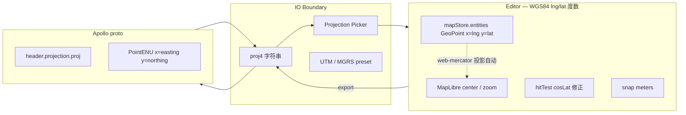

# 坐标系（Coordinate System）

Apollo HD Map 的坐标系是 IO 边界上的"硬通货"：一旦坐标含义错位，导出的
proto 在车端载入会瞬间漂移到几公里外。Apollo Map Studio 的设计原则：
**编辑器内一律 WGS84 lng/lat 度数，proto IO 边界上做投影变换**。本页
讲清楚每一处用到的坐标系、转换路径、proj4 串如何解析。

## 一、坐标系全景



## 二、用到的坐标系

| 名称           | 用在哪                     | 含义                                       |
| -------------- | -------------------------- | ------------------------------------------ |
| WGS84 lng/lat  | mapStore、所有几何模块     | 标准经纬度（度）                           |
| Web Mercator   | MapLibre 内部渲染          | 由 maplibre 自动从 lng/lat 投影到屏幕      |
| Local ENU (米) | snap / hit / topology 内部 | `cosLat` 修正后的局部米空间，**不持久化**  |
| UTM            | Apollo `PointENU` 字段     | 6° 带状投影；`header.projection.proj` 描述 |
| MGRS           | Projection picker 显示     | UTM 的方格网编码，便于人读                 |

> 编辑器**永远**不把 UTM 米存进 store。所有持久化层都是 lng/lat。

## 三、Web Mercator pixel ↔ meter

`pixelsToMeters(pixels, lat, zoom)`（`src/core/geometry/snap.ts:87-91`）
是 snap 半径换算的官方公式：

```ts
const EARTH_CIRC = 40_075_016.686; // meters
const metersPerPixel = (Math.cos((lat * Math.PI) / 180) * EARTH_CIRC) / (512 * Math.pow(2, zoom));
return pixels * metersPerPixel;
```

含义：MapLibre 用 512 px 瓦片，zoom z 下每像素 lng 度 = 360 / (512 ·
2^z)，乘上 cosLat 与赤道周长得到米/像素。

## 四、Proj4 字符串解析

Apollo 的 `header.projection.proj` 是一段 PROJ.4 字符串，例如：

```
+proj=tmerc +lat_0=37.413082 +lon_0=-122.012573 +k=1.0 +x_0=0 +y_0=0 +ellps=WGS84 +datum=WGS84 +units=m +no_defs
```

或 garage map 里带模板花括号：

```
+proj=tmerc +lat_0={37.413082} +lon_0={-122.012573} +k=1.0 ...
```

`src/io/proto/projection.ts` 给出三个抓手：

### 4.1 `sanitizeProjString(s)`

剥掉模板花括号 —— Apollo 参考的 Sunnyvale / garage 地图把数值参数包
在 `{}` 里，proj4 会拒收，所以**所有 proj 串入口都要先 sanitize**。

```ts
export function sanitizeProjString(s: string): string {
  return s.replace(/\{([^}]+)\}/g, '$1').trim();
}
```

### 4.2 `makeProjection(projString)`

返回 `Projection` 对象，提供 `toLonLat` 与 `fromLonLat`。内部用
proj4 把源 CRS（典型 UTM 米）→ WGS84 度数互转：

```ts
const toWgs84 = proj4(clean, WGS84);
const fromWgs84 = proj4(WGS84, clean);
```

`WGS84 = '+proj=longlat +datum=WGS84 +no_defs'` 是 lng/lat 度数的 PROJ
表达。

### 4.3 UTM 工具

| 函数                              | 用途                                                                            |
| --------------------------------- | ------------------------------------------------------------------------------- |
| `utmProjString(zone, hemisphere)` | 构造 UTM PROJ 串（`+proj=utm +zone=10 +ellps=WGS84 +units=m`）                  |
| `utmZoneFromLon(lonDeg)`          | 由经度推断 UTM 带（每带 6°）                                                    |
| `UTM_PRESETS`                     | 常见城市 preset：sunnyvale (10N), beijing (50N), shanghai (51N), shenzhen (50N) |

> ⚠ UTM zone **不能从 (x, y) 推断** —— 同一对 easting/northing 在每个
> zone 都存在。UTM 是 per-zone local 坐标。所以必须由用户指定 zone（见
> projection picker），或者从已有的 proj 串读出来。

## 五、Projection Picker

Projection picker 是 IO Settings 弹窗里的 UI，让用户在没有
`header.projection` 时手动指定坐标系。它的状态机：

```mermaid
stateDiagram-v2
  [*] --> Detect
  Detect --> HasHeader : header.projection.proj 非空
  Detect --> NoHeader : 缺失
  HasHeader --> Sanitize --> Ready
  NoHeader --> AskUser
  AskUser --> PickPreset : 选预设（sunnyvale / beijing / …）
  AskUser --> EnterCustom : 粘贴自定义 PROJ 串
  AskUser --> InferFromLng : 已知大致经度 → utmZoneFromLon
  PickPreset --> Ready
  EnterCustom --> Sanitize --> Ready
  InferFromLng --> Ready
```

落点：选定后写入 `apolloMapStore.projection`，由 import worker 在
`PointENU → GeoPoint` 转换里使用，并在 export 时回写到
`header.projection.proj`。

## 六、Header.projection 字段

Apollo `Header` proto 上有以下相关字段（仅列与坐标相关的）：

| 字段                                 | 含义                                      |
| ------------------------------------ | ----------------------------------------- |
| `header.projection.proj`             | PROJ.4 字符串（编辑器持久化的源 CRS）     |
| `header.left / right / top / bottom` | 地图边界（米空间）                        |
| `header.geo_reference`               | 可选：另一种 PROJ 串（如 +proj=utm 直接） |
| `header.zone_id`                     | 可选：UTM zone 数字                       |

策略：**`header.projection.proj` 是 single source of truth**；其它字
段在导出时由编辑器从 `projection.proj` 推算并填回，导入时不被读取。

## 七、转换路径示例

### 7.1 Apollo → Editor（导入）

```text
proto.PointENU(x=586217.5, y=4143000.0)  // UTM 10N meters
   └── makeProjection(header.projection.proj).toLonLat
       └── proj4.forward([586217.5, 4143000.0])
           └── GeoPoint(x=-122.012573, y=37.4131)
```

### 7.2 Editor → Apollo（导出）

```text
GeoPoint(x=-122.012573, y=37.4131)
   └── makeProjection(...).fromLonLat
       └── proj4.forward([lon, lat])
           └── PointENU(x=586217.5, y=4143000.0)
```

### 7.3 Editor 内部测距

```text
两点 GeoPoint
   └── haversineMeters (lib/geo.ts) → 米
        ↑ 用于 lane.length
   或
   └── 投影到 ENU (snap.ts: project) → cosLat 修正 → 米
        ↑ 用于 snap / hit / connect
```

## 八、内部 ENU 局部空间

snap / hitTest / laneTopology 都在内部"投影到 ENU"再算欧氏距离。
公式：

```
x = lng * cosLat * DEG_TO_M
y = lat * DEG_TO_M
```

`DEG_TO_M = 111320`、`cosLat = cos(referenceLat)`。这是一个**仅在
当前局部有效**的近似 —— 几公里内误差 < 0.5%。**永远不要把这个 ENU
坐标存盘**，只在临时算几何里用。

## 九、Public surface

| 入口                                       | 文件                           | 用途                                      |
| ------------------------------------------ | ------------------------------ | ----------------------------------------- |
| `sanitizeProjString`                       | `src/io/proto/projection.ts`   | 剥模板花括号                              |
| `makeProjection`                           | `src/io/proto/projection.ts`   | 构造 `{ toLonLat, fromLonLat }`           |
| `utmProjString` / `utmZoneFromLon`         | 同上                           | UTM 工具                                  |
| `UTM_PRESETS`                              | 同上                           | sunnyvale / beijing / shanghai / shenzhen |
| `pixelsToMeters`                           | `src/core/geometry/snap.ts:87` | px → m，给 snap 半径用                    |
| `haversineMeters` / `polylineLengthMeters` | `src/lib/geo.ts`               | WGS84 大圆距离                            |
| `metersToDegLat` / `metersToDegLng`        | `src/lib/geo.ts`               | 米 → 度，给 signal 模板等小尺度几何用     |

## 十、Pitfalls

1. **不要混用 `pixelsToMeters` 与 `metersToDegLng`**：前者依赖 zoom，
   后者依赖纬度；用错会产生 `Math.cos(0)` 量级的偏差。
2. **proj4 实例不要长期持有**：`makeProjection` 闭包了 `proj4(...)`
   的两个变换器；当用户切换 projection 时务必丢弃旧实例（保留会
   导致用旧 zone 解析新数据）。
3. **PROJ 串里允许 `\r\n`**：导入文本时常常带 Windows 换行；
   `sanitizeProjString` 的 `.trim()` 只清头尾空白；如果用户粘贴的
   多行 PROJ 串中间有换行，需要在 picker 里先做 `replace(/\s+/g, ' ')`。
4. **header bounds 不会自动同步**：你改了 `projection.proj` 但忘了
   重算 `header.left/right/top/bottom`，导出后车端会按旧 bounds 截图。
5. **UTM ≠ MGRS**：MGRS 是更短的网格编码，可读性更好，但解析逻辑
   不同。projection picker 的 UI 显示 MGRS 仅作"label"，底层仍是
   UTM PROJ 串。

## 十一、Source map

| 概念                  | 文件                           | 行      |
| --------------------- | ------------------------------ | ------- |
| PROJ.4 解析 / 构造    | `src/io/proto/projection.ts`   | 1-80    |
| WGS84 距离            | `src/lib/geo.ts`               | 1-57    |
| pixels ↔ meters       | `src/core/geometry/snap.ts`    | 87-91   |
| Local ENU 投影        | `src/core/geometry/snap.ts`    | 256-290 |
| Apollo IO（投影应用） | `src/io/apollo/*`（IO worker） | —       |

## 十二、测试要点

| 测试                          | 覆盖                                                                    |
| ----------------------------- | ----------------------------------------------------------------------- |
| `projection.test.ts`（io 层） | sanitize template；UTM zone 推断                                        |
| `geo.test.ts`                 | haversine 与 metersToDeg 互逆                                           |
| `snap.test.ts`                | pixelsToMeters 在不同 zoom + lat                                        |
| 集成                          | 使用 garage 地图的 `header.projection.proj` 走完整 import → export 回程 |

## 十三、FAQ

**Q: 编辑器为什么不直接用 UTM 米存储？**

A: 一致性。Web 底图（OSM tiles 等）原生用 lng/lat；MapLibre 内部走
Web Mercator；如果 store 用 UTM，每次渲染都要做一次转换，且需要
zone 信息。统一在 lng/lat 让 store / worker / inspector 都不用关心
zone。

**Q: 切换 projection 后，已存在的几何会怎样？**

A: 几何**不动**（仍是 lng/lat）。改的只是"导出时往 PointENU 怎么投
影"。所以可以 free 切换 picker，不影响数据。

**Q: 高纬度（lat > 70°）会有问题吗？**

A: 三处需要注意：

- `pixelsToMeters`：lat 越大 cosLat 越小，每像素米数变小（合理）。
- `cosLat` 在 hit / snap 中：极地附近 cosLat → 0 会让水平半径很大，
  代码里 `Math.max(cosLat, 1e-6)` 防御除零。
- UTM 在 lat > 84° / < -80° 不可用，需要切到 UPS（极区立体投影）。
  当前 picker 不支持 UPS，是已知 limitation。

**Q: PROJ.4 字符串里有非 UTF-8 字符怎么办？**

A: `sanitizeProjString` 不做编码转换，只剥模板花括号。如果导入文件
带 UTF-8 BOM 或 GBK，需要 IO 层在解析前做编码识别（当前默认假定
UTF-8）。

## 十四、历史

- 早期版本曾把 `projection` 字段直接存在 `mapStore.metadata` 里；
  后来发现 undo / redo 应该把 projection 切换也撤销，所以挪到
  `apolloMapStore`，与 entities 分仓。
- `UTM_PRESETS` 是临时方案；长期希望加自动 zone 推断（基于地图边
  界经度），但要小心跨 zone 地图（有部分 garage 地图横跨两个 zone）。

## 十五、调试技巧

- **导入数据漂移到几公里外**：典型是 zone 错。在 import worker 里
  log `header.projection.proj`，对比经纬度推算的 utmZoneFromLon。
- **导出后车端载入失败**：`header.projection.proj` 可能有非法字符
  或漏字段；用 `proj4(string)` 在浏览器 console 里独立验证。
- **极地 hitTest 不准**：`Math.cos(lat)` 接近 0 时半径会失真，
  `Math.max(cosLat, 1e-6)` 是兜底；如果 lat > 84°（UTM 不可用），
  要切到 UPS。

## 十六、与 GeoJSON / MapLibre 的关系

GeoJSON spec 要求经度在 [-180, 180]、纬度在 [-90, 90]，单位是度。
MapLibre 内部按 Web Mercator 投影到屏幕。所以从主线程角度看：

- mapStore.entities 的 GeoPoint = WGS84 度数 = GeoJSON `coordinates`
- 所有 hooks 内的 `[lng, lat]` 都是 GeoJSON `Position` 兼容
- `useMapLibreInit` 的 `center: [lng, lat]` 直接用 GeoJSON 数值

不需要任何额外转换层。

## 十七、术语对照

| 中文     | 英文                  | 释义                                    |
| -------- | --------------------- | --------------------------------------- |
| 经纬度   | longitude / latitude  | WGS84 球面坐标（度）                    |
| 米空间   | meter space           | 投影后的局部 ENU 平面（米）             |
| 投影     | projection            | proj4 字符串描述的源 CRS → WGS84 转换   |
| 大圆距离 | great-circle distance | 球面两点最短弧长（米），用 haversine 算 |
| 投影中心 | tangent point         | UTM zone 的中央经线纬度参考             |

## 十八、See also

- [Geometry Engine](./geometry-engine.md)
- [Spatial Index](./spatial-index.md)
- [Map Event Router](./map-event-router.md)
- [Derive Engine](./derive-engine.md)
- [Export Engine](./export-engine.md)
- [Inspector System](./inspector-system.md) — projection picker UI
