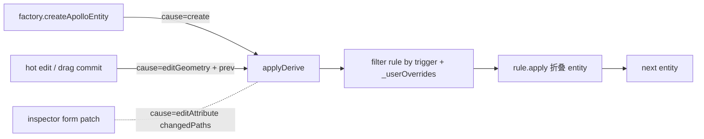
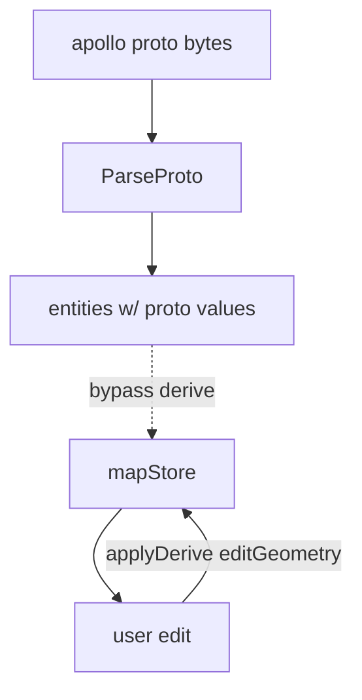
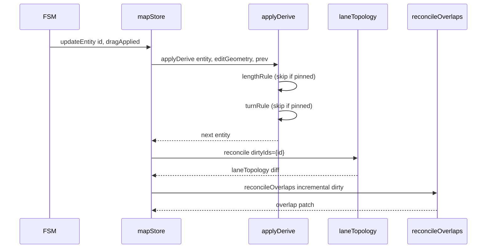
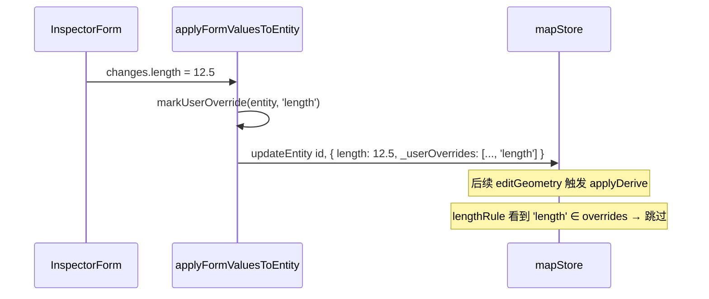

# 派生引擎（Derive Engine）

`src/core/elements/derive/` 是 Apollo Map Studio 的"自动闭环"中枢：当
用户编辑 lane 中心线，`length` / `turn` / `boundaryType[0]` 这些
**派生字段**应当自动同步而不需要 inspector 表单代劳。本页讲清楚
lifecycle 触发器、change detection、用户钉位（`_userOverrides`）的
取舍策略，以及"为什么 import 时不跑 derive"。

## 一、设计目标

| 目标                   | 实现                                                           |
| ---------------------- | -------------------------------------------------------------- |
| 派生字段无需手动维护   | `applyDerive(entity, ctx)` 在 create / editGeometry 时统一闭环 |
| 用户手改不被覆盖       | `_userOverrides: string[]` 列出 owned-but-pinned 字段路径      |
| 导入 Apollo 时保留原值 | 默认不在 import 时跑 derive；只在编辑期 + factory 创建期       |
| 规则可分模块、可测试   | 每条规则是 `DeriveRule { id, owns, on, apply }`                |

## 二、Lifecycle 触发器



`DeriveCause` 三档：

```ts
// types.ts:19-27
export type DeriveCause = 'create' | 'editGeometry' | 'editAttribute';

export interface DeriveContext<E extends MapEntity> {
  cause: DeriveCause;
  prev?: E;
  changedPaths?: readonly string[];
}
```

| Cause           | 触发点                                              | 备注                           |
| --------------- | --------------------------------------------------- | ------------------------------ |
| `create`        | `createApolloEntity` 之后                           | 包含 boundarySeed 等"首次填值" |
| `editGeometry`  | drag commit / source-aware edit / connectLanes 之后 | 几何相关字段全闭环             |
| `editAttribute` | inspector 表单写入后（保留接口，当前未广泛使用）    | 与 `changedPaths` 配合细粒度   |

## 三、注册表

```ts
// index.ts:26-29
const REGISTRY: Partial<Record<MapEntity['entityType'], readonly DeriveRule<MapEntity>[]>> = {
  lane: laneRules,
  parkingSpace: parkingSpaceRules,
};
```

当前两个实体类型有规则。新增实体类型时只需在 `derive/rules/` 下加文件
并加进 REGISTRY。

## 四、Lane 规则

```ts
// rules/lane.ts:24-64
export const laneRules: DeriveRule<LaneEntity>[] = [lengthRule, turnRule, boundarySeedRule];
```

| 规则                | owns                                                          | on                    | 行为                                                      |
| ------------------- | ------------------------------------------------------------- | --------------------- | --------------------------------------------------------- |
| `lane.length`       | `['length']`                                                  | create + editGeometry | `polylineLengthMeters(centerPoints(e))` haversine         |
| `lane.turn`         | `['turn']`                                                    | create + editGeometry | `inferLaneTurn(centerPoints)` 基于起末航向角差            |
| `lane.boundarySeed` | `['leftBoundary.boundaryType', 'rightBoundary.boundaryType']` | **create only**       | 把空 `boundaryType` 数组填一个 `[{s:0, types:[DEFAULT]}]` |

**boundarySeed 只在 create 时跑** —— 因为 inspector 一旦让用户改过
boundaryType（哪怕只是查看），后续 editGeometry 不应再"还原"成默认值。

## 五、ParkingSpace 规则

```ts
// rules/parkingSpace.ts:13-22
const headingFromRectRule: DeriveRule<ParkingSpaceEntity> = {
  id: 'parkingSpace.headingFromRect',
  owns: ['heading'],
  apply: (e) => {
    const rect = e._sourceRect;
    if (!rect) return e;
    return rect.rotation === e.heading ? e : { ...e, heading: rect.rotation };
  },
};
```

意义：parkingSpace 用 `drawRotatedRect` 工具画时，旋转手柄拖动会更新
`_sourceRect.rotation`。`heading` 是 proto 字段，必须与 rect 同步，
所以 derive。

## 六、`_userOverrides` 钉位机制

```ts
// index.ts:42-57
export function applyDerive<E extends MapEntity>(entity: E, ctx: DeriveContext<E>): E {
  const rules = REGISTRY[entity.entityType];
  if (!rules || rules.length === 0) return entity;

  const overrides = readOverrides(entity);
  let next: MapEntity = entity;

  for (const rule of rules) {
    const triggers = rule.on ?? DEFAULT_TRIGGERS;
    if (!triggers.includes(ctx.cause)) continue;
    if (rule.owns.some((path) => overrides.has(path))) continue;
    next = rule.apply(next, ctx);
  }
  return next as E;
}
```

工作流：

1. inspector 用户改 `lane.length` → 表单 `applyFormValuesToEntity` 调
   `markUserOverride(entity, 'length')`。
2. `_userOverrides` 增添 `'length'`。
3. 后续 editGeometry 触发 `applyDerive`：`lengthRule.owns = ['length']`
   命中 overrides，**整条 rule 跳过**，length 保持手工值。
4. 用户想"释放"回自动派生，调 `clearUserOverride(entity, 'length')`。

```ts
// index.ts:62-79
export function markUserOverride<E extends MapEntity>(entity: E, path: string): E { ... }
export function clearUserOverride<E extends MapEntity>(entity: E, path: string): E { ... }
```

## 七、Import vs Editor



策略：**import 不跑 derive**。原因：

- 导入的 Apollo 数据可能用了不同的 length 计算（haversine vs 平面欧
  氏 vs proto 自带 length 字段）。强行 derive 会改写 proto 的"真值"。
- `boundaryType` 在 proto 里可能是空数组（空 = "继承默认"），但用户
  没有显式表态；强行加 `[{s:0, types:['UNKNOWN']}]` 会污染语义。

只在用户**编辑**之后开始派生 —— 那时已经是"用户的版本"了。

## 八、Public surface

| 导出                                           | 文件          | 用途                      |
| ---------------------------------------------- | ------------- | ------------------------- |
| `applyDerive(entity, ctx)`                     | `index.ts:42` | 主入口                    |
| `markUserOverride(entity, path)`               | `index.ts:62` | inspector 写字段时调      |
| `clearUserOverride(entity, path)`              | `index.ts:74` | "release back to auto" UI |
| `DeriveCause` / `DeriveContext` / `DeriveRule` | `types.ts`    | 类型                      |
| `laneRules` / `parkingSpaceRules`              | `rules/*.ts`  | 单元测试可独立调用        |

## 九、Always-derive vs preserve-on-import 字段策略

| 字段                                 | 策略                                         | 为什么                                  |
| ------------------------------------ | -------------------------------------------- | --------------------------------------- |
| `lane.length`                        | always derive on create + editGeometry       | 几何派生比 proto 原值更可信             |
| `lane.turn`                          | always derive                                | 起末航向角差是确定性算法                |
| `lane.boundaryType[0]`               | create only                                  | 用户后续可能手改，editGeometry 不应回退 |
| `lane.predecessorIds / successorIds` | 由 `laneTopology.reconcile` 而非 derive 处理 | 跨实体协同；放在 reconcile 是合适层     |
| `parkingSpace.heading`               | always derive when `_sourceRect` 存在        | `_sourceRect` 是真值                    |
| `lane.speedLimit`                    | 不 derive                                    | 与几何无关，纯属性                      |

## 十、Pitfalls

1. **不要在 derive rule 里写副作用**：rule.apply 必须是纯函数；写
   `console.log` 之类的也尽量避免（在 worker 路径里 console 很贵）。
2. **owns 路径与 inspector 字段路径必须一致**：表单字段写 `length` →
   规则的 `owns: ['length']`。如果未来嵌套字段（如
   `leftBoundary.boundaryType`）变更，要同时改 owns 与 inspector
   form 的 path 字符串。
3. **regenerate vs identity short-circuit**：每条 rule.apply 都做了
   "next === e ? e : { ...e, ...patch }" 的 identity short-circuit，
   保证 zustand 引用稳定，未变更不触发下游订阅。
4. **不要在 derive 里调 reconcileOverlaps**：那是 store layer 的责任；
   两者各管一摊，不要互相调。

## 十一、Source map

| 概念                      | 文件                                             | 行    |
| ------------------------- | ------------------------------------------------ | ----- |
| 主入口                    | `src/core/elements/derive/index.ts`              | 1-79  |
| 类型                      | `src/core/elements/derive/types.ts`              | 1-38  |
| Lane rules                | `src/core/elements/derive/rules/lane.ts`         | 1-64  |
| ParkingSpace rules        | `src/core/elements/derive/rules/parkingSpace.ts` | 1-23  |
| `inferLaneTurn`           | `src/core/geometry/apolloCompile/factory.ts`     | —     |
| `polylineLengthMeters`    | `src/lib/geo.ts`                                 | 35-42 |
| `markUserOverride` 调用方 | inspector form 适配层                            | —     |

## 十二、测试要点

| 测试                                | 覆盖                                 |
| ----------------------------------- | ------------------------------------ |
| `derive/index.test.ts`              | applyDerive 触发筛选；overrides 跳过 |
| `derive/rules/lane.test.ts`         | length / turn / boundarySeed 三规则  |
| `derive/rules/parkingSpace.test.ts` | headingFromRect 同步                 |
| `markUserOverride.test.ts`          | 幂等；clearUserOverride 还原         |

## 十三、典型工作流示例

### 13.1 用户拖动 lane vertex



`derive` 只关心**单实体**字段闭环；`topology` / `overlap` 处理跨实
体协同。三者不互相调用。

### 13.2 用户在 inspector 改 length



## 十四、FAQ

**Q: 如果两条规则 owns 同一个字段会怎么办？**

A: 按 `laneRules` 的数组顺序折叠 —— 后一条覆盖前一条。但实践中我们
避免这种重叠（每个字段只由一条规则持有）。

**Q: derive 跑在主线程还是 worker？**

A: 主线程。`applyDerive` 在 `mapStore.updateEntity` 内被调用，是
zustand action 的一部分。worker 不参与 derive。

**Q: 派生导致 length 变更，会不会再次触发 editGeometry 死循环？**

A: 不会。`updateEntity` 只接受**外部 caller** 的写入，store action
内部执行 derive 后写回的是同一次 transition，不会再次触发自己。

## 十五、调试技巧

- **派生不生效**：在 `applyDerive` 入口 log `cause` 和
  `entity._userOverrides`；如果 owns 命中 overrides，rule 会被跳过。
- **导入数据被覆盖**：确认导入路径**没有**调用 `applyDerive`；只
  `mapStore.addEntity` / `setEntities` 时才触发 derive。
- **inspector 改字段后还是被 derive 覆盖**：确认 `applyFormValuesToEntity`
  调用了 `markUserOverride`，并且 owns 路径与表单字段路径一致。

## 十六、扩展指南

加一种实体类型的 derive：

1. 在 `derive/rules/<type>.ts` 写 `DeriveRule[]`，每条声明 `id` /
   `owns` / `on` / `apply`。
2. `derive/index.ts` 的 `REGISTRY` 加上 `[<type>]: <type>Rules`。
3. `apply` 必须是纯函数，identity short-circuit
   （`return next === e ? e : ...`）保证引用稳定。
4. 单测：mock 一个简单 entity，分别在 `create` / `editGeometry` /
   带 `_userOverrides` 三种场景下断言 `applyDerive` 的输出。

加一条新规则到现有类型：

1. 写 `DeriveRule` 实例。
2. 推到 `<type>Rules` 数组**末尾**（顺序敏感）。
3. 单测覆盖 owns 路径与触发 cause。

## 十七、决策日志

- **2026-02**：评估"是否在 derive 里调 reconcile"，结论：不调，
  保持 single-purpose。
- **2026-03**：增加 `_userOverrides` 钉位机制；之前 inspector 改字段
  会被几何 derive 立即覆盖，UX 灾难。
- **2026-04**：boundarySeed 改成 `on: ['create']` only；之前
  editGeometry 也跑会让用户的 boundaryType 变更被回滚。

## 十八、术语对照

| 中文     | 英文      | 释义                                        |
| -------- | --------- | ------------------------------------------- |
| 派生     | derive    | 从其它字段（通常是几何）计算出某字段        |
| 触发因   | cause     | `create` / `editGeometry` / `editAttribute` |
| 钉位     | pinned    | 用户手改后字段被锁定，不被自动派生覆盖      |
| 拥有路径 | owns path | rule 写到的字段路径列表                     |

## 十九、See also

- [Geometry Engine](./geometry-engine.md)
- [Overlap Derivation](./overlap-derivation.md)
- [Inspector System](./inspector-system.md)
- [State Management](./state-management.md)
- [Anti-corruption Layer](./anti-corruption-layer.md)
