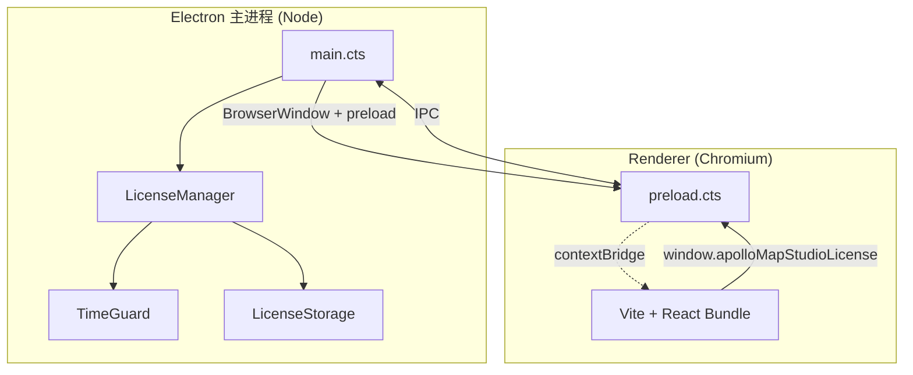

# Electron 集成 (Electron Integration)

> 关键文件：
>
> - `electron/main.cts` —— 主进程入口
> - `electron/preload.cts` —— preload 桥
> - `electron/license/manager.cts` —— License IPC 注册中心
> - `electron-builder.yml` —— 打包配置
> - `package.json` scripts: `electron:dev` / `package:linux/mac/win`

## 1. 设计目标

- **同一份 React renderer**：浏览器与桌面共用 `dist/`。Electron 只是给它套
  一个安全的 BrowserWindow + 一个特权主进程。
- **零运行时依赖**：除了 Electron 本身，主进程不引第三方包；License /
  机器码 / 加密都在 Node 内置 crypto 上实现。
- **严格沙箱**：`contextIsolation: true` + `nodeIntegration: false` +
  `sandbox: true`。Renderer 永远拿不到 `require` / `process`。

## 2. 进程拓扑



- 主进程：1 个 `BrowserWindow`，单实例锁，license 状态广播。
- Renderer：1 个 React app，license 通过 `licenseBridge` 调 IPC。

## 3. 主进程：`main.cts`

`electron/main.cts:18-54` 创建窗口：

```ts
const mainWindow = new BrowserWindow({
  width: 1440,
  height: 960,
  minWidth: 1024,
  minHeight: 700,
  title: 'Apollo Map Studio',
  backgroundColor: '#101318',
  show: false,
  webPreferences: {
    preload: getPreloadPath(),
    contextIsolation: true,
    nodeIntegration: false,
    sandbox: true,
  },
});
```

- `show: false` + `ready-to-show` 监听：避免白屏闪烁。
- `setWindowOpenHandler`：拦截 `window.open`，HTTP/HTTPS 链接走系统浏览器
  打开 (`shell.openExternal`)，其他全部 deny。

### 3.1 单实例锁

```ts
// main.cts:62-79
const gotSingleInstanceLock = app.requestSingleInstanceLock();
if (!gotSingleInstanceLock) {
  app.quit();
} else {
  app.on('second-instance', () => {
    const [mainWindow] = BrowserWindow.getAllWindows();
    if (!mainWindow) return;
    if (mainWindow.isMinimized()) mainWindow.restore();
    mainWindow.focus();
  });
  ...
}
```

二次启动时聚焦已有窗口，而不是开新进程 —— 避免两个 LicenseManager
争抢 userData 锁文件。

### 3.2 Vite Dev URL 接力

```ts
// main.cts:6, 47-54
const rendererUrl = process.env.ELECTRON_RENDERER_URL;
...
if (rendererUrl) {
  await mainWindow.loadURL(rendererUrl);
  mainWindow.webContents.openDevTools({ mode: 'detach' });
  return;
}
await mainWindow.loadFile(getRendererIndexPath());
```

`pnpm electron:dev` 通过 concurrently 并行启动：

```json
"electron:dev": "concurrently -k -n vite,electron -c cyan,magenta
  \"vite --host 127.0.0.1\"
  \"wait-on tcp:127.0.0.1:5173 && pnpm build:electron &&
   cross-env ELECTRON_RENDERER_URL=http://127.0.0.1:5173 electron .\""
```

- vite 在 5173 端口起 dev server；
- `wait-on` 等到端口可达；
- electron 通过环境变量拿到 URL，loadURL 实时 HMR；
- 自动开 DevTools。

生产构建走 `loadFile(dist/index.html)`，无环境变量依赖。

### 3.3 License 启动顺序

```ts
// main.cts:81-94
app.whenReady().then(() => {
  // 在创建 window 前先 wire LicenseManager —— renderer 加载后
  // 立刻能从已初始化的 IPC surface 请求状态。
  licenseManager = new LicenseManager();
  licenseManager.start();
  void createMainWindow();
  app.on('activate', () => { ... });
});
```

LicenseManager 在 renderer 出现之前注册四个 IPC handler，避免
renderer 启动后第一帧拿到 undefined。

`app.on('before-quit', () => licenseManager?.stop())` 让 TimeGuard
持久化最后一次时间戳。

## 4. preload.cts —— contextBridge

`electron/preload.cts` 暴露两个 read-only 全局：

```ts
// preload.cts:13-20
contextBridge.exposeInMainWorld('apolloMapStudio', {
  platform: process.platform,
  versions: { chrome, electron, node },
});

// preload.cts:22-47
contextBridge.exposeInMainWorld('apolloMapStudioLicense', {
  getState():        ipcRenderer.invoke('license:get-state'),
  getMachineCode():  ipcRenderer.invoke('license:get-machine-code'),
  activate(code):    ipcRenderer.invoke('license:activate', code),
  deactivate():      ipcRenderer.invoke('license:deactivate'),
  onChange(handler): ipcRenderer.on('license:state', listener); return unsub;
});
```

设计要点：

- **不暴露 ipcRenderer 本体**：renderer 只能调四个具名方法。
- **不暴露任何 Node API**：`fs`, `path`, `child_process` 都过不去。
- **broadcast 通过命名 channel**：`license:state` 是 ipcRenderer.on 的
  channel，`onChange` 返回 unsubscribe 闭包。

## 5. IPC 通道一览

| Channel                    | 方向          | Payload        | 实现处                                         |
| -------------------------- | ------------- | -------------- | ---------------------------------------------- |
| `license:get-state`        | Renderer→Main | —              | `LicenseManager.start()` 注册 invoke           |
| `license:get-machine-code` | Renderer→Main | —              | 同上                                           |
| `license:activate`         | Renderer→Main | `code: string` | 同上 → `LicenseManager.activate`               |
| `license:deactivate`       | Renderer→Main | —              | 同上 → `LicenseManager.deactivate`             |
| `license:state`            | Main→Renderer | `LicenseState` | `LicenseManager.broadcast()` 在状态变更时 send |

详见 [License System](./license-system.md)。

## 6. Renderer 侧消费：`license-bridge.ts`

`src/lib/license-bridge.ts:77-101` 把 preload 暴露的 API 包成
"在 Web 也能跑"的 fallback：

```ts
export const licenseBridge: LicenseApi = {
  async getState() {
    return window.apolloMapStudioLicense?.getState() ?? Promise.resolve(fallbackState());
  },
  ...
};

export function isDesktopBuild(): boolean {
  return typeof window !== 'undefined' && Boolean(window.apolloMapStudioLicense);
}
```

`fallbackState()` 在浏览器返回一个永远 `canEdit: true` 的 7 日 trial
mock，让 Storybook / 浏览器预览不被 license 阻塞。

## 7. 打包：electron-builder

`electron-builder.yml`：

```yaml
appId: com.apollo-map-studio.app
productName: Apollo Map Studio
directories: { output: release }
files:
  - dist/**/*
  - dist-electron/**/*
  - package.json
  - '!node_modules/**/*'
asar: true
extraMetadata:
  main: dist-electron/main.cjs
  dependencies: {}
mac: { target: [{ target: dmg, arch: [x64, arm64] }, { target: zip, arch: [x64, arm64] }] }
win: { target: [{ target: nsis, arch: [x64] }, { target: zip, arch: [x64] }] }
linux: { target: [{ target: AppImage, arch: [x64] }, { target: deb, arch: [x64] }] }
```

要点：

- `extraMetadata.dependencies: {}`：electron-builder 用它覆写打包 package.json
  的 dependencies，让 asar 包不包含 React / proj4 等已经被 vite 打到 dist
  里的依赖。
- `asar: true`：压缩 + 简单的反向工程门槛。
- `npmRebuild: false`：所有原生模块都已是 prebuilt（`pnpm.onlyBuiltDependencies`
  限定为 `electron` / `electron-winstaller`）。

打包脚本：

```json
"package":       "pnpm build:desktop && electron-builder --dir --publish never",
"package:linux": "pnpm build:desktop && electron-builder --linux --x64 --publish never",
"package:mac":   "pnpm build:desktop && electron-builder --mac --x64 --arm64 --publish never",
"package:win":   "pnpm build:desktop && electron-builder --win --x64 --publish never",
"build:desktop": "pnpm build:web && pnpm build:electron",
"build:electron": "tsc -p tsconfig.electron.json"
```

- `build:web`：Vite 输出到 `dist/`。
- `build:electron`：`tsc -p tsconfig.electron.json`，输出到 `dist-electron/*.cjs`。
- `extraMetadata.main` 指向 `dist-electron/main.cjs`。

## 8. 安全模型

| 防御层                   | 实现                                                                           |
| ------------------------ | ------------------------------------------------------------------------------ |
| `contextIsolation`       | renderer 与 preload 分别在不同 V8 isolate，preload 通过 contextBridge 单向暴露 |
| `nodeIntegration: false` | renderer 不能 require                                                          |
| `sandbox: true`          | renderer 进程跑在 OS 沙箱里                                                    |
| `setWindowOpenHandler`   | 阻止 popup；外链由系统浏览器打开                                               |
| 单实例锁                 | 避免双进程同时操作 userData                                                    |
| ASAR                     | 不是加密，只是打包形态                                                         |
| License 校验             | Ed25519 公钥验签 + AES-GCM 数据存储                                            |

## 9. 平台差异

| 平台    | 应用 ID / 注意事项                                                                          |
| ------- | ------------------------------------------------------------------------------------------- |
| Windows | `app.setAppUserModelId('com.apollo-map-studio.app')` —— 让任务栏正确分组                    |
| macOS   | `darwin` 平台不在 `window-all-closed` 时退出，符合 dock app 习惯                            |
| Linux   | AppImage / deb 双输出；deb 维护者 `Apollo Map Studio <maintainers@apollo-map-studio.local>` |

## 10. 性能注意

- `BrowserWindow` `backgroundColor: '#101318'` 与 CSS 主题底色一致，避免
  加载期闪白。
- 主进程不做 CPU 密集工作 —— License 计算 < 1ms / IPC 调用，TimeGuard 1 分钟
  tick 一次。
- preload 体积控制在 ~100 行，不引入第三方代码，避免与 sandbox 冲突。

## 11. 调试技巧

- `electron:dev` 开 detached DevTools，便于双屏调试。
- 主进程日志直接 `stdout`：`pnpm electron:dev` 终端可见。
- 渲染进程报错：DevTools console + Network。
- 主进程崩溃：`crashReporter`（暂未启用，待加入）。

## 12. 陷阱

1. **改 main.cts 后忘 `pnpm build:electron`** —— 旧 .cjs 还在 dist-electron，
   行为不更新。`electron:dev` 在 Electron 启动前会 build 一次。
2. **preload 引第三方包** 会触发 sandbox 警告 —— 任何 `require()` 都可能让
   `nodeIntegrationInWorker: false` 失效。
3. **renderer 直接访问 `window.require`** —— 有，但走不通；务必通过
   contextBridge 暴露的命名 API。
4. **electron-builder 打包后启动失败** —— 99% 是 `extraMetadata.main`
   或 `files: dist-electron/**/*` 漏了。
5. **userData 路径不同** —— 开发期 `app.getPath('userData')` 在 macOS 是
   `~/Library/Application Support/Electron`；生产期变成 `~/Library/Application Support/Apollo Map Studio`。
   License 存储绑了 userData，因此 dev / prod 不共享 license 数据。

## 13. 公共 API（renderer 侧）

```ts
// window.apolloMapStudio
{
  platform: NodeJS.Platform;
  versions: { chrome: string; electron: string; node: string };
}

// window.apolloMapStudioLicense
{
  getState():        Promise<LicenseState>;
  getMachineCode():  Promise<string>;
  activate(code):    Promise<ActivationResult>;
  deactivate():      Promise<LicenseState>;
  onChange(h):       () => void;     // returns unsubscribe
}
```

类型来源：`electron/license/types.cts` (主) / `src/lib/license-bridge.ts` (镜像)。

## 14. 测试

- Renderer 侧：`isDesktopBuild()` 在测试环境返回 false，所有 license API
  走 fallback；用例不依赖 Electron。
- 主进程目前未引 spectron/playwright-electron。
- 手工冒烟：`pnpm package` 产物在 `release/` 里启动跑一遍 import → export。

## 15. 源码地图

```
electron/
├── main.cts                  ← BrowserWindow + LicenseManager 启动
├── preload.cts               ← contextBridge 暴露
├── license/                  ← 详见 license-system.md
│   ├── manager.cts
│   ├── machine-id.cts
│   ├── time-guard.cts
│   ├── storage.cts
│   ├── crypto.cts
│   ├── public-key.cts
│   └── types.cts
└── (没有第三方依赖)

src/lib/license-bridge.ts     ← renderer 适配层
src/lib/editable-guard.ts     ← assertEditable cross-cutting

tsconfig.electron.json        ← tsc 主进程配置
electron-builder.yml          ← 打包配置
.github/workflows/ci.yml      ← desktop-package job 矩阵
```

## 16. See also

- [License System](./license-system.md)
- [Build & Bundle](./build-and-bundle.md)
- [Editable Guard / 设计](./design-tokens.md)
