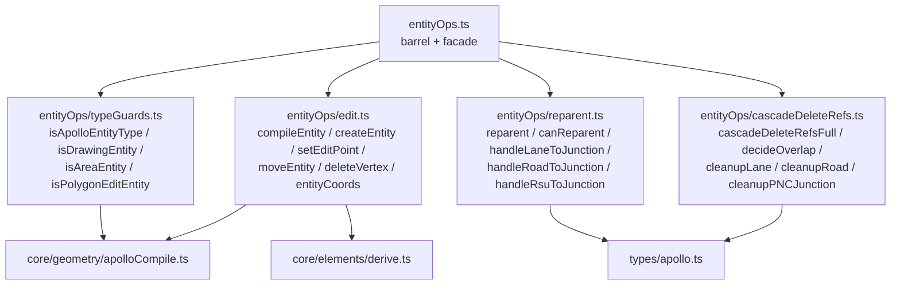
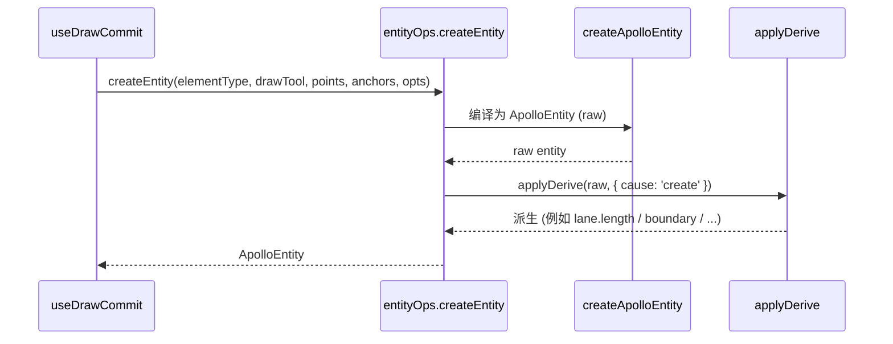
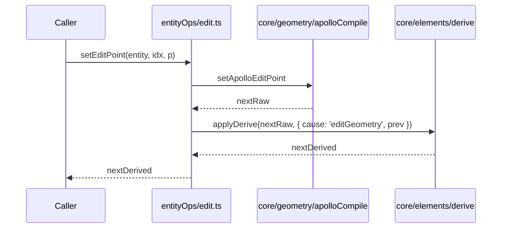

# entityOps 模块

`src/lib/entityOps.ts` (40 行) 是一个 **门面 (facade)** ：把 Apollo proto 相关的所有
geometry / 编辑 / 校验 / 级联删除 / reparent / 类型守卫操作统一暴露成 proto-agnostic 的
`MapEntity` 接口。组件、Hook、Store 永远只 import `@/lib/entityOps`，绝不深入
`@/core/geometry/apolloCompile.ts` 或 `@/types/apollo` 的具体字段。

## 1. 设计目的与不变量

::: tip 设计目标

- 任何 proto 升级 (例：Apollo v2 调整 lane.boundaryType) 只需改 entityOps 内部，**不影响**
  UI 与 store 层。
- 提供"参数化几何 → GeoJSON" 的统一编译入口 (`compileEntity`)，让冷热层不直接
  依赖 `apolloCompile`。
- 把级联删除 (cascadeDeleteRefs) 与重新挂载 (reparent) 这些 proto-aware 复杂操作收口在
  lib 层。
  :::

::: warning 不变量

- 仅 `lib/entityOps/*` 内部模块允许 import `core/geometry/apolloCompile` 与 `types/apollo`。
- `lib/entityOps.ts` 的导出不暴露 Apollo 类型字段，只暴露 `MapEntity`、`ApolloEntity`
  (作为不透明类型)、`GeoPoint`、`BezierAnchorData`、`DrawingEntity`。
- `cascadeDeleteRefs` (无 `Full`) 已 deprecated；新代码统一用 `cascadeDeleteRefsFull`。
  :::

## 2. 模块地图



## 3. 公共表面

| 符号                                                                         | 出处                           | 说明                                                                |
| ---------------------------------------------------------------------------- | ------------------------------ | ------------------------------------------------------------------- |
| `MapEntity`, `ApolloEntity`, `DrawingEntity`, `GeoPoint`, `BezierAnchorData` | `entityOps.ts:7-10`            | re-export of `@/types/entities` / `@/types/apollo` (作为不透明类型) |
| `compileEntity(entity)`                                                      | `edit.ts:69-74`                | `MapEntity` → GeoJSON Features                                      |
| `createEntity(elementType, drawTool, points, anchors, options)`              | `edit.ts:76-85`                | 构造 ApolloEntity (附带 derive)                                     |
| `getEditPoints(entity)`                                                      | `edit.ts:19-35`                | 返回 entity 的可编辑控制点列表                                      |
| `setEditPoint(entity, index, point)`                                         | `edit.ts:37-43`                | 修改单个控制点 (含 derive)                                          |
| `setAllEditPoints(entity, points)`                                           | `edit.ts:45-51`                | 批量替换控制点                                                      |
| `moveEntity(entity, dx, dy)`                                                 | `edit.ts:53-59`                | 平移 entity                                                         |
| `deleteVertex(entity, index)`                                                | `edit.ts:61-67`                | 删除单个 vertex (返回 null 表示退化)                                |
| `entityCoords(entity)`                                                       | `edit.ts:87-92`                | 获取所有坐标 (LngLat[])                                             |
| `cascadeDeleteRefs` (deprecated)                                             | `cascadeDeleteRefs.ts:128-133` | 仅返回 changes                                                      |
| `cascadeDeleteRefsFull`                                                      | `cascadeDeleteRefs.ts:135-154` | changes + cascadeRemoved                                            |
| `reparent`                                                                   | `reparent.ts:195-204`          | 把 child 移到新 parent                                              |
| `canReparent`                                                                | `reparent.ts:206-212`          | 是否允许 reparent                                                   |
| `isDrawingEntity`                                                            | `typeGuards.ts:7-9`            | 是否是 polyline/bezier/arc/rect/polygon                             |
| `isApolloEntityType`                                                         | `typeGuards.ts:11-13`          | 是否是 Apollo 业务实体                                              |
| `isAreaEntity`                                                               | `typeGuards.ts:15-18`          | 是否是面积型实体                                                    |
| `isPolygonEditEntity`                                                        | `typeGuards.ts:25-28`          | 编辑点是否构成闭合 polygon ring                                     |

## 4. createEntity 的责任链



派生引擎 (`core/elements/derive.ts`) 根据元素类型派生只读字段：lane 的 length、
parking space 的 polygon 顶点、信号灯的 stopLine 等。

## 5. cascadeDeleteRefs 实现要点

```mermaid
flowchart TB
  In[removedIds: Set<id>] --> Iter[遍历 allEntities]
  Iter --> Branch{ entity.entityType }
  Branch -->|overlap| Decide[decideOverlap]
  Branch -->|lane| Lane[cleanupLane: 清 junctionId / pred-succ-neighbor]
  Branch -->|road| Road[cleanupRoad: 清 sections.laneIds / junctionId]
  Branch -->|pncJunction| PNC[cleanupPNCJunction: 清 passages.*Ids]
  Branch -->|rsu| RSU[junctionId null]
  Decide -->|<2 remaining| Remove[加入 cascadeRemoved]
  Decide -->|partial| Patch[changes.set(id, patched)]
  Iter --> Stripped[stripOverlapIds]
  Stripped -->|cascadeRemoved 非空| Cleanup[cleanupCascadedOverlapIds]
```

- `decideOverlap` (`cascadeDeleteRefs.ts:116-121`)：当 overlap 引用的 objects 少于 2 个，
  整条 overlap 删除并加入 `cascadeRemoved`。
- `cleanupCascadedOverlapIds` 第二轮扫一遍，把所有 entity 上指向已 cascadeRemoved
  overlap 的 `overlapIds` 也擦掉。

## 6. reparent 的策略表

```ts
// reparent.ts:184-193
const HANDLERS = {
  'lane:junction': handleLaneToJunction,
  'lane:road': handleLaneToRoad,
  'lane:roadSection': handleLaneToRoadSection,
  'lane:none': handleLaneToNone,
  'road:junction': handleRoadToJunction,
  'road:none': handleRoadToNone,
  'rsu:junction': handleRsuToJunction,
  'rsu:none': handleRsuToNone,
};
```

- `lane → junction`：写 lane.junctionId；同时把 lane 从所有 road.sections 中剥离。
- `lane → roadSection`：清 lane.junctionId；把 lane 加入指定 section；从其它 road
  剥离。如果 sectionId 不存在则新建一个。
- `lane → road`：等价于 `lane → roadSection(sections[0])`，没有则用 `roadId_s0`。
- `road → junction`：写 road.junctionId。
- `rsu → junction`：写 rsu.junctionId。
- `* → none`：解除挂载。

::: warning rejection 字符串
当 target 类型不匹配 (例如把 lane 重新挂到 stopSign)，`reparent` 返回
`{ changes: new Map(), rejected: 'cannot reparent X → Y' }`，UI 应当 toast 给用户看。
:::

## 7. typeGuards 的设计

`DRAWING_TYPES` 集合 (`polyline | catmullRom | bezier | arc | rect | polygon`) 定义
"通用绘制几何"。其余 entityType 全部视为 Apollo 业务实体。`isApolloEntityType` 只是
"非绘制" 的反面 —— 这意味着 **添加新业务实体时无需改 typeGuards**。

## 8. 内部细节：edit.ts 的 isApolloEntityType 分支

```ts
// edit.ts:19-35
export function getEditPoints(entity: MapEntity): GeoPoint[] {
  if (isApolloEntityType(entity)) return getApolloEditPoints(entity);
  switch (entity.entityType) {
    case 'polyline':
    case 'catmullRom':
    case 'polygon':
      return entity.points;
    case 'bezier':
      return entity.anchors.map((a) => a.point);
    case 'arc':
      return [entity.start, entity.mid, entity.end];
    case 'rect':
      return [entity.p1, entity.p2];
  }
}
```

绘制类实体的几何在 lib 层直接编辑 (因为这些 schema 是 lib 自己的)；Apollo 业务实体
统一委托 `getApolloEditPoints` 。

## 9. derive 引擎与 entityOps 的关系

`applyDerive` 在 `setEditPoint`、`setAllEditPoints`、`moveEntity`、`deleteVertex`、
`createEntity` 之后都会调用一次。它接受 `{ cause, prev }`：

- `cause: 'create'` —— 初始化派生字段。
- `cause: 'editGeometry'` —— 重新派生 length / polygon / boundary 等。
- 后续可能扩展 `cause: 'edit属性'` (拆分派生范围)。

::: tip 派生只在 entityOps 出口
任何"修改 entity"的入口都得调 derive，否则会出现"几何变了但 length 没更新" 的脏数据。
:::

## 10. 常见陷阱

::: danger 直接 import apolloCompile
反腐败的根本红线。出现 `from '@/core/geometry/apolloCompile'` 在 components/hooks
是 PR 阻塞项。
:::

::: danger 用 cascadeDeleteRefs 而非 cascadeDeleteRefsFull
旧版本只返回 changes，cascadeRemoved (孤儿 overlap) 会留在 store。新增功能必须用 Full。
:::

::: danger 直接修改 entity 字段而不走 setEditPoint
`mapStore.updateEntity` 接受 entity 引用 —— 如果上游不通过 entityOps 改，derive 不会
运行，length / polygon 会陈旧。
:::

::: danger reparent 后忘记 propagate 到 mapStore
`reparent` 只返回 `changes` map，需要 caller 写回 store。`mapStore.reparentEntity`
(`mapStore.ts:218-234`) 已替你写回；自定义脚本要照做。
:::

## 11. Source map (file:line refs)

- `src/lib/entityOps.ts:1-39` — facade
- `src/lib/entityOps/edit.ts:1-92`
- `src/lib/entityOps/typeGuards.ts:1-28`
- `src/lib/entityOps/cascadeDeleteRefs.ts:1-214`
- `src/lib/entityOps/reparent.ts:1-212`
- `src/types/apollo.ts` — proto 字段定义 (内部使用)
- `src/core/elements/derive.ts` — 派生引擎
- `src/core/geometry/apolloCompile.ts` — 内部 proto-aware 编译器

## 12. 性能与边界

| 入口                    | 复杂度                  | 备注                                                         |
| ----------------------- | ----------------------- | ------------------------------------------------------------ |
| `compileEntity(entity)` | O(features × points)    | lane corridor 含 boundary，是大头；junction stitching 不在此 |
| `createEntity(...)`     | O(point count) + derive | derive 与 entityType 相关；lane 走 corridor 编译             |
| `setEditPoint(...)`     | O(1) + derive           | 若是 lane，会触发 lane.length 重算                           |
| `cascadeDeleteRefsFull` | O(N entities)           | 单次扫描 + 第二轮 stripOverlapIds                            |
| `reparent(...)`         | O(roads × sections)     | 仅当 child 是 lane 时遍历；否则 O(1)                         |

::: tip 调用频率
`compileEntity` 在冷层路径里被 worker 调用 (受 featureCache 保护)。UI 不应在
render 中直接调它。
:::

## 13. derive 的 cause 形态

```ts
type DeriveCause =
  | { cause: 'create' }
  | { cause: 'editGeometry'; prev: MapEntity }
  | { cause: 'editProperty'; prev: MapEntity; field: string }; // future
```

当前只用前两种 cause。未来扩展 `editProperty` 可让 derive 跳过几何相关字段，
直接派生属性影响的字段 (例如 `lane.type` 改变时只重算 boundary 颜色，不重算 length)。

## 14. 测试矩阵

| 模块                   | 关键测试用例                                                                               |
| ---------------------- | ------------------------------------------------------------------------------------------ |
| `cascadeDeleteRefs.ts` | 删 lane → 关联 road sections 清理；删 junction → lane.junctionId null；orphan overlap 移除 |
| `reparent.ts`          | lane → junction、lane → roadSection、lane → none；reject 非法 child:target                 |
| `typeGuards.ts`        | 6 个 drawing type 全命中；任意未知 entityType 走 Apollo 分支                               |
| `edit.ts`              | setEditPoint 触发 derive；deleteVertex 退化为 null 的边界情况                              |

## 15. 公共契约稳定性

| 符号                                               | 稳定性     | 备注                           |
| -------------------------------------------------- | ---------- | ------------------------------ |
| `compileEntity` / `createEntity` / `getEditPoints` | stable     | 主要 API，禁止 breaking change |
| `cascadeDeleteRefs`                                | deprecated | 新代码用 Full 版本             |
| `cascadeDeleteRefsFull`                            | stable     | 主路径                         |
| `reparent` / `canReparent`                         | stable     | HANDLERS 可加                  |
| `isXxx` guards                                     | stable     | 新增 entity 类型时无需改       |

## 16. 用法范例

### 16.1 创建一条 lane

```ts
import { createEntity } from '@/lib/entityOps';
import type { LngLat } from '@/core/geometry/interpolate';

const points: LngLat[] = [
  [121.5, 31.2],
  [121.501, 31.2],
  [121.502, 31.201],
];
const lane = createEntity('lane', 'drawPolyline', points, [], { laneHalfWidth: 1.75 });
useMapStore.getState().addEntity(lane);
```

### 16.2 把 lane 重新挂到另一个 junction

```ts
import { useMapStore } from '@/store/mapStore';

const result = useMapStore
  .getState()
  .reparentEntity('lane_xxx', { kind: 'junction', id: 'junction_yyy' });
if (result.rejected) toast(result.rejected);
```

### 16.3 删除 lane（含 cascade）

```ts
useMapStore.getState().removeEntity('lane_xxx');
// mapStore 内部自动 cascadeDeleteRefsFull
```

### 16.4 修改单个 vertex

```ts
import { setEditPoint } from '@/lib/entityOps';

const lane = useMapStore.getState().entities.get('lane_xxx')!;
const next = setEditPoint(lane, 0, { x: 121.499, y: 31.2 });
useMapStore.getState().updateEntity('lane_xxx', next);
```

## 17. 与 derive 引擎的协作时序



`prev` 让 derive 引擎做差量决策 —— 例如 `lane.length` 仅在 centralCurve 真的改变时
重算，避免 O(N) 重新计算所有派生字段。

## 18. 与 Worker 的契约

worker (spatial / overlap / IO) 接收的实体一律是 `MapEntity` (proto-aware shape)，
而不是从 `entityOps` 拿 helper。这里有两个含义：

1. worker 内部代码 **可以** import `core/geometry/apolloCompile` (worker 属于 core 层)，
   但 **不应** import lib/entityOps —— 因为 entityOps 内部假设主线程环境。
2. worker 输出回主线程的对象是 GeoJSON Feature 或 patch (`{ changes, removedOverlapIds }`)，
   主线程通过 `mapStore.setState(...)` 写入；entityOps 在 worker 内部不参与。

## 19. See also

- [反腐败层](./anti-corruption-layer.md) —— 更广义的论述
- [架构总览](./overview.md)
- [状态管理](./state-management.md) —— `mapStore` 如何调用 cascadeDeleteRefs / reparent
- [FSM 设计](./fsm-design.md) —— `useDrawCommit` 调用 `createEntity`
- [几何引擎](./geometry-engine.md)
- [派生引擎](./derive-engine.md)
