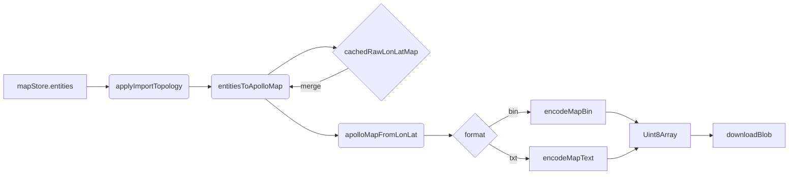

# 导出引擎 (Export Engine)

> 当前实现：`src/io/apolloIO.worker.ts` + `src/io/apolloIOBridge.ts`。
> 与 ARCHITECTURE.md 中规划的 `buildBaseMap.ts` / `buildSimMap.ts` /
> `buildRoutingMap.ts` 等离散文件不同，本工程通过单 worker
> "保留原始 raw map → 替换实体 → 反向投影 → 编码"的统一管线实现导出。

## 1. 总体管线



每一步的语义：

| 步骤                  | 文件:行                                                 | 作用                                                              |
| --------------------- | ------------------------------------------------------- | ----------------------------------------------------------------- |
| `applyImportTopology` | `src/io/apolloIO.worker.ts:94-114`                      | reconcileLaneTopology + reconcileOverlaps（mode: 'full'）         |
| `entitiesToApolloMap` | `src/io/proto/entityBridge/map.ts`                      | 把编辑实体写回 raw map 的对应数组（lane / road / junction / ...） |
| `cachedRawLonLatMap`  | `src/io/apolloIO.worker.ts:27`                          | 导入时缓存的原始 lon/lat map —— 用于保留 editor 未改动的字段      |
| `apolloMapFromLonLat` | `src/io/proto/adapter.ts:72`                            | WGS84 → UTM ENU 反向投影                                          |
| `encodeMapBin`        | `src/io/proto/binCodec.ts:17`                           | protobufjs 二进制编码                                             |
| `encodeMapText`       | `src/io/proto/textCodec.ts:13` / `textCodec/encoder.ts` | Apollo 文本 protobuf 编码                                         |

## 2. 入口：`mapIO.ts`

`src/io/mapIO.ts:95-141` 暴露两个用户命令：

```ts
export async function exportApolloBin(): Promise<void>;
export async function exportApolloText(): Promise<void>;
```

二者共享 `currentExportContext()` —— 校验 `apolloMapStore.info` 存在
（必须先导入），从 `mapStore.entities` 取出全量实体数组，再调用
`apolloIOBridge.exportBin/Text(entities, projString, onProgress)`。
导出结果以 `downloadBlob(blob, suggestedFilename(...))` 触发浏览器下载。

文件名规则：

```ts
// mapIO.ts:75-79
function suggestedFilename(originalName: string, ext: 'bin' | 'txt'): string {
  const base = originalName.replace(/\.(bin|txt|pb\.txt)$/i, '') || 'apollo-map';
  const stamp = new Date().toISOString().replace(/[-:T]/g, '').slice(0, 14);
  return `${base}-${stamp}.${ext}`;
}
```

`<base>-YYYYMMDDhhmmss.{bin|txt}`。

## 3. Bridge：chunked + transfer

`ApolloIOBridge.exportBin/exportText` 在
`apolloIOBridge.ts:138-178`：

1. 注册 `pending[requestId]` 与 onProgress / resolve / reject。
2. `BEGIN_EXPORT { format, projString, total: N }` —— 通知 worker
   进入累积模式。
3. `EXPORT_ENTITIES_CHUNK { entities, offset, total }` —— 每 2000
   实体一批，每批 `await yieldToMain()`，避免主线程被 postMessage 风暴
   阻塞。同步发 `PROGRESS { detail: 'Sending entities X / N' }`
   给 UI。
4. `FINISH_EXPORT` —— worker 真正进入序列化阶段。
5. worker 回 `EXPORT_BIN_RESULT { bytes }` 或
   `EXPORT_TEXT_RESULT { bytes }`，bridge resolve 出 Uint8Array。

`bytes` 通过 `[bytes.buffer]` 转移，避免 50MB 双倍内存。

## 4. Worker 阶段

```ts
// src/io/apolloIO.worker.ts:199-243
async function runExport(requestId, entities, projString, format) {
  if (!cachedRawLonLatMap) {
    throw new Error('No imported Apollo map is cached in the IO worker.');
  }
  // 1. derive：拓扑 + overlap 全量重算
  const processed = applyImportTopology(entities);
  // 2. merge：把编辑实体覆盖到 cached raw map
  const merged = entitiesToApolloMap(cachedRawLonLatMap, processed.entities);
  // 3. project：lon/lat → ENU
  const { map: enuMap } = await apolloMapFromLonLat(merged, projString);
  // 4. encode：bin or text
  if (format === 'bin') {
    const bytes = await encodeMapBin(enuMap);
    postWithTransfer({ type: 'EXPORT_BIN_RESULT', requestId, bytes }, [bytes.buffer]);
  } else {
    const text = await encodeMapText(enuMap);
    const bytes = TEXT_ENCODER.encode(text);
    postWithTransfer({ type: 'EXPORT_TEXT_RESULT', requestId, bytes }, [bytes.buffer]);
  }
}
```

每一步都伴随一次 PROGRESS：12% Recomputing overlaps → 35% Merging → 55%
Projecting → 80% Encoding → 100% 完成。

## 5. derive：拓扑 + overlap

```ts
// apolloIO.worker.ts:94-114
function applyImportTopology(entities) {
  const entityMap = new Map(entities.map((e) => [e.id, e]));

  // 1) lane topology：predecessor/successor/neighbor 端点连接
  const { changes: topoChanges } = reconcileLaneTopology(entityMap);
  for (const [id, e] of topoChanges) entityMap.set(id, e);

  // 2) overlap：lane × signal/stopSign/junction/... 全量重算
  const patch = reconcileOverlaps(entityMap, { mode: 'full' }, new SpatialIndex());
  for (const id of patch.removedOverlapIds) entityMap.delete(id);
  for (const [id, e] of patch.changes) entityMap.set(id, e);

  return { entities: Array.from(entityMap.values()), topologyMs, overlapMs };
}
```

设计意图：导出前的 derive 是**最后一道防线**。即便编辑期间没触发 reconcile
（例如撤销绕过了部分链路），导出时仍能保证 Apollo 协议拓扑一致。

## 6. merge：保留原始字段

`entitiesToApolloMap(cachedRawLonLatMap, entities)`（`entityBridge/map.ts`）
的核心思想是：

- 编辑实体覆盖 raw map 的对应数组（`lane`, `crosswalk`, `junction`, ...）；
- **未被编辑的字段**（如 lane 的 `function`、`type` 中 Apollo 私有 enum、
  `link` 等）保留 raw map 中的原始值；
- header / hdmap_version / 自定义字段都原封不动透传。

这就是为什么导出必须先 import —— 没有 raw map 就没有"留住"的语义。

## 7. project：精度与单位

`apolloMapFromLonLat(map, projString)` 调
`transformPointsInMessage(Map, msg, projection.fromLonLat)`，递归遍历
`apollo.common.PointENU` 子消息（`adapter.ts:12-39`）。

projection 由 proj4 驱动：`makeProjection(projString)` 在
`projection.ts:30-45`，`fromLonLat({ x, y })` 调用 `proj4(WGS84, target).forward([x,y])`
得到 ENU 平面坐标。Apollo `PointENU.z` 在 round trip 中保留。

## 8. encode：bin vs text

### 8.1 binCodec

```ts
// src/io/proto/binCodec.ts:17-23
export async function encodeMapBin(obj) {
  const Map = await getMapType();
  const err = Map.verify(obj); // schema check
  if (err) throw new Error(`Map.verify failed: ${err}`);
  const msg = Map.fromObject(obj);
  return Map.encode(msg).finish();
}
```

`Map.verify` 在序列化之前 catch 类型错误（例如非数字 enum、缺失必填字段）。
失败时 worker 抛出 ERROR，bridge reject。

### 8.2 textCodec

`textCodec.ts` 调用自定义 `encodeMessage`（`textCodec/encoder.ts`），
输出 Apollo 文本 protobuf —— 字段名 snake_case，enum 用名字。
比 `bin` 大 5-10 倍，但便于 diff / 人工 review。

### 8.3 何时选哪个

| 场景                   | 选择   |
| ---------------------- | ------ |
| 与 Apollo runtime 集成 | `.bin` |
| 人工审阅 / git diff    | `.txt` |
| 自动化测试 fixture     | `.txt` |
| CI 体积要求            | `.bin` |

## 9. Header 保留

`cachedRawLonLatMap.header` 完整透传 —— 包括 `projection.proj`、
`vendor`、`hdmap_version`、`zone_id`、`max/min` bbox 等字段。
`apolloIO.worker.ts:75-79` 的 `cloneHeader` 仅在 import 时 `structuredClone`
一份给 store 做展示，导出仍读 `cachedRawLonLatMap.header` 原值。

## 10. ProjString 解析

```ts
// src/io/proto/adapter.ts:87-98
export function readHeaderProjString(map): string | null {
  const header = map.header;
  const proj = header?.projection?.proj;
  if (proj == null) return null;
  if (typeof proj === 'string') return proj;
  if (proj instanceof Uint8Array) return new TextDecoder().decode(proj);
  if (Array.isArray(proj)) return proj.map((b) => String.fromCharCode(b as number)).join('');
  return null;
}
```

Apollo 早期版本可能把 PROJ 字符串编码为 bytes / number[]，三种格式都要兼容。
`sanitizeProjString` (`projection.ts:10-12`) 进一步去掉
`+lat_0={37.413082}` 这种模板占位符。

## 11. EditorMeta 透传

`editor_meta` 字段（proto field 1000 on `Map`）让 editor 把
"polyline vs polygon"、"用户覆盖标记" 等 Apollo runtime 忽略的元信息塞进 .bin
里走 round trip。

`src/io/proto/editorMeta.ts:49-66`：

- `readEditorMeta(rawMap)` 在导入时把 wire format → 内存对象。
- `writeEditorMeta(rawMap, meta)` 在导出时反向写回。
- proto2 默认保留未知字段，所以 Apollo runtime 不会 strip 此节。

## 12. Public API 表

| 入口                             | 文件:行                             |
| -------------------------------- | ----------------------------------- |
| `exportApolloBin`                | `src/io/mapIO.ts:95`                |
| `exportApolloText`               | `src/io/mapIO.ts:121`               |
| `apolloIOBridge.exportBin`       | `apolloIOBridge.ts:88`              |
| `apolloIOBridge.exportText`      | `apolloIOBridge.ts:96`              |
| `runExport`                      | `apolloIO.worker.ts:199`            |
| `entitiesToApolloMap`            | `proto/entityBridge/map.ts`         |
| `apolloMapFromLonLat`            | `proto/adapter.ts:72`               |
| `encodeMapBin` / `encodeMapText` | `proto/binCodec.ts`, `textCodec.ts` |

## 13. 性能预算

| 阶段                    | 5w 实体地图实测 |
| ----------------------- | --------------- |
| `applyImportTopology`   | ~150 ms         |
| `entitiesToApolloMap`   | ~80 ms          |
| `apolloMapFromLonLat`   | ~120 ms         |
| `encodeMapBin`          | ~250 ms         |
| **总计**                | **~600 ms**     |
| Bridge / chunk overhead | <50 ms          |

CI bench 在 `scripts/bench-budgets.json` 设硬阈值，超出阻断合入。

## 14. 陷阱

1. **导出前未 import** —— `runExport` throw `No imported Apollo map is cached`，
   UI 拿到 ERROR；务必先调用 `pickAndImportApollo()`。
2. **mode: 'full' overlap 是必须的** —— 增量 overlap 会漏掉 lane 拓扑
   重连后产生的"间接" overlap。
3. **PROJ 字符串末尾的 `{}`** —— 不 sanitize 会让 proj4 抛错。
4. **bytes 不 transfer** —— 50MB 双倍内存，浏览器有可能 OOM。
5. **手工增删 entity 后未触发 derive** —— 导出会暴露不一致；
   `applyImportTopology` 是兜底，但生产环境应该让运行时 reconciler 在
   编辑时跑（已经是默认行为）。

## 15. 测试

`src/io/__tests__/endToEnd.test.ts` 测试：

1. 加载 `__fixtures__/apollo/{borregas_ave,demo,dreamview}` fixture；
2. import → 编辑（增删某 lane） → exportBin → re-import；
3. 断言关键字段无损 round trip（lane id 集合 / lane 拓扑 / overlap 集合）。

`__fixtures__/apollo/` 三个 fixture 来自 Apollo 官方 demo，覆盖
小 / 中 / 大尺寸地图。

## 16. 与 base_map / sim_map / routing_map 的关系

ARCHITECTURE.md 提到的三个 build 函数对应 Apollo 的三个 map flavor。
当前实现只产 `base_map`：编辑器是把 `base_map` 作为唯一事实来源，
sim_map / routing_map 由 Apollo 离线工具从 base_map 派生。
未来若把 derive 内置到 editor，`runExport(format='base'|'sim'|'routing')`
会成为 worker 协议的一个新维度。

## 17. 源码地图

```
src/io/
├── mapIO.ts                       ← exportApolloBin/Text 入口
├── fileIO.ts                      ← downloadBlob 等浏览器 IO
├── apolloIOBridge.ts              ← chunked + transfer 主线程封装
├── apolloIOProtocol.ts            ← request/response 协议
├── apolloIO.worker.ts             ← runExport 实现
├── proto/
│   ├── adapter.ts                 ← apolloMapFromLonLat / readHeaderProjString
│   ├── binCodec.ts                ← encodeMapBin
│   ├── textCodec.ts               ← encodeMapText
│   ├── projection.ts              ← proj4 桥
│   ├── loader.ts                  ← protobufjs schema bundling
│   ├── editorMeta.ts              ← editor_meta 透传
│   ├── apolloGeoJson.ts           ← 导入 bbox 计算
│   └── entityBridge/
│       ├── map.ts                 ← entitiesToApolloMap
│       ├── laneRoad.ts
│       ├── overlap.ts
│       └── simpleEntities.ts
└── __tests__/endToEnd.test.ts
```

## 18. 增量导出（未来）

当前实现只有 "full export"。规划中两种增量场景：

1. **diff 导出**：相对上次导入仅产出变化集（add / remove / update），
   适合大地图的逐步集成；需要在 worker 维护 baseline 引用 + 变化集
   patch。
2. **partial 导出**：导出选区内的子集（例如仅一个 lane region），
   依赖 reconcile 层的 `mode: 'incremental' | 'subset'`。

两者都需要等 overlap reconciler 与 lane topology reconciler 提供 patch
返回值（已部分支持）。

## 19. See also

- [Worker Protocol](./worker-protocol.md)
- [Coordinate System](./coordinate-system.md)
- [Anti-corruption Layer](./anti-corruption-layer.md)
- [Overlap Derivation](./overlap-derivation.md)
- [Junction Stitching](./junction-stitching.md)
