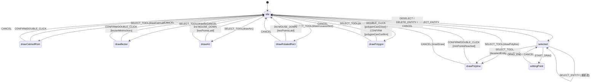
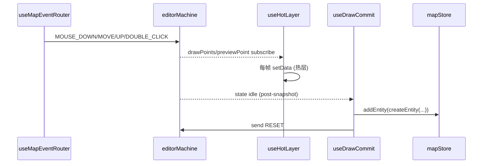
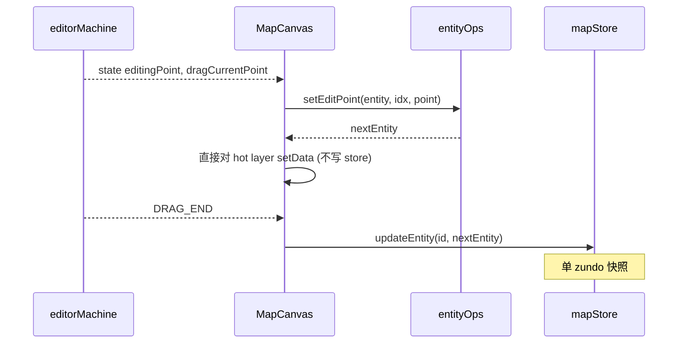

# FSM 设计

`src/core/fsm/editorMachine.ts` 是编辑器交互的 **唯一真理源**。它用 XState 5 的
`setup({ types }).createMachine(...)` 模式描述：6 种绘制态、idle / selected /
editingPoint 三种非绘制态、共享的 draw event handler、以及与 `useDrawCommit` 联动的
post-snapshot commit 协议。本页把它的所有状态、事件、guard 与 action 摊开。

## 1. 设计目的与不变量

::: tip 设计目标

- 消灭"组件内部维护编辑器宏观状态"的可能性。
- 通过 guard 把无效输入挡在 store 之外 (例：自相交多边形不能 close)。
- 撤销协议 R1 闭环：CANCEL → temporal.undo()。
  :::

::: warning 不变量

- 全编辑器只有 **一个** actor，由 `WorkspaceLayout.tsx:187` 创建。
- 输入层 dedup 是单一事实源；FSM 不再做 `slice(-1)` 补偿。
- `idle` 接收 commit transition 时 **不带 actions**，让 `useDrawCommit` 读 post-snapshot。
  :::

## 2. 状态与事件全景



## 3. Context

```ts
// editorMachine.ts:32-44
export interface EditorContext {
  drawPoints: LngLat[];
  previewPoint: LngLat | null;
  bezierAnchors: BezierAnchor[];
  isDraggingHandle: boolean;
  selectedEntityId: string | null;
  dragPointIndex: number;
  dragPointType: DragPointType;
  dragCurrentPoint: LngLat | null;
  dragAltKey: boolean;
  activeElement: MapElementType | null;
}
```

`activeElement` 让 ToolStrip 知道用户在画哪个 Apollo 元素 (例如 lane vs polyline)。
`previewPoint` 给热层渲染下一个候选点。

## 4. Events 全表

```ts
// editorMachine.ts:46-65
type EditorEvent =
  | { type: 'SELECT_TOOL'; tool: DrawTool; element?: MapElementType }
  | { type: 'MOUSE_DOWN'; point: LngLat }
  | { type: 'MOUSE_MOVE'; point: LngLat }
  | { type: 'MOUSE_UP'; point: LngLat }
  | { type: 'DOUBLE_CLICK'; point: LngLat }
  | { type: 'CONFIRM' }
  | { type: 'CANCEL' }
  | { type: 'RESET' }
  | { type: 'SELECT_ENTITY'; id: string }
  | { type: 'DESELECT' }
  | { type: 'START_DRAG'; index: number; pointType: DragPointType; altKey?: boolean }
  | { type: 'DRAG_MOVE'; point: LngLat }
  | { type: 'DRAG_END'; point: LngLat }
  | { type: 'DELETE_ENTITY' }
  | { type: 'TOGGLE_SMOOTH'; index: number };
```

::: warning CANCEL vs RESET
两者都把状态拨回 `idle`，但语义不同：

- `CANCEL` 用户主动取消 (Esc / 撤销前置)，会调 `resetDraw`。
- `RESET` 由 `useDrawCommit` 在 commit **之后** 发，专做收尾。否则
  `activeElement` 残留导致 ToolStrip 高亮不消。
  :::

## 5. Guards

| Guard                    | 作用                                                 |
| ------------------------ | ---------------------------------------------------- |
| `minPointsReached`       | drawPoints ≥ 2，多段线 / 曲线 / catmull-rom 提交前置 |
| `bezierMinAnchors`       | bezierAnchors ≥ 2                                    |
| `isDraggingHandle`       | 当前是否在拖 bezier 控制柄                           |
| `twoPointsLaid`          | 已落两点 → 第三次点击触发 commit (Arc / RotatedRect) |
| `polygonNoSelfIntersect` | 候选点不会让多边形自相交                             |
| `polygonCanClose`        | 多边形当前足以闭合 (≥3 点 + 不自相交)                |
| `polygonCanConfirm`      | CONFIRM 时是否允许提交多边形                         |

## 6. Actions

| Action                | 用途                                                                                  |
| --------------------- | ------------------------------------------------------------------------------------- |
| `resetDraw`           | 清空 drawPoints / previewPoint / bezierAnchors / isDraggingHandle，重设 activeElement |
| `addPoint`            | drawPoints 末尾追加一个点                                                             |
| `updatePreview`       | 把 MOUSE_MOVE 的点写入 previewPoint                                                   |
| `bezierAddAnchor`     | 加一个 BezierAnchor，置 isDraggingHandle                                              |
| `bezierDragHandle`    | 拖控制柄时更新 anchor 的 handleIn/handleOut (mirrorPoint)                             |
| `bezierConfirmHandle` | MOUSE_UP 释放控制柄；若距离极小则 handleIn/Out 置 null (尖角)                         |
| `bezierPreview`       | 非拖柄时只更新 previewPoint                                                           |
| `selectEntity`        | 写 selectedEntityId、清 drag 上下文                                                   |
| `deselectEntity`      | 清 selectedEntityId 与 drag 上下文                                                    |
| `startDrag`           | 记录 dragPointIndex / type / altKey                                                   |
| `dragMove`            | 写 dragCurrentPoint                                                                   |

## 7. 共享 draw event handler

```ts
// editorMachine.ts:89-105
const sharedDrawEvents = {
  SELECT_TOOL: selectToolTransitions,
  MOUSE_DOWN: { actions: 'addPoint' },
  MOUSE_MOVE: { actions: 'updatePreview' },
  DOUBLE_CLICK: { guard: 'minPointsReached', target: 'idle' },
  CONFIRM: { guard: 'minPointsReached', target: 'idle' },
  CANCEL: { target: 'idle', actions: 'resetDraw' },
};
```

`drawPolyline` 与 `drawCatmullRom` 共用此 handler，删除任何一个都会让 ToolStrip 在它
上面失效。

`threeClickCommitEvents` 是 Arc / RotatedRect 专用：第三次 MOUSE_DOWN 用 `twoPointsLaid`
guard 直接 commit。

## 8. 关键注释：`removeLastPoint` 历史

`editorMachine.ts:83-87` 注释说明：双击会触发两次 mousedown，FSM 多收一个点；早期实现
在 DOUBLE_CLICK 时 `slice(-1)`。但 `useMapEventRouter` 的 `isDuplicateInput` 已经在
**输入层** 吞掉了 dblclick 的第二次 click，FSM 只会收到一次 MOUSE_DOWN。
**双重补偿会真的把最后一个点削掉**，导致"多段线少一个点"。当前代码相信 drawPoints。

## 9. XState 5 类型痛点

`editorMachine.ts:120-128` 的注释解释为什么 `assign(...)` 必须 **内联** 在 `setup.actions`
对象里：

> XState 5 的 `assign` 签名要 5 个类型参数 (TContext, TExpressionEvent, TParams, TEvent,
> TActor)，内联时类型推断顺利；提取到顶层 `const` 时 `_out_TEvent` 会被 widen 成
> `EventObject`，无法结构匹配 `setup.actions` 映射。

> 之前因此挂过 `// @ts-nocheck`；当前已 typed (无 `// @ts-nocheck`)，但保持内联约束。

## 10. drawBezier 特殊状态

不与 `sharedDrawEvents` 共享，因为 bezier 有 MOUSE_UP 释放控制柄、`isDraggingHandle`
分支：

```ts
// editorMachine.ts:332-353
drawBezier: {
  on: {
    SELECT_TOOL: selectToolTransitions,
    MOUSE_DOWN: { actions: 'bezierAddAnchor' },
    MOUSE_MOVE: [
      { guard: 'isDraggingHandle', actions: 'bezierDragHandle' },
      { actions: 'bezierPreview' },
    ],
    MOUSE_UP: { actions: 'bezierConfirmHandle' },
    DOUBLE_CLICK: { guard: 'bezierMinAnchors', target: 'idle', actions: assign({ isDraggingHandle: false }) },
    CONFIRM: { guard: 'bezierMinAnchors', target: 'idle' },
    CANCEL: { target: 'idle', actions: 'resetDraw' },
  },
},
```

## 11. drawPolygon 特殊状态

`MOUSE_DOWN` 加 `polygonNoSelfIntersect` guard：候选点会引发自相交时 **不收点**。
`DOUBLE_CLICK` 用 `polygonCanClose`、`CONFIRM` 用 `polygonCanConfirm`。两者都要求
≥3 点且不自相交。

## 12. selected / editingPoint

`selected` 接受 `START_DRAG` 进 `editingPoint`，或 `DESELECT` / `DELETE_ENTITY` /
`CANCEL` / `SELECT_TOOL` 退出 (后者会先 `deselectEntity` 再切到 draw)。
`editingPoint` 接受 `DRAG_MOVE` / `DRAG_END` / `CANCEL`。
**实际 entity 更新由 `MapCanvas` 在 DRAG_END 时执行**，FSM 不持有 entity 写入语义。

## 13. 与外层的交互



## 14. 常见陷阱

::: danger 在 FSM 之外维护"我现在是不是在画"
任何 `useState<boolean>('isDrawing')` 都是 bug。`useSelector(actorRef, s => isDrawingState(s.value as string))` 是唯一来源。
:::

::: danger commit transition 带 actions
若 `DOUBLE_CLICK` transition 同时带 `actions: 'resetDraw'`，post-snapshot 看到 drawPoints 已被清空，commit 失败。**保持 transition 只 target idle**。
:::

::: danger 给 idle 加 SELECT_TOOL 之外的初始动作
`idle` 的 `SELECT_TOOL` 用 `selectToolTransitions` (含 `resetDraw`)；`selected` 走
`selectToolFromSelected` (先 deselect 再 reset)。两者顺序很关键。
:::

::: danger 把 `selectedEntityId` 也放进 zundo
zundo 只持久化 `mapStore.entities`；FSM context 不进历史。撤销 entity 删除时，
`selectedEntityId` 仍指向已被删的 id —— 上层 (`InspectorForms`) 必须容忍 missing。
:::

## 15. Source map (file:line refs)

- `src/core/fsm/editorMachine.ts:10-25` — `DrawTool` 与 `DRAW_STATES`
- `:32-44` — Context
- `:46-65` — Events
- `:67-79` — `selectToolTransitions` / `selectToolFromSelected`
- `:81-117` — `sharedDrawEvents` / `threeClickCommitEvents`
- `:130-249` — `setup({ types, guards, actions })`
- `:249-384` — `createMachine` 状态机主体
- `src/hooks/__tests__/undoCancel.test.ts` — R1 回归测试
- `src/hooks/useDrawCommit.ts` — post-snapshot commit + RESET

## 16. selectToolTransitions 工厂

```ts
// editorMachine.ts:67-73
const selectToolTransitions = DRAW_STATES.map((tool) => ({
  guard: ({ event }) => event.type === 'SELECT_TOOL' && event.tool === tool,
  target: tool,
  actions: ['resetDraw'] as const,
}));
```

每个 draw state 一条 transition，结构相同只换 tool 名。从 `DRAW_STATES` 单一事实源
派生，避免 6 条手抄记录漂移。`selectToolFromSelected` 在此基础上前置 `deselectEntity`。

## 17. addPoint / updatePreview 的执行时机

| Event      | 期望频率                | 数据走向                                      |
| ---------- | ----------------------- | --------------------------------------------- |
| MOUSE_DOWN | 用户点击 (~1Hz)         | 写 `drawPoints` → 触发 useHotLayer 一次重渲染 |
| MOUSE_MOVE | 鼠标移动 (60Hz)         | 仅写 `previewPoint` → useHotLayer 高频重画    |
| MOUSE_UP   | 配合 bezier handle 释放 | 仅 drawBezier 用                              |

useHotLayer 通过 selector 订阅 `s.context.previewPoint`，因此 `updatePreview` 不会
导致整个 React 树 re-render。

## 18. dragMove 的实际实体修改



::: tip 拖拽期间不写 store
拖拽过程中只更新热层，避免每帧都触发 immer producer + zundo 快照 + worker
INCREMENTAL。直到 DRAG_END 才一次性 commit。
:::

## 19. TOGGLE_SMOOTH 的目的

```ts
// editorMachine.ts:304-308
TOGGLE_SMOOTH: {
  target: 'selected',
}
```

仅留一个 self-transition；实际"尖角 ↔ 平滑"切换由 MapCanvas 在 catch 到事件后
调 entityOps 修改 entity 的 anchor.handleIn/Out。FSM 仅记录"用户按了 Alt+点击锚点"。

## 20. See also

- [架构总览](./overview.md)
- [Action Registry](./action-registry.md) — `SELECT_TOOL` 的来源
- [状态管理](./state-management.md) — R1 CANCEL 闭环
- [Map Event Router](./map-event-router.md) — 输入层 dedup
- [几何引擎](./geometry-engine.md) — addPoint 之后的几何编译
