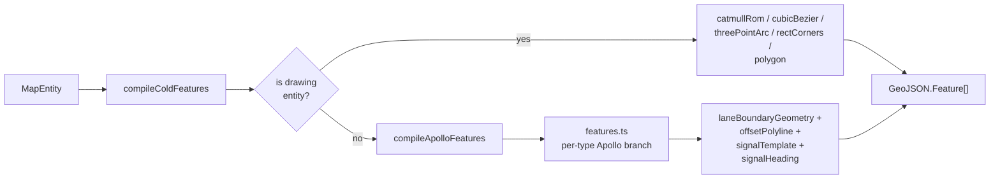

# Geometry Engine

The geometry engine is the pure-function core that compiles `MapEntity`
records into GeoJSON features and answers shape-derived queries (edit
points, hit test, area-vs-line classification). It is shared by the spatial
worker (cold rendering) and the main thread (hot rendering, hit testing,
overlap reconciliation).

## Top-level facade

`src/core/geometry/compile.ts` is the thin facade exposed to callers:

| Export                        | Returns                    | Used by                       |
| ----------------------------- | -------------------------- | ----------------------------- |
| `compileColdFeatures(entity)` | `GeoJSON.Feature[]`        | spatial worker featureCache   |
| `entityCoords(entity)`        | `LngLat[]`                 | bbox + worker spatial item    |
| `entityRenderCoords(entity)`  | `LngLat[]`                 | hitTest precision pass        |
| `entityBBox(entity)`          | `[minX, minY, maxX, maxY]` | RBush insertion               |
| `isAreaEntity(entity)`        | `boolean`                  | hitTest area vs line distance |

It branches on `entityType`: drawing entities (polyline/catmullRom/bezier/
arc/rect/polygon) use local interpolation helpers; Apollo entities delegate
to `apolloCompile`.

## Submodules

```
src/core/geometry/
  ├── compile.ts              ← facade, drawing-entity dispatch
  ├── apolloCompile.ts        ← Apollo-entity facade
  ├── apolloCompile/
  │   ├── conversions.ts      ← pointsToCurve / pointsToPolygon
  │   ├── editPoints.ts       ← getApolloEditPoints / setApolloEditPoint / ...
  │   ├── factory.ts          ← createApolloEntity / inferLaneTurn
  │   ├── features.ts         ← compileApolloFeatures (per-type GeoJSON)
  │   ├── laneBoundaryGeometry.ts ← curvePoints, boundary side construction
  │   ├── offsetPolyline.ts   ← parallel-offset for lane half-widths
  │   ├── projection.ts       ← lon/lat ↔ apollo PointENU helpers
  │   ├── signalHeading.ts    ← heading derivation for vertical signals
  │   └── signalTemplate.ts   ← templated multi-bulb signal layouts
  ├── anchorConvert.ts        ← BezierAnchorData ↔ runtime BezierAnchor
  ├── interpolate.ts          ← catmullRom / cubicBezier / threePointArc / rectCorners
  ├── snap.ts                 ← endpoint / midpoint / grid snap
  ├── validation.ts           ← polygon self-intersection guards
  ├── hitTest.ts              ← point-to-polyline / point-to-polygon distance (geo-aware)
  ├── connectLanes.ts         ← lane endpoint join op for connect-mode
  ├── coords.ts               ← LngLat / GeoPoint conversion helpers
  ├── laneJunctions.ts        ← junction stitcher (the cached-decoration target)
  └── laneTopology.ts         ← reconcileLaneTopology(Incremental) for pred/succ/junctionId
```

## Pipeline



### One paragraph per submodule

**`conversions.ts`** — bridges editor `LngLat[]` arrays with Apollo proto
shapes (`Curve { segment[].lineSegment.point[] }`, `Polygon { point[] }`).
The 1:1 boilerplate that `apolloCompile/features.ts` would otherwise repeat
for every entity type.

**`editPoints.ts`** — given an entity, returns the draggable control points
that the canvas overlay shows on selection. Supports per-type granularity:
a polygon yields each vertex, a lane yields its centerline points, a bezier
yields anchors and tangent handles.

**`factory.ts`** — `createApolloEntity(type, points, ctx)` builds a fully
populated Apollo entity from a raw `LngLat[]` plus contextual hints
(half-width, projection). `inferLaneTurn` heuristically tags a freshly drawn
lane as left/right/u-turn based on its end-to-end heading delta.

**`features.ts`** — the per-type Apollo render branch. Each entity type has
a small function that emits the cold-layer feature list — fill polygons for
junctions, line strings + boundary decoration for lanes, symbol features
for signals/stop signs/etc. The functions are pure given the entity and
projection.

**`laneBoundaryGeometry.ts`** — the boundary geometry primitives. Lanes
keep their centerline + per-side half-widths; this module derives the
parallel-offset boundary curves and the segment-by-segment boundary type
breakdown.

**`offsetPolyline.ts`** — parallel-offset of a polyline by a signed metric
distance. The math runs in degree-space with a `cosLat` correction so the
offset is uniform in meters, not in degrees. Tested at 10/100/1000-point
budgets in `src/core/geometry/__tests__/offsetPolyline.bench.ts`.

**`projection.ts`** — `LngLat ↔ Apollo PointENU` helpers. The actual proj4
runtime lives in `src/io/proto/projection.ts`; this submodule wraps it for
convenience inside compile-time geometry.

**`signalHeading.ts`** — heading derivation for vertical signals (poles).
Reads the parent lane's tangent at the signal's S-coordinate to align bulb
glyphs with traffic flow.

**`signalTemplate.ts`** — multi-bulb signal layouts (3 vertical, 2
horizontal, plus arrow variants) generated as small icon collections so
the cold layer can render them as MapLibre symbols.

**`anchorConvert.ts`** — `BezierAnchorData` (the persisted shape) ↔
`BezierAnchor` (the runtime computation shape). The runtime form has
`mirrorPoint` precomputed for the dragged-handle tangent.

**`interpolate.ts`** — the basic curve primitives.
`catmullRom(coords, samplesPerSeg)` produces a sampled spline.
`cubicBezier(anchors)` evaluates a cubic bezier with N+1 control points
into a polyline. `threePointArc(p1, p2, p3)` finds the circumcircle and
samples it. `rectCorners(p1, p2, rotation)` constructs an axis-aligned-then-
rotated rectangle.

**`snap.ts`** — `findSnap(pt, candidates, tolerance)`. Snap kinds are
`endpoint`, `midpoint`, `grid`, and `intersection`. The `tolerance` is in
pixels; the conversion to degrees uses the current zoom level.

**`validation.ts`** — `wouldSelfIntersect(points, nextPoint)` and
`polygonSelfIntersects(points)` — both predicates used as FSM guards on
polygon drawing.

**`hitTest.ts`** — `pointToPolylineDistGeo(pt, coords, cosLat)` and
`pointToPolygonDistGeo(...)`. The `cosLat` argument is the latitude
correction factor for the test point; segment math runs in equivalent
lon-degree space.

**`connectLanes.ts`** — the connect-mode join operation. Given two lane ids,
it appends the second lane's pred id to the first's succ array (and the
mirror), updates `junctionId` if the merge spans a junction, and emits a
`reconcileLaneTopologyIncremental` dirty set.

**`coords.ts`** — small one-liners. `pointsToCoords(points)` flattens a
`{x, y}[]` array to `[lng, lat][]`. `toLngLat(pt)` is the inverse.

**`laneJunctions.ts`** — the boundary stitcher. Walks every lane, finds
shared endpoints via the worker's `LaneJunctionGraph`, and emits decoration
features that join boundary curves cleanly across the junction. This is
the function the worker's `decorationCache` is built around.

**`laneTopology.ts`** — `reconcileLaneTopology(entities)` recomputes
`pred` / `succ` / `junctionId` arrays based purely on geometric proximity.
The incremental version takes a dirty set + previousEntities snapshot so
it only re-evaluates changed lanes against their neighbourhood.

## Deterministic + side-effect free

Every function under `src/core/geometry/**` is pure. The same inputs always
yield the same output. There is no module-level mutable state; everything
that's "cached" lives in the worker's `SpatialState` or the main-thread
overlap pipeline.

This is what makes the geometry engine importable from the spatial worker
without polyfills, and what makes the bench suite valid — measurements
reflect compute cost only, not cache state.

## Related Modules

- `src/lib/entityOps/edit.ts` — the only first-party caller above the
  worker boundary; see [Anti-Corruption Layer](./anti-corruption-layer.md).
- `src/core/workers/spatialState.ts` — invokes `compileColdFeatures` per
  entity, owns the feature cache.
- `src/core/elements/overlap/*` — the overlap pipeline that depends on
  centerline / corridor geometry from this engine.

See [Overlap Derivation](./overlap-derivation.md) for the next layer up.
