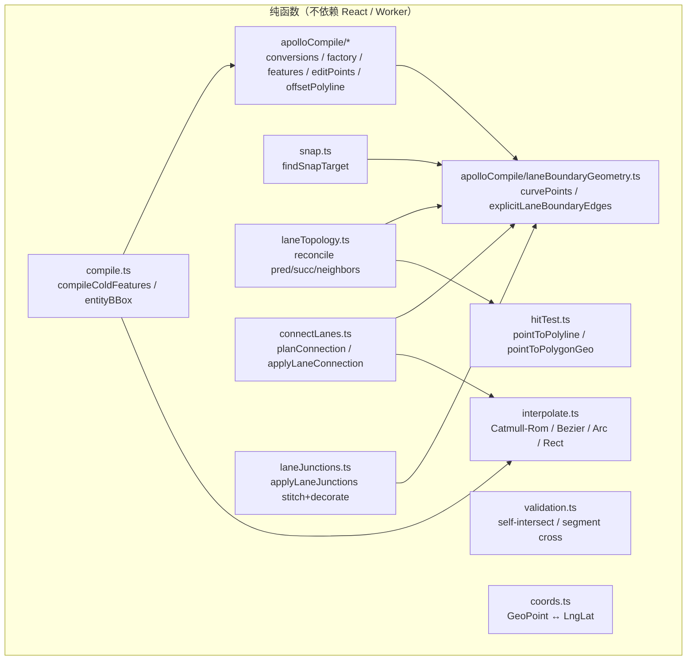

# 几何引擎（Geometry Engine）

`src/core/geometry/` 是 Apollo Map Studio 的**纯函数几何核心**，没有
任何 React / Zustand / MapLibre / Worker 依赖。所有"实体 → GeoJSON"
的编译、"两点 → 圆弧"的曲线生成、"端点 → lane 拓扑链接"的派生都在
这里完成。本页是该目录的导览。

## 一、模块拓扑

## 二、按职责分组

### 2.1 编译（Compile）

| 文件                                    | 公开 API                                                                                          | 用途                                                                 |
| --------------------------------------- | ------------------------------------------------------------------------------------------------- | -------------------------------------------------------------------- |
| `compile.ts`                            | `compileColdFeatures(entity)`、`entityBBox`、`entityCoords`、`entityRenderCoords`、`isAreaEntity` | 实体 → 冷层 feature 数组（被 worker 调用）                           |
| `apolloCompile.ts`                      | barrel export，列出 `compileApolloFeatures` 等                                                    | 集中暴露 apolloCompile 子目录的公开符号                              |
| `apolloCompile/conversions.ts`          | `pointsToCurve`、`pointsToPolygon`                                                                | 在 GeoPoint 数组与 Apollo `Curve` / `Polygon` 之间互转               |
| `apolloCompile/factory.ts`              | `createApolloEntity`、`inferLaneTurn`                                                             | 根据 drawTool + 参数实例化 LaneEntity / SignalEntity 等              |
| `apolloCompile/features.ts`             | `compileApolloFeatures`                                                                           | Apollo 实体 → 冷层 features（lane 中心线、边界、箭头、label）        |
| `apolloCompile/laneBoundaryGeometry.ts` | `curvePoints`、`explicitLaneBoundaryEdges`                                                        | 把 Apollo `LaneBoundary.curve` 解算成 GeoPoint[]；判断是否有显式边界 |
| `apolloCompile/offsetPolyline.ts`       | `offsetPolylineDeg`                                                                               | 中心线偏移（带 miter/bevel 处理）以推断车道宽                        |
| `apolloCompile/editPoints.ts`           | `getApolloEditPoints`、`setApolloEditPoint`、`moveApolloEntity`、`deleteApolloVertex`             | 把每个 Apollo 实体类型的"可拖拽点"集中收口                           |
| `apolloCompile/projection.ts`           | （内部）笛卡尔/球面投影辅助                                                                       | 给 signal 朝向算法用                                                 |
| `apolloCompile/signalHeading.ts`        | `computeSignalHeading`                                                                            | 由 boundary 平面 × 停止线推断 signal icon 朝向                       |
| `apolloCompile/signalTemplate.ts`       | （signal 几何模板）                                                                               | 渲染 mix-2/3 horizontal/vertical 灯组                                |

### 2.2 曲线 / 几何插值（Interpolate）

`interpolate.ts` 共 364 行；纯算法：

- `catmullRom(points, segments=32, alpha=0.5)` —— 穿过所有控制点的
  样条；`alpha` 决定 uniform/centripetal/chordal。
- `cubicBezier(anchors, segments=48)` —— 多段三次贝塞尔；锚点带
  `handleIn/handleOut`。
- `threePointArc(p1, p2, p3, segments=64)` —— 三点圆弧；共线时
  fallback 折线。投影到 cosLat 修正空间避免高纬变形。
- `rectCorners(p1, p2, rotation)` / `rotatedRectFromPoints(a,b,c)` /
  `rectRotateHandle` —— 可旋转矩形几何。
- `mirrorPoint(pivot, pt)` —— 锚点镜像（贝塞尔 break/smooth 切换用）。

不做：自交检测（在 `validation.ts`）、曲线长度（在 `lib/geo.ts`
haversine）、命中（在 `hitTest.ts`）。

### 2.3 验证（Validation）

`validation.ts` 仅 58 行：

- `segmentsIntersect(a1, a2, b1, b2)` —— 严格相交（不含端点重合）
- `wouldSelfIntersect(points, newPt)` —— 加入新点是否自交
- `polygonSelfIntersects(points)` —— 闭合多边形是否自交

被 FSM 的 `MOUSE_DOWN` guard 调用，避免用户在贝塞尔/折线模式下画出
"折回交叉"的非法几何。

### 2.4 命中（Hit Test）

`hitTest.ts` 提供两套 API：

- 纯欧氏度空间（legacy）：`pointToPolylineDist` / `pointToPolygonDist`
- **纬度补偿版（推荐）**：`pointToPolylineDistGeo` / `pointToPolygonDistGeo`

后者把 Δlat 乘 1/cosLat 转到等效 lng 度空间，与 `pixelToRadius`（lng
度数）的量纲一致。worker `hitTest` 用这一套（见
[Spatial Index](./spatial-index.md)）。

### 2.5 吸附（Snap）

`snap.ts:309` 的 `findSnapTarget(point, entities, radiusMeters, excludeId)`
是公开入口：

- 收集候选：lane 端点（带 `endpointRole`）、polygon 顶点、其它实体
  顶点 + 边段。
- 投影到 ENU 米空间，按欧氏平方距离查找最近候选。
- **顶点优先**：vertex 命中 > edge 命中（同距离时）。
- lane 只取首/末顶点 —— 避免吸到中间生成"看起来连通但不在拓扑里"的
  幽灵连接（详见 `pushLaneEndpointVertices`）。

详细行为见 [Map Event Router](./map-event-router.md) 的 snap 节。

### 2.6 拓扑（Topology）

`laneTopology.ts:1-665` 是 reconcile lane 的 pred/succ/neighbors 的
纯函数。颗粒度：

| 字段                        | 派生规则                                                |
| --------------------------- | ------------------------------------------------------- |
| `predecessorIds`            | 端点 1cm 精度共享（`toFixed(6)`）                       |
| `successorIds`              | 同上（互为反向）                                        |
| `selfReverseIds`            | A 的 reverse twin：B.start ≈ A.end ∧ B.end ≈ A.start    |
| `junctionId`                | 中心线与 junction.polygon 几何相交                      |
| `leftNeighborForwardIds` 等 | 横向距离 ∈ [1, 6]m，方向 dot ≥ 0.95，纵向投影重叠 ≥ 50% |

输入是 `(entities, dirtyIds)` —— 增量模式下走 dirty 闭包；输出是
"最小 diff"（`Map<laneId, updated lane>`），由 store 一次性 apply。

### 2.7 Lane connect

`connectLanes.ts`：

- `planConnection(a, b)` —— 4 种端点对组合中找最小距离的，返回
  `ConnectionPlan`（`mode` / `indexToMove` / `target`）。
- `applyLaneConnection(lane, plan)` —— 把对应端点平移到 target；
  根据 `_source.drawTool` 分支处理：
  - 贝塞尔：移动锚点 + 控制柄，重采样。
  - 圆弧：替换 arcPoints 中的端点，重采样。
  - 折线：直接覆写 `centralCurve`。
    最后跑 `applyDerive(editGeometry)` 闭环 length / turn 等派生字段。

被 connectMode（map event router 中的 connectMode 处理器）调用。

### 2.8 Lane junctions（端点拼接）

`laneJunctions.ts:150-165` 的 `applyLaneJunctions(features, entities,
excludeId, decorateOnly)` 是 worker 调用的入口：

1. `buildLaneFeatureMap(features)` —— 在 GeoJSON 数组里找出每条 lane
   对应的 left / right / polygon feature。
2. `collectLaneEndpoints` —— 提取所有 lane 的端点 + 局部宽度。
3. `findEndpointJunctions` —— 1cm 精度归并到端点 key，找出唯一一对的
   "继续" junctions（start-start fork / end-end merge 不算）。
4. `stitchLaneJunctions` —— 算出 left/right miter join，把 boundary
   端点拉到共享点，同步 polygon。
5. `decorateLaneBoundaries` —— 仅对 `decorateOnly`（incremental 时是
   affected lane 集合）跑 `decorateBoundary`，输出虚线/实线/双黄等
   装饰 features。

详见 [Junction Stitching](./junction-stitching.md)。

## 三、Public surface 一览

| 入口                                                           | 文件                        | 调用方                                  |
| -------------------------------------------------------------- | --------------------------- | --------------------------------------- |
| `compileColdFeatures`                                          | `compile.ts`                | spatial worker                          |
| `compileApolloFeatures`                                        | `apolloCompile/features.ts` | `compile.ts`（dispatch）                |
| `entityRenderCoords`                                           | `compile.ts`                | hit test、reconcile                     |
| `findSnapTarget`                                               | `snap.ts`                   | `mapEventRouter/snap.ts`                |
| `pointToPolylineDistGeo` / `pointToPolygonDistGeo`             | `hitTest.ts`                | `spatialHitTest.ts`                     |
| `applyLaneJunctions`                                           | `laneJunctions.ts`          | worker `buildFeatureCollection`         |
| `planConnection` / `applyLaneConnection`                       | `connectLanes.ts`           | `mapEventRouter/connectMode.ts`         |
| `reconcileLaneTopology`                                        | `laneTopology.ts`           | mapStore（addEntity / updateEntity 后） |
| `catmullRom` / `cubicBezier` / `threePointArc` / `rectCorners` | `interpolate.ts`            | overlay 渲染 + 实体编译                 |
| `wouldSelfIntersect` / `polygonSelfIntersects`                 | `validation.ts`             | FSM guards                              |

## 四、内部算法亮点

### 4.1 Cosine-lat 修正

所有"米空间"计算（snap / hit / connect / topology）都先经
`cosLat = cos(lat)` 把 Δlng 缩放到等效米空间（或反之把 Δlat 放大到
lng 空间）。常量 `DEG_TO_M = 111320` 是 WGS84 在赤道附近的近似。

### 4.2 端点 1cm 精度

junction stitching、lane topology、laneJunctionGraph 三处都用
`toFixed(6)` 作为端点 hash key —— 6 位小数 ≈ 1cm 量级，对编辑器场景
足够（远小于车道宽度），避免浮点抖动导致的"差一点点没接上"。

### 4.3 圆弧外接圆

`circumcenter(p1, p2, p3)` 是经典外接圆公式：
$D = 2(a_x(b_y-c_y) + b_x(c_y-a_y) + c_x(a_y-b_y))$，
共线（|D| < 1e-12）返回 null fallback 折线。

### 4.4 矩形局部坐标

`rotatedRectFromPoints(a, b, c)`：把第三点 c 投影到主轴 (a,b) 的法线
方向得到半宽，最后 `rotation = -atan2(dy, dx)`。负号是为了让"视觉
顺时针"为正方向。

## 五、Pitfalls

1. **不要在 geometry 层引用 store**：违反就再没法在 worker 里跑。
2. **lane 必须是端点 snap，不要让中间顶点参与 reconcile**：见
   `snap.ts:138-148` 的注释。
3. **`apolloCompile` barrel**：UI 不要绕过 `@/lib/entityOps` 直接进
   `@/core/geometry/apolloCompile`，那会破坏 R2 反腐层。
4. **interpolate.threePointArc 共线 fallback**：返回 `[p1, p2, p3]`
   不是 `[p1, p3]`，调用方需要预知。

## 六、Source map

| 概念               | 文件                                                      | 行    |
| ------------------ | --------------------------------------------------------- | ----- |
| 实体冷编译         | `src/core/geometry/compile.ts`                            | 1-159 |
| Apollo 编译 facade | `src/core/geometry/apolloCompile.ts`                      | 1-20  |
| Apollo 实体工厂    | `src/core/geometry/apolloCompile/factory.ts`              | —     |
| Lane 边界几何      | `src/core/geometry/apolloCompile/laneBoundaryGeometry.ts` | —     |
| 偏移折线           | `src/core/geometry/apolloCompile/offsetPolyline.ts`       | —     |
| 编辑点             | `src/core/geometry/apolloCompile/editPoints.ts`           | —     |
| 曲线插值           | `src/core/geometry/interpolate.ts`                        | 1-364 |
| 自交校验           | `src/core/geometry/validation.ts`                         | 1-58  |
| 距离               | `src/core/geometry/hitTest.ts`                            | 1-143 |
| 吸附               | `src/core/geometry/snap.ts`                               | 1-368 |
| 拓扑 reconcile     | `src/core/geometry/laneTopology.ts`                       | 1-665 |
| Lane 连接          | `src/core/geometry/connectLanes.ts`                       | 1-204 |
| Junction stitch    | `src/core/geometry/laneJunctions.ts`                      | 1-165 |
| stitch 内部        | `src/core/geometry/laneJunctions/internal.ts`             | 1-... |

## 七、测试要点

geometry 层的测试集中在 `src/core/geometry/__tests__/`：

| 测试                    | 覆盖                                               |
| ----------------------- | -------------------------------------------------- |
| `apolloCompile.test.ts` | 实体 → features 编译；signal 朝向                  |
| `connectLanes.test.ts`  | 4 种端点配对；贝塞尔 / 圆弧 / 折线分支             |
| `interpolate.test.ts`   | Catmull-Rom 双倍点；Bezier 单段；arc 共线 fallback |
| `laneJunctions.test.ts` | continuous junction stitch；fork/merge 跳过        |
| `laneTopology.test.ts`  | pred/succ 1cm 量化；neighbor 阈值                  |
| `snap.test.ts`          | vertex > edge；lane endpoints-only；excludeId      |

约定：纯函数测试，不依赖 store / worker；测试 fixture 用真实小型
Apollo 地图（`map_data/garage` 子集）保证回归 coverage。

## 八、历史

- **2026-01**：拆出独立 `apolloCompile/` 子目录，把 760 行的单文件
  `apolloCompile.ts` 切成 9 个 < 200 行的模块。
- **2026-03**：把 `validation.ts` 从 `interpolate.ts` 拆出来；
  `interpolate` 不再做自交检测（FSM guard 的事）。
- **2026-04 Phase E**：`laneJunctions.ts` 增加 `decorateOnly` 参数
  支持增量装饰。
- **2026-04**：`hitTest.ts` 加纬度补偿版（pointToPolylineDistGeo），
  legacy 欧氏版本仅留单测兼容。

## 九、FAQ

**Q: 为什么 lane snap 只取首末，不取中间顶点？**

A: lane 是有方向的线段，topology 只在端点上有意义。如果 mid-snap，
用户会看到几何上"贴住了"但 reconcile 不写 pred/succ，产生"看起来连
通但不在拓扑里"的幽灵。详见 `snap.ts:138-148`。

**Q: 为什么 `inferLaneTurn` 在 factory 而不是 derive？**

A: 历史包袱。`inferLaneTurn` 是纯函数，被 derive 规则消费。把它放
factory 是因为它最早是 factory 的 helper；现在两个地方都调用。

**Q: 圆弧三点共线时返回什么？**

A: `[p1, p2, p3]`（三点折线），不是 `[p1, p3]`。原因：保留 p2 的
位置让 inspector 能展示中间点，否则 user "看到的"圆弧消失了一个点。

## 十、调试技巧

- **`compileColdFeatures` 输出空**：通常是 `entityRenderCoords` 拿
  不到坐标；对 Apollo 实体而言，检查 `apolloEntityCoords` 的 entity
  type 分支是否完整。
- **lane stitch 后边界混乱**：在 `decorateBoundary` 里 dump
  boundary feature 的 LineString 坐标，对照 lane.leftBoundary.curve
  的原始点序。
- **bezier 弯曲方向反了**：检查 `_source.anchors[i].handleOut` 的
  方向；对 smooth anchor 应等于 `handleIn` 的镜像。

## 十一、可视化辅助：典型几何

| 场景                          | 模块                                                                | 算法                        |
| ----------------------------- | ------------------------------------------------------------------- | --------------------------- |
| 用户画 lane（折线工具）       | `compileColdFeatures` → `compileApolloFeatures`                     | `pointsToCurve`             |
| 用户画曲线 lane（贝塞尔工具） | 同上 + `_source.anchors`                                            | `cubicBezier` 重采样        |
| 用户拖 lane vertex            | `applyDrag` → `apolloCompile/editPoints.ts` → `compileColdFeatures` | 索引重写 + 重新派生         |
| Lane 端点拼接                 | `applyLaneJunctions`                                                | miter join                  |
| Lane × junction overlap       | overlap pipeline `detectPair` polygon                               | `polylineIntersectsPolygon` |
| Lane × signal overlap         | overlap pipeline `detectPair` stopLines                             | `polylinesIntersect`        |
| Lane reconcile pred/succ      | `reconcileLaneTopology`                                             | 端点 1cm 共享               |

## 十二、术语对照

| 中文     | 英文            | 释义                                              |
| -------- | --------------- | ------------------------------------------------- |
| 中心线   | centerline      | lane 的中央曲线，topology / overlap 的几何主线    |
| 边界     | boundary        | lane 左右边线（`leftBoundary` / `rightBoundary`） |
| 端点     | endpoint        | 中心线的首末点                                    |
| 弧长     | arc length      | 折线累计长度（米）                                |
| 偏移折线 | offset polyline | 沿法线方向偏移给定距离生成的新折线                |
| 拼接     | stitching       | 把两条 lane 的边界端点拉到共享 miter join         |
| 装饰     | decoration      | 边界的虚线 / 双黄等附加可视化                     |

## 十三、See also

- [Rendering Pipeline](./rendering-pipeline.md)
- [Junction Stitching](./junction-stitching.md)
- [Junction Graph](./junction-graph.md)
- [Spatial Index](./spatial-index.md)
- [Coordinate System](./coordinate-system.md)
- [Map Event Router](./map-event-router.md)
- [Derive Engine](./derive-engine.md)
- [Overlap Derivation](./overlap-derivation.md)
