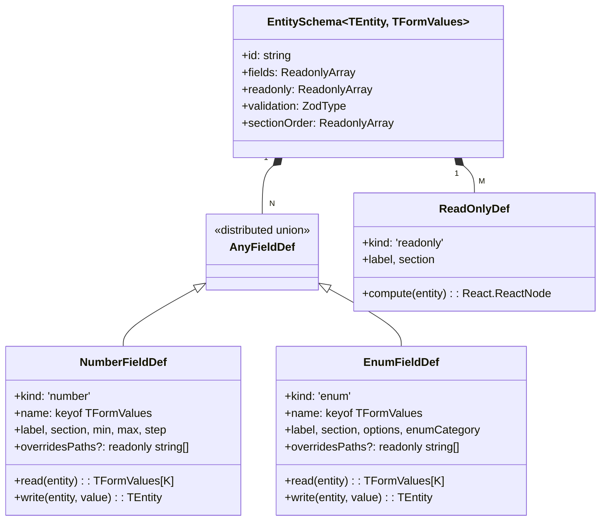

# 检查器 Schema (Inspector Schema)

> 文件位置：`src/types/inspectorSchema.ts`
> 关键 fixture：`LaneInspectorSchema`（同文件内）
> 历史背景：Schema 化重构前每个 entity 类型都对应一个独立的 React 表单文件，
> 加一个字段要碰 5 处 JSX；本模块把"渲染"与"语义"切分。

## 1. 为什么需要 Schema

在 schema 化之前，`InspectorForms.tsx` 为每种 entity 写死一个独立的 React
组件，新增一个字段（例如 `Lane.speedLimit`）需要：

1. 改 `LaneEntity` 类型；
2. 改 `laneSchema` (zod) 校验；
3. 改 `LaneForm` 的 JSX；
4. 改 `LaneForm` 的 `useEffect` 监听；
5. 改 `LaneForm` 的 watch 写回逻辑。

而真正变化的只有第 1 / 2 / 5 步是"语义"，第 3 / 4 步是"渲染样板"。
Inspector Schema 把样板抽到 `SchemaForm`，让"加字段"退化为"加一行
`F.field({...})`"。

## 2. 类型层次结构



## 3. 关键设计决策

### 3.1 Adapter 模式而非字段路径

天真的 schema 库会假设 `entity[fieldName] = value`。`LaneEntity` 不行 ——
"left width" 实际上是把同一个值写到 `leftSamples[*].width` 的每个采样点；
"left boundary type" 是写到 `leftBoundary.boundaryType[0].types[0]`。

因此每个 `FieldDef` 自带 `read` / `write` adapter：

```ts
// src/types/inspectorSchema.ts:209-247
function applySampleWidth(
  samples: readonly LaneSampleAssociation[],
  width: number,
  totalLength: number,
): LaneSampleAssociation[] {
  if (samples.length === 0) {
    return [
      { s: 0, width },
      { s: Math.max(0, totalLength), width },
    ];
  }
  return samples.map((sample) => ({ s: sample.s, width }));
}

const writeLeftWidth = (e, w) => ({ ...e, leftSamples: applySampleWidth(...) });
```

`read` 是 `(entity) => formValue`；`write` 是 `(entity, formValue) => entity`。
两者必须互为逆 —— `read(write(e, v)) === v`。

### 3.2 双泛型：TEntity + TFormValues

`EntitySchema<TEntity, TFormValues>` 同时绑定领域实体和 zod 推导出的表单值
类型，`FieldDef` 的 `name` 受约束为 `keyof TFormValues`，编译期就能抓出
拼写错误。

### 3.3 Distributed FieldDef 联合

```ts
// src/types/inspectorSchema.ts:124-126
export type AnyFieldDef<TEntity, TFormValues> = {
  [K in keyof TFormValues]-?: FieldDef<TEntity, TFormValues, K>;
}[keyof TFormValues];
```

普通的数组字面量会让 `read` 的返回类型坍缩为字段值的并集，丢掉每字段的
窄类型。distributed mapped type 让数组在迭代时仍能保持每元素的精度。

### 3.4 Curried 字段构造器

```ts
// src/types/inspectorSchema.ts:187-200
export function fieldBuilder<TEntity, TFormValues>() {
  return {
    field<TKey extends keyof TFormValues>(
      def: FieldDef<TEntity, TFormValues, TKey>,
    ): FieldDef<TEntity, TFormValues, TKey> {
      return def;
    },
  };
}
```

调用：

```ts
const LaneField = fieldBuilder<LaneEntity, LaneFormValues>();
LaneField.field({ kind: 'number', name: 'speedLimit', read, write, ... });
```

理由：天真的 `defineField<TEntity, TFormValues>(...)` 会强迫调用方再传一次
`TKey`（TS 不能从单个参数推三个泛型）。先固定 entity / form 类型，再让
`.field({...})` 从字面量推 `TKey` —— 类型完整，写法干净。

## 4. `LaneInspectorSchema` 详解

`src/types/inspectorSchema.ts:263-435` 是当前唯一的"完整 schema"实例。

### 4.1 sectionOrder

```ts
sectionOrder: ['Attributes', 'Boundaries', 'Topology'],
```

`SchemaForm` 按此顺序渲染 section；同 section 内编辑字段在前、只读行在后。

### 4.2 八个可编辑字段

| name              | kind   | section    | range          | 派生                                   |
| ----------------- | ------ | ---------- | -------------- | -------------------------------------- |
| type              | enum   | Attributes | laneType       | —                                      |
| turn              | enum   | Attributes | laneTurn       | —                                      |
| direction         | enum   | Attributes | laneDirection  | —                                      |
| speedLimit        | number | Attributes | 0..50, step .5 | —                                      |
| leftWidth         | number | Boundaries | 0.5..10        | 写入到 `leftSamples[*].width` 全部采样 |
| rightWidth        | number | Boundaries | 0.5..10        | 同上 right                             |
| leftBoundaryType  | enum   | Boundaries | boundaryType   | 写入 `leftBoundary.boundaryType[0]`    |
| rightBoundaryType | enum   | Boundaries | boundaryType   | 同上 right                             |

### 4.3 readonly 行

13 条 readonly：ID、Length、L/R Virtual、Junction、Predecessors、Successors、
4 类邻居、Self-Reverse、Overlaps。其中拓扑 ID 字段统一通过
`createElement(LaneRef, { id })` 或 `createElement(LaneRefList, { ids })`
渲染成可点击 chip ——
`src/components/layout/panels/LaneRefList.tsx` 是入口。

## 5. Lane 引用渲染（Lane refs）

```ts
{
  kind: 'readonly',
  label: 'Predecessors',
  section: 'Topology',
  compute: (e) => createElement(LaneRefList, { ids: e.predecessorIds }),
},
```

`LaneRef` 单个 chip：点击后 `useUIStore.setState({ selectedIds: new Set([id]) })`，
进而触发 `Inspector` 重新渲染目标 lane。`LaneRefList` 处理空列表与"未引用"
fallback；既能显示 `lane_xxx`，也能高亮当前 hover。

## 6. Overlap pinning

Overlap 是"两个对象的关联"，schema 不适合渲染（每行需要对象类型、对象 ID、
lane 语义 pin 等组合控件），所以 `OverlapForm` 走
`InspectorForms/overlap.tsx` 的手写路径，override 纯函数放在
`InspectorForms/overlapOverrides.ts`。Schema 模型仍然适用 —— 后续可以加一个
`kind: 'objectPair'` 的扩展，但目前保持手写避免过度抽象。

## 7. 公共算子（Schema-generic helpers）

| 函数                      | 入参                         | 出参                | 用途                                      |
| ------------------------- | ---------------------------- | ------------------- | ----------------------------------------- |
| `formValuesFromEntity`    | (schema, entity)             | TFormValues         | 把 entity 投影到 form values（read 全跑） |
| `diffFormAgainstEntity`   | (schema, current, entity)    | Array<[key, value]> | 同 id 漂移检测                            |
| `shouldPersistForm`       | (schema, formValues, entity) | boolean             | watch dedupe gate                         |
| `applyFormValuesToEntity` | (schema, entity, values)     | TEntity             | 写回 + 自动覆盖标记                       |

签名见 `src/types/inspectorSchema.ts:444-540`。

## 8. 校验：zod 与 `mode: 'onChange'`

```ts
validation: laneSchema,   // ZodType<LaneFormValues, LaneFormValues>
```

`SchemaForm` 把它喂给 `zodResolverZ4` → `useForm({ resolver, mode: 'onChange' })`。
表单 `onChange` 时校验全字段，`formState.errors` 实时更新；`watch` 不会等
"isValid"，因为最终 gate 由 `shouldPersistForm` 把控（diff 为空就不写）。

## 9. 覆盖标记与 derive 协同

`overridesPaths` 默认 `[name]`：写 `speedLimit` 就 markUserOverride('speedLimit')。
对于 Lane width 这类"一个 form 字段触发多个内部字段写入"的场景，可以指定：

```ts
LaneField.field({
  kind: 'number',
  name: 'leftWidth',
  ...
  overridesPaths: ['leftSamples'],   // 阻止 derive 重新派生 leftSamples
}),
```

如果不指定，下次几何编辑时 `markUserOverride('leftWidth')` 会失败匹配
（实际派生路径是 `leftSamples`），用户输入会被自动派生覆盖。

## 10. Public API 表

| 符号                       | 文件:行                            |
| -------------------------- | ---------------------------------- |
| `EntitySchema`             | `src/types/inspectorSchema.ts:154` |
| `FieldDef` / `AnyFieldDef` | `inspectorSchema.ts:111, 124`      |
| `NumberFieldDef`           | `inspectorSchema.ts:63`            |
| `EnumFieldDef`             | `inspectorSchema.ts:89`            |
| `ReadOnlyDef`              | `inspectorSchema.ts:133`           |
| `fieldBuilder`             | `inspectorSchema.ts:187`           |
| `LaneInspectorSchema`      | `inspectorSchema.ts:263`           |
| `formValuesFromEntity`     | `inspectorSchema.ts:444`           |
| `diffFormAgainstEntity`    | `inspectorSchema.ts:464`           |
| `shouldPersistForm`        | `inspectorSchema.ts:484`           |
| `applyFormValuesToEntity`  | `inspectorSchema.ts:507`           |

## 11. 性能与体积

- Schema 是常量 —— 模块加载即冻结，运行时无分配。
- `formValuesFromEntity` 与 `applyFormValuesToEntity` 复杂度为 O(F)，F = 字段数；
  Lane 当前 8 个字段，相比一次几何重算可忽略。
- `groupBySections` 在 `SchemaForm` 内部已被 `useMemo` 缓存。
- ReadOnly compute 函数会在每次 entity 引用变化时重跑；它们应当是纯函数
  且 < 0.1ms（实际上只是读 `entity.predecessorIds.length` 之类）。

## 12. 安全与正确性

1. `applyFormValuesToEntity` **不会**对未列出的字段做任何事 —— 写入仅限
   `schema.fields`。把 `_userOverrides` 之外的内部字段保留给 derive 引擎。
2. `read`/`write` 必须是纯函数 —— React effect 重入时复用结果。
3. `compute` 不应触发 store mutation —— 它在 render 中执行。
4. 校验失败时 watch 仍会调用，但 `shouldPersistForm` 会在 diff 计算阶段
   屏蔽显式无效的字段（zod 的 transform 会抛错前先 reject）。

## 13. 陷阱

1. **read / write 不互逆**会让 cherry-pick effect 死循环：每次 setValue
   都被 store 投影回不同的值，watch 又写回去。
2. **enum options 的 const 数组**：必须 `as const` 或导出
   `readonly string[]`，否则 `EnumFieldDef.options` 接受不了。
3. **`overridesPaths` 漏写**：用户改了 `leftWidth` 但 derive 仍按几何
   重算 `leftSamples`，导致输入"反弹"。
4. **`sectionOrder` 漏列 section**：会被排到末尾。
5. **大表单切换 entity** 时 cherry-pick effect 触发 N 次 setValue —
   单实体单 effect 已最小化，必要时再加 `useTransition`。

## 14. 测试

- `InspectorForms.test.ts` 覆盖 `formValuesFromEntity` /
  `diffFormAgainstEntity` / `shouldPersistForm` / `applyFormValuesToEntity`
  的纯函数行为。
- 当未来加入新 schema（例如 SignalSchema）时，应在测试中：
  1. 验证 `formValuesFromEntity(schema, sample)` 与 zod schema 等价；
  2. 验证 `applyFormValuesToEntity(schema, e, v).then(read)` ≡ v；
  3. 验证 `shouldPersistForm` 在 v 来自 entity 投影时返回 false。

## 15. 源码地图

```
src/types/inspectorSchema.ts        ← 此文档主体
src/lib/schemas.ts                  ← zod schemas 与 options
src/lib/enumLabels.ts               ← getEnumLabel 显示翻译
src/components/layout/panels/SchemaForm.tsx
src/components/layout/panels/LaneRefList.tsx
src/components/layout/panels/InspectorForms/lane.tsx
src/core/elements/derive.ts         ← markUserOverride
src/components/layout/panels/__tests__/InspectorForms.test.ts
```

## 16. 未来扩展点

下面五个变体在我们规划中但尚未实现 —— 引入新的 `kind` 时务必同时增加
最少一个 `LaneInspectorSchema`-级别的真实使用案例和测试：

1. **`kind: 'boolean'`** —— 渲染为 `<input type="checkbox">`，
   `read/write` 适配 `boolean` 字段；用于 lane.virtual 等。
2. **`kind: 'point'`** —— 经纬度 + 海拔 3 字段联动，写回 PointENU。
3. **`kind: 'objectPair'`** —— Overlap 专用，单元素是
   `{ objectType, refId }` 二元组。
4. **嵌套 schema** —— `EntitySchema` 引用 `EntitySchema`，让 PNCJunction
   的 passages 可以复用 lane-style 渲染。
5. **`condition`** —— 字段在 `entity.type === 'X'` 时才渲染；现在依靠
   零碎的 readonly 行 hack。

每条扩展都要对应回答：a) 是否真的需要泛化 b) 测试如何证明它不退化已通过的
案例 c) 是否值得让 SchemaForm 处理新的渲染分支。

## 17. See also

- [Inspector System](./inspector-system.md) —— 上层分派与同步策略
- [Anti-corruption Layer](./anti-corruption-layer.md)
- [State Management](./state-management.md) —— `_userOverrides` 与 zundo 协作
- [Testing Strategy](./testing-strategy.md)
