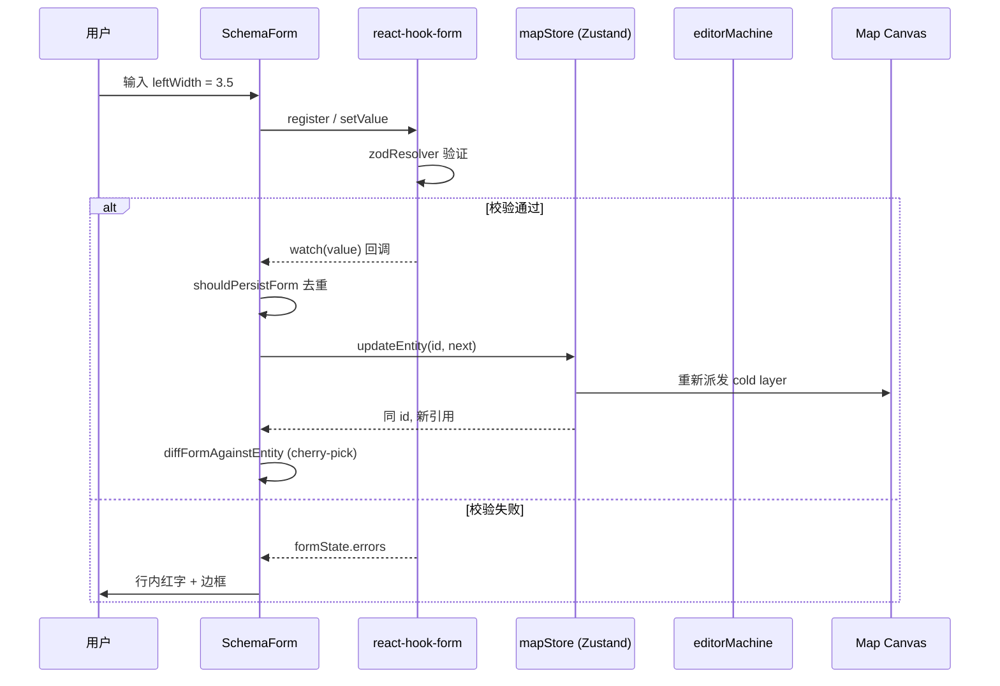

# 检查器系统 (Inspector System)

> 适用范围：Apollo Map Studio v1 / 2026-04 之后版本
> 关键风险闭合：R1 (`onChange` 校验门 + same-id 同步)、R2 (entityOps 反腐层)

## 1. 目的与定位

检查器（Inspector）是右侧 Dockview 面板的核心，负责把当前选中的 `MapEntity`
转译为可读、可编辑的属性界面。它必须满足三条硬性约束：

1. **类型完备性**：覆盖 17 种 entity 类型（lane / junction / parkingSpace /
   signal / stopSign / road / pncJunction / overlap / area / barrierGate /
   crosswalk / speedBump / yieldSign / clearArea / rsu，外加 6 种 drawing
   元素），每种都要有"比通用 DrawingForm 更结构化"的视图。
2. **双向同步无死循环**：用户键入 → store；store 因 undo / 画布拖拽变化
   → 表单。任何一侧重复回写都不能触发 watch → updateEntity → reset → watch
   的递归。
3. **校验实时反馈**：`mode: 'onChange'` 是不可让步的契约。它保证
   `formState.isValid` 与最新一次按键同步，R1 回归测试钉死了这条。

## 2. 数据流总览



## 3. 入口分派 —— `InspectorForms.tsx`

`src/components/layout/panels/InspectorForms.tsx:45-80` 是唯一的类型分派开关，
单纯的 `switch (entity.entityType)`：

```ts
switch (entity.entityType) {
  case 'lane':         return <LaneForm entity={entity as LaneEntity} />;
  case 'junction':     return <JunctionForm entity={entity as JunctionEntity} />;
  case 'parkingSpace': return <ParkingSpaceForm entity={entity as ...} />;
  // ... 14 个分支
  default:             return <DrawingForm entity={entity} />;
}
```

设计意图：

- **零运行时反射**：编译期 TypeScript 用 discriminated union 检查穷尽性。新增
  entityType 但漏掉一个分支会触发 `default` 兜底，不会无声崩溃。
- **窄类型 cast**：`entity as LaneEntity` 是已知安全的，因为它在
  `case 'lane'` 分支内部。
- **Drawing 兜底**：未与 Apollo 协议对齐的自由几何（polyline / bezier 等）
  统一走 `DrawingForm`，仅展示顶点数 / 长度等通用字段。

## 4. 三种渲染策略

| 策略        | 代表实体                              | 入口                                 |
| ----------- | ------------------------------------- | ------------------------------------ |
| Schema 驱动 | `LaneEntity`                          | `SchemaForm` + `LaneInspectorSchema` |
| 手写表单    | `Junction`/`Signal`/`StopSign`/`Road` | `simpleForms.tsx` 中的命名组件       |
| 只读摘要    | `Crosswalk`/`SpeedBump`/`RSU`/...     | `simpleForms.tsx` 末尾的纯展示组件   |

### 4.1 Schema 驱动 —— Lane

`LaneForm` 只是一个 thin wrapper，把 `LaneInspectorSchema` 喂给 `SchemaForm`：

```tsx
// src/components/layout/panels/InspectorForms/lane.tsx:32
export function LaneForm({ entity }: { entity: LaneEntity }) {
  return <SchemaForm schema={LaneInspectorSchema} entity={entity} />;
}
```

详细的字段 / read / write / overridesPaths 模型见
[Inspector Schema](./inspector-schema.md)。

### 4.2 手写表单 —— Junction / Signal

为什么不全部 schema 化？因为信号灯子灯泡（`subsignals`）、信号标志位
（`signInfo` 多选）这类形态强依赖 React 组件，硬塞进 schema 会让
`FieldDef` 联合类型膨胀到 7 种。`simpleForms.tsx:184` 的 `SignalForm`
就保留了原生 JSX：

- `useForm<SignalFormValues>` + `mode: 'onChange'`
- `methods.watch(value => ...)` 订阅一次，`entityRef` 永远引用最新实体
- 类型变更触发 `regenerateSignalGeometry` 联动重生几何

### 4.3 只读摘要

`Crosswalk` / `SpeedBump` / `YieldSign` / `ClearArea` / `RSU` 在 proto 层
仅暴露 id + 几何 + 外键。几何由画布编辑、外键由拓扑 reconciler 计算 ——
检查器面板不应该是这些字段的所有权点，所以只展示 vertices / overlapIds
等只读摘要（`simpleForms.tsx:544`+）。

## 5. 双向同步的 R1 闭合

R1 规格写在 `SchemaForm.tsx:18-23`：

> **Behavior contract**: this component MUST preserve the validation gate
> fix from commit 6a83d9d — `mode: 'onChange'` is the gate that makes
> `formState.isValid` reflect the live keystroke status, which the Lane
> regression test pins.

三段防御：

1. **`mode: 'onChange'`** —— 不能改成 `onSubmit`。`onSubmit` 模式下
   `formState.isValid` 在用户按键时停留在 false，watch 持久化逻辑被旧版
   gate 阻断（已废弃但不能复活）。
2. **id swap reset** —— `useEffect(..., [entity.id])` 仅在切换实体时
   `methods.reset()`，避免 same-id 引用变化时清空用户正在键入的字段。
3. **same-id cherry-pick** —— `useEffect(..., [entity])` 用
   `diffFormAgainstEntity` 计算每个字段的 store-side / form-side 偏差，
   只对偏差字段调 `setValue(..., { shouldDirty: false, ... })`。

第三条尤其关键：撤销 / 重做 / 拖拽控制柄时，store 会产出同 id 但内容不同
的 entity 引用，这条 effect 让面板"跟上"画布。

## 6. 持久化死循环的 `shouldPersistForm` gate

```ts
// src/components/layout/panels/SchemaForm.tsx:106-114
useEffect(() => {
  const subscription = methods.watch((value) => {
    const liveEntity = entityRef.current;
    if (!shouldPersistForm(schema, value as Partial<TFormValues>, liveEntity)) return;
    const next = applyFormValuesToEntity(schema, liveEntity, value as Partial<TFormValues>);
    updateEntity(liveEntity.id, next);
  });
  return () => subscription.unsubscribe();
}, [methods, updateEntity, schema]);
```

死循环的诱因是：

```
用户输入 → setValue → watch → updateEntity → store 新引用
       → cherry-pick effect → setValue → watch → updateEntity → ...
```

`shouldPersistForm` 通过 `diffFormAgainstEntity(...).length > 0` 短路：
当 form 值与 entity 投影一致时返回 false，watch 直接 return，循环终止。

`entityRef.current` 而不是 `entity` 是另一道保险 —— 闭包中始终读取最新
快照，避免老 entity 写穿。

## 7. 用户覆盖标记 (`_userOverrides`)

某些字段有衍生（derive）规则：例如 `length` 默认由 `centralCurve` 几何
积分得来；用户在面板里手填 `length` 后，下一次几何调整不应再覆盖手工值。

`applyFormValuesToEntity` 实现：

```ts
// src/types/inspectorSchema.ts:507-540
const prevValue = (field.read as (e: TEntity) => unknown)(next);
next = writer(next, v);
const newValue = (field.read as (e: TEntity) => unknown)(next);
if (prevValue !== newValue) {
  const paths = field.overridesPaths ?? [String(field.name)];
  for (const path of paths) {
    next = markUserOverride(next, path);
  }
}
```

只有"实际改变"才调 `markUserOverride`；redundant write（重新 seed 同值）
不会把自动派生值升级成 manual override。

## 8. Public API 摘要

| 符号                          | 文件 / 行号                              | 用途                          |
| ----------------------------- | ---------------------------------------- | ----------------------------- |
| `EntityForm`                  | `InspectorForms.tsx:45`                  | 顶层 switch 分派组件          |
| `LaneForm`                    | `InspectorForms/lane.tsx:32`             | Schema 驱动包装               |
| `SchemaForm`                  | `panels/SchemaForm.tsx:53`               | 通用 schema 渲染器            |
| `JunctionForm` / `SignalForm` | `InspectorForms/simpleForms.tsx:61, 184` | 手写实现                      |
| `OverlapForm`                 | `InspectorForms/overlap.tsx`             | 关联对象列表 + 类型选择       |
| `PNCJunctionForm`             | `InspectorForms/pncJunction.tsx`         | passage / 通行控制            |
| `DrawingForm`                 | `InspectorForms/DrawingForm.tsx`         | drawing 元素的最小展示        |
| `LaneRef` / `LaneRefList`     | `panels/LaneRefList.tsx`                 | 拓扑 ID 跳转 chip             |
| `zodResolverZ4`               | `InspectorForms/resolver.ts`             | zod v4 + react-hook-form 适配 |

## 9. 类型契约：discriminated union + zod

`MapEntity` 是 17 个 `entityType` literal 的 union；`InspectorForms.tsx`
的 switch 在 TypeScript 严格模式下满足穷尽。
`@/lib/schemas.ts` 输出每种 entity 的 zod schema，比如
`laneSchema: ZodType<LaneFormValues, LaneFormValues>`，
`zodResolverZ4` 把它变成 react-hook-form 认识的 resolver。

```ts
const methods = useForm<LaneFormValues>({
  resolver: zodResolverZ4<LaneFormValues>(laneSchema),
  mode: 'onChange',
  defaultValues: laneFormValuesFromEntity(entity),
});
```

## 10. 性能与可达性

- 任意时刻 Inspector 只渲染**一个**实体表单。多选时面板留空（保留位扩展点）。
- watch 订阅在每个 entity 切换时不重建（依赖列表是
  `[methods, updateEntity, schema]`），单个 form 生命周期内只挂一次。
- `groupBySections` 用 `useMemo([schema])` 缓存，避免每次 render 重排序。
- 所有键盘可达字段都通过 `<Input />` `<Select />` 组件实现 ARIA label
  和 `name` 关联。

## 11. 常见陷阱 (Pitfalls)

1. **不要在 watch 回调里直接 `methods.setValue`**：会形成内部信号循环。
   只能写 store。
2. **不要把 `mode` 改回 `'onSubmit'`** —— Lane 回归测试会失败。见
   `src/components/layout/panels/__tests__/InspectorForms.test.ts`。
3. **`entityRef.current` 不能省**。`entity` 闭包变量在 watch 订阅生命周期
   内是 stale 的，必须每次从 ref 读。
4. **Schema 化新 entity 时**记得在 `LaneInspectorSchema.sectionOrder`
   类似的位置声明 section 顺序，否则未列出的 section 会按声明顺序排在末尾，
   视觉上凌乱。
5. **`applyFormValuesToEntity` 是顺序敏感的**：写入按 `schema.fields`
   顺序左→右执行，每一步都基于上一步的结果。如果两个字段互相影响
   （例如 leftWidth 影响 length 推断），把"被依赖"的字段排在前。

## 12. 测试覆盖

| 测试                                                              | 验证                                                           |
| ----------------------------------------------------------------- | -------------------------------------------------------------- |
| `src/components/layout/panels/__tests__/InspectorForms.test.ts`   | Lane R1：`shouldPersistLaneForm` / `diffLaneFormAgainstEntity` |
| `src/components/layout/panels/__tests__/overlapInspector.test.ts` | Overlap 选择器 + objects 编辑                                  |
| `src/hooks/__tests__/undoCancel.test.ts`                          | FSM `CANCEL` 在 `temporal.undo()` 之前 —— 间接保护检查器同步   |
| `src/lib/__tests__/entityOps.test.ts`                             | entityOps 反腐层（R2）                                         |

## 13. 源码地图

```
src/
├── components/layout/panels/
│   ├── InspectorForms.tsx              ← 入口分派
│   ├── SchemaForm.tsx                  ← 通用 schema 渲染
│   ├── LaneRefList.tsx                 ← 拓扑 chip
│   └── InspectorForms/
│       ├── DrawingForm.tsx
│       ├── lane.tsx                    ← Schema-driven Lane
│       ├── overlap.tsx
│       ├── pncJunction.tsx
│       ├── resolver.ts
│       └── simpleForms.tsx             ← 手写 + 只读 forms
├── types/
│   ├── inspectorSchema.ts              ← FieldDef / EntitySchema / 公共算子
│   └── entities.ts                     ← MapEntity discriminated union
├── lib/
│   ├── schemas.ts                      ← zod schemas + options
│   └── enumLabels.ts                   ← 显示标签字典
└── core/elements/derive.ts             ← markUserOverride
```

## 14. 与 FSM 的协同

XState 5 的 `editorMachine` 在 Inspector 之外管理"是否处于绘制 / 编辑
点"等状态。Inspector 不订阅 FSM，但有两条隐性合约：

1. **CANCEL 优先**：撤销 / 重做派发前必须先 `actorRef.send({ type:
'CANCEL' })`，让 FSM 退出 mid-draw 子状态；否则 mapStore 回滚后
   FSM 的 `drawPoints` 仍残留，下一帧 schema → entity 投影会产生不一致。
   该合约由 `useActionDispatcher` 守卫，回归测试 `undoCancel.test.ts`
   钉死。
2. **画布选区驱动 entity ref**：`uiStore.selectedIds` 的变更会让
   `Inspector` 切换实体，Inspector 内部的两个 `useEffect` 自动响应。

## 15. 多语言（i18n）现状

按 user memory 记录，`i18next` 尚未引入。所有文案硬编码英文：
`Type` / `Length` / `Predecessors` 等。enum 显示走 `getEnumLabel`
（`src/lib/enumLabels.ts`），是未来 i18n 唯一的 hook —— 改这个函数
即可整体翻译 enum 选项；普通字段 label 暂时无翻译路径。

引入 i18n 的最小成本路径：

1. 在 `EntitySchema` 上加 `labelI18n?: string`，向后兼容已有 `label`。
2. SchemaForm 渲染时 `t(field.labelI18n ?? field.label)`。
3. ReadOnly 行同样支持 `i18nKey`。
4. 新增 `lib/i18n/` 暴露 `t()`，初期支持 zh-CN / en-US 两语言。
5. enum 类已有 `getEnumLabel(category, value, locale)` 路径，扩展第三参。

## 15.1 与 Action Registry 的解耦

Inspector 自己不"派发动作"——它的所有写入都通过 `mapStore.updateEntity`
直接走 store。但有几个例外性的"轻动作"：

- **跳转到引用实体**（点击 LaneRef chip）—— 直接 `useUIStore.setState`
  写 `selectedIds`，不经过 action registry。
- **重新生成几何**（SignalForm 的 Regenerate 按钮）—— 直接调几何函数
  `regenerateSignalGeometry`，不走 registry。

理由：这些都不是用户语义级别的"动作"（不需要快捷键、不出现在命令面板）。
未来若需要把它们暴露给键盘 / 命令面板，再考虑迁入 registry。

## 16. See also

- [Inspector Schema](./inspector-schema.md) —— 字段 / 验证 / lane refs / overlap pinning 详细规格
- [Anti-corruption Layer](./anti-corruption-layer.md) —— entityOps 与 Apollo proto 的隔离
- [State Management](./state-management.md) —— Zustand + zundo 撤销栈
- [FSM Design](./fsm-design.md) —— 编辑器状态机如何与表单交互
- [Testing Strategy](./testing-strategy.md) —— 检查器相关回归测试与 fixture
