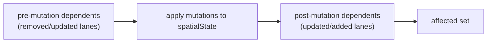

# Junction Graph

`src/core/workers/laneJunctionGraph.ts` is an in-worker dependency graph used
to compute the affected set during incremental cold-layer recomputation.

## Why It Exists

`applyLaneJunctions` (in `src/core/geometry/laneJunctions.ts`) decorates lane
boundaries by stitching shared endpoints across lanes. Decoration is the
dominant cost of `buildFeatureCollection` — roughly 3 ms per lane on a naïve
full rebuild. To make incremental edits below the 16 ms frame budget, the
worker caches decoration features per lane and only re-decorates lanes whose
endpoint geometry could have been altered by the current edit.

The question that drives the cache is "which lanes share an endpoint with
lane X?". The graph answers it in `O(K)` where K is junction fan-out —
typically 2-4.

## Data Structures

| Index        | Type                               | Purpose                                  |
| ------------ | ---------------------------------- | ---------------------------------------- |
| `laneToKeys` | `Map<lane_id, [startKey, endKey]>` | look up a lane's endpoints               |
| `keyToLanes` | `Map<endpoint_key, Set<lane_id>>`  | look up the lanes that share an endpoint |

An `EndpointKey` is a quantised string `"x.toFixed(6),y.toFixed(6)"`. The same
quantisation is used by the geometric stitcher in
`src/core/geometry/laneJunctions.ts`, so the graph and the stitcher agree on
"these two endpoints coincide".

## Public API

```ts
class LaneJunctionGraph {
  clear(): void;
  addLane(id: string, keys: [EndpointKey, EndpointKey]): void; // idempotent
  removeLane(id: string): void;
  getDependents(id: string): Set<string>; // lanes sharing an endpoint, excluding id
  has(id: string): boolean;
  size(): number;
}
```

`addLane` is idempotent — it removes any prior mapping before re-inserting,
so `addLane(id, …)` after a geometry update doesn't leave dead keys behind.
`removeLane` cleans up the reverse map and prunes empty buckets.

`endpointKeyOf(pt)` and `laneEndpointKeys(lane)` are the two helpers callers
use to derive keys; the latter pulls the first and last point from a lane's
`centralCurve` and rejects degenerate (single-point) curves with `null`.

## Affected Set Computation



For each `INCREMENTAL` request:

1. Before mutation: for every removed lane and every updated lane, collect
   `getDependents(id) ∪ {id}` into the affected set. These are the lanes
   whose decoration depends on geometry that's about to disappear or change.
2. Apply mutations to `spatialState` (insert/remove/replace).
3. After mutation: for every updated lane and every added lane, collect
   the new `getDependents(id) ∪ {id}`. These are the lanes that gained a
   shared endpoint with the new geometry.
4. The union is the set of lane decorations that need refreshing. Every
   other lane keeps the cached decoration from `decorationCache`.

Source: `src/core/workers/spatialRequests.ts:12-58`.

## Why Both Pre And Post

`pre` covers lanes that _used to_ share an endpoint with the edited lane;
their decoration may need to revert because the shared endpoint is gone.
`post` covers lanes that _now_ share an endpoint with the new geometry;
their decoration may need to gain new stitching.

Skipping either side leaves stale decoration on the canvas until the next
unrelated edit happens to touch the affected lane.

## Endpoint Quantisation

Both the graph and the stitcher use `Number.prototype.toFixed(6)`. Six
decimal digits at WGS84 lon/lat resolves to ~10 cm — fine enough that
endpoint snapping under user gestures lands on the same key, coarse enough
that floating-point drift between operations doesn't fragment endpoint
buckets.

## Related Modules

- `src/core/workers/spatialRequests.ts` — the consumer.
- `src/core/geometry/laneJunctions.ts` — the stitcher that shares the
  endpoint key convention.
- `src/core/workers/spatialState.ts` — owns the graph instance.
- `src/core/geometry/apolloCompile/laneBoundaryGeometry.ts` —
  `curvePoints(centralCurve)` extraction used by `laneEndpointKeys`.

See [Cold / Hot Layers](./cold-hot-layers.md) for the broader incremental
pipeline.
