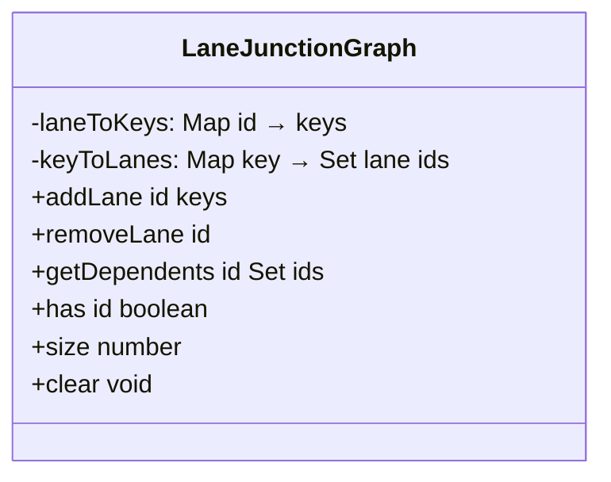
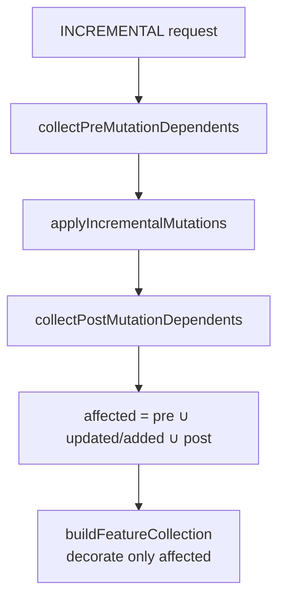
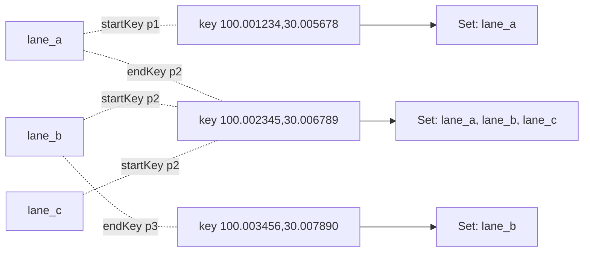

# 端点依赖图（Junction Graph）

`src/core/workers/laneJunctionGraph.ts` 是 spatial worker 的核心数据
结构之一，用来回答一个看似简单但贵到致命的问题：**"哪些 lane 与 lane
X 共享端点？"**。每次 lane 编辑后，stitching + decoration 都要重做这
些 lane —— 没有这个反查就只能扫全表。

## 一、为什么需要它

### 1.1 朴素方案的代价

不带反查时，每次 INCREMENTAL 编辑要全量跑 `applyLaneJunctions`：

- 收集所有 lane 端点（O(L)）
- 1cm 精度归并（O(L)）
- decorate 每条 lane 的 boundary（每条 ~3ms × L）

1k lanes 时，单次 INCREMENTAL ~3 秒。这是 Phase E 之前的真实卡顿。

### 1.2 端点反查的赋能

如果能在 O(K)（K = junction fan-out，典型 2-4）内拿到与 lane X 共享
端点的 lane 集合，就可以**只**对受影响的 lane 跑 decoration，其它 lane
直接复用 `decorationCache`。这就是 Phase E 的核心优化。

## 二、数据结构

```ts
// src/core/workers/laneJunctionGraph.ts:38-95
export class LaneJunctionGraph {
  private laneToKeys = new Map<string, [EndpointKey, EndpointKey]>();
  private keyToLanes = new Map<EndpointKey, Set<string>>();
  // ...
}
```

两个互为反向的 Map：

| Map          | Key           | Value                         | 用途                           |
| ------------ | ------------- | ----------------------------- | ------------------------------ |
| `laneToKeys` | `lane id`     | `[startKey, endKey]` 字符串对 | 删除时 O(1) 找回该 lane 的端点 |
| `keyToLanes` | endpoint hash | `Set<lane id>`                | `getDependents` 的反查表       |

`EndpointKey = ${x.toFixed(6)},${y.toFixed(6)}` —— **与 stitching 端
（`laneJunctions.ts`）使用相同的 1cm 精度量化**，两者必须保持同步。



## 三、API

### 3.1 `addLane(id, [startKey, endKey])`

**幂等**：先 `removeLane(id)` 清理旧索引，再插入新键。Worker 在
`insertEntity` 时调用：

```ts
// src/core/workers/spatialState.ts:68-74
function addLaneToGraph(state, entity) {
  if (entity.entityType !== 'lane') return;
  state.laneCount++;
  const keys = laneEndpointKeys(entity as LaneEntity);
  if (keys) state.junctionGraph.addLane(entity.id, keys);
  state.decorationCache.delete(entity.id);
}
```

注意：插入新 lane 时**清掉它自己的 decorationCache**（旧的可能是别的
lane 的同 id 残留 —— 极少发生但防御）。

### 3.2 `removeLane(id)`

清掉两个 map 中的引用。空集 bucket 一并清掉，避免内存泄漏：

```ts
// src/core/workers/laneJunctionGraph.ts:61-71
removeLane(id: string): void {
  const keys = this.laneToKeys.get(id);
  if (!keys) return;
  for (const key of keys) {
    const bucket = this.keyToLanes.get(key);
    if (!bucket) continue;
    bucket.delete(id);
    if (bucket.size === 0) this.keyToLanes.delete(key);
  }
  this.laneToKeys.delete(id);
}
```

### 3.3 `getDependents(id)` — O(K)

```ts
// src/core/workers/laneJunctionGraph.ts:73-86
getDependents(id: string): Set<string> {
  const out = new Set<string>();
  const keys = this.laneToKeys.get(id);
  if (!keys) return out;
  for (const key of keys) {
    const bucket = this.keyToLanes.get(key);
    if (!bucket) continue;
    for (const other of bucket) {
      if (other !== id) out.add(other);
    }
  }
  return out;
}
```

K = 该 lane 两个端点对应 bucket 大小之和（不含自身），实测 1-6。**完全
不依赖 lane 总数 L**，这是 Phase E 关键的复杂度降级。

## 四、INCREMENTAL 路径下的 affected-set 计算

`spatialRequests.ts` 在每次 INCREMENTAL 上做三轮收集：



### 4.1 Pre-mutation dependents

```ts
// src/core/workers/spatialRequests.ts:17-30
function collectPreMutationDependents(state, req, affected) {
  for (const id of req.removed) {
    const entity = state.entityMap.get(id);
    if (entity?.entityType === 'lane') addLaneDependents(state, id, affected);
  }
  for (const entity of req.updated) {
    if (entity.entityType === 'lane') addLaneDependents(state, entity.id, affected);
  }
}
```

意义：lane X **被改之前**与它共享端点的邻居，可能因为 X 端点位置变
化而需要重新 stitch。所以要先记下来。

### 4.2 应用 mutation

`applyIncrementalMutations` 真正改变 `tree` / `entityMap` /
`featureCache` / `junctionGraph`。

### 4.3 Post-mutation dependents

```ts
// src/core/workers/spatialRequests.ts:44-58
function collectPostMutationDependents(state, req, affected) {
  for (const entity of req.updated) {
    if (entity.entityType === 'lane') {
      for (const dep of state.junctionGraph.getDependents(entity.id)) affected.add(dep);
    }
  }
  for (const entity of req.added) {
    if (entity.entityType === 'lane') addLaneDependents(state, entity.id, affected);
  }
}
```

意义：lane X **改完之后**端点搬到新位置，新邻居也得 stitch。

### 4.4 合并

`affected = pre ∪ updated/added ∪ post`。`buildFeatureCollection` 把这
个集合作为 `decorateOnly` 传进 `applyLaneJunctions`，只对它们跑
`decorateBoundary`。

## 五、Public surface

| 导出                     | 文件                         | 说明                   |
| ------------------------ | ---------------------------- | ---------------------- |
| `endpointKeyOf(pt)`      | `laneJunctionGraph.ts:25-27` | 1cm 精度量化的端点 key |
| `laneEndpointKeys(lane)` | `laneJunctionGraph.ts:30-36` | 抽取 lane 中心线首末点 |
| `LaneJunctionGraph` 类   | `laneJunctionGraph.ts:38-95` | 反查表本体             |

## 六、性能与内存

| 量级      | LaneJunctionGraph 总大小 | 单次 getDependents |
| --------- | ------------------------ | ------------------ |
| 100 lanes | ~6 KB（Map 开销）        | < 1μs              |
| 1k lanes  | ~60 KB                   | < 5μs              |
| 5k lanes  | ~300 KB                  | < 10μs             |

主要内存开销是两个 Map 的桶 + 字符串端点 key（~25 字符 × 2 × L）。

## 七、Pitfalls

1. **量化精度必须与 stitching 一致**：当前都是 6 位小数；如果改成 5
   位小数，stitching 会按更粗的精度归并端点而 graph 还在按 6 位归并，
   会导致"该是邻居却不在 dependents 里"。
2. **CRUD 顺序**：`addLane(id)` 是幂等的（内部先 `removeLane`），但
   reusable id（同一 id 删后重建）必须经过 worker 的 `removeEntity →
insertEntity`，不能直接 `state.junctionGraph.addLane(...)` 跳过状态。
3. **不维护 lane × non-lane 关系**：graph 只管 lane 端点；junction
   polygon 与 crosswalk 等的依赖在 overlap pipeline 里处理。
4. **不支持 Z 维**：当前 endpoint key 只用 (x, y)；如果未来引入海拔
   匹配（同一平面内的 lane 可能高度不同），需要扩 key 到 (x, y, z)。

## 八、Source map

| 概念                | 文件                                    | 行    |
| ------------------- | --------------------------------------- | ----- |
| `endpointKeyOf`     | `src/core/workers/laneJunctionGraph.ts` | 25-27 |
| `laneEndpointKeys`  | 同上                                    | 30-36 |
| `LaneJunctionGraph` | 同上                                    | 38-95 |
| 注入 SpatialState   | `src/core/workers/spatialState.ts`      | 68-99 |
| affected-set 收集   | `src/core/workers/spatialRequests.ts`   | 12-66 |
| 与 stitching 互动   | `src/core/geometry/laneJunctions.ts`    | 47-68 |

## 九、测试要点

| 测试                        | 覆盖                                                        |
| --------------------------- | ----------------------------------------------------------- |
| `laneJunctionGraph.test.ts` | addLane / removeLane / getDependents 三接口；空 bucket 清理 |
| `spatialRequests.test.ts`   | INCREMENTAL 路径下 affected-set 闭包正确性                  |
| `spatialState.test.ts`      | lane insert/remove 后 graph 状态对齐                        |

测试约定：直接 new `LaneJunctionGraph()`，不需要 mock，测试纯接口幂
等性与边界（自身 → 排除、空 keys、null pts）。

## 十、内存模型可视化



`getDependents('lane_a')` = (Set in K1 ∪ K2) \\ {lane_a}
= {lane_b, lane_c}

复杂度：访问 `laneToKeys.get('lane_a')` 是 O(1)；遍历两个 bucket
（K1: 1, K2: 3），总 K=3 次比较。

## 十一、FAQ

**Q: 如果两条 lane 的端点差 0.005m（远小于 1cm 量化），算邻居吗？**

A: 算 —— `toFixed(6)` 把 0 → 0.000005 都映射到 `0.000000`。

**Q: 浮点精度漂移会让端点匹配失败吗？**

A: 经验上不会。0.0000005 的扰动会跨 5 位小数，但不会跨 6 位（即
0.0000010）。stitching 端用同样精度处理，二者必然一致。

**Q: lane 的 centerline 用了贝塞尔后端点会偏移吗？**

A: 视 `_source.anchors` 是否包含端点而定。`curvePoints(centralCurve)`
直接返回采样点序列，第一个点就是 anchor[0].point；最后一个就是
anchor[N-1].point。所以贝塞尔 lane 的端点稳定。

## 十二、调试技巧

- **getDependents 返回空集**：检查 `laneToKeys.has(id)`；若 false，
  说明 worker 未把该 lane 加入 graph（可能是 entityType 不是 'lane'，
  或 `laneEndpointKeys` 返回 null）。
- **decoration 不更新**：affected-set 漏算；在 `collectPreMutation` /
  `collectPostMutation` 里加 console.log 看是否把所有相关 lane 都
  加进去。
- **graph 与 stitcher 端点不一致**：检查 `toFixed(6)` 精度、双方都
  使用 `endpointKeyOf`。

## 十三、扩展点

如果未来要支持"非 lane 端点共享"（比如 lane × stopSign 端点对齐），
可以扩展为多类型 graph：

| 选项                       | 复杂度 | 适用                            |
| -------------------------- | ------ | ------------------------------- |
| 加 `entityType` 维度到 key | 低     | 仅 lane × lane 之间还原能力不变 |
| 拆成多个 graph 实例        | 中     | 类型间各自独立                  |
| 改成 hyperedge graph       | 高     | 多元参与（如 4 路 + 信号灯）    |

当前 1.0 版本只覆盖 lane × lane，足够 stitch 的需求。

## 十四、与 Phase E 的契合

Phase E 三件套：

1. `decorationCache: Map<lane_id, Feature[]>`（worker state）
2. `LaneJunctionGraph`（端点反查 → affected-set）
3. `applyLaneJunctions(decorateOnly)`（geometry 增量装饰参数）

三者紧耦合但通过明确边界协作 —— graph 给 affected-set，
worker 据此清/写 cache，stitch 据此跑 decoration。任何一处改逻辑都
要回看其它两处的不变量。

## 十五、术语对照

| 中文         | 英文           | 释义                                                    |
| ------------ | -------------- | ------------------------------------------------------- |
| 端点         | endpoint       | lane centerline 首末点                                  |
| 端点 key     | endpoint key   | `${x.toFixed(6)},${y.toFixed(6)}` 1cm 精度的字符串 hash |
| 反查         | reverse lookup | `keyToLanes` 提供的 endpoint → lane id 集合             |
| 依赖         | dependent      | 与某 lane 共享端点的其它 lane                           |
| Affected set | affected set   | INCREMENTAL 路径下需要重算装饰的 lane 集合              |

## 十六、See also

- [Junction Stitching](./junction-stitching.md)
- [Cold / Hot Layers](./cold-hot-layers.md)
- [Rendering Pipeline](./rendering-pipeline.md)
- [Geometry Engine](./geometry-engine.md)
- [Spatial Index](./spatial-index.md)
