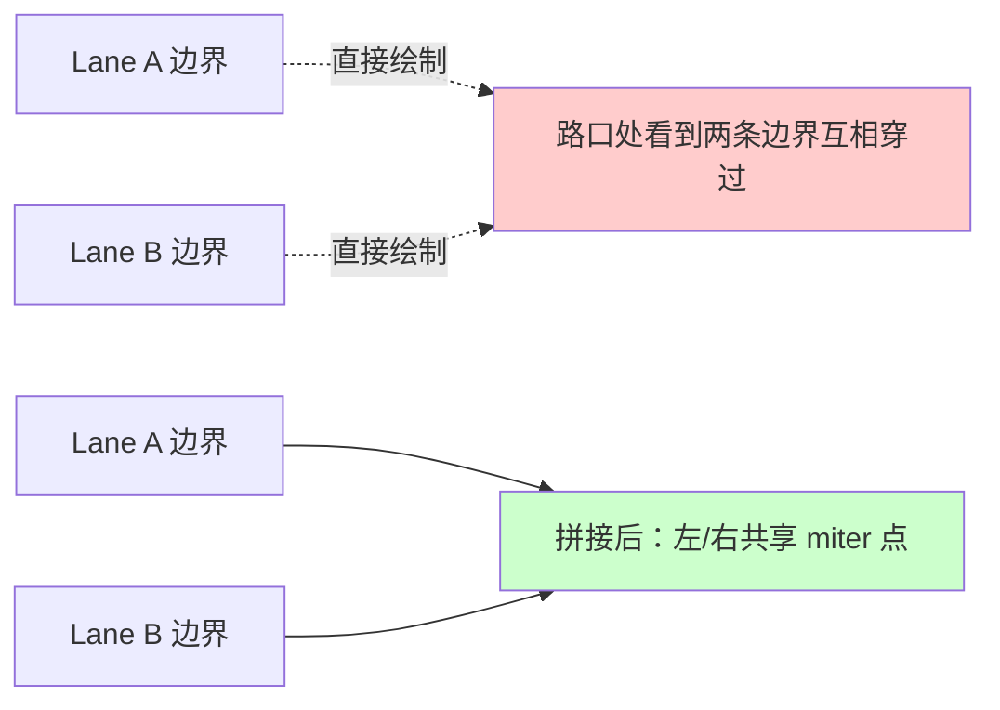
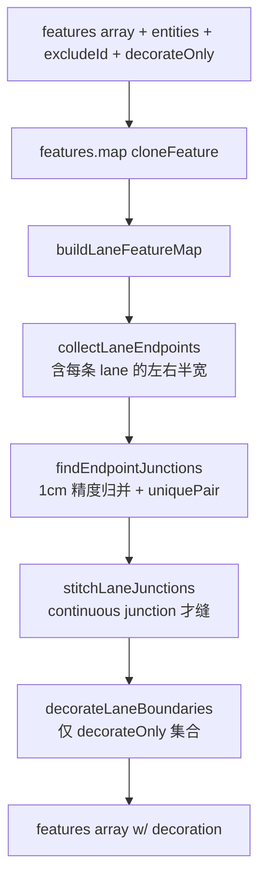

# 端点拼接（Junction Stitching）

`src/core/geometry/laneJunctions.ts:applyLaneJunctions` 是冷层渲染的
**视觉关键路径**。它把"两条共享端点的 lane"在 boundary 层做 miter
join，让用户在路口处看到平滑连接而不是两段独立的边界线。本页给出
完整算法与 Phase E 之后的"全量 stitch + 增量 decorate"双轨策略。

## 一、为什么需要 stitching



Apollo proto 把 lane 边界存成两条独立的曲线（`leftBoundary` /
`rightBoundary`）。两条相连 lane 的 left/right 端点在几何上接近，但
不一定 1:1 对齐。如果直接渲染，会出现：

- "T 字"突起 / 缺口
- 两侧 boundary 独自延伸越过路口边
- 折角不平滑

stitching 的工作是计算**左侧共享点 leftJoin**与**右侧共享点 rightJoin**，
拉两条 lane 的对应 boundary 端点到这两个点。

## 二、流程总览



## 三、关键算法

### 3.1 端点收集

```ts
// laneJunctions.ts:26-45
for (const entity of entities) {
  if (entity.entityType !== 'lane' || entity.id === excludeId) continue;
  if (!featureMap.has(lane.id)) continue;
  laneMap.set(lane.id, lane);
  endpoints.push(...laneEndpointsFromEntity(lane)); // 含 isStart 标记
}
```

每条 lane 产出两个 `LaneEndpoint`：start 与 end。`leftWidth /
rightWidth` 取自 `leftSamples[0]?.width` / `rightSamples[0]?.width`，
fallback 到 `DEFAULT_LANE_HALF_WIDTH`。

### 3.2 端点归并

```ts
// laneJunctions.ts:47-71
const endpointIndex = new Map<string, LaneEndpoint[]>();
for (const endpoint of endpoints) {
  const pt = endpoint.isStart ? endpoint.pts[0]! : endpoint.pts[endpoint.pts.length - 1]!;
  const key = `${pt.x.toFixed(6)},${pt.y.toFixed(6)}`;
  ...
}
```

1cm 精度 hash key —— 与 [`LaneJunctionGraph`](./junction-graph.md) 一致。
若同 key 下 `uniquePair` 返回 2 个 lane 端点，就视为继续 junction。

### 3.3 "Continuous" 判定

```ts
// laneJunctions.ts:88-90
function isContinuousJunction(a, b) {
  return a.isStart !== b.isStart; // 一头 start、一头 end 才是"延续"
}
```

- `start-start` = 分流（fork）：两条 lane 从同一点出发
- `end-end` = 合流（merge）：两条 lane 收敛到同一点
- `end-start` 或 `start-end` = 真正的"前后衔接"

只有最后一种被 stitch；fork / merge 留给 overlap pipeline 处理（详见
[Overlap Derivation](./overlap-derivation.md)）。

### 3.4 Miter join 计算

```ts
// laneJunctions.ts:96-123
const cosLat = Math.cos((pt.y * Math.PI) / 180);
const dirA = endpointDirection(a, cosLat); // 单位方向向量
const dirB = endpointDirection(b, cosLat);

const leftOffset = sideJoinOffset('left', a, b, dirA, dirB);
const rightOffset = sideJoinOffset('right', a, b, dirA, dirB);

const leftJoin = offsetToLngLat(pt, leftOffset, cosLat);
const rightJoin = offsetToLngLat(pt, rightOffset, cosLat);
```

`sideJoinOffset` 用两条方向向量的法线交点（miter）算共享端点的偏移
（米空间）。再通过 `offsetToLngLat` 转回 lng/lat。最后调用
`updateLineEndpoint` 修改 left/right boundary 的端点，调用
`syncPolygonFromEdges` 把 polygon feature 也同步过去。

### 3.5 边界装饰

```ts
// laneJunctions.ts:130-148
function decorateLaneBoundaries(featureMap, laneMap, decorateOnly) {
  const out: GeoJSON.Feature[] = [];
  for (const [id, refs] of featureMap) {
    if (decorateOnly && !decorateOnly.has(id)) continue;
    const lane = laneMap.get(id);
    if (!lane) continue;
    out.push(...decorateBoundary(lane, 'left', refs.left));
    out.push(...decorateBoundary(lane, 'right', refs.right));
  }
  return out;
}
```

`decorateBoundary` 按 `lane.boundaryType[]`（虚线 / 实线 / 双黄等）切
段并产出额外的 GeoJSON features：

- 双黄：两条平行 line，间距 `DOUBLE_YELLOW_GAP_METERS`
- 虚线 / 点线：dasharray 通过 paint 表达式实现，无需多 feature
- 路缘石（CURB）：实线 + 颜色

**Phase E 关键**：`decorateOnly` 集合（来自 affected-set）让这一步只
跑受影响的 lane；其它 lane 的 decoration 由 worker 的
`decorationCache` 在 `buildFeatureCollection` 那一层"补回"输出。

## 四、Stitching 与 Decoration 的双轨策略

| 路径                | Stitching 范围          | Decoration 范围 |
| ------------------- | ----------------------- | --------------- |
| SYNC（全量）        | 全部 lane               | 全部 lane       |
| INCREMENTAL（增量） | 全部 lane（仍然全量！） | 仅 affected-set |

为什么 stitching 仍然全量？

- 单次 stitch ~ 0.01ms × N junctions（5w 实体场景下也才 5ms）。
- stitch 算法是**幂等**的：未受影响的 lane 端点位置不变，重新算也得
  到同样的 leftJoin/rightJoin。
- 增量 stitch 需要"哪条 boundary 端点变过"的反查 —— 复杂度比直接全量
  更高。

decoration 必须增量化的原因：

- 单次 `decorateBoundary` ~3ms × N lanes（5w 实体 = 150 秒；致命）。
- 它的输出是大量 features（每 lane 数十个），增量化收益巨大。

## 五、decorationCache 失效

`SpatialState` 维护：

```ts
// spatialState.ts:27
decorationCache: Map<string, GeoJSON.Feature[]>; // lane id → features
```

失效时机：

1. **lane 被改 / 删 / 加**：worker 的
   `addLaneToGraph(state, entity)` 在 `insertEntity` 里
   `state.decorationCache.delete(entity.id)`；
   `removeEntity` 同理。
2. **stitch 后**：`buildFeatureCollection` 在写回新 decoration 之前
   `for (const id of affectedLaneIds) state.decorationCache.delete(id)`。
3. **全量 SYNC**：`state.decorationCache.clear()`。

合并回填：

```ts
// spatialFeatures.ts:108-115
if (isIncremental) {
  for (const [id, decoration] of state.decorationCache) {
    if (affectedLaneIds!.has(id)) continue;
    stitched.push(...decoration);
  }
}
```

未受影响 lane 的旧 decoration 直接拼到 stitched 数组里，不做任何重算。

## 六、Public surface

| 入口                                                                                | 文件                        | 用途                             |
| ----------------------------------------------------------------------------------- | --------------------------- | -------------------------------- |
| `applyLaneJunctions(features, entities, excludeId, decorateOnly)`                   | `laneJunctions.ts:150-165`  | Worker 入口                      |
| `decorateBoundary(lane, side, feature)`                                             | `laneJunctions/internal.ts` | 输出装饰 features                |
| `endpointDirection`、`sideJoinOffset`、`updateLineEndpoint`、`syncPolygonFromEdges` | `laneJunctions/internal.ts` | 内部 vec2 / miter 工具           |
| `endpointKeyOf`                                                                     | `laneJunctionGraph.ts`      | 与 stitching 共享的端点 hash key |

## 七、Pitfalls

1. **forking / merging 不是 stitch 场景**：`isContinuousJunction` 判
   定后才进入 stitch；start-start 与 end-end 必须由 overlap 与 topology
   分别处理（pred/succ 不会被建立，但 overlap 关系可能会）。
2. **decorationCache 颗粒度是 lane**：而 stitching 颗粒度是 junction。
   两者通过 affected-set 中转 —— 即"哪条 lane 牵涉到任何被改动的
   junction"才进入 affected。
3. **excludeId**：被选中正在 hot 层渲染的 lane 不参与 stitch（避免
   闪烁）。Worker SYNC / INCREMENTAL 的请求都可以带 excludeId。
4. **boundary feature 的 role**：装饰 features 的
   `properties.role = 'laneBoundaryDecor'`。`decorationCache` 在
   `spatialFeatures.ts:97-108` 通过这个 role 把 stitched 数组里的装饰
   features 反向加入 cache。改 role 名会破坏缓存。

## 八、Source map

| 概念                 | 文件                                                      | 行     |
| -------------------- | --------------------------------------------------------- | ------ |
| 主入口               | `src/core/geometry/laneJunctions.ts`                      | 1-165  |
| 内部 vec2 / miter    | `src/core/geometry/laneJunctions/internal.ts`             | —      |
| Lane endpoint 抽取   | `src/core/geometry/apolloCompile/laneBoundaryGeometry.ts` | —      |
| Stitching 调用方     | `src/core/workers/spatialFeatures.ts`                     | 65-118 |
| decorationCache 失效 | `src/core/workers/spatialState.ts`                        | 68-99  |
| 与 graph 的桥接      | `src/core/workers/laneJunctionGraph.ts`                   | —      |

## 九、视觉 Demo

下面是 stitch 之前与之后在路口处的视觉差异（示意，非真实截图）：

| Stitch 之前                               | Stitch 之后                                     |
| ----------------------------------------- | ----------------------------------------------- |
| 两条 lane 的左/右 boundary 互相穿过路口边 | 共享 leftJoin / rightJoin 点；boundary 平滑收束 |
| polygon feature 在路口处出现细缝          | polygon 与 boundary 同步，无缝合                |
| 双黄装饰在路口断开                        | decoration 沿连续端点延伸                       |

## 十、测试要点

| 测试                              | 覆盖                                       |
| --------------------------------- | ------------------------------------------ |
| `laneJunctions.test.ts`           | continuous 与 fork/merge 的分支；trim 选项 |
| `spatialFeatures.test.ts`         | decorationCache 在 `decorateOnly` 后的合并 |
| `internal/sideJoinOffset.test.ts` | miter 公式（含锐角 / 反向）正确性          |

## 十一、FAQ

**Q: 为什么 fork (start-start) 不 stitch？**

A: 两条从同一点出发的 lane 是分流；它们的 left-left / right-right
boundary 在物理上是分开的（一个向左拐、一个向右拐）。强行 miter 会
让两条 lane 的左/右 boundary 都拉到同一点，看起来像三角形而不是
分叉。

**Q: 同一路口接 3+ 条 lane 怎么办？**

A: 当前 `findEndpointJunctions` 用 `uniquePair` 只处理"一对"的情况；
3+ 条 lane 共享端点的"复杂路口"由 junction polygon 与 overlap 关系
处理，不在 stitch 范围。

**Q: 如果一条 lane 没有显式 boundary（例如新建的 polyline lane），
stitch 还能跑吗？**

A: 跑不了 stitch，但 `decorateBoundary` 会从 `centralCurve` +
`leftSamples` / `rightSamples` (half-width) 用 `offsetPolylineDeg`
推断 boundary，再 stitch。

## 十二、性能记录

- **Phase E 之前**（2026-04 之前）：1k lane 单次 INCREMENTAL ~3000ms。
- **Phase E 之后**：1k lane 单次 INCREMENTAL（dirty=1）~5ms。提升 600x。
- **5k lane 全量 SYNC**：stitch ~10ms + decorate ~150ms。

## 十三、调试技巧

- **路口处 boundary 没有 stitch**：检查 `findEndpointJunctions` 是否
  把这两个 lane 配成 pair；可能是 `uniquePair` 因第三条 lane 共享
  端点而返回 null。
- **stitch 后边界扭曲**：`endpointDirection` 用 lane 端点的最近一
  小段计算方向，如果 lane 在端点附近有非常短的小段，方向噪声会让
  miter 偏；可在 `endpointDirection` 加最小段长度过滤。
- **decoration 缺失**：`decorateOnly` 是否包含该 lane id；查
  `spatialFeatures.ts` 的 `affectedLaneIds`。

## 十四、与其它系统的边界

| 系统                    | 关系                                                              |
| ----------------------- | ----------------------------------------------------------------- |
| `LaneJunctionGraph`     | 提供 affected-set；二者使用同一 endpoint key 量化                 |
| `decorationCache`       | stitch 之前 worker 已清掉 affected lane 的 cache；stitch 之后写回 |
| `compileApolloFeatures` | 产出 stitching 的输入 features（lane left/right/polygon）         |
| Overlap pipeline        | fork / merge 等"非继续"端点关系由它处理；stitch 不参与            |
| Lane topology reconcile | 端点 1cm 共享判定 pred/succ；与 stitch 不互依，仅同精度           |

## 十五、扩展指南

要给 stitch 加新行为（比如"在 stitch 端点处生成 join indicator"）：

1. 在 `stitchLaneJunctions` 末尾追加一个生成 indicator feature 的
   循环；indicator features 写到外部数组（不要改 boundary 主线）。
2. 通过参数注入控制开关，避免 stitch 主路径多余开销。
3. 加 paint：`addColdLayers` 加 layer + filter；不要改现有 layer。
4. 单测 stitch 数量与原 boundary 数量保持一致。

## 十六、术语对照

| 中文                | 英文                | 释义                                        |
| ------------------- | ------------------- | ------------------------------------------- |
| 拼接                | stitching           | 把端点共享的两条 lane 边界拉到共同 miter 点 |
| 装饰                | decoration          | 边界的虚线 / 双黄 / 路缘石等附加 features   |
| Continuous junction | continuous junction | 一头 start + 一头 end 的延续型连接          |
| Fork / Merge        | fork / merge        | start-start 分流 / end-end 合流             |
| Miter join          | miter join          | 两段方向向量法线的交点                      |

## 十七、See also

- [Junction Graph](./junction-graph.md)
- [Cold / Hot Layers](./cold-hot-layers.md)
- [Rendering Pipeline](./rendering-pipeline.md)
- [Geometry Engine](./geometry-engine.md)
- [Overlap Derivation](./overlap-derivation.md)
- [Spatial Index](./spatial-index.md)
