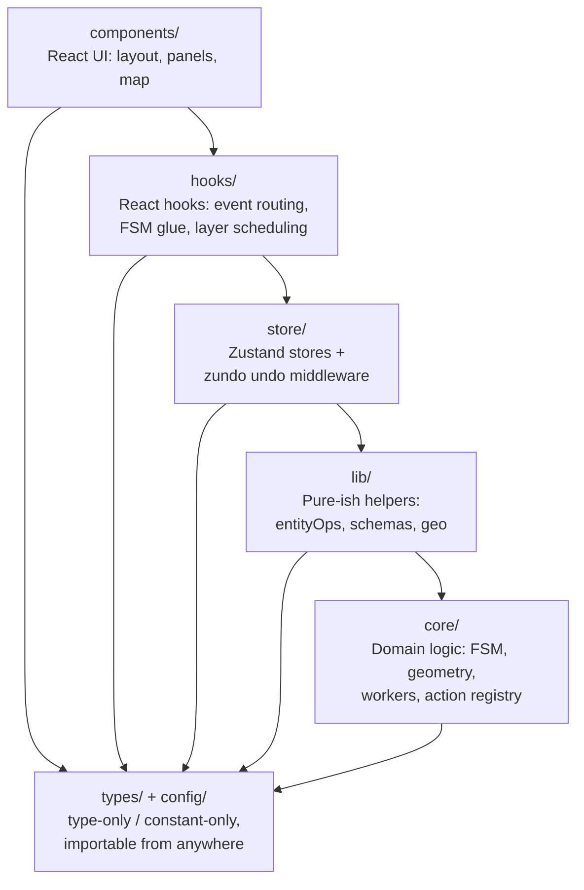

# Layered Architecture

The codebase is layered. **Imports flow downward only** — an outer layer may
import from any inner layer below it, never the other way round. This page
expands the layer table from `ARCHITECTURE.md`, explains the audit grep, and
documents the import-cycle lint rule that lives on the P2 backlog.

## The five layers



## Allowed-imports table

| Layer         | May import from                                | May NOT import from                                   |
| ------------- | ---------------------------------------------- | ----------------------------------------------------- |
| `core/`       | `core/` peers, `types/`, `config/`             | anything in `lib/`, `store/`, `hooks/`, `components/` |
| `lib/`        | `core/`, `types/`, `config/`                   | `store/`, `hooks/`, `components/`                     |
| `store/`      | `core/`, `lib/`, `types/`, `config/`           | `hooks/`, `components/`                               |
| `hooks/`      | `core/`, `lib/`, `store/`, `types/`, `config/` | `components/`                                         |
| `components/` | everything                                     | nothing — top of the stack                            |

`types/` and `config/` are leaf modules: pure type or pure constant content
with no runtime imports. They can be referenced from any layer without
violating the rule.

## Why downward only?

Two practical reasons and one strategic one:

1. **Worker-safety.** `core/` modules run inside Web Workers (see
   `src/core/workers/spatial.worker.ts`). Anything `core/` imports must also
   be importable in a worker context, where `window`, the DOM, React, and
   Zustand stores do not exist. Forbidding upward imports keeps that promise
   mechanical instead of inspectional.

2. **Bundle locality.** Vite chunks split along these layer lines naturally.
   The `vite.config.ts` `manualChunks` map keeps third-party libraries in
   stable vendor chunks, and forbidding upward imports keeps first-party code
   from forming chunk cycles between vendor groups.

3. **Refactor radius.** When `lib/entityOps.ts` (the [Anti-Corruption Layer](./anti-corruption-layer.md))
   exists specifically to insulate UI from proto changes, it must not itself
   import from UI. The layer rule formalises that.

## What the rule looks like in practice

A `core/` file:

```ts
// src/core/geometry/laneJunctions.ts — fine
import type { LaneEntity } from '@/types/apollo';
import { offsetPolylineDeg } from './apolloCompile/offsetPolyline';
import { METERS_PER_DEGREE } from '@/config/mapConstants';
```

A `core/` file that violates the rule:

```ts
// src/core/geometry/laneJunctions.ts — DISALLOWED
import { useUIStore } from '@/store/uiStore'; // ← upward import
```

A `lib/` file:

```ts
// src/lib/entityOps/edit.ts — fine
import type { ApolloEntity } from '@/types/apollo';
import { compileApolloFeatures } from '@/core/geometry/apolloCompile';
```

A `hooks/` file:

```ts
// src/hooks/useColdLayer.ts — fine
import { useMapStore } from '@/store/mapStore';
import { COLD_LAYER_IDS } from '@/components/map/coldLayerConfig';
```

::: warning Do not import from components in hooks except for type-only
constants
The map config constants live under `src/components/map/coldLayerConfig.ts`.
They are imported in hooks. This is a known minor wart — the config file is
data-only and is queued to migrate to `src/config/` (or `src/core/render/`)
once the rendering pipeline factor-out lands. Track in the architecture audit.
:::

## Audit grep

Run before every refactor that touches `core/` or `lib/`:

```bash
# Forbidden: store/hooks/components imports inside core/
git grep -l "from '@/store/" -- 'src/core/**'
git grep -l "from '@/hooks/" -- 'src/core/**'
git grep -l "from '@/components/" -- 'src/core/**'

# Forbidden: store/hooks/components imports inside lib/
git grep -l "from '@/store/" -- 'src/lib/**'
git grep -l "from '@/hooks/" -- 'src/lib/**'
git grep -l "from '@/components/" -- 'src/lib/**'

# Forbidden: hooks/components imports inside store/
git grep -l "from '@/hooks/" -- 'src/store/**'
git grep -l "from '@/components/" -- 'src/store/**'

# Forbidden: components imports inside hooks/
git grep -l "from '@/components/" -- 'src/hooks/**'
```

A non-empty result for any of these is a layering leak — fix it before the
PR merges.

::: tip Anti-corruption-layer-specific audit
The Apollo proto adapter (`src/lib/entityOps.ts`) has its own audit:

```bash
git grep "from '@/core/geometry/apolloCompile'" \
  -- 'src/components/**' 'src/hooks/**'
```

This must always be empty — UI code routes through `entityOps` instead.
:::

## Import-cycle lint rule (planned)

The audit greps catch the layer rule but not within-layer cycles. Two `core/`
files importing each other in a loop would pass the grep but still cause
trouble.

The plan (P2):

```js
// eslint.config.js — proposed
import importPlugin from 'eslint-plugin-import';

export default [
  {
    plugins: { import: importPlugin },
    rules: {
      'import/no-cycle': ['error', { maxDepth: 5 }],
      // Tier enforcement: regex boundary checks.
      'import/no-restricted-paths': [
        'error',
        {
          zones: [
            { target: 'src/core', from: 'src/lib' },
            { target: 'src/core', from: 'src/store' },
            { target: 'src/core', from: 'src/hooks' },
            { target: 'src/core', from: 'src/components' },
            { target: 'src/lib', from: 'src/store' },
            { target: 'src/lib', from: 'src/hooks' },
            { target: 'src/lib', from: 'src/components' },
            { target: 'src/store', from: 'src/hooks' },
            { target: 'src/store', from: 'src/components' },
            { target: 'src/hooks', from: 'src/components' },
          ],
        },
      ],
    },
  },
];
```

This is gated on `eslint-plugin-import`'s flat-config support being stable
(it lagged ESLint 9 for several months). Once landed, the audit greps become
redundant and the layer rule becomes machine-checkable.

## Why `types/` and `config/` are not in the stack

Both directories contain **type-only or constant-only modules** that compile
out at zero runtime cost:

- `src/types/apollo.ts` — Apollo proto type mirrors. Pure `interface` / `type`.
- `src/types/entities.ts` — `MapEntity` discriminated union.
- `src/types/editor.ts` — drag/select editor-internal types.
- `src/config/mapConstants.ts` — numeric defaults (lane width, arrow spacing,
  zoom levels).

None of these depend on framework code. Putting them in the layer stack would
force an artificial "what layer does a type live in?" decision every time a
new shared shape is added.

## Practical consequences

- **`core/` is testable in isolation.** Pure-function tests in
  `src/core/geometry/__tests__/*.test.ts` and benchmarks in `*.bench.ts` boot
  in milliseconds. None of them require React, MapLibre, or jsdom.
- **`store/` is testable with real reducers.** `src/store/__tests__/` uses
  the real `useMapStore` because Zustand has no module-level singleton baked
  into React state. See [State Management](./state-management.md).
- **`hooks/` and `components/` use jsdom.** They live above store and import
  from it, so tests need a renderer-ish environment.

## Cross-references

- [Anti-Corruption Layer](./anti-corruption-layer.md) — the `lib/entityOps`
  facade that makes the rule worthwhile.
- [State Management](./state-management.md) — Zustand stores live in
  `store/` and only outwardly visible mutators are exposed.
- [Cold/Hot Layers](./cold-hot-layers.md) — explains why `core/workers/` must
  be free of UI imports.
- [Testing Strategy](./testing-strategy.md) — the layer split is what makes
  the unit tests fast.
