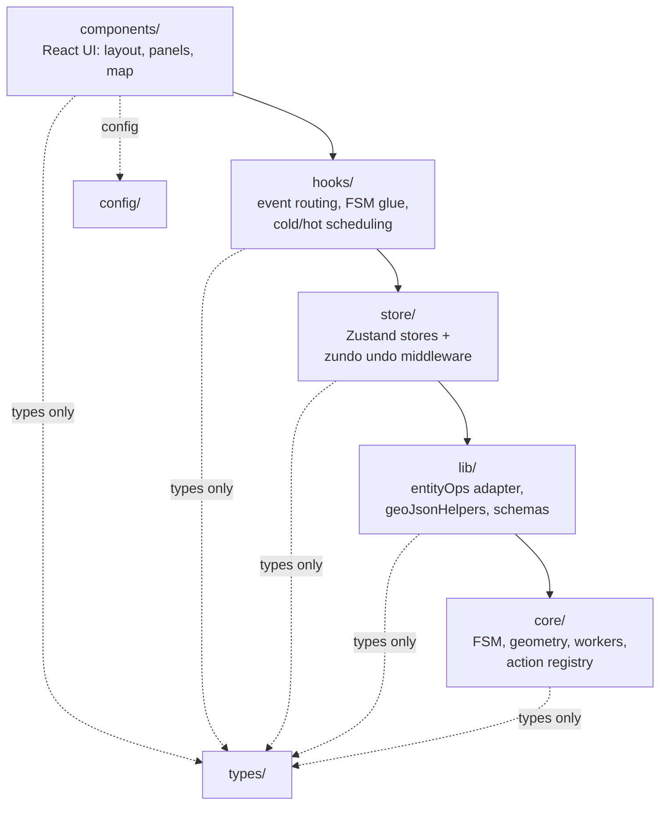
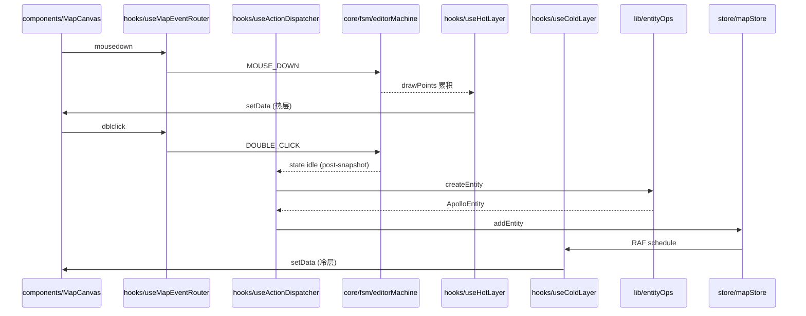

# 分层架构

代码库 **严格分层**。导入只能向下流：外层可以引用内层，反之不行。本页把
`ARCHITECTURE.md` 里的层级表展开成可执行的审计清单，并把每条规则的"为什么"写出来 ——
之所以禁止某条引用，是因为如果允许，重构、Worker 化、ACL 都会塌方。

::: tip 一句话总结
`components → hooks → store → lib → core`。`types/` 与 `config/` 是纯定义，所有人可读；
`__tests__` 与 `*.test.ts` 不算业务代码、不参与依赖图。
:::

## 1. 五层全景



每一层的方向性不只是规约 —— 它是一种 **物理隔离**。例如 `core/` 不允许引用 `store/`
意味着 `core/geometry/apolloCompile.ts` 永远是 pure function，因此可以被搬到 Web
Worker 里、被 fuzz、被独立单测。

## 2. 各层职责

### 2.1 `core/` —— 领域核心

| 子目录           | 职责                                                                                              |
| ---------------- | ------------------------------------------------------------------------------------------------- |
| `core/actions/`  | Action registry：`registry.ts` 暴露 `ACTION_DEFS` 与 12 个查询 helper                             |
| `core/elements/` | Apollo 元素元数据 (`MapElementType`, `derive` 派生引擎)                                           |
| `core/fsm/`      | XState 5 编辑器状态机                                                                             |
| `core/geometry/` | 参数化 → GeoJSON 编译 (`apolloCompile.ts`, `interpolate.ts`, `validation.ts`, `laneJunctions.ts`) |
| `core/spatial/`  | RBush 共享空间索引                                                                                |
| `core/workers/`  | Web Worker 脚本 + protocol + bridge                                                               |

**禁止**：引用 `lib/`、`store/`、`hooks/`、`components/`。

### 2.2 `lib/` —— 应用纯辅助

| 模块                                   | 职责                          |
| -------------------------------------- | ----------------------------- |
| `lib/entityOps.ts` + `lib/entityOps/*` | proto 反腐败门面 (R2)         |
| `lib/schemas.ts`                       | zod schema (Inspector 表单)   |
| `lib/geoJsonHelpers.ts`                | GeoJSON 操作工具              |
| `lib/editable-guard.ts`                | License + 只读模式拦截        |
| `lib/license-bridge.ts`                | 与 Electron preload 的 IPC 桥 |
| `lib/idGenerator.ts`                   | nanoid 包装                   |
| `lib/enumLabels.ts`                    | 枚举 → 显示文案               |
| `lib/mapIcons.ts`                      | MapLibre symbol icon 元数据   |

**禁止**：引用 `store/`、`hooks/`、`components/`。
**允许**：`core/`、`types/`、`config/`。

### 2.3 `store/` —— 全局状态

| 文件                         | 职责                                           |
| ---------------------------- | ---------------------------------------------- |
| `store/mapStore.ts`          | 实体仓 (Map<id, MapEntity>) + zundo            |
| `store/uiStore.ts`           | UI 偏好 / 图层显隐 / connect mode              |
| `store/settingsStore.ts`     | 用户设置 (history limit, lane width)           |
| `store/licenseStore.ts`      | 镜像 main 进程的 license state                 |
| `store/taskProgressStore.ts` | 长任务进度提示                                 |
| `store/projDialogStore.ts`   | PROJ.4 picker promise gate                     |
| `store/apolloMapStore.ts`    | 导入的 raw Apollo Map (header / bounds / info) |

**允许**：`core/`、`lib/`、`types/`。**禁止**：`hooks/`、`components/`。

### 2.4 `hooks/` —— React glue

`useMapEventRouter` (输入 dedup 与路由)、`useColdLayer` (RAF 合并)、`useHotLayer`、
`useActionDispatcher` (R1 closure)、`useDrawCommit` (post-snapshot 提交)、
`useLicense` 等。

**允许**：`core/`、`lib/`、`store/`、`types/`。**禁止**：`components/`。

### 2.5 `components/` —— UI 顶层

允许 import 任何下层。禁止反向暴露状态 (例如 export 一个全局可变 ref)。

## 3. 允许 / 禁止表 (规范化)

| 层                   | 允许 import                         | 禁止 import                               |
| -------------------- | ----------------------------------- | ----------------------------------------- |
| `core/`              | `core/`、`types/`、`config/`        | `lib/`、`store/`、`hooks/`、`components/` |
| `lib/`               | `core/`、`types/`、`config/`        | `store/`、`hooks/`、`components/`         |
| `store/`             | `core/`、`lib/`、`types/`           | `hooks/`、`components/`                   |
| `hooks/`             | `core/`、`lib/`、`store/`、`types/` | `components/`                             |
| `components/`        | 全部                                | 无                                        |
| `types/` / `config/` | (纯类型/常量，无运行时 import)      | 任何运行时模块                            |

## 4. 审计 grep recipe (CI 可挂)

::: tip 把以下 grep 加入 PR check
任何一条返回非空就阻塞合并。
:::

```bash
# 4.1 core 不准引用 lib/store/hooks/components
git grep -nE "from '@/(lib|store|hooks|components)/" -- 'src/core/**'

# 4.2 lib 不准引用 store/hooks/components
git grep -nE "from '@/(store|hooks|components)/" -- 'src/lib/**'

# 4.3 store 不准引用 hooks/components
git grep -nE "from '@/(hooks|components)/" -- 'src/store/**'

# 4.4 hooks 不准引用 components
git grep -nE "from '@/components/" -- 'src/hooks/**'

# 4.5 ACL 反腐败：UI 不准直接 import apolloCompile
git grep "from '@/core/geometry/apolloCompile'" -- 'src/components/**' 'src/hooks/**'

# 4.6 R1 闭环：所有撤销路径必先 CANCEL
git grep -n "temporal.undo" -- 'src/' | grep -v useActionDispatcher
```

::: warning P2 backlog
`import/no-cycle` ESLint 规则与 tier 检查脚本仍在 P2 backlog 上。在它们落地前，
review 时手工跑上述 grep 是唯一防线。
:::

## 5. 跨层 sequence (绘制一条多段线)



注意所有箭头都是 **向内** 或 **横向**，没有"core 主动 push 给 components"。core 的输出
通过 store 与 hook 中转。

## 6. 公共表面 (本页关心的导出)

| 包/模块                    | 入口                                | 暴露给谁                          |
| -------------------------- | ----------------------------------- | --------------------------------- |
| `@/types/apollo`           | `src/types/apollo.ts`               | 任何层都可 import (类型)          |
| `@/types/entities`         | `src/types/entities.ts`             | 同上                              |
| `@/config/mapConstants`    | `src/config/mapConstants.ts`        | 任何层都可 import (常量)          |
| `@/lib/entityOps`          | `src/lib/entityOps.ts:1`            | `store/`、`hooks/`、`components/` |
| `@/core/actions/registry`  | `src/core/actions/registry.ts:1`    | `hooks/`、`components/`           |
| `@/core/fsm/editorMachine` | `src/core/fsm/editorMachine.ts:130` | `hooks/`、`components/`           |

## 7. 内部分层细节

### 7.1 `core/` 内部禁止跨子目录隐式耦合

`core/geometry/laneJunctions.ts` 不直接 import `core/spatial/SharedSpatialIndex`；
而是通过 `core/elements/overlap.ts` 间接调用。这一约定保证了 spatial index 可被替换
为 Web Worker 内的副本而不动 geometry 模块。

### 7.2 `hooks/` 不能持有副本状态

例如 `useColdLayer` 不持有"已编译特征" 的 React state；它只把 store 的 `entities`
发给 worker，由 worker 的 `featureCache` 做单一缓存。

### 7.3 `components/` 不直接订阅 worker

worker 的输出始终经过 `useColdLayer` / `useHotLayer` 等 hook 进入 store 或 MapLibre。
组件订阅 store，而不是订阅 worker。

## 8. 常见陷阱

::: danger 在 store 里 import hook
`store/*` 是 React 之外的纯 JS。一旦 `import { useColdLayer } from '@/hooks/...'`
出现在 store，store 就只能在 React 树内被使用，违背了"store 可在测试中独立创建"的承诺。
:::

::: danger 通过 barrel 文件偷渡反向引用
`src/lib/index.ts` 如果 re-export 了 hook，会让 `core/` 通过 `import { ... } from '@/lib'`
间接拿到 hook 引用。本仓库只允许子目录级别的 barrel (`@/lib/entityOps`)，没有 `@/lib`
顶级 barrel。
:::

::: danger 复用 ESLint flat config 的 `paths` 没限制层级
flat config 的 `paths` 只解析别名，不阻止跨层引用。tier 检查必须由专门脚本完成。
:::

## 9. 重构时的层移动 SOP

| 步骤 | 操作                                            |
| ---- | ----------------------------------------------- |
| 1    | 找出新模块要走哪一层 (一般在 `core/` 或 `lib/`) |
| 2    | 在该层下创建文件，先写 pure type signature      |
| 3    | 编译通过后再 import 到 `store/` 或 `hooks/`     |
| 4    | 跑 §4 的 6 条 grep                              |
| 5    | 跑 `pnpm typecheck && pnpm test`                |

## 10. Source map (file:line refs)

- `ARCHITECTURE.md:7-41` — 层级表与允许 / 禁止矩阵
- `src/core/actions/registry.ts:1` — barrel re-export 模式
- `src/lib/entityOps.ts:12-39` — entityOps 子模块 re-export
- `src/store/mapStore.ts:5-25` — store 允许 import 的 lib/core 范围
- `src/hooks/useActionDispatcher.ts` — hooks 集中订阅 store + FSM 的范例
- `eslint.config.js` — flat config (尚未启用 import/no-cycle)
- `tsconfig.json` — `paths` 别名定义

## 11. 层与测试边界

| 层            | 测试位置                      | 边界处理                                                                        |
| ------------- | ----------------------------- | ------------------------------------------------------------------------------- |
| `core/`       | `src/core/**/__tests__`       | 纯 JS，零 mock；vitest 自带 jsdom 不需要                                        |
| `lib/`        | `src/lib/**/__tests__`        | 注入 fake `MapEntity` map；mock `core/geometry/apolloCompile` 仅在 ACL 边界测试 |
| `store/`      | `src/store/__tests__`         | 用 `useFooStore.getState()` 直接测，`renderHook` 不必要                         |
| `hooks/`      | `src/hooks/__tests__`         | `@testing-library/react` 的 `renderHook`；mock 全局 store                       |
| `components/` | `src/components/**/__tests__` | RTL `render`；几乎不写，单元测试不在该层负担                                    |

::: tip 黄金法则
单元测试模拟下层；集成测试跑真实下层。Vitest 的 `vi.mock('@/lib/entityOps')` 在
hook 测试中是常态。
:::

## 12. ESLint flat config 与层

```ts
// eslint.config.js (片段)
export default [
  // ...
  {
    files: ['src/core/**/*.ts'],
    rules: {
      'no-restricted-imports': [
        'error',
        {
          patterns: ['@/lib/*', '@/store/*', '@/hooks/*', '@/components/*'],
        },
      ],
    },
  },
  // 其他层类似
];
```

::: warning 当前未启用
flat config 的 `no-restricted-imports` 与 `paths` 别名解析有歧义；P2 backlog 上
计划自写 plugin 解决。在落地之前，§4 的 grep 是唯一防线。
:::

## 13. 重构路径示例

**场景**：把 `src/components/map/laneRenderer.ts` 中的几何裁剪逻辑提到 core。

1. 在 `src/core/geometry/laneCorridor.ts` 创建 pure function。
2. 删除组件内的 inline 实现；让组件从 `@/core/geometry/laneCorridor` import。
3. 跑 §4 grep —— 应该不会触发，因为 components 可以 import core。
4. 给 core 模块加单测 `src/core/geometry/__tests__/laneCorridor.test.ts`。
5. 跑 `pnpm typecheck && pnpm test && pnpm bench`。

## 14. 反例：导致跨层耦合的常见 PR

| 反例                                                   | 修正                                                |
| ------------------------------------------------------ | --------------------------------------------------- |
| `src/lib/foo.ts` import `useMapStore`                  | 让 `lib/foo` 接受 entities 作为参数                 |
| `src/core/bar.ts` import `useUIStore`                  | 让 `core/bar` 不读 UI 偏好；UI 偏好通过 caller 注入 |
| `src/store/laneTopology.ts` import `useMapEventRouter` | 把 event 处理移到 hook 层                           |
| `src/components/MapCanvas.tsx` import `apolloCompile`  | 改为 `entityOps.compileEntity`                      |

## 15. 层级与 bundle 切片

Vite 默认按 dynamic import 切片。我们的层级与 chunk 关系：

| 层            | 切片策略                                                                              |
| ------------- | ------------------------------------------------------------------------------------- |
| `core/`       | 大部分进 main chunk；`core/workers/*.worker.ts` 独立 worker chunk                     |
| `lib/`        | main chunk                                                                            |
| `store/`      | main chunk                                                                            |
| `hooks/`      | main chunk                                                                            |
| `components/` | 顶层 components 进 main chunk；面板内 components 通过 `lazyPanels.tsx` 拆分独立 chunk |

`maplibre-gl` 巨型依赖被 `LazyMapCanvas` 隔在 dynamic import 之后，不进 main chunk。

## 16. 与文件命名约定

| 模式          | 含义                                        |
| ------------- | ------------------------------------------- |
| `*.test.ts`   | vitest 单测                                 |
| `*.bench.ts`  | vitest 基准                                 |
| `*.worker.ts` | Web Worker 入口；vite 自动用 `?worker` 处理 |
| `*.cts`       | CommonJS (Electron main / preload 专用)     |
| `*.tsx`       | 含 JSX 的模块                               |

## 17. 层与 worker 边界

`core/workers/*.worker.ts` 是特殊的 core 模块 —— 它们被 `?worker` 导入后跑在
独立 V8 isolate 内。worker 内部仍遵守层级规则 (worker 也只能 import core / types /
config)，但 worker 不能 import store / hooks / components (无 React 上下文)。
worker 的输出经 `*Bridge.ts` 包装回 hook 层。

## 18. See also

- [架构总览](./overview.md)
- [反腐败层](./anti-corruption-layer.md) — Apollo proto 跨层规则
- [entityOps 模块](./entityops.md)
- [状态管理](./state-management.md)
- [测试策略](./testing-strategy.md) — 层与 mock 边界
