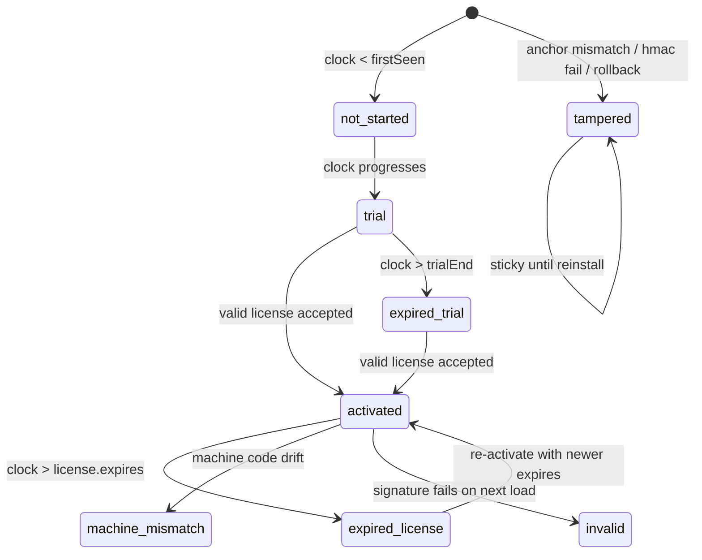
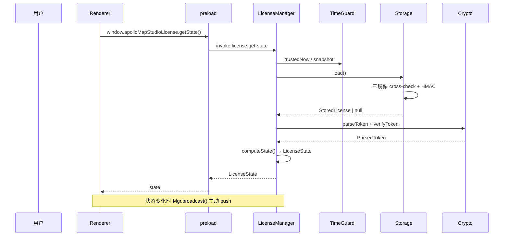
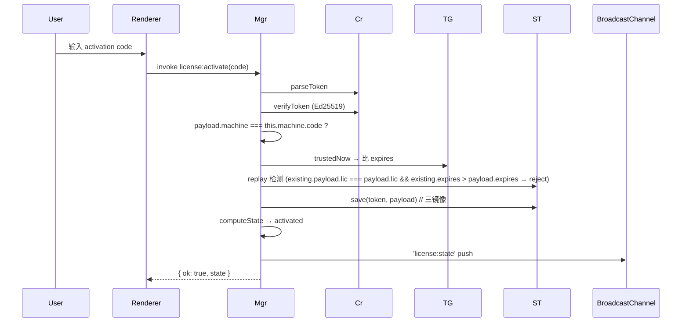

# License 系统 (License System)

> 桌面专属。Web 构建走 `src/lib/license-bridge.ts` 的 fallback，永久 trial。
> 关键文件：
>
> - `electron/license/manager.cts` —— 状态机 + IPC handler
> - `electron/license/machine-id.cts` —— 16 字符机器码
> - `electron/license/time-guard.cts` —— 时钟回拨防御
> - `electron/license/storage.cts` —— 三镜像加密存储
> - `electron/license/crypto.cts` —— Ed25519 / AES-GCM / HKDF / HMAC
> - `electron/license/public-key.cts` —— 嵌入公钥与 pepper
> - `electron/license/types.cts` —— 共享类型定义
> - `src/lib/license-bridge.ts` —— renderer 适配
> - `src/lib/editable-guard.ts` —— 编辑拦截

## 1. 设计目标

1. **完全离线**：不联网验证。激活码包含全部信息，验证在客户端完成。
2. **绑定机器**：一次签发只对一台机器有效；换机需重新签发。
3. **抗滥用**：检测时钟回拨、文件篡改、二次激活、机器指纹漂移。
4. **降级体验**：异常状态进入 read-only 而非崩溃；能展示原因。
5. **零运行时依赖**：纯 Node 内置 `crypto`。

## 2. 状态机概览



可编辑（`canEdit: true`）状态：`trial`、`activated`。
其余全部 read-only。

## 3. 顶层流程



## 4. Token 与签名

### 4.1 Wire 格式

```
APMS1.<base64url(payload)>.<base64url(ed25519-sig)>
```

`TOKEN_PREFIX = 'APMS1'`，bump 前缀即可作废所有旧 token（`parseToken`
会拒绝未知前缀，便于紧急 key rotation）。

### 4.2 LicensePayload

```ts
// electron/license/types.cts:25
interface LicensePayload {
  v: 1;
  lic: string; // license id (unique per issuance)
  machine: string; // machine code 这张证书绑的机器
  issued: number; // epoch ms
  expires: number; // epoch ms; 0 = perpetual
  features?: string[];
  name?: string;
  nonce: string; // 让两次相同 license 字节不同
}
```

### 4.3 验证

```ts
// crypto.cts:101-109
export function verifyToken(parsed): boolean {
  try {
    const sig = fromB64url(parsed.sigB64);
    if (sig.length !== 64) return false;
    return edVerify(null, Buffer.from(parsed.bodyB64, 'utf8'), getPublicKey(), sig);
  } catch {
    return false;
  }
}
```

公钥嵌入在 `public-key.cts`：

```
-----BEGIN PUBLIC KEY-----
MCowBQYDK2VwAyEAc2wnOyeb2Mb5p/byoxXv5WEJfiRMGbI54BCVSWVp63s=
-----END PUBLIC KEY-----
```

私钥永远在 `tools/license-gen/keys/private.pem`，不进发布产物。

## 5. 机器码 —— `machine-id.cts`

### 5.1 信号汇集

`collectSignals()` (`machine-id.cts:99-117`) 收集：

- `platform` / `arch`
- `release-major`（kernel 主版本号）
- `hostname`
- 第一颗 CPU model + 核心数
- `totalmem` 取整 GiB
- `stableMac()`：跳过 docker / VBox / KVM / VMware OUI 后字母序最小的物理 MAC
- `diskSerial()`：Linux `/etc/machine-id` / macOS `IOPlatformUUID` / Windows `wmic csproduct UUID`

### 5.2 派生

```
ikm = signals.join('||')
digest = HMAC_SHA256(APP_PEPPER, ikm)
code = base32_crockford(digest[0..10]) → "XXXX-XXXX-XXXX-XXXX"
```

80 bit 输出（16 字符 base32）；冲突概率可忽略。

### 5.3 持久化提示

`userData/.lic-machine.dat` 保存首次计算的机器码。
`readPersistedHint()` 让 LicenseManager 检测后续漂移：

```ts
// manager.cts:160-163
const persistedHint = readPersistedHint(this.userDataDir);
const machineDrift = persistedHint && persistedHint !== this.machine.code;
```

漂移 → status `tampered`。

## 6. TimeGuard —— 时钟防御

`time-guard.cts` 实现 4 层防御：

1. **Monotonic high-water-mark**：persisted `lastSeen`，每 60s tick
   `max(now, lastSeen)`。`now < lastSeen - GRACE(5min)` → `tampered`。
2. **Anchor mtime**：app binary / package.json 的安装时间作为下界，
   `now < anchorMtime` 不可能。
3. **Session counter**：与 wallclock 解耦，一定程度上限制"删 userData
   重启获得新 trial"的滥用（目前只记录，未强制）。
4. **Mono-vs-wall drift**：`Math.abs(dWall - dMono) > 1h && dMono < 30s`
   → 时钟跳变。

State 文件 `userData/.lic-clock.dat`：AES-GCM 加密 + HMAC 头。

`trustedNow() = max(Date.now(), state.lastSeen)`：
即便系统时钟回退，license 决策仍以历史最大值为准。

## 7. Storage —— 三镜像加密

`storage.cts` 写三份文件（`userData/`）：

| 文件              | 内容                                                 |
| ----------------- | ---------------------------------------------------- |
| `license.dat`     | AES-GCM 加密的 PrimaryV1：token + storedAt + machine |
| `.lic-state.json` | 明文 JSON：tokenHash + activatedAt + nonce + HMAC    |
| `.lic-shadow.dat` | AES-GCM 加密的 StateV1 副本                          |

读取时三份交叉比对：

```ts
// storage.ts: load()
if (!safeEqual(computedHash, state.tokenHash)) return tampered('token hash differs');
if (!safeEqual(state.tokenHash, shadow.tokenHash)) return tampered('shadow disagrees with state');
if (!safeEqual(state.machineAtActivation, shadow.machineAtActivation))
  return tampered('shadow machine differs');
if (state.activatedAt !== shadow.activatedAt) return tampered('shadow activatedAt differs');
if (!safeEqual(state.mac, expectedMac)) return tampered('state HMAC mismatch');
```

任何一项不一致 → 整个 license 视作 tampered。

## 8. KDF —— machine code → 文件密钥

```ts
// crypto.cts:122-130
function deriveKey(machineCode, info, length = 32) {
  const ikm = `${machineCode}|${APP_PEPPER}`;
  const salt = sha256(APP_PEPPER);
  return hkdfSync('sha256', ikm, salt, info, length);
}
```

不同 info 导出独立子密钥：

| 用途         | info                       |
| ------------ | -------------------------- |
| AES file enc | `apms.license.enc.v1`      |
| HMAC mac     | `apms.license.mac.v1`      |
| 文件级子密钥 | `apms.file.key.v1:<label>` |

机器码不同 → 密钥不同 → license 文件不能跨机复用。

## 9. 激活流程



错误码（`ActivationResult.errorCode`）：

| code                | 触发                      |
| ------------------- | ------------------------- |
| `invalid_format`    | 长度异常 / split !== 3    |
| `invalid_signature` | Ed25519 verify 失败       |
| `machine_mismatch`  | payload.machine ≠ 本机    |
| `expired`           | now > expires             |
| `replay`            | 已有更长 expires 的同 lic |
| `storage_error`     | 写盘失败                  |
| `unknown`           | renderer fallback (web)   |

## 10. computeState —— 状态决定函数

`manager.cts:156-291` 是单一来源的状态计算：

1. 漂移检测（machineDrift / tg.tampered） → `tampered`
2. 加载 storage：
   - tampered → `tampered`
   - 验签失败 → `invalid`
   - machine mismatch → `machine_mismatch`
   - now > expires → `expired_license`
   - else → `activated`
3. 没有 license → trial 路径：
   - now < firstSeen → `not_started`
   - now ≥ trialEnd → `expired_trial`
   - else → `trial`

每分钟 tick 一次（`refresh()`），状态变化才 broadcast。

## 11. Renderer 拦截 —— `editableGuard`

`src/lib/editable-guard.ts:21-36`：

```ts
export function assertEditable(action = 'edit'): boolean {
  const { state, promptActivation } = useLicenseStore.getState();
  if (state.canEdit) return true;
  // 5s 节流警告 + 弹激活窗
  if (now - lastWarn > WARN_INTERVAL) {
    lastWarn = now;
    console.warn(`[license] Blocked ${action}: status=${state.status}. ${state.reason}`);
    try {
      promptActivation();
    } catch {}
  }
  return false;
}
```

调用点：

- `mapStore.addEntity / updateEntity / removeEntity / reparentEntity`：
  store 入口最先 assertEditable，false 则 return 不写。
- `useActionDispatcher`：所有 action / tool / selection 在 dispatch 前
  assertEditable。
- 关键 UI 按钮：禁用态从 `isEditable()` 读。

## 12. Public API（renderer 视角）

```ts
// src/lib/license-bridge.ts
licenseBridge.getState():        Promise<LicenseState>
licenseBridge.getMachineCode():  Promise<string>
licenseBridge.activate(code):    Promise<ActivationResult>
licenseBridge.deactivate():      Promise<LicenseState>
licenseBridge.onChange(handler): () => void
```

## 13. 安全与威胁建模

| 威胁                   | 缓解                                                                              |
| ---------------------- | --------------------------------------------------------------------------------- |
| 复制 license 到他机    | machine code 绑定 + 文件密钥派生                                                  |
| 修改 expires 字段      | Ed25519 签名校验失败                                                              |
| 替换公钥               | 公钥编译进二进制；ASAR + 签名分发                                                 |
| 系统时钟回退           | TimeGuard `lastSeen` water-mark + grace 5min                                      |
| 替换 lic-state.json    | HMAC 校验 + shadow cross-check                                                    |
| 删 userData 重置 trial | 失去 active license 仍降级为新 trial（设计上允许，未来可加 server-side throttle） |
| 反编译提取 pepper      | pepper **不是密钥**，只是防止跨 app 复用；rotate 需要发版迁移                     |
| 旁路 IPC 直接写文件    | 无法绕过 HMAC + AES（密钥由机器码派生），只能造成 tampered                        |

## 14. 工具链

`tools/license-gen/`：

```bash
node tools/license-gen/gen-keys.mjs --rotate      # 生成 / 旋转 keypair
node tools/license-gen/issue.mjs --machine XXXX-XXXX-XXXX-XXXX --name "Acme" --days 365
node tools/license-gen/verify.mjs --code "APMS1.eyJ...base64..."
```

私钥保存在 `tools/license-gen/keys/private.pem`，仅运维持有；
公钥镜像由 `gen-keys.mjs` 自动写回 `electron/license/public-key.cts`。

## 15. 陷阱

1. **不要 `app.disableHardwareAcceleration()` 之后再读 disk serial** —
   GPU 加速与 wmic 无关，但避免把无关副作用带入 license 路径。
2. **不要把 LicenseState 透传给 worker** —— worker 进程隔离，guard
   只在主线程/渲染线程入口生效。
3. **`replay` 检测只允许"延期"**：管理员误发短 expires，再发长 expires
   会被接受；反之拒绝。
4. **TimeGuard tampered 是 sticky** —— 一旦置位，重置只能改安装目录或
   开发者运行 `reset()`。生产构建未暴露 reset。
5. **CI matrix package 不能签名**：`CSC_IDENTITY_AUTO_DISCOVERY: false`，
   产物未公证；签名逻辑由发布工程师本地完成。

## 16. 测试

- `electron/license/__tests__/`（暂未启用）应覆盖：
  - parseToken / verifyToken 基本契约；
  - storage round trip + 三镜像 cross-check；
  - TimeGuard rollback 检测；
  - LicenseManager activate / deactivate / replay。
- Renderer：`license-bridge.test.ts` 验证 fallback；
  `editable-guard.test.ts` 验证拦截顺序。

## 17. See also

- [Electron Integration](./electron-integration.md)
- [Build & Bundle](./build-and-bundle.md)
- [State Management](./state-management.md) —— `licenseStore` 与编辑器集成
