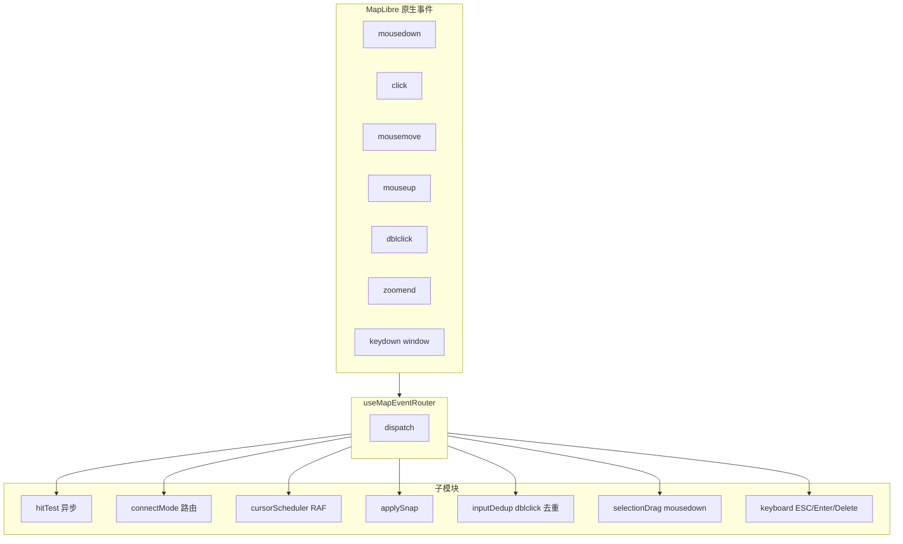
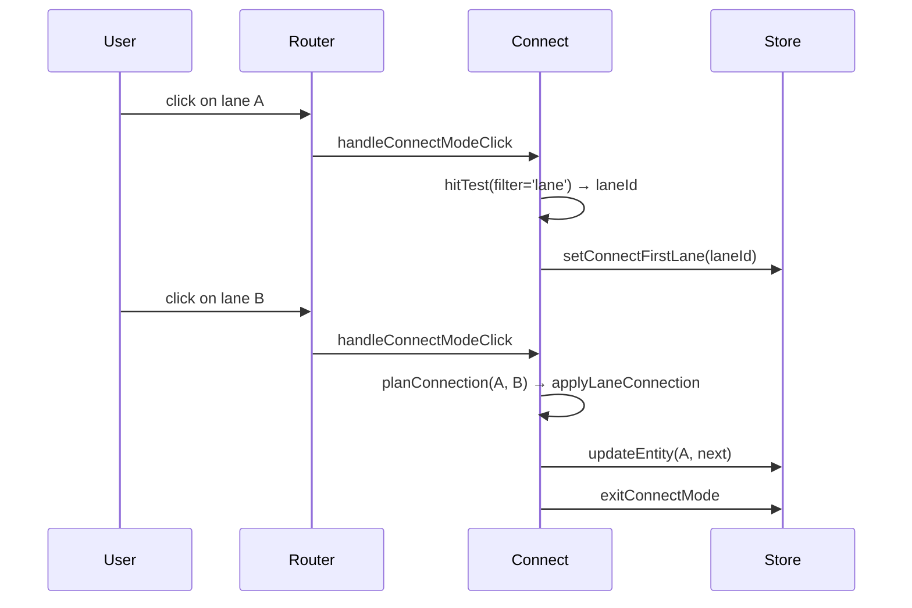

# 鼠标事件路由（Map Event Router）

`useMapEventRouter` 是地图交互的"中央调度器"。它接管 MapLibre canvas
上**所有**鼠标 / 键盘事件，按 FSM 当前状态、UI store 模式（如
connectMode）派发到 7 个子模块。每个子模块只负责一个语义切面，互不
耦合。这是把"100 行 ifelse 巨函数"拆出来后的产物。

## 一、责任范围



## 二、状态分支总图

`onClick` / `onMouseMove` 的核心都是"按 FSM state 分支"。下表覆盖
绝大多数分支：

| FSM state        | mousedown                                 | click                                        | mousemove                                 | mouseup                  |
| ---------------- | ----------------------------------------- | -------------------------------------------- | ----------------------------------------- | ------------------------ |
| `idle`           | 不处理                                    | hitTest → SELECT_ENTITY \| 否则 MOUSE_DOWN   | 清 snap target                            | MOUSE_UP                 |
| `selected`       | `selectionDrag` 处理 vertex/handle/center | hot-points 命中则消费；否则 hitTest 切换选中 | 切换 cursor + 清 snap                     | MOUSE_UP                 |
| `editingPoint`   | 不处理                                    | 不处理                                       | DRAG_MOVE（含 snap + center grab offset） | DRAG_END + updateEntity  |
| `drawBezier`     | 去重后 MOUSE_DOWN                         | （不再 MOUSE_DOWN，避免双击）                | MOUSE_MOVE（含 snap）                     | MOUSE_UP                 |
| 其它 draw\*      | 不处理                                    | 去重后 MOUSE_DOWN                            | MOUSE_MOVE                                | MOUSE_UP                 |
| 任意（dblclick） | —                                         | —                                            | —                                         | DOUBLE_CLICK             |
| 任意（ESC）      | —                                         | —                                            | —                                         | CANCEL（清 connectMode） |

## 三、子模块逐一拆解

### 3.1 `hitTest.ts`

```ts
// src/hooks/mapEventRouter/hitTest.ts:26-42
export function workerHitTest(map, bridge, e, filter?) {
  const pt = toLngLat(e);
  return bridge
    .send({ type: 'HIT_TEST', point: pt, radius: pixelToRadius(map, HIT_TEST_RADIUS_PX) })
    .then((result) => {
      if (result.type !== 'HIT_RESULT' || result.hits.length === 0) return null;
      const hit = filter ? result.hits.find((h) => filter(h.entityType)) : result.hits[0];
      return hit?.id ?? null;
    })
    .catch(() => null);
}
```

- 把鼠标位置转为 lng/lat，半径转为 lng 度数 `pixelToRadius`。
- 异步走 worker（`bridge.send`），不阻塞 click handler。
- 可选 `filter` 让调用方限制只命中 lane（connectMode 用）。
- 失败安全：`.catch(() => null)`，worker 死掉不会让 UI 崩。

### 3.2 `connectMode.ts`

ConnectMode 是 UI 上"连两条 lane"的模式：用户点第一条 lane → 高亮 →
点第二条 lane → reconcile 写入 pred/succ。

`handleConnectModeClick(actorRef, hitTest, e)` 返回 boolean，true 表
示已消费该 click（`useMapEventRouter` 直接 return）。流程：



错误兜底：`finally { exitConnectMode + SELECT_ENTITY(source) }`，
失败也要恢复 UI 状态。

### 3.3 `cursorScheduler.ts`

把 mousemove 的 lng/lat 写入 `uiStore.cursorLngLat` 是高频操作（60+
fps）。`createCursorScheduler` 在每一帧合并到一次 `setCursorLngLat`：

```ts
// src/hooks/mapEventRouter/cursorScheduler.ts:4-30
let pendingCursorLngLat: LngLat | null = null;
let cursorRafId: number | null = null;
schedule(point) {
  pendingCursorLngLat = point;
  if (cursorRafId === null) cursorRafId = requestAnimationFrame(flushCursor);
}
```

意义：StatusBar 显示坐标的更新被天然 throttle 到 60fps。

### 3.4 `snap.ts`（router 侧）

`applySnap(map, actorRef, lngLat, excludeId)` 是吸附的 entry：

- 仅在 `editingPoint` 或 draw\* 状态下生效。
- 从 `mapStore.entities` + 当前 zoom 算 `radiusM = pixelsToMeters(SNAP_RADIUS_PX, lat, zoom)`。
- 调 `findSnapTarget`（geometry 层）拿到 `SnapTarget`。
- 写 `uiStore.setSnapTarget(target)` —— 触发 snap 指示器渲染。
- 返回吸附后的 lng/lat（或原值）。

### 3.5 `inputDedup.ts`：dblclick 去重

dblclick 在浏览器里是**两次 click + 一次 dblclick**。如果不去重，FSM
会先收到两个 MOUSE_DOWN，再收到一个 DOUBLE_CLICK，导致绘制时多落一个
点。`isDuplicateInput`：

```ts
// src/hooks/mapEventRouter/inputDedup.ts:16-21
export function isDuplicateInput(prev, next) {
  if (!prev) return false;
  const dx = next.x - prev.x;
  const dy = next.y - prev.y;
  return Math.hypot(dx, dy) < 4 && next.ts - prev.ts < 350;
}
```

阈值：4px / 350ms（DBLCLICK_PX_TOLERANCE / DBLCLICK_MS_WINDOW）。
路由器在 draw 状态的 MOUSE_DOWN 路径上调用；在 dblclick 触发时
`lastDrawInput = null` 重置。

### 3.6 `selectionDrag.ts`

`selected` 状态的 mousedown 由它接管：

- 命中 `hot-points`（顶点/手柄）：根据 `props.role`/`props.handleType`
  决定 dragPointType（`vertex` / `handleIn` / `handleOut`），发
  `START_DRAG`；按住 alt 切 smooth/break。
- 命中 `hot-fill`（实体内部）：进入"中心拖拽"模式，索引 `-2`，并计算
  `centerGrabOffset = mouseLngLat - entityCenter`，避免抓取点突然跳到
  实体中心。
- 都没命中：返回 `{ handled: false }`，让外层接着分支。

### 3.7 `keyboard.ts`

监听 window-level `keydown`：

| 键                     | 行为                                                                  |
| ---------------------- | --------------------------------------------------------------------- |
| `Escape`               | 清 centerGrabOffset → exitConnectMode → FSM `CANCEL`                  |
| `Enter`                | FSM `CONFIRM`                                                         |
| `Delete` / `Backspace` | 选中态下：vertex 删点（`deleteVertex`）或 整体删除（`DELETE_ENTITY`） |

## 四、Mid-draw cancel

设计目标：用户画到一半按 ESC，应该**完全回到 idle**，drawPoints 清空，
撤销栈不污染。FSM 的 `CANCEL` transition 在每个 draw\* state 都有声明
（见 [FSM Design](./fsm-design.md)）。Router 这边只把 `Escape` 映射成
`CANCEL`：

```ts
// src/hooks/mapEventRouter/keyboard.ts:12-18
if (e.key === 'Escape') {
  clearCenterGrabOffset();
  if (useUIStore.getState().connectMode.active) {
    useUIStore.getState().exitConnectMode();
  }
  actorRef.send({ type: 'CANCEL' });
}
```

附加副作用：connectMode 也一并退出。

## 五、Alt 键平滑切换

在 `selected` 状态下点中一个 vertex 时按住 alt，会**就地切换 smooth /
break**（贝塞尔锚点的两侧手柄是否对称）：

```ts
// src/hooks/mapEventRouter/selectionDrag.ts:50-55
if (altKey && pType === 'vertex') {
  const entityId = snap.context.selectedEntityId;
  if (entityId) toggleEntitySmooth(entityId, idx);
  actorRef.send({ type: 'TOGGLE_SMOOTH', index: idx });
  return { handled: true };
}
```

`toggleEntitySmooth` 区分两种来源：原生贝塞尔实体走 `toggleSmooth`，
Apollo 实体（drawTool='drawBezier' + `_source.anchors`）走
`toggleSmoothApollo`。

## 六、Click vs MouseDown 区分（防误触）

`onClick` 检查 `mouseDownScreenPos` 与当前 click 位置的距离 —— 超过
`CLICK_THRESHOLD_PX` 就视为"用户其实在拖动地图，不是点击"，直接
return。这防止 pan 完成时 maplibre 触发的 click 被误当作选中操作。

```ts
// src/hooks/useMapEventRouter.ts:65-69
if (mouseDownScreenPos) {
  const dx = e.point.x - mouseDownScreenPos.x;
  const dy = e.point.y - mouseDownScreenPos.y;
  if (Math.hypot(dx, dy) > CLICK_THRESHOLD_PX) return;
}
```

## 七、Public surface

| 入口                                             | 文件                   | 类型       |
| ------------------------------------------------ | ---------------------- | ---------- |
| `useMapEventRouter(mapRef, actorRef, bridgeRef)` | `useMapEventRouter.ts` | React hook |
| `isDuplicateInput`                               | `inputDedup.ts`        | 测试用导出 |
| `workerHitTest` / `hitBbox` / `pixelToRadius`    | `hitTest.ts`           | 子模块     |
| `handleConnectModeClick`                         | `connectMode.ts`       | 子模块     |
| `createCursorScheduler`                          | `cursorScheduler.ts`   | 子模块     |
| `applySnap`                                      | `snap.ts`              | 子模块     |
| `handleSelectedMouseDown`                        | `selectionDrag.ts`     | 子模块     |
| `handleMapKeyDown`                               | `keyboard.ts`          | 子模块     |

## 八、Pitfalls

1. **不要在 router 内部直读 store 后又同步派 FSM 事件**：FSM 的
   `getSnapshot()` 反映**事件派发前**的状态；用最新 store 推 FSM 是
   正确顺序，反过来会读到陈旧 selectedEntityId。
2. **hitTest 是 Promise**：所有依赖 hitTest 结果的分支必须在 `.then()`
   里**再次校验当前 FSM state**，防止异步回调时用户已切到另一个状态。
3. **center grab offset 必须在拖拽结束时清掉**：否则下次拖拽会带上
   旧偏移值。`clearCenterGrabOffset` 在 ESC / `mouseup` 路径上都被
   显式调用。
4. **dblclick + click 顺序**：浏览器是 click → click → dblclick；
   `isDuplicateInput` 拦截的是第二个 click，dblclick 单独走自己的
   handler。
5. **window-level keydown**：`onKeyDown` 注册在 window 上，所以即使
   焦点在右侧 inspector 的 input 里，ESC 也会触发；如果未来想让 input
   "吃掉"按键，需要在 `handleMapKeyDown` 入口加 `e.target` 检查。

## 九、Source map

| 概念            | 文件                                          | 行    |
| --------------- | --------------------------------------------- | ----- |
| 主路由          | `src/hooks/useMapEventRouter.ts`              | 1-235 |
| hitTest         | `src/hooks/mapEventRouter/hitTest.ts`         | 1-43  |
| connectMode     | `src/hooks/mapEventRouter/connectMode.ts`     | 1-58  |
| cursorScheduler | `src/hooks/mapEventRouter/cursorScheduler.ts` | 1-32  |
| inputDedup      | `src/hooks/mapEventRouter/inputDedup.ts`      | 1-22  |
| snap            | `src/hooks/mapEventRouter/snap.ts`            | 1-40  |
| selectionDrag   | `src/hooks/mapEventRouter/selectionDrag.ts`   | 1-87  |
| keyboard        | `src/hooks/mapEventRouter/keyboard.ts`        | 1-46  |
| FSM source      | `src/core/fsm/editorMachine.ts`               | —     |

## 十、测试要点

| 测试                        | 覆盖                                           |
| --------------------------- | ---------------------------------------------- |
| `useMapEventRouter.test.ts` | click vs mouseup 阈值；hitTest async race      |
| `inputDedup.test.ts`        | dblclick px / ms 阈值                          |
| `selectionDrag.test.ts`     | center grab offset 计算；alt smooth 切换       |
| `connectMode.test.ts`       | 第一/第二条 lane click；error fallback         |
| `keyboard.test.ts`          | ESC 清 connectMode；Delete 删 vertex vs entity |

## 十一、调试技巧

- **click 不响应**：检查 `mouseDownScreenPos` 距离阈值；如果 pan 完成
  时 click 被丢弃，可能是 `CLICK_THRESHOLD_PX` 设得太低（默认值见
  `mapConstants.ts`）。
- **绘制点偏移**：通常是 snap 写回了 wrong target；在 `applySnap` 里
  log target，确认是否选中了不该选的实体。
- **dblclick 落多点**：`isDuplicateInput` 阈值不够 —— 如果用户用
  trackpad 触发，可以把 PX_TOLERANCE 调到 6。

## 十二、扩展指南

新加一种交互模式（如"测距"模式）：

1. 在 `uiStore` 加 `measureMode: { active: boolean; firstPoint?: GeoPoint }`。
2. 在 `useMapEventRouter` 的 `onMouseDown` 早期路径加：
   ```ts
   if (useUIStore.getState().measureMode.active) {
     handleMeasureClick(actorRef, e);
     return;
   }
   ```
3. 写 `handleMeasureClick.ts` 子模块（参考 `connectMode.ts` 的结构）。
4. ESC 在 `keyboard.ts` 里把 measureMode 也清掉。

新加一种快捷键：

1. 在 `keyboard.ts` 的 `handleMapKeyDown` 添加分支。
2. 与 Action Registry 对齐：如果该快捷键已被某 action 占用，应该走
   action dispatcher 而非直接调 FSM。
3. 加一行测试 `keyboard.test.ts`。

## 十三、See also

- [FSM Design](./fsm-design.md)
- [Spatial Index](./spatial-index.md)
- [Geometry Engine](./geometry-engine.md)
- [Cold / Hot Layers](./cold-hot-layers.md)
- [Junction Stitching](./junction-stitching.md)
