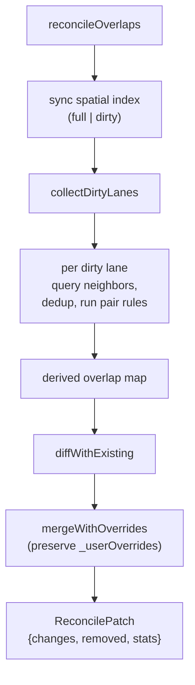

# Overlap Derivation

Apollo's HD-map proto includes an `Overlap` message — every place a lane
intersects another lane, a crosswalk, a junction, a stop sign, etc. produces
one `Overlap` entry. Apollo Map Studio derives these entirely from geometry;
users do not author overlap entities by hand.

The derivation pipeline lives under `src/core/elements/overlap/`. It's
incremental, override-aware, and runs both on the main thread (per-edit) and
in a Web Worker (full recompute).

## Subtree

```
src/core/elements/overlap/
  ├── index.ts             ← public API barrel
  ├── reconcile.ts         ← main reconcile entry
  ├── intersect.ts         ← geometric primitives (bbox, segment, polygon-in-point)
  ├── pairTable.ts         ← per-pair-type rules (lane×lane, lane×crosswalk, ...)
  ├── geometryAdapters.ts  ← getCenterline / isOverlapParticipant / ...
  ├── computeLaneS.ts      ← per-lane arc-length cache for proto S-coordinate
  ├── laneCorridor.ts      ← lane corridor expansion (centerline + ½ width)
  ├── polyClip.ts          ← polygon-clipping wrapper for lane × area regions
  ├── overlapId.ts         ← makeOverlapId + isDerivedOverlapId
  ├── regionId.ts          ← makeRegionId for RegionOverlapInfo
  ├── overridePaths.ts     ← _userOverrides path constants
  ├── spatialIndex.ts      ← main-thread RBush mirror
  └── types.ts             ← BBox / IndexNode / ReconcileMode / ReconcilePatch
```

## Reconcile entry

```ts
// src/core/elements/overlap/reconcile.ts:57-155
function reconcileOverlaps(
  entities: ReadonlyMap<string, MapEntity>,
  mode: ReconcileMode, // { mode: 'full' } | { mode: 'incremental', dirtyIds }
  index?: SpatialIndex,
): ReconcilePatch;
```

Returns:

```ts
interface ReconcilePatch {
  changes: Map<string, MapEntity>; // overlap entities to add or update
  removedOverlapIds: Set<string>; // overlap entities to delete
  stats: {
    pairsTested: number;
    pairsMatched: number;
    overlapsCreated: number;
    overlapsRemoved: number;
    durationMs: number;
  };
}
```

`mapStore.applyOverlapPatch` (`src/store/mapStore.ts:76-84`) writes the
patch into `state.entities` inside the same immer producer as the originating
edit, so undo replays both as one zundo step.

## Modes

### Full

Used by `mapStore.batchImport` (`mapStore.ts:184-198`) and by
`recomputeOverlapsAsync` after the worker finishes (`mapStore.ts:236-257`).

Walks every `lane` × every spatial neighbour, builds `derived` map keyed by
sorted-participant id, then diffs against existing overlap entities to
produce changes + removals. ~450 ms for a 50k-entity map; CPU-bound, runs
synchronously on the main thread for `batchImport` and offloaded to the
overlap worker for `recomputeOverlapsAsync`.

### Incremental

Used by `addEntity` / `updateEntity` / `removeEntity`. The pipeline:

1. `collectDirtyLanes` — `dirtyIds` are the explicitly mutated entities;
   non-lane participants (crosswalks, stop signs, …) expand via the
   spatial index to their bbox-overlapping lanes
   (`reconcile.ts:177-201`).
2. For each dirty lane, query neighbours from the spatial index, dedup the
   pairs by sorted-participant id, and run the relevant pair rule from
   `pairTable.ts`.
3. Diff the new derived set against existing overlaps **with scope**:
   only overlaps where at least one participant is dirty are eligible for
   removal — distant overlaps survive untouched.
4. Apply `_userOverrides` (the "pin" mechanism, see below).

Source: `src/core/elements/overlap/reconcile.ts:213-302`.

## Pair rules

`pairTable.ts` declares which entity-type combinations produce overlaps and
how:

| Pair                    | Geometry                                              | Output objects                                                                        |
| ----------------------- | ----------------------------------------------------- | ------------------------------------------------------------------------------------- |
| `lane` × `lane`         | segment intersection along centerlines                | two `ObjectOverlapInfo { laneOverlapInfo: { startS, endS, isMerge } }` — one per lane |
| `lane` × `crosswalk`    | corridor expansion intersected with crosswalk polygon | `{ laneOverlapInfo, crosswalkOverlapInfo }` plus a `RegionOverlapInfo`                |
| `lane` × `junction`     | corridor inside junction polygon                      | `{ laneOverlapInfo, junctionOverlapInfo }`                                            |
| `lane` × `stopSign`     | stop line proximity                                   | `{ laneOverlapInfo, stopSignOverlapInfo }`                                            |
| `lane` × `signal`       | signal stop line projected onto lane                  | `{ laneOverlapInfo, signalOverlapInfo }`                                              |
| `lane` × `yieldSign`    | yield line projection                                 | `{ laneOverlapInfo, yieldSignOverlapInfo }`                                           |
| `lane` × `clearArea`    | corridor inside clear area polygon                    | `{ laneOverlapInfo, clearAreaOverlapInfo }`                                           |
| `lane` × `speedBump`    | bump line projected onto lane                         | `{ laneOverlapInfo, speedBumpOverlapInfo }`                                           |
| `lane` × `pncJunction`  | corridor inside PNC junction polygon                  | `{ laneOverlapInfo, pncJunctionOverlapInfo }`                                         |
| `lane` × `parkingSpace` | corridor inside parking polygon                       | `{ laneOverlapInfo, parkingSpaceOverlapInfo }`                                        |

For non-lane pairs, the participant order is always (lane, other) — Apollo
proto puts the lane participant first. `findPairRule` returns `null` for
combinations that don't produce overlaps; those pairs short-circuit.

## Lane corridor expansion

A lane's "corridor" is the lane's centerline buffered by its left/right
half-width — a thick strip whose interior is the drivable area. The
overlap pipeline expands lanes into corridors before intersecting them
with crosswalks / clear-areas / parking spaces / junctions, because the
proto expects "full corridor inside the area", not "centerline-only crosses
boundary".

Source: `src/core/elements/overlap/laneCorridor.ts`. The expansion uses
`offsetPolylineDeg` from the geometry engine — same primitive that
draws lane boundaries.

## RegionOverlapInfo

Crosswalks and clear-areas produce a _region_ — a polygonal sub-area of
the lane corridor that's covered by the overlapping entity. The region is
emitted as a `RegionOverlapInfo` separate from the per-object `ObjectOverlapInfo`:

```ts
{
  id: 'region_<participants>_0',
  polygons: [{ points: [...] }],
}
```

Each `ObjectOverlapInfo` referencing a region carries the `regionOverlapId`
back-reference, so consumers (Apollo planner, simulators) can find the
region geometry from the overlap entry.

`makeRegionId(participants, index)` ensures region ids are stable across
reconciles. The participants list is sorted before hashing, so
`makeRegionId(['L1', 'C1'], 0)` and `makeRegionId(['C1', 'L1'], 0)` agree.

## Override paths and the pin mechanism

::: warning Why overrides exist
Some overlap fields look "derived" but users sometimes need to override them.
The most common: `isMerge` on a lane × lane overlap. Geometry says "these
lanes touch tangentially" but Apollo planner needs the user to declare this
as a merge vs a junction crossing. Likewise, the auto-derived `regionOverlaps`
polygon may not match the operationally-correct region polygon for a
crosswalk that visually extends beyond the painted markings.
:::

Each `OverlapEntity` carries an optional `_userOverrides: string[]` array of
path expressions:

| Path                                 | Meaning                                                           |
| ------------------------------------ | ----------------------------------------------------------------- |
| `objects[i].laneOverlapInfo.isMerge` | preserve the user-edited isMerge for ObjectOverlapInfo at index i |
| `regionOverlaps`                     | preserve the entire `regionOverlaps[]` array                      |

`mergeWithOverrides` (`reconcile.ts:285-358`) parses the override paths
once per overlap and re-applies the preserved values from the existing
overlap onto the freshly-derived one. Without overrides, the overlap is
fully geometry-driven; with overrides, the pinned fields survive future
reconciles.

The path constants and parser live at
`src/core/elements/overlap/overridePaths.ts`.

## ID semantics

```ts
makeOverlapId(participantIds: string[]): string  // 'overlap_' + sortedIds.join('_')
isDerivedOverlapId(id: string): boolean          // tests against the prefix
```

Sorting the participants makes the id symmetric in (A, B): the same overlap
id results regardless of which lane was the "dirty side" of an incremental
edit. This was load-bearing for the GAP-3 fix in the architecture audit —
the prior version ordered by `lane.id < lo.id` and silently dropped pairs
whose dirty side was lexicographically larger.

::: info First reconcile after import
The first reconcile after importing an Apollo map normalises imported
overlap ids to the local sorted-participant form. This is **destructive**
to the original Apollo overlap id ordering. The trade-off was deliberate:
keeping a "preserve imported id" branch made the diff logic gnarly and
allowed silent drift between the imported id and what reconcile would
produce next. Single id system → set-diff is consistent.
:::

## Spatial index

The reconcile pipeline uses its own `SpatialIndex` mirror — see
`src/core/elements/overlap/spatialIndex.ts`. `getSharedSpatialIndex()`
returns a process-level singleton that all reconcile calls share.

The singleton has two sync entry points:

| Method                     | When                                   |
| -------------------------- | -------------------------------------- |
| `syncFromEntities(all)`    | full mode — rebuild from scratch       |
| `syncDirty(all, dirtyIds)` | incremental — only update dirty bboxes |

After the overlap **worker** runs `recomputeOverlapsAsync`, the main thread
calls `resetSharedSpatialIndex()` so the next incremental edit triggers a
full rebuild rather than a possibly-stale delta. See
[State Management](./state-management.md) and the comment block at
`src/store/mapStore.ts:251-253`.

## polyClip

Region computation for crosswalks/clear-areas uses `polygon-clipping` (the
npm package) to compute the polygon intersection of the lane corridor and
the area polygon. `src/core/elements/overlap/polyClip.ts` is a thin wrapper
that:

- Coerces input rings to the package's expected shape (closed, CCW).
- Returns the largest output polygon by area when multiple disjoint
  intersections exist (the data model accepts a single polygon per
  region).
- Falls back to `null` when intersection is empty or degenerate.

## computeLaneS

Apollo overlap entries record `startS` and `endS` along the lane's
centerline arc-length parameter. Computing arc-length from a polyline is
expensive at scale, so `computeLaneS` caches per-lane arc-length tables
keyed by lane id.

`invalidateLaneArcLength(id)` (called from `mapStore.removeEntity` for
deleted lanes, and from `reconcile.ts` whenever a lane geometry mutates)
drops the cache so the next reconcile recomputes.

## Reconcile flow



## Related Modules

- `src/store/mapStore.ts` — invokes reconcile on every edit.
- `src/core/workers/overlap.worker.ts` + `overlapBridge.ts` — full
  reconcile in a worker for `recomputeOverlapsAsync`.
- `src/core/geometry/laneTopology.ts` — pred/succ/junctionId reconcile,
  runs before overlap reconcile in the same edit.

See [Geometry Engine](./geometry-engine.md) for the primitives this
pipeline depends on.
