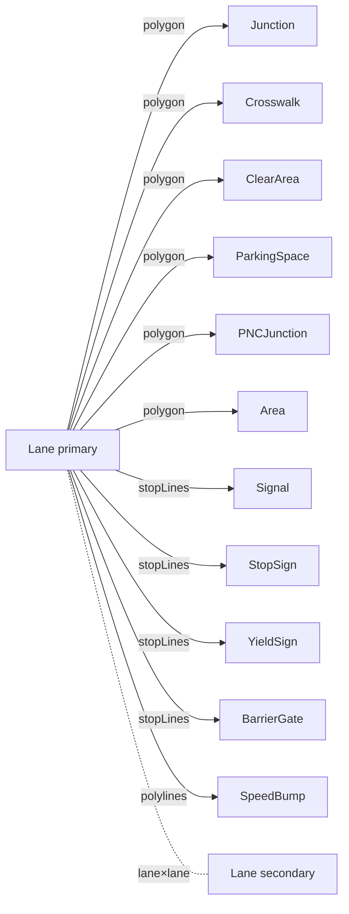

# 重叠推导（Overlap Derivation）

Apollo HD Map proto 把"lane 与 junction / crosswalk / signal 等其它
对象在地面上的相交"建模成 `OverlapEntity`，每个 overlap 包含两个
`ObjectOverlapInfo`，其中 lane 一侧带 `start_s` / `end_s` 弧长区间。
Apollo Map Studio 把它做成**几何派生事实**：用户编辑几何 → 自动
reconcile 出 OverlapEntity 集合；导出 proto 时直接落盘。

## 一、设计取舍

| 设计选择                                     | 理由                                                       |
| -------------------------------------------- | ---------------------------------------------------------- |
| Overlap 由几何派生，不让用户手画             | Apollo proto 里 lane.overlap_id[] 必须配对存在，手工易遗漏 |
| 单一 ID 体系：`overlap_<sortedParticipants>` | A→B 与 B→A 派生出同一 id，diff 自动幂等                    |
| 增量模式跑 dirty 闭包                        | 编辑期 < 16ms 帧预算                                       |
| 用户可"pin"个别字段                          | `_userOverrides` 支持手工锁 isMerge / region polygon       |
| lane × lane 单独路径                         | 因为 LaneOverlapInfo 是 oneof 中唯一带 startS/endS 的分支  |

## 二、配对类型矩阵



每个对子由 `PairRule` 指定：

```ts
// src/core/elements/overlap/pairTable.ts:106-127
export const PAIR_RULES: readonly PairRule[] = [
  makeRule('junction', 'polygon', (o) => ({ objectType: 'junction', objectId: o.id })),
  makeRule('crosswalk', 'polygon', (o, opts) => { ... }, true /* computeRegion */),
  makeRule('clearArea', 'polygon', (o) => ({ objectType: 'clearArea', objectId: o.id })),
  makeRule('parkingSpace', 'polygon', (o) => ({ objectType: 'parkingSpace', objectId: o.id })),
  makeRule('pncJunction', 'polygon', (o) => ({ objectType: 'pncJunction', objectId: o.id })),
  makeRule('area', 'polygon', (o) => ({ objectType: 'area', objectId: o.id })),
  makeRule('signal', 'stopLines', (o) => ({ objectType: 'signal', objectId: o.id })),
  makeRule('stopSign', 'stopLines', (o) => ({ objectType: 'stopSign', objectId: o.id })),
  makeRule('yieldSign', 'stopLines', (o) => ({ objectType: 'yieldSign', objectId: o.id })),
  makeRule('barrierGate', 'stopLines', (o) => ({ objectType: 'barrierGate', objectId: o.id })),
  makeRule('speedBump', 'polylines', (o) => ({ objectType: 'speedBump', objectId: o.id })),
];
```

## 三、几何检测分发

`detectPair(lane, other, rule)` 依 `rule.geometry` 分支：

| Geometry      | 算法                                                     | 弧长区间                          |
| ------------- | -------------------------------------------------------- | --------------------------------- |
| `polygon`     | `polylineIntersectsPolygon` + `polylinePolygonCrossings` | 取最早/最晚穿越点投影到 lane 弧长 |
| `stopLines`   | `polylinesIntersect` + `polylinePolylineCrossings`       | 多条 stopLine 的最小/最大交点     |
| `polylines`   | 同上                                                     | speedBump 用                      |
| `lane × lane` | 单独 `detectLaneLanePair`                                | 跨纬度 cosLat 局部修正            |

### 3.1 lane × lane 触发条件

```ts
// pairTable.ts:230-272
const sameJunction = laneA.junctionId !== null && laneA.junctionId === laneB.junctionId;
const crosses = polylinesIntersect(centerA, centerB);

if (sameJunction) {
  hits = crosses || mergeAtEnd || mergeAtStart;
} else {
  hits = crosses && !anyEndpointTouch; // 端点重合 = pred/succ，不算 overlap
}
```

设计意图：

- **同一 junction 内**：穿越 / 端点合流 / 分流都视为冲突点（车端规
  划要避让）。
- **junction 外**：纯端点重合是 pred/succ 拓扑；只有真实穿越才算
  overlap（高速 ramp 等几何穿越但不在 junction 的场景）。

### 3.2 region overlap（GAP-5）

lane × crosswalk 额外计算"精确相交多边形"（`computeRegionPolygon`）：
用 lane corridor（左右边界 + close ring）与 crosswalk polygon 做
polygon clipping（`polygon-clipping` 包），取面积最大块。结果作为
`RegionOverlapInfo` 嵌进 `OverlapEntity.regionOverlaps[]`，并把
`regionOverlapId` 嵌进 lane 一侧的 `LaneOverlapInfo` 与 crosswalk 一侧
的 `ObjectOverlapInfo`。

Pinned 机制：`_userOverrides: ['regionOverlaps']` 让用户在 inspector
里 pin 住 region polygon，几何重算不会覆盖。

## 四、reconcile 主入口

```ts
// src/core/elements/overlap/reconcile.ts:57-155
export function reconcileOverlaps(entities, mode, index?) {
  const idx = index ?? getSharedSpatialIndex();
  if (mode.mode === 'full') idx.syncFromEntities(entities);
  else idx.syncDirty(entities, mode.dirtyIds);

  const dirtyLanes = collectDirtyLanes(entities, mode, idx);
  const derived = new Map<string, DerivedOverlap>();

  for (const lane of dirtyLanes) {
    const bbox = bboxOfPoints(centerline);
    const neighbors = idx.queryBBox(bbox).filter((n) => n.id !== lane.id);

    for (const n of neighbors) {
      // lane × lane / 通用 PAIR_RULES 匹配
    }
  }

  return diffWithExisting(entities, derived, mode);
}
```

### 4.1 模式

| Mode                                | 输入          | 用法                                 |
| ----------------------------------- | ------------- | ------------------------------------ |
| `{ mode: 'full' }`                  | 全量 entities | 导入完成 / 用户手动重算 / 导出前校验 |
| `{ mode: 'incremental', dirtyIds }` | dirty 闭包    | 编辑期每次 mutate 后                 |

### 4.2 Dirty 闭包

`collectDirtyLanes`：把 dirtyIds 中的 lane 直接收入；非 lane 的
overlap-participant（junction / crosswalk / …）则用其 bbox 反查 R-tree
邻居，把"几何上靠近"的 lane 带进 dirty 集。这样改一个 junction polygon
不需要全量重算 —— 只重算与该 junction 几何相交的那几条 lane。

### 4.3 Set diff

`diffWithExisting` 把派生集合 vs 现有 OverlapEntity 做幂等 set diff：

- 派生有、现有无 → 新建 OverlapEntity
- 派生无、现有有 → 标记删除（非 dirty 范围跳过）
- 都有但内容变 → 更新（保留 `_userOverrides` 中钉位字段）

最后调 `applyOverlapIdsBack` 把每个参与实体的 `overlapIds[]` 按 derived
集回写。

## 五、Public surface

| 入口                                             | 文件                  | 用途                                        |
| ------------------------------------------------ | --------------------- | ------------------------------------------- |
| `reconcileOverlaps(entities, mode, index?)`      | `reconcile.ts:57`     | 主入口                                      |
| `invalidateLaneCaches(removedIds)`               | `reconcile.ts:461`    | lane 删除时清 arc-length 缓存               |
| `getSharedSpatialIndex`                          | `spatialIndex.ts:212` | 模块级 singleton                            |
| `bboxForEntity`                                  | `spatialIndex.ts:37`  | 算实体 bbox                                 |
| `makeOverlapId(participants)`                    | `overlapId.ts`        | 生成 sorted 派生 id                         |
| `isDerivedOverlapId(id)`                         | 同上                  | 区分派生 id 与 imported 残留                |
| `PAIR_RULES`、`detectPair`、`detectLaneLanePair` | `pairTable.ts`        | 几何检测                                    |
| `laneArcLength`、`projectSegmentParam`           | `computeLaneS.ts`     | 累计弧长 / 段参数投影                       |
| `laneCorridorPolygon`                            | `laneCorridor.ts`     | 走廊多边形（region polygon 算法的 subject） |

## 六、recompute 触发点

| 触发                                               | 路径                                   | 模式        |
| -------------------------------------------------- | -------------------------------------- | ----------- |
| `mapStore.addEntity / updateEntity / removeEntity` | dirtyIds 闭包                          | incremental |
| 导入 Apollo 完成                                   | apolloMapStore 接管后立即              | full        |
| Inspector "重算 overlaps" 按钮                     | 命令面板触发                           | full        |
| 导出 proto 前                                      | 写入前自检                             | full        |
| undo / redo                                        | mapStore 恢复 entities，触发 dirty=ALL | full        |

## 七、性能预算

| 量级        | full reconcile | incremental（dirty=1） |
| ----------- | -------------- | ---------------------- |
| 1k entities | 5-10ms         | < 1ms                  |
| 5k entities | 30-50ms        | 1-3ms                  |
| 5w entities | 200-500ms      | 5-10ms                 |

主要开销：`detectPair` 的多边形相交（O(L · P) 每对 lane × polygon），
和 `polylinePolylineCrossings` 的 lane × lane O(N · M)。spatial index
把"邻居数"压到常数级。

## 八、Pitfalls

1. **不能在 reconcile 内部手改 entities**：reconcile 是纯函数，
   返回 `ReconcilePatch` 由 store 一次性 apply（保证 zundo 单事务）。
2. **lane.junctionId 与 OverlapEntity{lane, junction} 必须一致**：
   `laneTopology` 的 junctionId 派生与 overlap 的 lane × junction 检测
   都基于"中心线穿越多边形"。如果你修改了 polygon 几何但没有进
   reconcile，这两侧会失同步。
3. **arc length 缓存失效**：`reconcile.ts:461` 的
   `invalidateLaneCaches(removedIds)` 必须在 lane 删除路径上调用，
   否则 `laneArcLength` 会拿到旧 prefix。
4. **`bboxOfPoints` 空集返回 null**：早期 buggy 版本返回零 bbox，会
   被 R-tree 命中所有包含原点的查询。现在 caller 都需要 null-guard。
5. **lane × lane 端点重合**：sameJunction 内才算 overlap；junction
   外的端点重合（4 种组合）属于 pred/succ 拓扑，由 laneTopology 处理，
   **不**进 overlap 表。

## 九、Source map

| 概念             | 文件                                            | 行    |
| ---------------- | ----------------------------------------------- | ----- |
| reconcile 主入口 | `src/core/elements/overlap/reconcile.ts`        | 1-463 |
| 配对规则         | `src/core/elements/overlap/pairTable.ts`        | 1-281 |
| 几何相交原语     | `src/core/elements/overlap/intersect.ts`        | 1-212 |
| 多边形 clip      | `src/core/elements/overlap/polyClip.ts`         | 1-126 |
| Lane corridor    | `src/core/elements/overlap/laneCorridor.ts`     | 1-61  |
| 累计弧长         | `src/core/elements/overlap/computeLaneS.ts`     | 1-76  |
| 空间索引         | `src/core/elements/overlap/spatialIndex.ts`     | 1-219 |
| ID 生成          | `src/core/elements/overlap/overlapId.ts`        | 1-30  |
| Region ID 生成   | `src/core/elements/overlap/regionId.ts`         | 1-30  |
| 几何 adapter     | `src/core/elements/overlap/geometryAdapters.ts` | 1-132 |
| 公开类型         | `src/core/elements/overlap/types.ts`            | 1-70  |

## 十、测试要点

| 测试 | 覆盖 |
| ---------------------- | ------------------------------------------ | ----- | --- |
| `reconcile.test.ts` | full vs incremental；id 派生稳定；arr 回写 |
| `pairTable.test.ts` | 各 PAIR_RULE 与 lane×lane 检测分支 |
| `intersect.test.ts` | 几何相交原语（包括退化输入） |
| `polyClip.test.ts` | 多边形求交、largestRing |
| `computeLaneS.test.ts` | 弧长前缀缓存与 invalidation |
| `spatialIndex.test.ts` | bbox 签名 dedup；syncDirty O( | dirty | ) |

## 十一、FAQ

**Q: 同一对实体被多次 detectPair 命中（A→B 与 B→A），会重复创建
overlap 吗？**

A: 不会。`makeOverlapId([A, B])` 内部排序参与者 id，所以两次调用拿
到同一 overlap id；`derived: Map<id, ...>` 自动幂等。

**Q: 用户 pin 了一个 overlap 的 isMerge=true 后，删了其中一条 lane
会怎样？**

A: 该 overlap 在 derived 集合里不再出现 → 进入 `removedOverlapIds`
→ 被删除。pin 的字段保护是"如果还存在就保留"，**不**保护"如果消失了
还要把它复活"。

**Q: lane × stopLine 检测的 stopLine 来自哪？**

A: `getStopLines(other)`（geometryAdapters）：signal 的
`stopLines: Curve[]`、stopSign / yieldSign 的 `stopLines`、
barrierGate 的 `stopLine`。每条 stopLine 都被当作折线检测交点。

**Q: lane corridor polygon 用什么 boundary？**

A: 优先用 `explicitLaneBoundaryEdges(lane)`（如果有显式
left/right boundary）；fallback 到 centerline + half-width
offsetPolyline。

## 十二、与其它派生系统的关系

| 派生系统                             | 输入                 | 输出                | 何时跑               |
| ------------------------------------ | -------------------- | ------------------- | -------------------- |
| `applyDerive`（lane / parkingSpace） | 单实体 + ctx         | 单实体              | mutate 时            |
| `reconcileLaneTopology`              | (entities, dirtyIds) | lane diff           | mutate 后            |
| `reconcileOverlaps`                  | (entities, mode)     | overlap diff        | mutate 后 / 全量     |
| `applyLaneJunctions`（worker）       | features + entities  | features+decoration | 每次 cold layer 重算 |

四者**互不调用**。store 在 mutate 中按顺序执行：`derive → topology
reconcile → overlap reconcile`，最后 worker 同步 cold layer。

## 十三、调试技巧

- **overlap 数量爆炸**：通常是几何上有"接近平行但实际相交"的 lane
  错误判断；检查 `polylinesIntersect` 输入是否含极短段。
- **lane.overlapIds 与 OverlapEntity 不一致**：`applyOverlapIdsBack`
  的 `inScope` filter 漏了某个实体；查看 mode.dirtyIds 是否覆盖。
- **region polygon 始终为 null**：lane corridor 与 crosswalk polygon
  的退化输入；用 `largestRing(pieces)` 后空数组说明 polygon-clipping
  没产出多边形（极端共线 / 自交）。

## 十四、扩展指南

新加一种 `lane × X` 配对的步骤：

1. 在 `pairTable.ts` 的 `PAIR_RULES` 加一行 `makeRule('xType',
'polygon' | 'stopLines' | 'polylines', emitter)`。
2. 如果 X 的几何提取与现有 adapter 不同，往 `geometryAdapters.ts`
   加 `getPolygon` / `getStopLines` / `getPolylines` 的分支。
3. 若需要 region polygon（精确相交块），加 `computeRegion: true`，
   并扩展 `detectPair` 的 region 计算（默认走 `laneCorridorPolygon`
   × secondary.polygon）。
4. 给 `apolloEntityCoords` / `entityRenderCoords` 加 X 类型的支持，
   保证 worker hit test 也能命中。
5. `bboxForEntity`（spatialIndex）必须能给 X 算出有效 bbox。

## 十五、性能监测

`reconcileOverlaps` 的返回 `stats`：

```ts
stats: {
  pairsTested: number;
  pairsMatched: number;
  overlapsCreated: number;
  overlapsRemoved: number;
  durationMs: number;
}
```

UI 端可以把这些数据上报到 telemetry 或 perf overlay；当
`durationMs > 50` 时应警惕（可能是 dirty 闭包失控）。

## 十六、See also

- [Geometry Engine](./geometry-engine.md)
- [Spatial Index](./spatial-index.md)
- [Junction Stitching](./junction-stitching.md)
- [Derive Engine](./derive-engine.md)
- [Coordinate System](./coordinate-system.md)
- [State Management](./state-management.md) — store 如何编排 derive / reconcile
