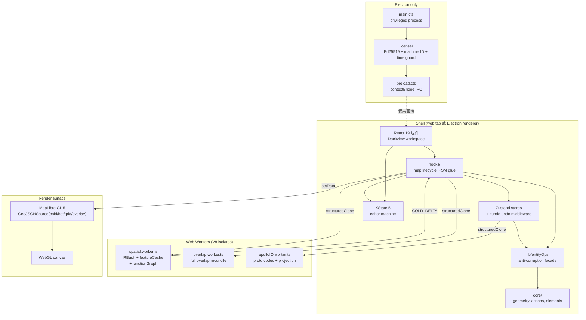
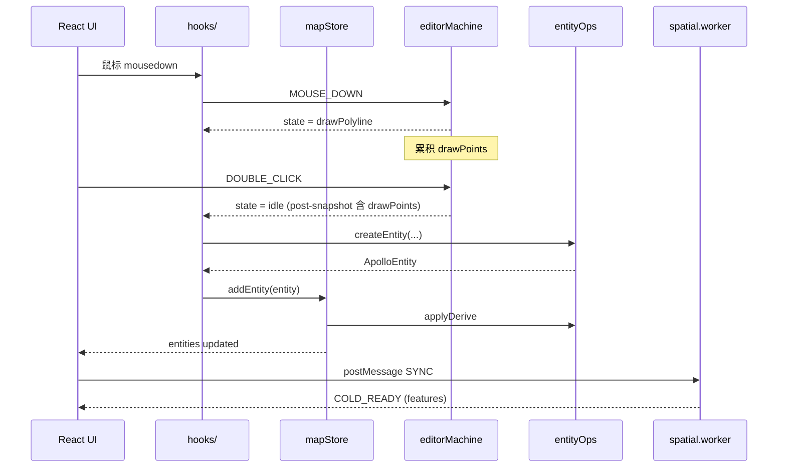

# 架构总览

Apollo Map Studio 是一个面向 Apollo HD 地图数据的 TypeScript 编辑器，同时提供
**纯浏览器** 和 **Electron 桌面端** 两种交付形态，共享同一份 React 19 渲染代码。
本页是整张工程的"航图" —— 把每一层、每一个 Worker、每一个 Electron 进程画在一张图上，
并给出每层的模块计数与关键不变量。当与 `/ARCHITECTURE.md` 出现分歧时，**仓库根目录的
单页摘要为准**，本页负责把它展开成可点击的索引。

::: tip 阅读顺序

- 先读本页的 mermaid 全景图，建立空间感。
- 再按"See also"链接进入感兴趣的子系统。
- 不变量列表是审计代码合法性的快捷清单 —— 任何 PR 违反都需要在评审中显式答辩。
  :::

## 1. 设计目的与系统定位

本项目并非传统的 Web GIS 标注页面，而是一台 **运行在浏览器中的轻量级 CAD 渲染引擎 +
关系型空间数据库**。设计目标 (DESIGN.md §1)：

- **十万级要素 60fps 交互**：道路、车道、信号灯、停止线、停车位、人行横道、限速带、
  PNC Junction、Overlap 全部存活在主线程 GPU 通道里。
- **参数化几何**：拒绝硬编码图形，所有几何都从最小参数集 (起点、宽高、旋转、控制点)
  实时编译为 GeoJSON。
- **严格解耦**：UI 视图 / 渲染画布 / 空间计算 / 状态数据彼此通过 ID 引用，避免对象嵌套。
- **协议兼容**：底层类型与 Apollo `map_*.proto` 字段一一映射，支持 protobuf 无损往返。

::: info 设计取向
我们构建的不是网页，而是一台 **可演进至 Rust/WebAssembly 计算底层** 的工程级 CAD。
这意味着任何代码都必须可以被替换、被搬迁、被并行 —— 这是分层、ACL、Worker 化设计的根因。
:::

## 2. 顶层系统视图



## 3. 模块计数 (按层)

| 层            | 文件数 (近似) | 代表模块                                                                                                         |
| ------------- | ------------- | ---------------------------------------------------------------------------------------------------------------- |
| `components/` | ~70           | `WorkspaceLayout`, `MapCanvas`, `InspectorForms`, `SidebarPanel`                                                 |
| `hooks/`      | ~25           | `useMapEventRouter`, `useColdLayer`, `useHotLayer`, `useActionDispatcher`, `useDrawCommit`                       |
| `store/`      | 7             | `mapStore`, `uiStore`, `settingsStore`, `licenseStore`, `taskProgressStore`, `projDialogStore`, `apolloMapStore` |
| `lib/`        | ~12           | `entityOps.ts` 及子模块、`schemas.ts`, `geoJsonHelpers.ts`, `editable-guard.ts`                                  |
| `core/`       | ~50           | `actions/registry`, `elements/`, `fsm/editorMachine`, `geometry/`, `workers/`, `spatial/`                        |
| `types/`      | 4             | `apollo.ts`, `editor.ts`, `entities.ts`, `inspectorSchema.ts`                                                    |
| `electron/`   | 3             | `main.cts`, `preload.cts`, `license/`                                                                            |

> 计数随重构会漂移；以上数字是 2026-04 工程审计时的口径，请以 `git ls-files | wc -l`
> 实测为准。

## 4. 关键不变量 (Invariants)

这一节是审计的入口。每条不变量都对应一段在仓库里能用 `git grep` 复现的事实。

::: warning 1. 单向依赖
`components → hooks → store → lib → core`。任何反向引用都是 bug。
审计：`git grep -nE "from '@/(components|hooks)/" -- src/core src/lib src/store`。
:::

::: warning 2. Apollo proto 反腐败
UI 不得直接 import `@/core/geometry/apolloCompile` 或 `@/types/apollo` 的具象字段；
统一走 `@/lib/entityOps`。
审计：`git grep "from '@/core/geometry/apolloCompile'" -- 'src/components/**' 'src/hooks/**'`。
:::

::: warning 3. FSM 单一事实源
所有"编辑器宏观状态"由 `editorMachine` (`src/core/fsm/editorMachine.ts:130`) 决定。
组件内部不得维护"我现在是不是在画线"这种状态副本。
:::

::: warning 4. 撤销前先 CANCEL
`useActionDispatcher.ts:76-82` 在调用 `temporal.undo()` 之前先发 `CANCEL` 给 FSM，
避免半成品 `drawPoints` 与 `mapStore.entities` 错位 (R1 闭环)。
回归测试：`src/hooks/__tests__/undoCancel.test.ts`。
:::

::: warning 5. 冷热层分流
未选中的实体 → 冷层 (Worker 编译) → `setData` 一次。
正在编辑 / 拖拽的实体 → 热层 (主线程) → 每帧 `setData`。
共用同一个 GeoJSONSource 是 bug 的温床。
:::

::: warning 6. 输入层 dedup 单一事实源
`useMapEventRouter` 的 `isDuplicateInput` 已经吞掉 dblclick 的第二次 click ——
FSM 不再需要补偿性 `slice(-1)`。曾经存在的"多段线少最后一个点"问题就是双重补偿造成的。
:::

::: warning 7. 历史事务收敛
`mapStore.batchImport` 把"写实体 → 拓扑重算 → overlap reconcile"收口到一个
immer producer 里 —— 这意味着一次导入只产生一条 zundo 历史记录。逐 `addEntity` 写入会
把历史栈打爆。
:::

## 5. 公共表面 (Top-level Public Surface)

| 入口              | 文件                                            | 职责                                                     |
| ----------------- | ----------------------------------------------- | -------------------------------------------------------- |
| `WorkspaceLayout` | `src/components/layout/WorkspaceLayout.tsx:186` | 顶层布局组件，挂 Dockview / FSM Provider / License Hooks |
| `editorMachine`   | `src/core/fsm/editorMachine.ts:130`             | XState 5 状态机定义                                      |
| `ACTION_DEFS`     | `src/core/actions/registry/definitions.ts:22`   | 全局 Action 表                                           |
| `useMapStore`     | `src/store/mapStore.ts:86`                      | 实体仓 + zundo undo                                      |
| `entityOps`       | `src/lib/entityOps.ts:1`                        | Apollo 反腐败门面                                        |

## 6. 与其他子系统的交互



## 7. 三轴分解

代码库无法用单一坐标系解释 —— 每个文件同时参与三个层级：

### 轴 1 — 状态

```
mapStore (entities + zundo)
  └─ FSM (editorMachine 绘制/选中状态)
       └─ uiStore (用户偏好、图层显隐)
            └─ 派生缓存 (spatial.worker、overlap.worker)
```

状态自上而下流动：`mapStore` 的 mutation 触发 FSM 清理
(`src/hooks/useActionDispatcher.ts:104-110`)，进而触发 Worker 重新装饰
(`src/hooks/useColdLayer.ts:236-275`)。

### 轴 2 — 管线

```
input → FSM event → store mutation → worker SYNC/INCREMENTAL → MapLibre setData
```

热编辑每帧跑、冷提交以 RAF 合并跑。

### 轴 3 — 进程外壳

```
electron main ↔ contextBridge IPC ↔ renderer ↔ web workers
```

只有桌面端才存在最左边那一段；renderer 右侧的所有部分在 web 与 desktop 构建中相同。

## 8. 执行边界

| 边界                     | 实现                                   | 跨越的内容                                                          |
| ------------------------ | -------------------------------------- | ------------------------------------------------------------------- |
| Renderer ↔ Web Worker    | `postMessage` + `structuredClone`      | `WorkerRequest` / `WorkerResponse` (`src/core/workers/protocol.ts`) |
| Renderer ↔ Electron main | `contextBridge` + `ipcRenderer.invoke` | 仅 typed license payload —— 不传 `Map` / `Buffer` / DOM             |
| 冷层 ↔ MapLibre          | `GeoJSONSource.setData / updateData`   | feature collection (绝不传裸实体)                                   |
| FSM ↔ store              | actor `subscribe` + 手动 `send`        | event (`SELECT_TOOL`, `MOUSE_DOWN`, `CONFIRM`, `CANCEL` …)          |

::: warning Worker 边界开销
`structuredClone` 在 ~5000 实体之上是热点路径主因。已有两道缓解：

1. 分块 `SYNC_BEGIN` / `SYNC_CHUNK` / `SYNC_FINISH` (`src/core/workers/spatialRequests.ts:82-115`)；
2. `COLD_DELTA` 响应只回写变更的实体组 (`src/core/workers/spatialRequests.ts:117-137`)。
   :::

## 9. 常见陷阱

::: danger 跨层引用
`components/` 里出现 `import x from '@/types/apollo'` 是反腐败破坏的首个征兆。
所有 Apollo 字段访问都应通过 `entityOps` 暴露的 `MapEntity` 接口。
:::

::: danger 双倍补偿
当看到 FSM 内部 `drawPoints.slice(0, -1)` 时要警觉。输入层已经 dedup，FSM 再补一刀
就丢点。注释见 `editorMachine.ts:83-87`。
:::

::: danger 撤销期间 FSM 漂移
任何"在 FSM 还在 draw 状态时直接 `temporal.undo()`"的代码都会破坏 R1 闭环。
:::

::: danger 在 immer producer 之外修改实体
zundo 的快照点是 `set((state) => ...)` 闭包结束时 —— producer 之外的副作用不会进
历史栈。
:::

## 10. Source map (file:line refs)

- `src/components/layout/WorkspaceLayout.tsx:186` — `WorkspaceLayout` 入口
- `src/core/fsm/editorMachine.ts:130` — `setup({...}).createMachine` 起点
- `src/core/fsm/editorMachine.ts:18-25` — `DRAW_STATES` 单一事实源
- `src/core/actions/registry.ts:1-22` — `ACTION_DEFS` re-export
- `src/store/mapStore.ts:86-263` — `useMapStore` + zundo middleware
- `src/store/mapStore.ts:184-198` — `batchImport` 单事务
- `src/lib/entityOps.ts:12-39` — entityOps facade exports
- `src/lib/entityOps/edit.ts:76-85` — `createEntity` + applyDerive
- `src/hooks/useActionDispatcher.ts:76-82` — R1 CANCEL 闭环
- `ARCHITECTURE.md` — 单页权威摘要

## 11. 双形态：web vs desktop

| 表面    | 入口                                                       | License                                                                                 | 文件 I/O                                  | 进程边界                                             |
| ------- | ---------------------------------------------------------- | --------------------------------------------------------------------------------------- | ----------------------------------------- | ---------------------------------------------------- |
| Web     | `index.html` → `src/main.tsx`                              | 无 —— `licenseBridge` 落入 permissive trial 状态 (`src/lib/license-bridge.ts:62-75`)    | 浏览器 File API + 下载                    | 单 renderer + workers                                |
| Desktop | Electron `BrowserWindow` 从 `electron/main.cts:18-54` 启动 | `LicenseManager` 强制 Ed25519 + machine binding (`electron/license/manager.cts:31-313`) | 同浏览器风格 API；main 进程不接触用户地图 | renderer + workers + Electron main + license process |

renderer 代码两种模式下 **完全相同**。唯一的桥梁是 `window.apolloMapStudioLicense`，
由 `electron/preload.cts:13-47` 注入并由 `src/lib/license-bridge.ts:77-101` 读取。当
bridge 不存在时 (`isDesktopBuild() === false`)，所有 license 调用都回落到
`fallbackState()`。

## 12. 性能预算

| 指标                   | 阈值                        | 出处                             |
| ---------------------- | --------------------------- | -------------------------------- |
| 5 万实体导入耗时       | ≤500 ms                     | `bench-budgets.json`             |
| 冷层 setData (5万)     | ≤180 ms                     | `bench-budgets.json`             |
| 增量 overlap reconcile | ≤8 ms / mutation            | `bench-budgets.json`             |
| pnpm bench CI          | bench-budgets 不通过即 fail | `scripts/check-bench-budget.mjs` |

::: tip 性能保护
任何 PR 让 `bench-results.json` 超过 budget，CI 直接红。无需人工 review。
:::

## 13. 安全与威胁模型

| 威胁                  | 防护                                                                                               |
| --------------------- | -------------------------------------------------------------------------------------------------- |
| 用户绕过 license      | 桌面端 `LicenseManager` Ed25519 公钥校验 + machine ID 绑定 (`electron/license/manager.cts:31-313`) |
| 调试器篡改 React 状态 | renderer 仅接收 main 进程 IPC payload；payload 经 contextBridge 类型化                             |
| Worker XSS            | worker 没有 DOM 访问；postMessage payload 是结构化数据                                             |
| 第三方 proto 字段污染 | 反腐败层 (R2)；UI 永不读 proto 字段                                                                |

## 14. Glossary

| 术语               | 含义                                                          |
| ------------------ | ------------------------------------------------------------- |
| **冷层**           | 已 commit 的实体集合，由 worker 编译，主线程一次 `setData`    |
| **热层**           | 正在编辑的单一实体，主线程每帧 `setData`，绕过 React Diff     |
| **R1 闭环**        | 撤销前 `CANCEL` 的协议，避免 FSM 与 store 错位                |
| **R2 反腐败**      | UI 永不直 import apolloCompile / proto field                  |
| **R5 Action 单源** | 所有 user-executable 命令统一注册在 `ACTION_DEFS`             |
| **派生引擎**       | `core/elements/derive` —— 编辑后自动重算 length / boundary 等 |
| **partialize**     | zundo 中只追踪部分 state 的过滤器                             |

## 15. See also

- [分层架构](./layered-architecture.md) — 五层导入规则与审计 grep
- [技术栈](./tech-stack.md) — 每个依赖的版本与选择动机
- [工作区布局](./workspace-layout.md) — Dockview 面板注册与持久化
- [状态管理](./state-management.md) — Zustand + zundo
- [Action Registry](./action-registry.md) — 单一动作中心
- [FSM 设计](./fsm-design.md) — XState 5 编辑器状态机
- [entityOps 模块](./entityops.md) — proto 反腐败门面
- [反腐败层](./anti-corruption-layer.md) — 更广义的隔离论述
- [冷热层](./cold-hot-layers.md) — 渲染管线
- [Worker 协议](./worker-protocol.md) — postMessage 协议表
- [Electron 集成](./electron-integration.md) — 双形态交付
- [License 系统](./license-system.md) — 离线激活
- [测试策略](./testing-strategy.md) — 回归测试矩阵
