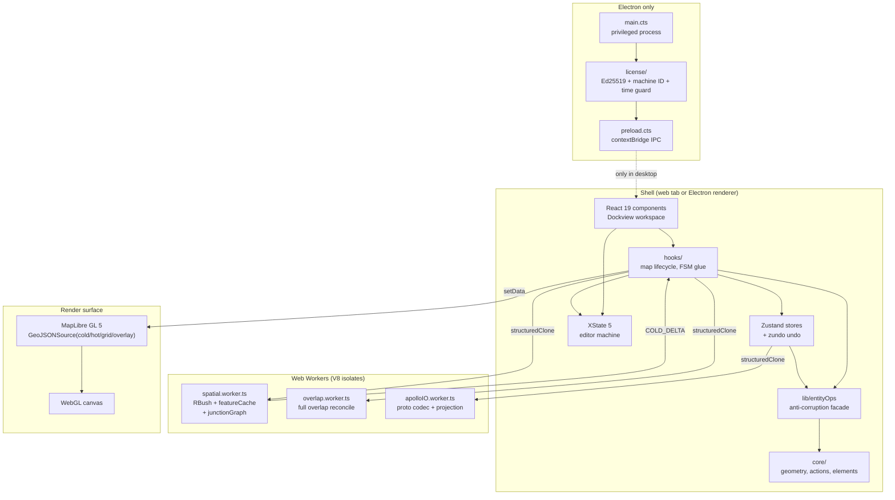

# Architecture Overview

Apollo Map Studio is a TypeScript editor for Apollo HD-map data. It ships in
two surface forms — a standalone web build and an Electron desktop bundle —
sharing a single React 19 codebase. The architecture is organised along three
orthogonal axes:

1. **Layered modules** — pure-domain `core/` at the bottom, React UI at the top
   (see [Layered Architecture](./layered-architecture.md)).
2. **Cold/hot rendering pipeline** — committed entities flow through a Web
   Worker into MapLibre; in-flight strokes bypass the worker
   (see [Cold/Hot Layers](./cold-hot-layers.md)).
3. **Two-shell delivery** — the same renderer bundle runs in a browser tab
   or inside an Electron `BrowserWindow` with an IPC bridge to a privileged
   main process (see [Electron Integration](./electron-integration.md)).

::: tip Authoritative source
The single-page `ARCHITECTURE.md` at the repo root is the load-bearing summary.
This deep-dive expands every section listed there. When the two disagree, the
root document wins.
:::

## Top-level system view



## Surfaces: web vs desktop

| Surface | Entry                                                         | License                                                                                               | File I/O                                                     | Process boundary                                     |
| ------- | ------------------------------------------------------------- | ----------------------------------------------------------------------------------------------------- | ------------------------------------------------------------ | ---------------------------------------------------- |
| Web     | `index.html` → `src/main.tsx`                                 | none — `licenseBridge` falls back to a permissive trial state (see `src/lib/license-bridge.ts:62-75`) | browser File API + downloads                                 | single renderer + workers                            |
| Desktop | Electron `BrowserWindow` boots from `electron/main.cts:18-54` | `LicenseManager` enforces Ed25519 + machine binding (see `electron/license/manager.cts:31-313`)       | same browser-style API; main process never touches user maps | renderer + workers + Electron main + license process |

The renderer code is identical in both modes. The single
seam — `window.apolloMapStudioLicense` — is wired in `electron/preload.cts:13-47`
and read by `src/lib/license-bridge.ts:77-101`. When the bridge is absent
(`isDesktopBuild() === false`), every license call resolves to the permissive
`fallbackState()`.

::: info Why two surfaces?
The web surface is the canonical dev/preview environment and the source of
truth for issue reproduction. The desktop surface is the licensed, distributable
form — it adds offline activation and machine binding without changing any
domain logic. See [License System](./license-system.md).
:::

## Three-axis decomposition

The codebase resists single-axis explanation. Every file participates in three
hierarchies simultaneously:

### Axis 1 — State

```
mapStore (entities + zundo)
  └─ FSM (editor machine, drawing/selection state)
       └─ uiStore (preferences, layer visibility)
            └─ derived caches (spatial.worker, overlap.worker)
```

State flows downward: a mutation in `mapStore` triggers FSM cleanup
(`src/hooks/useActionDispatcher.ts:104-110`) which triggers a worker
re-decoration (`src/hooks/useColdLayer.ts:236-275`). See
[State Management](./state-management.md).

### Axis 2 — Pipeline

```
input → FSM event → store mutation → worker SYNC/INCREMENTAL → MapLibre setData
```

The pipeline runs every frame for hot edits and on RAF coalescing for cold
commits. See [Cold/Hot Layers](./cold-hot-layers.md) and the
[Worker Protocol](./worker-protocol.md).

### Axis 3 — Shell

```
electron main ↔ contextBridge IPC ↔ renderer ↔ web workers
```

Only the desktop surface populates the leftmost link; everything to the right
of `renderer` is identical between web and desktop builds.

## Execution boundaries

| Boundary                 | Implementation                         | What crosses                                                          |
| ------------------------ | -------------------------------------- | --------------------------------------------------------------------- |
| Renderer ↔ Web Worker    | `postMessage` with `structuredClone`   | `WorkerRequest` / `WorkerResponse` per `src/core/workers/protocol.ts` |
| Renderer ↔ Electron main | `contextBridge` + `ipcRenderer.invoke` | typed license payloads only — no `Map`, no `Buffer`, no DOM           |
| Cold layer ↔ MapLibre    | `GeoJSONSource.setData / updateData`   | feature collections, never raw entities                               |
| FSM ↔ store              | actor `subscribe` + manual `send`      | events (`SELECT_TOOL`, `MOUSE_DOWN`, `CONFIRM`, `CANCEL`, …)          |

::: warning Worker boundary cost
`structuredClone` is the dominant cost on hot paths above ~5 000 entities.
Two mitigations are in place: chunked `SYNC_BEGIN`/`SYNC_CHUNK`/`SYNC_FINISH`
(see `src/core/workers/spatialRequests.ts:82-115`) and `COLD_DELTA` responses
that ship only changed entity groups (see `src/core/workers/spatialRequests.ts:117-137`).
:::

## Where to read next

- [Layered Architecture](./layered-architecture.md) — the import-direction rule
  and the audit grep that enforces it.
- [Anti-Corruption Layer](./anti-corruption-layer.md) — why UI never imports
  `apolloCompile.ts` directly.
- [Cold/Hot Layers](./cold-hot-layers.md) — the rendering pipeline in full.
- [License System](./license-system.md) — Ed25519 activation, time guard, and
  the threat model.

For consumer-facing entry points see the [Guide](/guide/) section; for type
references see [Reference](/reference/) and [API](/api/).
