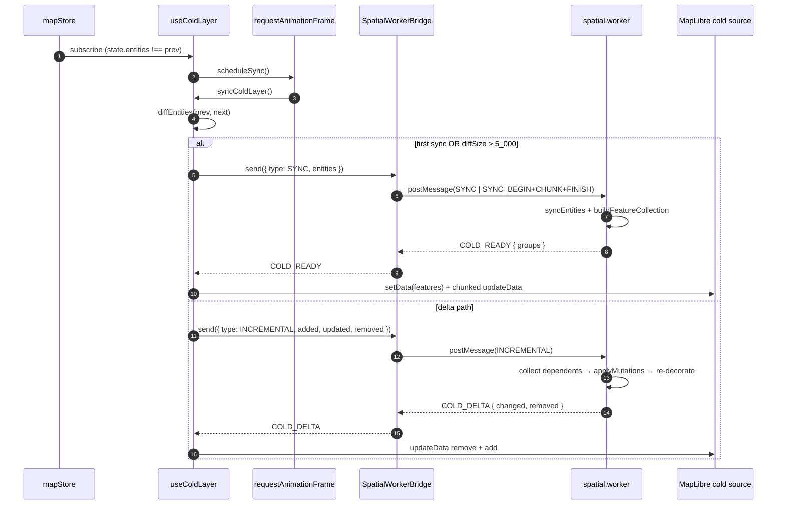
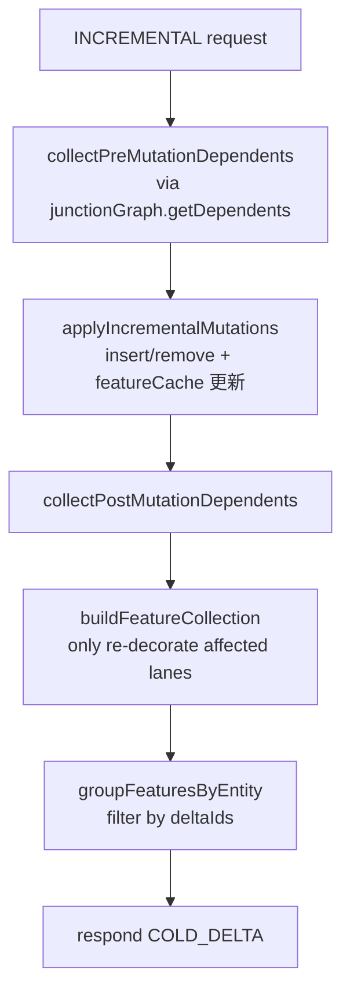
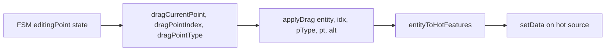

# 渲染流水线深度解析（Rendering Pipeline Deep Dive）

本页把渲染流水线拆到"每一次 postMessage、每一次 RAF tick"的颗粒度。
读者群：需要在性能/正确性边界上做修改的工程师 —— 比如想把贝塞尔编译
搬进 WASM、或者想替换 worker 协议为 SharedArrayBuffer。

## 一、流水线总览



## 二、冷管线（cold pipeline）

### 2.1 触发点

`useColdLayer` 注册两个订阅：

```ts
// src/hooks/useColdLayer.ts:296-300
const unsubscribeStore = useMapStore.subscribe((state, prevState) => {
  if (state.entities !== prevState.entities) {
    scheduleSync();
  }
});
```

外加 `actorRef.subscribe(onActorChange)` 来响应 `selectedEntityId`
变化（用于 cold layer 的选中态 filter）。`scheduleSync` 不直接同步，
而是把工作推进 RAF：

```ts
// src/hooks/useColdLayer.ts:278-281
const scheduleSync = () => {
  if (syncFrameRef.current !== null) return;
  syncFrameRef.current = requestAnimationFrame(syncColdLayer);
};
```

**RAF coalescing 的意义**：连续多次 `addEntity` / `updateEntity`（例
如批量导入或 reconcileOverlaps）只触发一次 worker 调用。

### 2.2 Diff 与策略路径

`diffEntities(prev, next)` 返回 `{ added, updated, removed }`，全部以
**引用比较**（`previousEntity !== entity`）判定 update —— Zustand +
Immer 保证了未修改实体的引用稳定。

阈值决策：

| 条件                                                   | 路径              |
| ------------------------------------------------------ | ----------------- |
| `prevEntitiesRef === null`（首次）                     | 全量 SYNC         |
| `diffSize > FULL_SYNC_ENTITY_CHANGE_THRESHOLD = 5_000` | 全量 SYNC         |
| 其它                                                   | INCREMENTAL delta |

源码：`src/hooks/useColdLayer.ts:227-247`。

### 2.3 postMessage 克隆边界

主线程与 worker 通过结构化克隆传输 `SerializedEntity[]`。**没有
ArrayBuffer transfer，也没有 WASM 共享内存** —— 这是当前最大的开销点
（5w 实体 SYNC ~ 200ms 在普通笔记本上）。`SpatialWorkerBridge` 的对策：

1. 阈值切片：`SYNC_ENTITY_CHUNK_SIZE = 2_000`，超过则走
   `SYNC_BEGIN → SYNC_CHUNK*N → SYNC_FINISH`。
2. 每个 chunk 之间 `await yieldToMain()` 让主线程能插帧响应输入。
3. INCREMENTAL 不切片（典型 dirtyIds 小于 50）。

worker 反向也有切片：`COLD_GROUP_CHUNK_SIZE = 1_000`，
`spatial.worker.ts:respondChunked` 把超过该阈值的 `COLD_READY` 拆成
`COLD_GROUPS_CHUNK[]` 顺序回包，bridge 端 `mergeChunks` 合并。

### 2.4 Worker 内部



关键文件：

| 步骤                            | 文件:行                                       |
| ------------------------------- | --------------------------------------------- |
| dispatch                        | `src/core/workers/spatialRequests.ts:139-164` |
| 受影响 lane 收集                | `src/core/workers/spatialRequests.ts:12-58`   |
| feature 缓存 + RBush            | `src/core/workers/spatialState.ts:76-115`     |
| 构造 FC                         | `src/core/workers/spatialFeatures.ts:65-118`  |
| junction stitching + decoration | `src/core/geometry/laneJunctions.ts:150-165`  |

### 2.5 主线程应用

`useColdLayer` 收到响应后：

- `COLD_READY`：`groupsToFeatureMap(groups)` 写回 `entityFeatureCacheRef`，
  然后清空 source 并按 4 000 一批 `updateData({ add })`。
- `COLD_DELTA`：从缓存计算 `previousFeatures`（待删除），合并 `changed`
  到缓存，调用 `applyColdDeltaToSource`：先 `updateData({ remove })`
  再分批 `updateData({ add })`。

```ts
// src/hooks/useColdLayer.ts:96-115
const remove = previousFeatures.map(featureId).filter(...);
if (remove.length > 0) await updateColdSourceChunk(src, { remove });
let add: GeoJSON.Feature[] = [];
for (const group of changed) {
  for (const feature of group.features) {
    add.push(withPromotedFeatureId(feature));
    if (add.length >= SOURCE_UPDATE_CHUNK_SIZE) {
      await updateColdSourceChunk(src, { add });
      add = [];
    }
  }
}
if (add.length > 0) await updateColdSourceChunk(src, { add });
```

`promoteId` 配合 `withPromotedFeatureId` 保证 MapLibre 在 delta
更新时能稳定追踪每个 feature。

### 2.6 版本号防回包错乱

`useColdLayer` 维护 `syncVersionRef`。每次 `syncColdLayer` 启动时
`++syncVersionRef.current`，把版本号闭包到 `requestVersion`，回调里
`if (cancelled || requestVersion !== syncVersionRef.current) return;`。
意义：用户连点 5 下导致并发 5 次 INCREMENTAL，只有最后一次的响应被
应用 —— 中间的过期回包被丢弃，避免"加上去又被旧 delta 覆盖"。

## 三、热管线（hot pipeline）

### 3.1 触发点

`useHotLayer` 同时订阅 FSM（`actorRef.subscribe`）与 mapStore。每次
变化都 `scheduleRender`，进入 RAF。

### 3.2 渲染状态去重

构造一个 `HotRenderState`，用 `sameHotRenderState` 比对前后状态；
**完全相同则提前 return**，不进 setData。

```ts
// src/hooks/useHotLayer.ts:30-41
function sameHotRenderState(a, b) {
  return (
    !!a &&
    a.selectedEntityId === b.selectedEntityId &&
    a.entity === b.entity && // 引用相等就是 OK
    a.isEditingPoint === b.isEditingPoint &&
    a.dragPointIndex === b.dragPointIndex &&
    a.dragPointType === b.dragPointType &&
    a.dragAltKey === b.dragAltKey &&
    samePoint(a.dragCurrentPoint, b.dragCurrentPoint)
  );
}
```

### 3.3 拖拽预览



- `applyDrag` 是**纯函数**：返回新实体（不写 store），所以预览不会
  污染数据层，松手时由 `onMouseUp` 一次性 `updateEntity` 落盘。
- `entityToHotFeatures` 把实体编译成"几何体 + 顶点 + 控制柄"三类
  GeoJSON。

### 3.4 不走 worker 的理由

热层只画 1 个实体，几何体编译开销 < 0.5ms（贝塞尔 48 段采样），
postMessage clone 反而成为瓶颈。把热层放主线程能稳定 60fps。

## 四、Overlay / Snap / Grid 管线

| 管线              | 触发源                                                               | 频率      | 同步原语                   |
| ----------------- | -------------------------------------------------------------------- | --------- | -------------------------- |
| `useOverlayLayer` | FSM `currentState` + `drawPoints` + `bezierAnchors` + `previewPoint` | mousemove | RAF                        |
| `useGridLayer`    | `uiStore.gridEnabled` + `moveend`/`zoomend`                          | 视口变化  | 同步（无 RAF；事件低频）   |
| Snap 指示器       | `uiStore.currentSnapTarget`                                          | mousemove | UI store dedup             |
| `useApolloLayer`  | `apolloMapStore.bounds`                                              | 导入完成  | 同步（一次性 `fitBounds`） |

`useOverlayLayer` 内部 `OVERLAY_BUILDERS` 把每个绘制态映射到 builder：

```ts
// src/hooks/useOverlayLayer.ts:157-164
const OVERLAY_BUILDERS: Record<string, OverlayBuilder> = {
  drawPolyline: buildPolylineFeatures,
  drawCatmullRom: buildCatmullRomFeatures,
  drawBezier: buildBezierFeatures,
  drawArc: buildArcFeatures,
  drawRotatedRect: buildRotatedRectFeatures,
  drawPolygon: buildPolygonFeatures,
};
```

## 五、Public surface

`useColdLayer` / `useHotLayer` / `useOverlayLayer` 都返回 `void`；它们
是"effect hook"，副作用（订阅 + setData）在 `useEffect` 里完成。

供测试与诊断用的导出（在测试里用 vitest mock）：

| 导出                    | 文件                         | 用途                             |
| ----------------------- | ---------------------------- | -------------------------------- |
| `groupFeaturesByEntity` | `useColdLayer.ts:20-32`      | 按 `properties.id` 重组 features |
| `diffEntities`          | `useColdLayer.ts:121-144`    | 测试 add/update/remove 路径      |
| `flattenEntityFeatures` | `useColdLayer.ts:70-76`      | 把每实体 feature buckets 拍平    |
| `sameHotRenderState`    | `useHotLayer.ts:30-41`       | 单测 render 去重                 |
| `buildOverlayFeatures`  | `useOverlayLayer.ts:166-169` | dispatch table 直查              |
| `metersForZoom`         | `useGridLayer.ts:9-21`       | grid step 选档                   |

## 六、性能预算

| 阶段                              | 预算         | 实测来源                                    |
| --------------------------------- | ------------ | ------------------------------------------- |
| INCREMENTAL（dirty=1 lane）       | < 5ms 端到端 | `pnpm bench` + `scripts/bench-budgets.json` |
| `applyDrag` 在 Catmull-Rom 实体上 | < 1ms        | hot layer 60fps 反推                        |
| postMessage SYNC（5k entities）   | < 50ms 单段  | 切片后单段 < 25ms                           |
| RBush hitTest（1k entities）      | < 0.5ms      | rbush 4.x benchmark                         |

## 七、WASM 钩子

**当前没有 WASM**。曾评估过把 `applyLaneJunctions` 与 RBush 搬到 Rust

- wasm-bindgen，被推迟到 P3：

* 收益边际：JS rbush 已能撑 5w 实体；postMessage clone 才是瓶颈。
* WASM 共享内存（SharedArrayBuffer + Atomics）需要 COOP/COEP，
  Electron 打包会添加复杂度。
* TS 端代码已 < 700 LOC（spatial 全栈），可读性优于跨语言混编。

如未来需要切 WASM：worker `handleRequest` 的 dispatch 是天然边界。
建议先把 `intersect.ts` / `polyClip.ts` 搬过去，因为它们 CPU-bound 且
已被 overlapper 多次调用。

## 八、Pitfalls

1. **不要在 React 组件里直读 `featureCache`**：缓存在 worker 里。
   主线程的 `entityFeatureCacheRef` 是镜像，仅供 delta apply 路径使用，
   不是 source of truth。
2. **避免在 `requestAnimationFrame` 回调里 await 太多**：`updateData`
   返回 `Promise`，但分块 await 太长会让多帧合并失效（一帧塞两次
   SOURCE_UPDATE_CHUNK_SIZE 的 add 队列）。
3. **prev snapshot vs cleanup**：`prevEntitiesRef.current = snapshot`
   在 schedule 之前赋值，所以即使 worker 调用失败，下次也不会"双倍重发"。
4. **`syncVersionRef` 单调递增**：不是按 ID 路由；如果未来加并发
   worker pool，需要改成 `Map<workerId, version>`。

## 九、Source map

| 概念                  | 文件                                  | 行      |
| --------------------- | ------------------------------------- | ------- |
| Cold hook             | `src/hooks/useColdLayer.ts`           | 161-334 |
| Cold helper utilities | `src/hooks/useColdLayer.ts`           | 20-159  |
| Hot hook              | `src/hooks/useHotLayer.ts`            | 43-132  |
| Overlay hook          | `src/hooks/useOverlayLayer.ts`        | 219-285 |
| Bridge                | `src/core/workers/spatialBridge.ts`   | 1-143   |
| Worker entry          | `src/core/workers/spatial.worker.ts`  | 1-38    |
| Request dispatch      | `src/core/workers/spatialRequests.ts` | 1-165   |
| Worker state          | `src/core/workers/spatialState.ts`    | 1-116   |
| Feature builder       | `src/core/workers/spatialFeatures.ts` | 1-118   |
| Hit test              | `src/core/workers/spatialHitTest.ts`  | 1-81    |
| Protocol types        | `src/core/workers/protocol.ts`        | 1-74    |

## 十、调试

- **冷层 stale**：在 `useColdLayer` 里加 `console.log(diff)` 打印每次
  diffEntities 结果；如果 `added/updated/removed` 都为空但 store 有
  变化，说明 `state.entities` reference 未变 —— 检查 mutate 路径是否
  返回新 Map。
- **Worker 死锁**：`SpatialWorkerBridge` 的 timeout 默认 120s；如果
  请求挂起，bridge 会 reject 并清空 pending 表。chrome devtools 的
  workers 子页签能看每个 in-flight message。
- **`COLD_DELTA` add 出现重复 feature id**：`withPromotedFeatureId`
  必须保证每个 feature 有 unique id；旧版未调时会出现幽灵。

## 十一、See also

- [Cold / Hot Layers](./cold-hot-layers.md)
- [Spatial Index](./spatial-index.md)
- [Junction Graph](./junction-graph.md)
- [Junction Stitching](./junction-stitching.md)
- [Worker Protocol](./worker-protocol.md)
