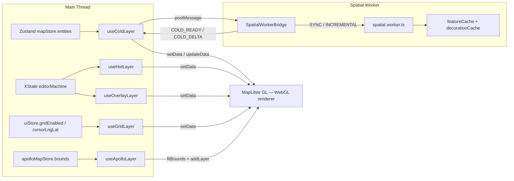
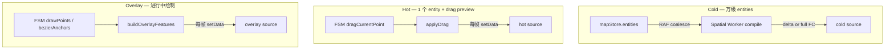
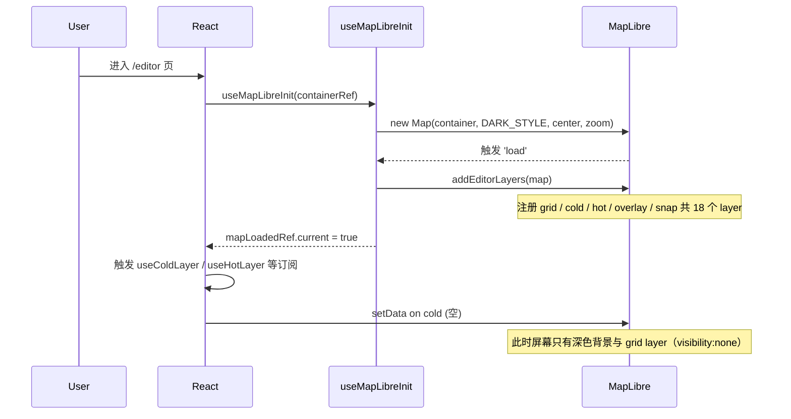
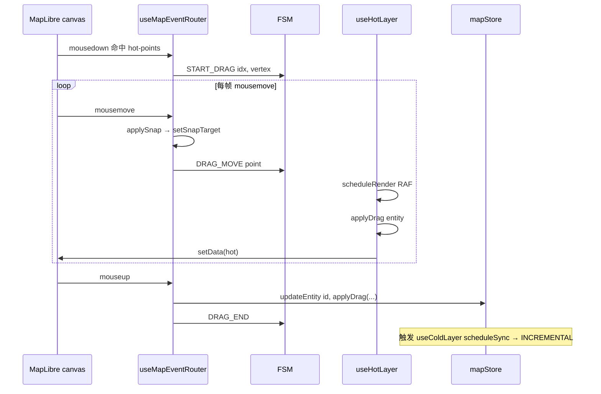

# 渲染层概览（Rendering Layer Overview）

Apollo Map Studio 把"绘图引擎"放在浏览器里跑，渲染底座选用了纯粹的
WebGL 渲染器 [MapLibre GL](https://maplibre.org/)，而**业务逻辑、几何
推演、空间索引都被剥离到 Worker 与纯函数模块**。本页给出渲染层的整体
拓扑：MapLibre 实例如何启动、有哪些 Source、哪些 Layer、它们的绘制顺
序、paint 属性如何由 `ams-*` 设计令牌驱动，以及动静分离（cold / hot
/ overlay / grid / snap / apollo）背后的工程考量。

## 一、设计目标

| 目标                 | 实现机制                                                                      |
| -------------------- | ----------------------------------------------------------------------------- |
| 60fps 拖拽           | 把"会高频变更的实体"挪到 `hot` source，绕过 React diff，直接 `setData()`      |
| 万级实体秒级渲染     | `cold` source 的 GeoJSON 由 Worker 一次编译并缓存，主线程只 push 全量或 delta |
| 编辑期 < 16ms 帧预算 | INCREMENTAL 路径只重算受影响 lane 的 boundary decoration                      |
| 视觉令牌可热替换     | paint 属性引用 `--color-ams-*` CSS 变量；调色板切换无需触碰组件               |
| 跨原始数据来源       | `apollo-*` 图层放在 `cold-*` 之下，导入 Apollo 原图与编辑物理上分离           |

## 二、渲染流水线总图



## 三、Source / Layer 清单

`addEditorLayers` 在地图 `load` 完成后批量注册所有 source 与 layer，
顺序就是 z-order（先注册的先绘制，后续覆盖在上）：

| 注册顺序           | Source                                                                     | Layer ids                                                                                                                                                | 用途                                                 |
| ------------------ | -------------------------------------------------------------------------- | -------------------------------------------------------------------------------------------------------------------------------------------------------- | ---------------------------------------------------- |
| 1                  | `grid`                                                                     | `grid-line`                                                                                                                                              | 米制网格线（Photoshop 式参考线）                     |
| 2                  | `cold`                                                                     | `cold-fill` / `cold-fill-crosswalk` / `cold-fill-cleararea` / `cold-line` / `cold-line-dotted` / `cold-line-dashed` / `cold-labels` / `cold-lane-arrows` | 已落盘实体（lane / junction / crosswalk / signal …） |
| 3                  | `hot`                                                                      | `hot-fill` / `hot-line` / `hot-points`                                                                                                                   | 选中实体的几何 + 顶点/手柄                           |
| 4                  | `overlay`                                                                  | `overlay-fill` / `overlay-line` / `overlay-points` / `overlay-handles` / `overlay-handle-lines`                                                          | 进行中绘制的预览（折线、贝塞尔锚点……）               |
| 5                  | `snap`                                                                     | `snap-ring` / `snap-dot`                                                                                                                                 | 吸附指示器（光标处的青色圆环）                       |
| `apollo-*`（按需） | `apollo-lane-center` / `apollo-lane-boundary` / `apollo-road-boundary` / … | 导入只读的 Apollo 原图（保留色调）                                                                                                                       |

注：`apollo-*` 由 `useApolloLayer` 在 cold layer **之下**插入，确保用
户编辑物悬于 Apollo 原图之上。

代码索引：`src/hooks/mapLibreInit/layers.ts:270-277` 中的
`addEditorLayers` 是该顺序的唯一登记处。

## 四、动静分离：cold / hot / overlay 的边界



- **冷层（cold）**：地图主体；rebuild 走 worker，编辑期走 INCREMENTAL
  delta，避免主线程 stall。详见
  [rendering-pipeline](./rendering-pipeline.md) 与
  [cold-hot-layers](./cold-hot-layers.md)。
- **热层（hot）**：只画"被选中"的那一个实体的几何与可拖拽手柄；拖拽时
  `applyDrag` 在主线程合成预览几何，直接 `setData`，**绕开 worker**。
- **覆盖层（overlay）**：绘制进行中（drawPolyline / drawCatmullRom /
  drawBezier / drawArc / drawRotatedRect / drawPolygon）的状态预览。
  `useOverlayLayer` 内置的 `OVERLAY_BUILDERS` dispatch 表把每个绘制态
  路由到自己的特征构造器。
- **吸附层（snap）**：独立 source，以便在拖动顶点（非 draw 态）时也能
  显示指示器；订阅 `uiStore.currentSnapTarget`。

## 五、Paint 属性与 ams-\* 令牌

冷层颜色不在 hook 里写死，而是通过 GeoJSON `properties` 传递，再由
MapLibre 的 [data-driven expressions](https://maplibre.org/maplibre-style-spec/expressions/)
读取（见 `addColdLayers`）：

```ts
// src/hooks/mapLibreInit/layers.ts:30-40
map.addLayer({
  id: 'cold-fill',
  type: 'fill',
  source: 'cold',
  paint: {
    'fill-color': ['get', 'color'],
    'fill-opacity': ['coalesce', ['get', 'fillOpacity'], 0.15],
  },
});
```

实体编译器（`compileColdFeatures` / `compileApolloFeatures`）负责把
**语义化设计令牌**（`ams-bg-base`、`ams-accent` 等定义在
`src/index.css` 的 `@theme` 块）落到具体的 hex / rgba 上。设计上保留
未来直接读取 CSS 变量的能力 —— 当前为兼容 MapLibre paint 表达式 JSON
化，仍用具体颜色字面量，但**所有取色都过 `mapConstants` 的常量层**，
避免组件直接写 `#ff4444`。

热层与吸附层的颜色固定（红 `#ff4444` / 青 `#00d4ff`），代表"编辑/吸附
正在发生"的瞬时高亮，不参与令牌切换。

## 六、字体、图标与 SDF

`registerRuntimeImages` 在地图 `load` 后注入运行期生成的纹理：

| 资源           | 类型                         | 用途                                               |
| -------------- | ---------------------------- | -------------------------------------------------- |
| `zebra-stripe` | 16×16 raster                 | crosswalk fill-pattern（横纹）                     |
| `red-hatch`    | 12×12 raster                 | clearArea fill-pattern（红色斜纹）                 |
| `lane-arrow`   | 20×20 SDF                    | 沿 lane 中心线的方向箭头（symbol-placement: line） |
| Map icons      | 通过 `registerMapIcons(map)` | signal / stopSign / yieldSign 等 SVG → bitmap      |

字体走默认 glyph URL（`https://demotiles.maplibre.org/font/{fontstack}/{range}.pbf`）
仅作 fallback；编辑器 UI 字体（Syne + JetBrains Mono）由 React 一侧的
全局样式驱动，不会进 MapLibre 渲染流程。

## 七、Public surface

| Hook               | 入参                                              | 主要职责                                                    |
| ------------------ | ------------------------------------------------- | ----------------------------------------------------------- |
| `useMapLibreInit`  | `containerRef`                                    | 创建 MapLibre 实例 + 注册全部 source/layer                  |
| `useColdLayer`     | `mapRef`, `mapLoadedRef`, `actorRef`, `bridgeRef` | 监听 mapStore，RAF coalesce 后向 worker 派 SYNC/INCREMENTAL |
| `useHotLayer`      | `mapRef`, `mapLoadedRef`, `actorRef`              | 监听 FSM + selectedEntity，每帧 `setData`                   |
| `useOverlayLayer`  | `mapRef`, `mapLoadedRef`, `actorRef`              | 监听 FSM 绘制态 + `currentSnapTarget`，渲染进行中几何       |
| `useGridLayer`     | `mapRef`, `mapLoadedRef`                          | viewport 变更时按 zoom 选择网格步长                         |
| `useApolloLayer`   | `mapRef`, `mapLoadedRef`                          | 在 cold layer 之下注册 apollo-\* 图层（仅作占位/fitBounds） |
| `useCursorManager` | `mapRef`, `actorRef`                              | 根据 FSM 状态切换 canvas cursor 样式                        |
| `useDragPan`       | `mapRef`, `actorRef`                              | 拖拽实体时关掉 MapLibre 自带 dragPan，松开恢复              |

## 八、性能要点

- **postMessage clone 边界**：cold 同步全量 SYNC 时整张 entities 数组
  会被结构化克隆一次。`SpatialWorkerBridge` 在条目数 >2 000 时切到
  `SYNC_BEGIN/CHUNK/FINISH` 三段式，避免主线程 stall（详见
  [rendering-pipeline](./rendering-pipeline.md)）。
- **RAF coalescing**：`useColdLayer` / `useHotLayer` / `useOverlayLayer`
  都用 `requestAnimationFrame` 合并同一帧内的多次 store 推送，确保每
  帧最多一次渲染（实测 mousemove 风暴时 hot layer 帧率稳定 60fps）。
- **chunked updateData**：cold layer apply delta 时分块（`SOURCE_UPDATE_CHUNK_SIZE = 4_000`）
  调用 `updateData`，避免单次 `add` 太大被 MapLibre 内部 layout 卡住。
- **promoteId**：cold source 启用 `promoteId: 'featureId'`，让 MapLibre
  能稳定对应每个 feature 的 ID（hover / 高亮过滤无需重排）。

## 九、Pitfalls

1. **顺序敏感**：`addColdLayers` / `addHotLayers` / `addOverlayLayers`
   的注册顺序就是 z-order，**不要随意调整**。Apollo 原图必须在 cold
   之下；hot 必须高于 cold；overlay 应高于 hot 以便预览压住选中态。
2. **map.once('load') 时序**：`useColdLayer` 的 effect 同时支持"已加载"
   与"未加载"两条路径；如果你在 hook 里直接读 `map.getStyle()` 而忘
   了等 `mapLoadedRef.current === true`，会拿到空的 layers 数组。
3. **selectedEntity 不应被 hot 层"独占"**：`buildColdLayerFilter` 故意
   保留选中实体在 cold 层中的可见性，hot 层只覆盖叠加它的 handles 与
   红色高亮线，避免选中瞬间抖动（参考
   `src/components/map/coldLayerConfig.ts:50-60`）。
4. **grid step**：`metersForZoom` 的台阶是手工调过的；改时务必看
   `MAX_LINES_PER_AXIS = 240` 这条护栏，否则极端 zoom-out 会瞬间生成
   几万条线撑爆 GPU。

## 十、Source map

| 概念                 | 文件                                    | 行数  |
| -------------------- | --------------------------------------- | ----- |
| MapLibre 启动        | `src/hooks/useMapLibreInit.ts`          | 1-46  |
| Source / Layer 注册  | `src/hooks/mapLibreInit/layers.ts`      | 1-277 |
| 运行期纹理           | `src/hooks/mapLibreInit/assets.ts`      | 1-77  |
| 冷层 hook            | `src/hooks/useColdLayer.ts`             | 1-335 |
| 冷层 filter / 选中态 | `src/components/map/coldLayerConfig.ts` | 1-60  |
| 热层 hook            | `src/hooks/useHotLayer.ts`              | 1-133 |
| 覆盖层 hook          | `src/hooks/useOverlayLayer.ts`          | 1-286 |
| 网格层 hook          | `src/hooks/useGridLayer.ts`             | 1-149 |
| Apollo 只读层        | `src/hooks/useApolloLayer.ts`           | 1-237 |
| MapCanvas 组合点     | `src/components/map/MapCanvas.tsx`      | 1-46  |

## 十一、典型时序举例

### 11.1 用户首次加载地图



### 11.2 用户拖拽 lane vertex



## 十二、扩展性

### 12.1 加新的 source / layer

如果未来要加一层 "thumbnail" 概览，规范流程：

1. 在 `addEditorLayers` 末尾追加 `addThumbnailLayer(map)`，确认 z-order。
2. 写一个 `useThumbnailLayer(mapRef, mapLoadedRef, store)` hook，遵循
   "唯一写入者"约束。
3. 在 `MapCanvas.tsx` 里挂载该 hook。
4. 加 paint 表达式时仍走 `properties.color` + `['get', 'color']`，
   不在 hook 里硬编码颜色。

### 12.2 加新的实体类型

冷层 paint 表达式都是 data-driven，**不需要为新实体类型加 layer**，
只需要：

1. 在 `compileColdFeatures` 里加 dispatch 分支，emit 带 `properties.color`
   / `properties.entityType` / `properties.role` 的 features。
2. 如果需要自定义 fill-pattern（比如新的纹理），在
   `registerRuntimeImages` 里加 `addStripeImage` 或类似工具。
3. 如果需要按实体类型 filter（比如新区域类型有专属 fill-pattern），
   在 `coldLayerConfig.ts` 加新 layer + filter。

## 十三、调试技巧

- **看不到任何实体**：检查 `mapLoadedRef.current` 是否变成 true；
  worker bridge 的 `onerror` 是否触发；浏览器 console 是否有 GeoJSON
  parse 错误。
- **网格不显示**：确认 `uiStore.gridEnabled === true` 且 zoom 不在
  `metersForZoom` 的极端档（zoom < 0 不会有网格）。
- **Apollo 原图被编辑物压住看不到**：检查 `useApolloLayer` 的
  `beforeId = coldLayer?.id` 是否正确插入到 cold 层之下。
- **拖拽时主线程卡顿**：用 Chrome DevTools 的 Performance tab 录
  10s，关注 `requestAnimationFrame` 上的 long task；如果 cold layer
  的 setData 出现在 mousemove 帧里，说明 `prevEntitiesRef` 未生效，
  导致每次 mousemove 都重发 INCREMENTAL。

## 十四、性能调优 checklist

启用一组渲染层时按此清单审查：

- [ ] 是否走 RAF coalesce？避免每个 store push 直接 setData。
- [ ] 是否使用 promoteId？delta 更新依赖 stable feature id。
- [ ] 是否避免在主线程做曲线重采样（贝塞尔 / Catmull-Rom）？
      超过 200 实体的层应放 worker。
- [ ] paint 表达式是否走 `['get', 'color']` 而非硬编码？
- [ ] 是否在 cleanup 里释放 RAF / 取消订阅？
- [ ] map.once('load') 的两条路径是否都正确？

## 十五、扩展行为：自定义 paint 表达式

如果想给某类实体添加 hover 高亮（不进 hot 层），可在冷层 paint 上挂
`feature-state`：

```ts
map.setPaintProperty('cold-line', 'line-width', [
  'case',
  ['boolean', ['feature-state', 'hover'], false],
  4,
  ['coalesce', ['get', 'lineWidth'], 2],
]);
map.on('mouseenter', 'cold-line', (e) => {
  const id = e.features?.[0]?.id;
  if (id != null) map.setFeatureState({ source: 'cold', id }, { hover: true });
});
```

注意：`feature-state` 依赖 `promoteId`，本仓库已默认开启
（`promoteId: 'featureId'`），所以可以直接用。

## 十六、See also

- [Rendering Pipeline](./rendering-pipeline.md) — 冷/热管线的 step-by-step 与 Worker 协议
- [Cold / Hot Layers](./cold-hot-layers.md) — 严格定义与读写权限
- [Spatial Index](./spatial-index.md) — RBush 在 worker 中的角色
- [Map Event Router](./map-event-router.md) — 鼠标事件如何分发到 FSM 与渲染
- [Design Tokens](./design-tokens.md) — `ams-*` 命名空间与扩展规则
- [State Management](./state-management.md) — Zustand + zundo 与冷层 RAF 调度的接口
- [FSM Design](./fsm-design.md) — XState 状态机驱动的热/覆盖层
- [Junction Stitching](./junction-stitching.md) — Lane 边界 stitch 的视觉行为
