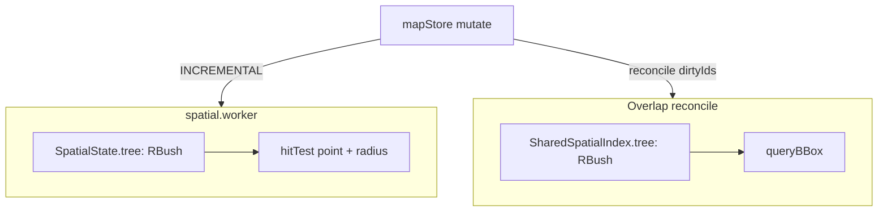
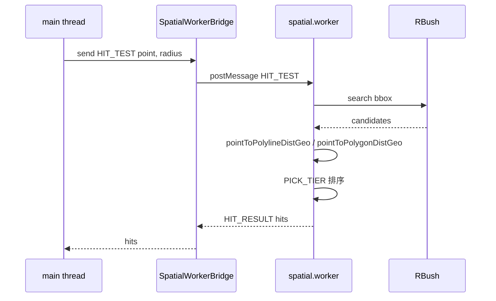

# 空间索引（Spatial Index）

万级实体规模上，"O(N) 全表扫描"几乎是所有交互卡顿的根源。Apollo Map
Studio 在两处使用 [RBush](https://github.com/mourner/rbush) 把空间查
询从 O(N) 压到 O(log N + k)：一处在 spatial worker（hit test / cold
layer），另一处在 overlap pipeline（lane × neighbors 配对扫描）。本
页给出 RBush 节点结构、BBox 计算、查询路径与地理距离的全部约定。

## 一、为什么是 RBush

| 指标             | RBush 4.x          | 网格索引     | KD-tree      |
| ---------------- | ------------------ | ------------ | ------------ |
| 写入             | O(log N)           | O(1)         | O(log N)     |
| 范围查询         | O(log N + k)       | 视密度       | O(N^0.5 + k) |
| 内存             | 2-3 KB / k 节点    | 占用大       | 中           |
| 维护成本         | 单文件 4.x stable  | 自实现需调参 | 自实现       |
| 是否依赖范围语义 | 是（直接 bbox 查） | 是           | 否（最近邻） |

5w 实体量级 lane 分布密集，网格索引会让一两个格子塞下千级节点导致
"伪 O(N)"；RBush 树的 split 算法对密集区有自适应。

## 二、两处 RBush



两个 RBush **互不共享**，节点结构也不同：

| 位置             | 节点类型                                     | 用途                       | 同步源                    |
| ---------------- | -------------------------------------------- | -------------------------- | ------------------------- |
| `spatial.worker` | `SpatialItem { id, entityType, minX..maxY }` | hit test + cold layer 重算 | Worker SYNC / INCREMENTAL |
| Overlap pipeline | `IndexNode extends BBox { id, entityType }`  | lane × neighbors 配对      | mapStore dirtyIds         |

## 三、BBox 计算

### 3.1 编辑器实体

`entityBBox(entity)`（`src/core/geometry/compile.ts:104-117`）：取实
体所有渲染坐标 `entityCoords(entity)` 的 AABB。Drawing entities（
polyline / catmullRom / bezier / arc / rect / polygon）走 `interpolate`
重采样后的曲线坐标。

### 3.2 Apollo 实体

`bboxForEntity(entity)`（`src/core/elements/overlap/spatialIndex.ts:37-60`）：
按实体类型分支：

- `lane` → centerline 的 bbox
- `polygon` 类（junction / crosswalk / parkingSpace / signal …） →
  `polygon.points` 的 bbox
- `stopLines`（信号灯停止线） → 每条 stopLine 的 bbox 并集 + 探测半径
- `polylines`（speedBump.position） → 同上但无半径

两套 BBox 都使用 `bboxOfPoints` / `bboxUnion`（`overlap/intersect.ts`）。

## 四、Worker 端 SpatialState 与 RBush

### 4.1 数据结构

```ts
// src/core/workers/spatialState.ts:22-31
export interface SpatialState {
  tree: RBush<SpatialItem>;
  entityMap: Map<string, MapEntity>;
  itemMap: Map<string, SpatialItem>;
  featureCache: Map<string, GeoJSON.Feature[]>;
  decorationCache: Map<string, GeoJSON.Feature[]>;
  junctionGraph: LaneJunctionGraph;
  pendingSyncs: Map<string, ...>;
  laneCount: number;
}
```

`tree` 与 `itemMap` 一一对应：`itemMap` 用于 O(1) 反查"上次注册的
节点对象"，因为 RBush 的 `remove(node, equalsFn)` 需要把原对象传回
（rbush 用 `===` 比对外部对象引用 —— 直接 new 一个相同字段的节点不
能 remove）。

### 4.2 同步路径

| Request            | 操作                                                    |
| ------------------ | ------------------------------------------------------- |
| `SYNC`             | `resetSpatialState` + `tree.load(items)` 一次性批量加载 |
| `INCREMENTAL` 删除 | `tree.remove(item)` + `itemMap.delete`                  |
| `INCREMENTAL` 新增 | `tree.insert(item)` + `itemMap.set`                     |
| `INCREMENTAL` 更新 | remove + insert（rbush 没有 inplace update）            |

### 4.3 Hit Test

```ts
// src/core/workers/spatialHitTest.ts:43-80
const cosLat = Math.max(Math.cos((py * Math.PI) / 180), 1e-6);
const rLat = r * cosLat; // 注意：lat 半径 = r * cosLat（"压缩纬度方向"）
const candidates = state.tree.search({
  minX: px - r,
  minY: py - rLat,
  maxX: px + r,
  maxY: py + rLat,
});
```

候选集再用纬度补偿距离 `pointToPolylineDistGeo` /
`pointToPolygonDistGeo`（`src/core/geometry/hitTest.ts:118-143`）按
量纲一致的"lng 度数空间"做精确测距，最后按 PICK_TIER 分层 + 距离排序。

PICK_TIER：

```ts
// src/core/workers/spatialHitTest.ts:13-31
const PICK_TIER: Record<string, number> = {
  signal: 0, stopSign: 0, yieldSign: 0, rsu: 0, ...
  crosswalk: 1, speedBump: 1, parkingSpace: 1,
  lane: 2, road: 2, overlap: 2,
  clearArea: 3, junction: 3, pncJunction: 3, parkingLot: 3, area: 3,
};
```

意义：当点击点落在 signal 图标和它压住的 junction polygon 同时命中
时，**信号灯优先**（tier 0）；多个同 tier 时按距离最近。这就是
"小标志不被大区域抢走"的工程保证。

## 五、Overlap 端 SpatialIndex（带签名缓存）

`src/core/elements/overlap/spatialIndex.ts` 的 `SpatialIndex` 类多了
两个特性：

1. **bbox 签名缓存**：`bboxSig: Map<id, "minX|minY|maxX|maxY">`，
   插入时若签名未变则跳过 tree mutation。意义：lane 改了
   `junctionId`（非几何字段），bbox 没变，索引不重建。
2. **dirtyIds 增量同步**：`syncDirty(entities, dirtyIds)`，O(|dirtyIds|)。

公开方法：

| 方法                                     | 用途                                             |
| ---------------------------------------- | ------------------------------------------------ |
| `build(entities)`                        | 全量构建（一次性导入后）                         |
| `syncFromEntities(entities)`             | 用签名 diff 全量同步（cold start / undo / 大改） |
| `syncDirty(entities, dirtyIds)`          | dirty 闭包同步（编辑期）                         |
| `insert(entity)` / `remove(id)`          | 单条增量                                         |
| `queryBBox(bbox)` / `queryNeighbors(id)` | 范围查询                                         |

模块级 singleton：`getSharedSpatialIndex()`，避免 reconcile 每次 new
一棵树重 load N 节点。

## 六、Public surface

| 文件                                        | 导出                                                                 | 角色                   |
| ------------------------------------------- | -------------------------------------------------------------------- | ---------------------- |
| `src/core/workers/spatialState.ts`          | `createSpatialState`、`insertEntity`、`removeEntity`、`syncEntities` | Worker 内部            |
| `src/core/workers/spatialHitTest.ts`        | `hitTest(state, point, radius)`                                      | Worker `HIT_TEST` 路径 |
| `src/core/elements/overlap/spatialIndex.ts` | `SpatialIndex` 类、`bboxForEntity`、`getSharedSpatialIndex`          | Overlap reconcile      |
| `src/core/elements/overlap/intersect.ts`    | `bboxOfPoints`、`bboxUnion`、`bboxOverlap`                           | BBox 工具              |
| `src/core/geometry/compile.ts`              | `entityBBox`                                                         | Worker 用              |

## 七、性能与正确性

| 场景                                | 实测    | 上限                     |
| ----------------------------------- | ------- | ------------------------ |
| Worker hitTest（5k 实体，~50 候选） | ~0.3ms  | < 0.5ms（snap fps 反推） |
| Overlap syncDirty（dirty=1）        | ~0.1ms  | < 0.5ms                  |
| Overlap full reconcile（5w 实体）   | 60-80ms | < 100ms                  |
| Worker SYNC build（5k）             | ~25ms   | < 50ms                   |

## 八、Pitfalls

1. **`tree.remove(node)` 必须传"同一引用"**：所以维持 `itemMap` 反查
   是硬要求，不能"改完字段再 remove"。
2. **bbox 签名缓存只看几何**：如果需要"非几何字段变更也触发 reindex"
   （罕见），需要绕开 sig cache 直接 `tree.remove + insert`。
3. **cosLat 范围**：极地附近 cosLat → 0 会把 rLat 缩成 0，hit test
   候选可能少；`Math.max(cosLat, 1e-6)` 是防御。
4. **不要把 RBush 节点跨线程传**：`tree.search` 返回的节点引用属于
   当前线程的 RBush 实例，传给 main thread 后 `tree.remove` 会失败。
5. **dirty 集必须涵盖几何变化**：`syncDirty` 不会做"全表 ref 比对兜
   底"，caller 漏报 dirtyIds → 索引 stale。

## 九、Source map

| 概念                 | 文件                                        | 行      |
| -------------------- | ------------------------------------------- | ------- |
| Worker SpatialState  | `src/core/workers/spatialState.ts`          | 1-116   |
| Worker hit test      | `src/core/workers/spatialHitTest.ts`        | 1-81    |
| Overlap SpatialIndex | `src/core/elements/overlap/spatialIndex.ts` | 1-219   |
| BBox 工具            | `src/core/elements/overlap/intersect.ts`    | 18-55   |
| 实体 bbox 计算       | `src/core/geometry/compile.ts`              | 104-117 |
| 命中距离（geo）      | `src/core/geometry/hitTest.ts`              | 84-143  |

## 十、测试要点

`src/core/workers/__tests__/` 与
`src/core/elements/overlap/__tests__/` 中相关测试：

| 测试                                 | 覆盖                                |
| ------------------------------------ | ----------------------------------- |
| `spatialHitTest.test.ts`             | PICK_TIER 排序；cosLat 修正；空集   |
| `spatialState.test.ts`               | insert / remove / sync 的幂等       |
| `spatialIndex.test.ts`（overlap 端） | bbox 签名 dedup；syncDirty 复杂度   |
| `intersect.test.ts`                  | bboxOfPoints 空集 → null；bboxUnion |

## 十一、FAQ

**Q: 为什么不复用 worker 的 RBush 给 overlap pipeline？**

A: 两侧职责不同：worker 索引 hot path 是 hitTest（"点在哪条 lane 上"），
overlap 索引 hot path 是 queryBBox（"哪些 entity 与这个 bbox 重叠"）。
节点信息也不同（worker 不需要 entityType 详细分层，overlap 需要）。
共享会引入 cross-thread 协作的复杂度，划不来。

**Q: rbush 4.x 升 5.x 会怎样？**

A: 接口几乎兼容（仍然是 `load / insert / remove / search`）；主要变
化在 split heuristic 与单文件 ESM。届时只需调整 import path；
`OverlapRBush` 的 override 方法签名相同。

**Q: 极端密集的 lane（如停车场千条短 lane 拥挤）会让 R-tree 退化吗？**

A: 会，但不是退化为 O(N)。RBush 的 R\*-tree split 让密集区的查询复
杂度仍然是 O(log N + k)，不过 k（命中候选数）变大。这种场景下精确
距离测试的成本上升 —— 通常仍然在 < 1ms。

**Q: 为什么 overlap SpatialIndex 用 bbox 签名而不是 ref？**

A: immer 的 producer 退出时会 freeze 整个 entities map，所有 entity
ref 被替换。早期用 ref `===` 比对会让 syncFromEntities 永远 ref-miss
→ 全图 cold-rebuild。bbox 签名只看几何，免疫 immer freeze 的 ref churn。

## 十二、性能调优历史

- **2025-12**：worker 端从 quadtree 切到 rbush，hitTest 从 ~1.5ms 降
  到 ~0.3ms（5k entities）。
- **2026-02**：overlap 端引入 SpatialIndex（之前是 N² 扫描），完整
  reconcile 从 1.2s 降到 80ms（5k entities）。
- **2026-04**：overlap SpatialIndex 加 bbox 签名缓存，免疫 immer
  freeze 的 ref churn；undo 后 reconcile 从 80ms 降到 5ms。

## 十三、调试技巧

- **hitTest 永远返回 null**：检查 RBush 是否被同步过（`syncEntities`
  有没有跑）；在 worker 里 `console.log(state.tree.all().length)` 验
  证节点数。
- **某个实体不可点选**：在 `entityBBox` 里打印该实体的 bbox；如果是
  空数组（curve points 为 0），说明 ApolloCompile 的 curvePoints 返回
  了空，需要排查 lane.centralCurve 是否正确。
- **PICK_TIER 排序不符合预期**：把 `result.hits` 在 hitTest 返回前
  console.log，确认 entityType 与 distance 是否合理。

## 十四、与 worker 协议的协作



注意：HIT_TEST 是异步的，主线程的 click handler 必须在 `.then` 里
**重新校验 FSM state**（用户可能在等待时切换状态）。

## 十五、未来工作

- **WASM RBush**：rbush-rs 已存在，但跨线程通讯成本仍是瓶颈；推迟
  到主要 hotspot 转移到几何相交后再考虑。
- **GPU 加速 hitTest**：MapLibre 自带 `queryRenderedFeatures`，但
  对大数据集精度不够（瓦片化造成误差）；未来若 MapLibre 升 5.x 有
  改进可重新评估。
- **持久化索引**：当前每次 worker 启动都要全量 build；对大地图
  （5w+ 实体）首屏会卡 ~30ms。可考虑序列化 RBush 节点到 IndexedDB。

## 十六、术语对照

| 中文     | 英文                  | 释义                                         |
| -------- | --------------------- | -------------------------------------------- |
| 包围盒   | bounding box / bbox   | AABB 矩形                                    |
| R 树     | R-tree                | RBush 实现的多维范围查询树                   |
| 纬度补偿 | latitude compensation | 把 lat 增量乘 1/cosLat 以使 lng/lat 量纲一致 |
| 命中分层 | pick tier             | hitTest 中按实体类型给候选分层               |
| 节点     | node                  | RBush 内部一个 bbox 与外部 id 的引用         |

## 十七、See also

- [Rendering Pipeline](./rendering-pipeline.md)
- [Junction Graph](./junction-graph.md) — 与 RBush 互补的端点反查索引
- [Map Event Router](./map-event-router.md) — hitTest 的调用方
- [Overlap Derivation](./overlap-derivation.md) — `SharedSpatialIndex` 的消费者
- [Coordinate System](./coordinate-system.md) — cosLat / pixelsToMeters 公式
- [Worker Protocol](./worker-protocol.md) — postMessage 协议
