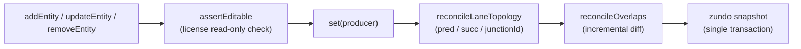
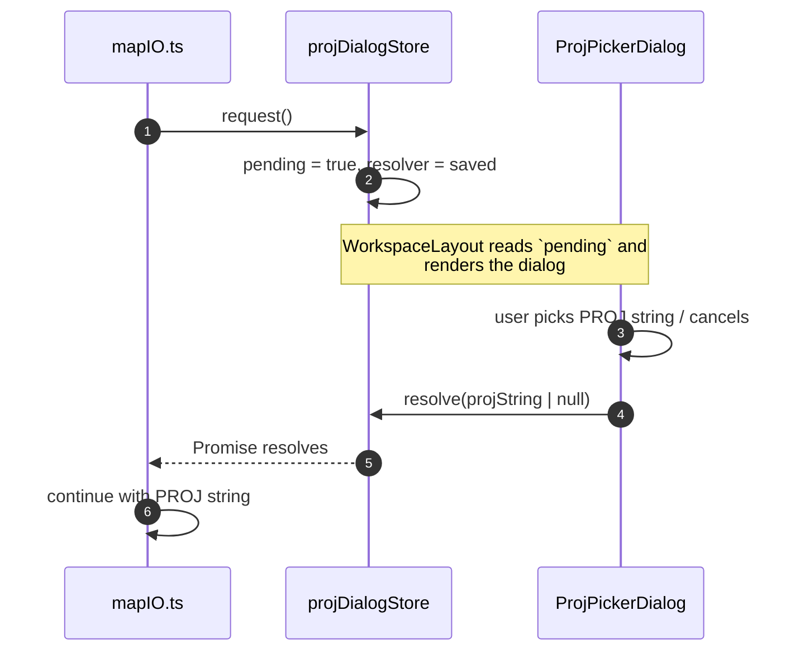

# State Management

State is split across seven Zustand stores, with `zundo` undo middleware
applied selectively to the entity store only. This page documents what
each store owns, what is and isn't undoable, and the **R1 closure** that
keeps the FSM and entity store consistent across undo/redo.

## The seven stores

| Store               | Owns                                                                             | Undoable?           | File                             |
| ------------------- | -------------------------------------------------------------------------------- | ------------------- | -------------------------------- |
| `mapStore`          | `Map<id, MapEntity>` of all editor entities                                      | yes (via zundo)     | `src/store/mapStore.ts`          |
| `uiStore`           | grid/snap toggles, cursor, layer visibility, app mode, connect mode              | no — UX preferences | `src/store/uiStore.ts`           |
| `settingsStore`     | `historyLimit`, `mapZoom`, `laneHalfWidth`, `mapCenter`, … (localStorage-backed) | no — user prefs     | `src/store/settingsStore.ts`     |
| `licenseStore`      | mirror of Electron license state                                                 | no — IPC-driven     | `src/store/licenseStore.ts`      |
| `apolloMapStore`    | imported Apollo `Map` header + bounds + import metadata                          | no — IO state       | `src/store/apolloMapStore.ts`    |
| `projDialogStore`   | promise-resolver state for the PROJ picker                                       | no — UI dialog      | `src/store/projDialogStore.ts`   |
| `taskProgressStore` | one currently-active long task (label, detail, progress)                         | no — telemetry      | `src/store/taskProgressStore.ts` |

## mapStore — the canonical entity store

`mapStore` is the single source of truth for editor content. Its state is a
single field:

```ts
interface MapState {
  entities: Map<string, MapEntity>;
}
```

The store is wrapped in two middleware layers:

```ts
// src/store/mapStore.ts:86-263 (abridged)
useMapStore = create<MapStore>()(
  temporal(            // zundo
    immer((set, get) => ({
      entities: new Map(),
      addEntity, updateEntity, removeEntity,
      reparentEntity, batchImport, replaceImportedEntityMap,
      recomputeOverlapsAsync, ...
    })),
    {
      partialize: (state) => ({ entities: state.entities }),
      limit: readHistoryLimit(),
    },
  ),
);
```

::: tip Read this in order

1. `zundo` only snapshots the field returned by `partialize` —
   the `entities` `Map`. Action references and derived caches are not in
   the history.
2. `immer`'s `enableMapSet()` is called once at module top
   (`src/store/mapStore.ts:27`). Without it, `state.entities.set(...)` inside
   a `set(producer)` block throws.
3. The temporal `limit` is read once at store creation time from
   `settingsStore`. Changing `historyLimit` from the settings panel does not
   resize an existing history — it takes effect on next page load.
   :::

### What mutations actually do

Every mutator runs three side-effects in a single `set()` block so the entire
diff lands in a single zundo snapshot:



`addEntity` (`src/store/mapStore.ts:91-111`):

1. Guard via `assertEditable` (license check).
2. Insert the new entity into `state.entities`.
3. If lane/junction-affecting, run `reconcileLaneTopologyIncremental` and
   merge its FK rewrites into the dirty set.
4. `applyOverlapPatch` runs an incremental overlap reconcile keyed on the
   dirty set.

All three operations land in one immer producer, so undo replays them as a
single step.

### Why entities is a `Map`, not a record

The `Map` choice is load-bearing for two reasons:

1. **Stable identity per id.** Adding or updating an entity does not change
   the `Map` reference for sibling entities; only the inner record changes.
   `useColdLayer` and `useHotLayer` exploit this with `prevEntity !== nextEntity`
   identity checks (see `src/hooks/useColdLayer.ts:121-144` `diffEntities`).
2. **O(1) `delete`.** A `Record<string, T>` mutation under immer would deep
   copy the surrounding object on every removal. With `Map`, immer (with
   `enableMapSet()`) tracks structural changes per-key.

The downside is `Map` doesn't serialise to JSON natively. The
`replaceImportedEntityMap` action (`mapStore.ts:206-216`) handles import
restoration without going through JSON.

### batchImport — the bulk path

`batchImport(entities)` (`src/store/mapStore.ts:184-198`) writes all entities,
then runs **one** topology reconcile and **one** full overlap reconcile —
deliberately bypassing the per-entity incremental path. This avoids both
N zundo snapshots and N incremental reconciles, which would amortise to
quadratic time on a 50k-entity import.

For very large maps, callers should prefer `recomputeOverlapsAsync`
(`mapStore.ts:236-257`), which offloads to the overlap worker — see
[Worker Protocol](./worker-protocol.md).

## uiStore — view preferences

`src/store/uiStore.ts:108-202` holds preferences and ephemeral UI state:

| Key                           | Type                                      | Notes                                   |
| ----------------------------- | ----------------------------------------- | --------------------------------------- |
| `appMode`                     | `'drawing' \| 'scene'`                    | Switches Dockview default layout        |
| `gridEnabled` / `snapEnabled` | `boolean`                                 | Toolbar toggles                         |
| `layerStates`                 | `Record<entityType, { visible, locked }>` | One entry per `MapEntity['entityType']` |
| `cursorLngLat`                | `[number, number] \| null`                | Status bar readout                      |
| `currentZoom`                 | `number`                                  | Status bar + grid spacing               |
| `connectMode`                 | `{ active, firstLaneId }`                 | Connect-lanes mode                      |
| `currentSnapTarget`           | `SnapTarget \| null`                      | Live during drag                        |

::: warning Why uiStore is NOT undoable
Toggling the grid is not a "creative" operation a user would want to undo.
Including it in the temporal history would also bloat snapshot count
substantially during normal editing. Same reasoning for layer visibility.
:::

`setSnapTarget` deliberately deduplicates identity changes
(`uiStore.ts:171-186`) because the overlay layer subscribes to it and
recomputing on every mousemove would cause render storms.

## settingsStore — persisted preferences

`settingsStore` writes to `localStorage` on every setter and reads on store
creation (`src/store/settingsStore.ts:35-115`):

| Key                             | localStorage                     | Range                |
| ------------------------------- | -------------------------------- | -------------------- |
| `historyLimit`                  | `apollo-map-studio:historyLimit` | 10–1000, default 100 |
| `mapCenterLng` / `mapCenterLat` | `…:mapCenterLng/Lat`             | -180..180 / -90..90  |
| `mapZoom`                       | `…:mapZoom`                      | 1–22                 |
| `laneHalfWidth`                 | `…:laneHalfWidth`                | 0.5–10 m             |
| `laneArrowSpacing`              | `…:laneArrowSpacing`             | 40–500 m             |

The setters clamp to the documented range — there is no path to write
out-of-range values to disk.

::: info Why localStorage and not zustand-persist?
Two reasons. (1) The persistent fields are scalars with explicit clamping
ranges; the standard middleware would persist whatever the in-memory shape
happens to be, including arrays/maps. (2) `historyLimit` needs to be readable
_before_ `mapStore` is created — see the `readHistoryLimit()` call in the
zundo `limit` option. A persist middleware would race that.
:::

## licenseStore — IPC mirror

`licenseStore` is the renderer-side mirror of the Electron main process
license state. It hydrates once at app boot and re-hydrates on `onChange`
push notifications from the main process.

```ts
// src/store/licenseStore.ts:36-54 (abridged)
useLicenseStore = create<LicenseStoreState>((set, get) => ({
  state: initial, // permissive trial fallback
  initialized: false,
  async hydrate() {
    const next = await licenseBridge.getState();
    set({ state: next, initialized: true });
  },
  setState(s) {
    set({ state: s, initialized: true });
  },
  promptActivation: () => {
    /* replaced by ActivationDialog */
  },
  registerPromptActivation(fn) {
    set({ promptActivation: fn });
  },
}));
```

Editing actions consult `state.canEdit` via the `assertEditable` helper
(`src/lib/editable-guard.ts`). When `canEdit` is false, the helper opens
the activation dialog (rate-limited to once per 5 s) and the action no-ops.
See [License System](./license-system.md).

## apolloMapStore — IO context

Stores everything the Apollo IO worker passes back from a successful import:
header metadata, WGS84 bounds, the projection string, per-entity counts,
and any error messages. Distinct from `mapStore` because the imported
proto tree contains fields the editor doesn't surface yet — round-trip
fidelity demands keeping that data alive separately from the editable
entity map.

## projDialogStore — promise-resolver dialog

`projDialogStore` is the only store that owns a `Promise` resolver. The
flow is:



Stacked dialogs are rejected: a second `request()` while the first is
pending resolves the previous one with `null` first
(`src/store/projDialogStore.ts:29-36`).

## taskProgressStore — single active task

`taskProgressStore` holds a single `activeTask` slot used by the import,
overlap recompute, and large cold-layer renders. Tasks declare a
`visibleAfterMs` so quick tasks never flash UI. The `TaskProgressOverlay`
component reads from this store.

## R1 — the FSM/undo closure

::: danger Critical invariant
The undo dispatcher must send `CANCEL` to the FSM **before** invoking
`temporal.undo()`. Without this, mid-draw Ctrl+Z leaves FSM `drawPoints`
stale while `mapStore.entities` rolls back, corrupting the next CONFIRM.

Source: `src/hooks/useActionDispatcher.ts:104-110`.
:::

```ts
// src/hooks/useActionDispatcher.ts:104-110
const historyWithCancel = (op: 'undo' | 'redo') => {
  actorRef.send({ type: 'CANCEL' });
  if (op === 'undo') useMapStore.temporal.getState().undo();
  else useMapStore.temporal.getState().redo();
};
map.set('undo', () => historyWithCancel('undo'));
map.set('redo', () => historyWithCancel('redo'));
```

The `CANCEL` event is no-op-safe in every FSM state:

| FSM state      | What CANCEL does                                           |
| -------------- | ---------------------------------------------------------- |
| `idle`         | nothing (no transition defined; XState 5 silently ignores) |
| any `draw*`    | transitions to `idle` and runs `resetDraw` action          |
| `selected`     | transitions to `idle` and runs `deselectEntity` action     |
| `editingPoint` | transitions to `selected` and clears drag state            |

So after `CANCEL`, the FSM is guaranteed to hold no entity-id references
that the upcoming `temporal.undo()` could invalidate.

The regression test lives at `src/hooks/__tests__/undoCancel.test.ts`.

```mermaid
sequenceDiagram
  autonumber
  participant User
  participant Dispatcher as useActionDispatcher
  participant FSM as editorMachine
  participant Store as mapStore (temporal)

  User->>Dispatcher: Ctrl+Z (mid-draw)
  Dispatcher->>FSM: send(CANCEL)
  FSM-->>FSM: drawPolyline → idle (resetDraw)
  Dispatcher->>Store: temporal.undo()
  Store-->>Store: rollback entities
  Note over FSM,Store: FSM holds no stale ids; next event is safe
```

This is **risk R1** in the architecture audit; it is closed.

## Anti-pattern: stale closures in MapLibre handlers

MapLibre event handlers register once during map init. Reading store state
through a React hook inside the handler captures the value at registration
time — every later edit looks at stale state.

The codebase uses `getState()` to dodge this:

```ts
// inside a maplibre 'click' handler registered in useEffect:
const { gridEnabled } = useUIStore.getState();
const { entities } = useMapStore.getState();
```

This pattern shows up in `src/hooks/mapEventRouter/*.ts`. It is intentional —
the handler shouldn't re-register on every render, and `getState()` always
returns fresh values.

## Cross-references

- [FSM Design](./fsm-design.md) — the editor machine and its CANCEL semantics.
- [Action Registry](./action-registry.md) — the dispatcher that issues
  `temporal.undo()` and `CANCEL`.
- [License System](./license-system.md) — how `assertEditable` plumbs through
  every mutator.
- [Cold/Hot Layers](./cold-hot-layers.md) — the consumer of `mapStore.entities`
  diffing.
