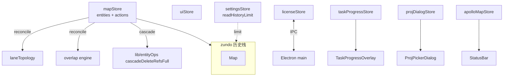
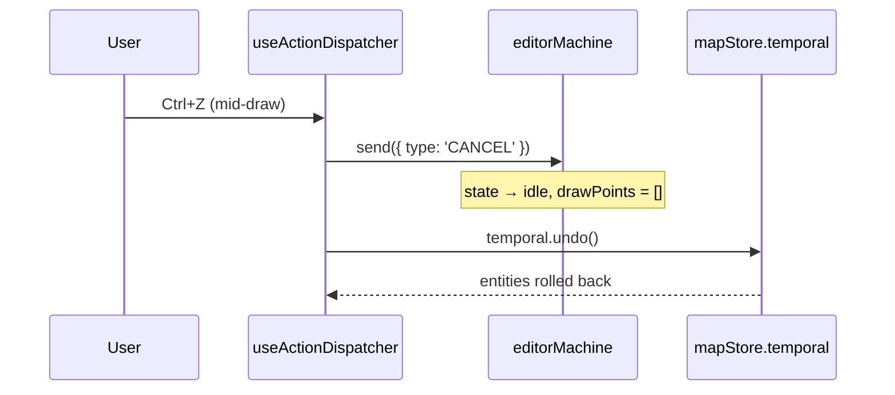
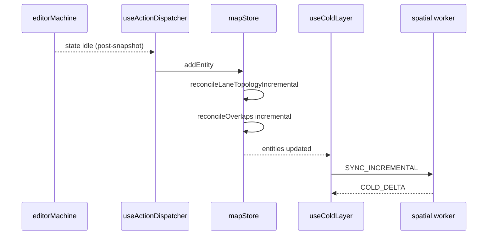

# 状态管理

应用状态被切成 **七个 Zustand store**，其中只有实体仓挂 `zundo` undo 中间件。本页
分别讲解每个 store 的所有权边界、是否进入历史栈，以及在 mid-draw 撤销时保护 FSM
状态一致性的 **R1 闭环**。

## 1. 设计目的与不变量

::: tip 设计目标

- **业务参数与 UI 偏好分离**：什么应该被撤销 / 什么不该。
- **撤销不破坏 FSM**：撤销 → CANCEL → temporal.undo() 的顺序不可逆。
- **导入路径单事务**：避免逐 entity 把历史栈打爆。
- **跨进程镜像**：licenseStore 是 main 进程状态的只读镜像。
  :::

::: warning 不变量 (审计点)

- 仅 `mapStore` 的 `entities` 进 zundo 历史栈 (partialize)。
- `mapStore` 全部 mutation 都经过一个 `set((state) => ...)` immer producer。
- `mapStore.batchImport` 与 `replaceImportedEntityMap` 调用 `temporal.pause()` /
  `temporal.clear()` 把导入排除在历史外。
- `useActionDispatcher.ts:76-82` 在 undo / redo 之前发 `CANCEL` (R1 闭环)。
  :::

## 2. Store 总表

| Store                  | 文件                                | 是否 undoable | 范围                                        |
| ---------------------- | ----------------------------------- | ------------- | ------------------------------------------- |
| `useMapStore`          | `src/store/mapStore.ts:86`          | ✅ (entities) | 实体仓 + 拓扑重算 + overlap reconcile       |
| `useUIStore`           | `src/store/uiStore.ts:108`          | ❌            | 偏好；图层显隐；connect mode                |
| `useSettingsStore`     | `src/store/settingsStore.ts:107`    | ❌            | history limit、map zoom、lane half-width 等 |
| `useLicenseStore`      | `src/store/licenseStore.ts:36`      | ❌            | main 进程 license 镜像                      |
| `useTaskProgressStore` | `src/store/taskProgressStore.ts:28` | ❌            | 单一 active task 进度                       |
| `useProjDialogStore`   | `src/store/projDialogStore.ts:25`   | ❌            | PROJ.4 picker promise gate                  |
| `useApolloMapStore`    | `src/store/apolloMapStore.ts:56`    | ❌            | 导入的 raw Apollo 元数据                    |

## 3. 模块地图



## 4. mapStore 深入

### 4.1 公共表面

```ts
// mapStore.ts:33-63
interface MapActions {
  addEntity(entity: MapEntity): void;
  updateEntity(id: string, entity: MapEntity): void;
  removeEntity(id: string): void;
  reparentEntity(childId: string, target: ParentTarget): ReparentResult;
  batchImport(entities: MapEntity[]): void;
  replaceImportedEntities(entities: MapEntity[]): void;
  replaceImportedEntityMap(entities: Map<string, MapEntity>): void;
  recomputeOverlapsAsync(): Promise<{...} | null>;
}
```

### 4.2 zundo 配置

```ts
// mapStore.ts:259-263
{
  partialize: (state) => ({ entities: state.entities }),
  limit: readHistoryLimit(),  // settingsStore 控制 (10–1000，默认 100)
}
```

`partialize` 让 zundo 只追踪 `entities`；切换 connect mode、cursor 移动这些事件不会
进历史。

### 4.3 mutation 内部流水

每条 mutation 在 `immer((set, get) => ...)` 内部执行三步：

1. **写入主体**：`state.entities.set(id, entity)`
2. **拓扑重算 (incremental)**：仅当 entityType ∈ {lane, junction}
   (`topologyAffectingType`) 时触发 `reconcileLaneTopologyIncremental`
3. **overlap 重算 (incremental)**：合并所有"脏 id"，调用 `reconcileOverlaps({ mode: 'incremental', dirtyIds })`

这三步全部进 **同一** immer producer → **同一** zundo 快照 → R1 不破。

### 4.4 batchImport：单事务多步

```ts
// mapStore.ts:184-198
batchImport(entities) {
  if (entities.length === 0) return;
  set((state) => {
    for (const e of entities) state.entities.set(e.id, e);
    const { changes: topoChanges } = reconcileLaneTopology(state.entities);
    for (const [cid, c] of topoChanges) state.entities.set(cid, c);
    const patch = reconcileOverlaps(state.entities, { mode: 'full' });
    for (const oid of patch.removedOverlapIds) state.entities.delete(oid);
    for (const [oid, e] of patch.changes) state.entities.set(oid, e);
  });
}
```

::: tip 5 万实体导入约 450 ms
完整 reconcile 耗时已被基准测试约束在 `bench-budgets.json` 中；超大图建议走 worker
路径 `recomputeOverlapsAsync()`。
:::

### 4.5 replaceImportedEntityMap：暂停历史

```ts
// mapStore.ts:206-216
replaceImportedEntityMap(entities) {
  const temporal = useMapStore.temporal.getState();
  temporal.pause();
  try {
    set({ entities });
    temporal.clear();   // 清空历史栈
  } finally {
    temporal.resume();
  }
  resetSharedSpatialIndex();
}
```

导入新地图时把历史完全清空 —— 撤销不应跨地图边界。

### 4.6 removeEntity 的级联清理

`removeEntity` 在删除前用 `getSharedSpatialIndex().queryBBox(bbox)` 收集空间邻居 lane
(`mapStore.ts:147-158`)，再把 `cascadeDeleteRefsFull` 的 cleanups 写回。这是为了覆盖
"几何邻居 lane 不持有被删 entity 的 overlapIds，但语义上需要重新评估 overlap" 这种
情况。

## 5. R1 闭环：撤销前先 CANCEL



::: danger 错误顺序
如果先 `temporal.undo()` 再 `CANCEL`：FSM 还在 `drawPolyline` 状态，`drawPoints`
仍然有 N 个点；下次 CONFIRM 会用旧 drawPoints 创建一个 entity，与已经撤销的状态错位。
回归测试 `src/hooks/__tests__/undoCancel.test.ts`。
:::

## 6. uiStore 细节

```ts
// uiStore.ts:31-58
interface UIState {
  appMode: AppMode; // 'drawing' | 'scene'
  gridEnabled: boolean;
  snapEnabled: boolean;
  layerStates: Record<string, LayerState>;
  cursorLngLat: [number, number] | null;
  currentZoom: number;
  sidebarVisible: boolean;
  currentSnapTarget: SnapTarget | null;
  connectMode: { active: boolean; firstLaneId: string | null };
}
```

::: warning setSnapTarget 的去抖
`uiStore.ts:171-187` 显式比对 `prev` vs `target` —— 鼠标移动时若 snap target 没变，
不更新 store。否则 overlay 层 subscribe 会每帧 re-render。
:::

## 7. settingsStore：localStorage 持久化

```ts
// settingsStore.ts:107-148
```

每次 setter 同步 `persist(KEY, value)`；初始值通过 `read*()` 函数从 localStorage
读取并 clamp 到合法区间。`mapStore` 的 zundo `limit` 在 store 创建时 **一次性**
读取 (`mapStore.ts:261`) —— 修改 historyLimit 不会动态影响已有 zundo 实例，需要
重启或重新 hydrate。

## 8. licenseStore：跨进程镜像

```ts
// licenseStore.ts:39-44
async hydrate() {
  const next = await licenseBridge.getState();
  set({ state: next, initialized: true });
}
```

通过 `useLicenseSync()` (在 `WorkspaceLayout.tsx:42` 调用) 注册 `licenseBridge.onChange`，
每当 main 进程发出 `license-state-changed` IPC 消息时刷新本地 store。`canEdit` 选择器
被 `lib/editable-guard.ts` 用于 mutation 拦截。

## 9. taskProgressStore + projDialogStore + apolloMapStore

### 9.1 taskProgressStore

单 active task slot：导入 / 全量 overlap 重算等长任务广播进度。`visibleAfterMs` 默认
1000 ms —— 短于此不弹 overlay，避免闪烁。

### 9.2 projDialogStore

Promise gate：`request()` 创建 pending Promise，UI 弹 dialog 后调用 `resolve()`。
若已有 pending request，新调用会先 reject 旧的 (`null`)，避免堆栈式 dialog。

### 9.3 apolloMapStore

```ts
// apolloMapStore.ts:33-43
header: ApolloMapHeader | null;
bounds: ApolloMapBounds | null;
info: ApolloMapImportInfo | null;
lastError: string | null;
```

导入路径让 `apolloIO.worker` 持有完整 proto 树，主线程只保存 lightweight metadata、
header 副本和 bounds。

## 10. 与 FSM / Worker 的交互



## 11. 常见陷阱

::: danger 在 immer producer 之外修改 entities
zundo 监听 `set` 调用；`useMapStore.setState({entities: ...})` 之外的修改不会进历史。
:::

::: danger 把非业务参数加进 partialize
任何写进 partialize 的字段都会被记录每一步快照。把 cursorLngLat 之类 60Hz 字段加进去
会在数秒内打爆 history limit。
:::

::: danger uiStore 直接持有 entity 引用
uiStore 应该只存 ID 或纯标量。持有实体引用会让 React selector 命中错误的相等比较，
出现"撤销后选中的 entity 仍是旧引用"问题。
:::

::: danger 在 React render 里调用 `temporal.undo()`
`useActionDispatcher` 是事件回调里调用；render 期间调用会引发递归 setState。
:::

## 12. Source map (file:line refs)

- `src/store/mapStore.ts:86-263` — 完整 store
- `src/store/mapStore.ts:91-111` — `addEntity`
- `src/store/mapStore.ts:113-134` — `updateEntity`
- `src/store/mapStore.ts:136-182` — `removeEntity` 级联
- `src/store/mapStore.ts:184-198` — `batchImport`
- `src/store/mapStore.ts:200-216` — replace import
- `src/store/mapStore.ts:236-257` — `recomputeOverlapsAsync`
- `src/store/uiStore.ts:108-202` — UI store 全文
- `src/store/settingsStore.ts:1-148`
- `src/store/licenseStore.ts:36-54`
- `src/store/taskProgressStore.ts:28-65`
- `src/store/projDialogStore.ts:25-43`
- `src/store/apolloMapStore.ts:56-86`
- `src/hooks/useActionDispatcher.ts:76-82` — R1 CANCEL

## 13. selector 模式与重渲染优化

```ts
// 推荐：单字段
const entityCount = useMapStore((s) => s.entities.size);

// 推荐：组合 selector + memoise (zustand 内置 shallow)
const { ids, count } = useMapStore(
  useShallow((s) => ({ ids: [...s.entities.keys()], count: s.entities.size })),
);
```

::: warning 不要返回 Map 引用本身
`useMapStore(s => s.entities)` 每次 mutation 都会 re-render，因为 immer 给 Map 装上
新代理。组件应当 select 具体字段或 ID 数组。
:::

## 14. zundo actor API 在 dispatcher 中的用法

```ts
// useActionDispatcher.ts (节选)
const temporal = useMapStore.temporal.getState();
// 撤销：
actorRef.send({ type: 'CANCEL' }); // R1 闭环
temporal.undo();
// 重做：
actorRef.send({ type: 'CANCEL' });
temporal.redo();
```

`useMapStore.temporal` 是 zundo 注入的 vanilla store；可以在 React 树外读 / 调用，
天然适配键盘 handler 的 useEffect 全局监听器。

## 15. 多 store 协同的最小示例：Connect Lanes

1. 用户按 `C`，`useActionDispatcher` 调 `useUIStore.toggleConnectMode()`。
2. `connectMode.active = true`，map 进入"等待第一次 lane 点击"。
3. 第一次点击：`uiStore.setConnectFirstLane(id)`。
4. 第二次点击：调 `mapStore.connectLanes(firstId, secondId)` (修改 lane.predecessor /
   successor)，再 `uiStore.exitConnectMode()`。
5. 一次完整流程命中 `uiStore` 两次 + `mapStore` 一次。zundo 历史只见 `mapStore` 那次。

## 16. 单元测试模式

```ts
// store/__tests__/mapStore.test.ts
import { useMapStore } from '@/store/mapStore';

beforeEach(() => {
  useMapStore.setState({ entities: new Map() });
  useMapStore.temporal.getState().clear();
});

test('addEntity creates one history entry', () => {
  useMapStore.getState().addEntity(makeFakeLane('lane_1'));
  expect(useMapStore.temporal.getState().pastStates.length).toBe(1);
});
```

::: tip 测试隔离
每个测试用 `setState` + `temporal.clear()` 重置。不要在 vitest 全局 beforeEach
里做这件事 —— 会把别的 store 也意外 reset。
:::

## 17. SettingsStore 持久化策略

| 字段             | localStorage key                     | 区间      | 默认                        |
| ---------------- | ------------------------------------ | --------- | --------------------------- |
| historyLimit     | `apollo-map-studio:historyLimit`     | 10–1000   | 100                         |
| mapCenterLng     | `apollo-map-studio:mapCenterLng`     | -180–180  | `MAP_DEFAULT_CENTER[0]`     |
| mapCenterLat     | `apollo-map-studio:mapCenterLat`     | -90–90    | `MAP_DEFAULT_CENTER[1]`     |
| mapZoom          | `apollo-map-studio:mapZoom`          | 1–22      | `MAP_DEFAULT_ZOOM`          |
| laneHalfWidth    | `apollo-map-studio:laneHalfWidth`    | 0.5–10 m  | `DEFAULT_LANE_HALF_WIDTH`   |
| laneArrowSpacing | `apollo-map-studio:laneArrowSpacing` | 40–500 px | `LANE_ARROW_SYMBOL_SPACING` |

`readNum(key, fallback, min, max)` 是统一的读出 + clamp + fallback 助手
(`settingsStore.ts:35-46`)，避免每个字段重复"localStorage / Number / clamp"流程。

## 18. See also

- [架构总览](./overview.md)
- [Action Registry](./action-registry.md) — undo / redo 的入口
- [FSM 设计](./fsm-design.md) — CANCEL 的语义
- [entityOps 模块](./entityops.md) — cascadeDeleteRefs / reparent
- [反腐败层](./anti-corruption-layer.md)
