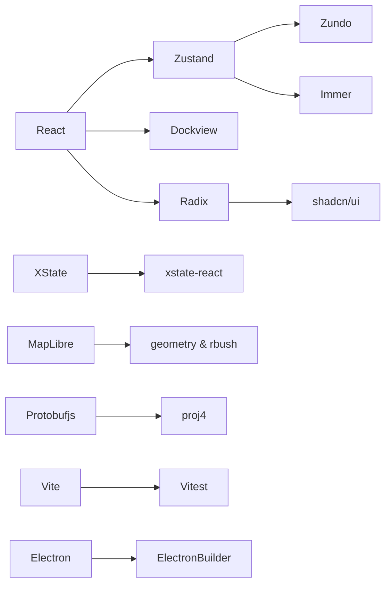

# 技术栈

`package.json` 中的每一个直接依赖都是 **被刻意挑选** 的 —— 我们没有"模板遗留包"。
本页把每个包的版本、扮演角色与选型动机摊开给你看。当某个版本已经被业务深度依赖
(例如 React 19 / XState 5 / MapLibre 5)，迁移代价高，本页同时给出"绑定原因"。

::: tip 总览

- 框架与 UI：`react@19`、`tailwind@4`、`@radix-ui/*`、`shadcn` (devDep)、`react-icons`、`react-arborist`
- 状态：`zustand@5`、`zundo@2`、`immer@11`
- 状态机：`xstate@5`、`@xstate/react@6`
- 渲染：`maplibre-gl@5`
- 几何：`polygon-clipping`、`rbush`、`proj4`
- 协议：`protobufjs@8`
- 表单：`react-hook-form`、`@hookform/resolvers`、`zod@4`
- 桌面端：`electron@41`、`electron-builder`
- 工具链：`vite@8`、`vitest@4`、`vitepress@1.6`、`typescript@6`
  :::

## 1. 运行时依赖 (`dependencies`)

### 1.1 应用底座

| 包                     | 版本      | 角色      | 选型动机                                                                               |
| ---------------------- | --------- | --------- | -------------------------------------------------------------------------------------- |
| `react`                | `^19.2.4` | UI 框架   | 19 系列稳定后切换；`useTransition` / Concurrent rendering 让大量实体重渲染不阻塞输入。 |
| `react-dom`            | `^19.2.4` | 渲染器    | 与 `react` 配套；Electron 使用同一渲染器无须额外适配。                                 |
| `tailwindcss` (devDep) | `^4.2.2`  | 原子 CSS  | 4.x 的 `@theme` 块是 `ams-*` 设计 token 的载体。                                       |
| `@tailwindcss/vite`    | `^4.2.2`  | Vite 插件 | 走 Vite plugin 而非 PostCSS，HMR 速度提升约 40%。                                      |

### 1.2 UI 组件 (Radix + shadcn)

| 包                              | 版本      | 角色            | 动机                                                                           |
| ------------------------------- | --------- | --------------- | ------------------------------------------------------------------------------ |
| `@radix-ui/react-context-menu`  | `^2.2.16` | 右键菜单原语    | 无样式 + 可访问性已做完，shadcn/ui 在它之上做主题。                            |
| `@radix-ui/react-dialog`        | `^1.1.15` | 模态对话框      | 命令面板、激活对话框、PROJ 选择器都基于它。                                    |
| `@radix-ui/react-dropdown-menu` | `^2.1.16` | 顶部 MenuBar    | MenuBar 子菜单 → 由 ActionRegistry `getMenuActions(menu)` 数据驱动。           |
| `@radix-ui/react-tooltip`       | `^1.2.8`  | 悬浮提示        | ToolStrip 工具按钮的快捷键提示。                                               |
| `cmdk`                          | `^1.1.1`  | Command palette | Vercel 出品，键盘可达性优秀；与 `getCommandPaletteActions()` 数据驱动绑定。    |
| `class-variance-authority`      | `^0.7.1`  | variant 工具    | shadcn 风格组件的 variant prop 实现。                                          |
| `clsx`                          | `^2.1.1`  | className 拼接  | 标配，与 `tailwind-merge` 搭配解决冲突。                                       |
| `tailwind-merge`                | `^3.5.0`  | utility 去冲突  | 用户传入 `className` 与组件默认 utility 冲突时合并。                           |
| `react-icons`                   | `^5.6.0`  | 图标            | `react-icons/fa6` 是 `ActionDef.icon` 的来源，`registry/definitions.ts:1-19`。 |
| `react-arborist`                | `^3.4.3`  | 虚拟化树        | Sidebar 的图层树支持万级条目仍然 60fps。                                       |

### 1.3 状态层

| 包        | 版本      | 角色                 | 动机                                                                                                 |
| --------- | --------- | -------------------- | ---------------------------------------------------------------------------------------------------- |
| `zustand` | `^5.0.12` | 全局状态容器         | 轻量、selector 精细化、无 Provider；直接 `create<T>()(temporal(...))` 链式中间件。                   |
| `zundo`   | `^2.3.0`  | undo/redo middleware | `temporal.partialize` 让我们只把 `entities` 入历史栈；`limit` 由 `settingsStore.historyLimit` 控制。 |
| `immer`   | `^11.1.4` | 不可变更新           | `mapStore` 走 `immer((set) => ...)`，Map 类型需要 `enableMapSet()`。                                 |

### 1.4 状态机

| 包              | 版本      | 角色       | 动机                                                                        |
| --------------- | --------- | ---------- | --------------------------------------------------------------------------- |
| `xstate`        | `^5.30.0` | 编辑器 FSM | `setup({ types }).createMachine(...)` 提供类型安全的事件 / 上下文 / guard。 |
| `@xstate/react` | `^6.1.0`  | React 绑定 | `useActorRef` / `useSelector` 让组件订阅 FSM context。                      |

::: warning XState 5 类型痛点
`editorMachine.ts:1` 顶部 **没有** `// @ts-nocheck`，说明已迁移到 typed `setup` API；
但 `assign` 的 5 类型参数推断仍是雷区，请保持 `assign(...)` 内联在 `setup.actions`
对象里 —— 不要提取到顶层 `const`，详见 `editorMachine.ts:120-128` 的注释。
:::

### 1.5 渲染与几何

| 包                 | 版本      | 角色            | 动机                                                                                          |
| ------------------ | --------- | --------------- | --------------------------------------------------------------------------------------------- |
| `maplibre-gl`      | `^5.22.0` | WebGL 地图      | 开源 fork (BSD)，与 Mapbox v1 风格兼容；`GeoJSONSource.updateData` 增量 patch 是 5.x 才稳定。 |
| `polygon-clipping` | `^0.15.7` | 多边形布尔运算  | overlap 计算与 lane junction 切割。                                                           |
| `rbush`            | `^4.0.1`  | R-tree 空间索引 | `core/spatial/SharedSpatialIndex` 与 `spatial.worker` 内部使用。                              |
| `proj4`            | `^2.20.8` | 大地坐标转换    | UTM / WGS84 / 用户自定义 PROJ.4 字符串相互转换；与 `projDialogStore` 联动。                   |

### 1.6 协议与序列化

| 包           | 版本     | 角色           | 动机                                                                                                                                                                       |
| ------------ | -------- | -------------- | -------------------------------------------------------------------------------------------------------------------------------------------------------------------------- |
| `protobufjs` | `^8.0.3` | Protobuf codec | `src/io/proto/loader.ts` 用 `import.meta.glob('/src/proto/**/*.proto', { query: '?raw', eager: true })` 打包 raw `.proto`，运行时 `root.load('map_msgs/map.proto')` 解析。 |
| `nanoid`     | `^5.1.7` | ID 生成        | `${type}_${nanoid(12)}`，URL-safe，碰撞概率工程可忽略。                                                                                                                    |

### 1.7 表单与校验

| 包                    | 版本      | 角色           | 动机                                                                            |
| --------------------- | --------- | -------------- | ------------------------------------------------------------------------------- |
| `react-hook-form`     | `^7.72.1` | 表单引擎       | Inspector 面板每个字段独立 register，零 re-render。                             |
| `@hookform/resolvers` | `^5.2.2`  | RHF + zod 桥   | `zodResolver(schema)` 把 `zod` schema 转成 RHF resolver。                       |
| `zod`                 | `^4.3.6`  | runtime schema | `lib/schemas.ts` 定义 entity 校验规则；同时是 inspector 自动表单生成的 source。 |
| `dockview`            | `^5.2.0`  | 面板布局核心   | 多 panel + drag/drop + 可保存到 JSON 布局。                                     |
| `dockview-react`      | `^5.2.0`  | React 适配     | `WorkspaceLayout.tsx:2` 直接 import `DockviewReact`。                           |

## 2. 开发依赖 (`devDependencies`)

### 2.1 编译与打包

| 包                     | 版本      | 角色                                    |
| ---------------------- | --------- | --------------------------------------- |
| `typescript`           | `^6.0.2`  | 编译器；启用 `noUncheckedIndexedAccess` |
| `vite`                 | `^8.0.7`  | 开发服务器 + 构建                       |
| `@vitejs/plugin-react` | `^6.0.1`  | React JSX + Fast Refresh                |
| `cross-env`            | `^10.1.0` | 跨平台环境变量                          |

### 2.2 测试

| 包                    | 版本     | 角色                 |
| --------------------- | -------- | -------------------- |
| `vitest`              | `^4.1.4` | Vite 原生测试 runner |
| `@vitest/coverage-v8` | `4.1.4`  | V8 原生覆盖率        |

### 2.3 桌面端

| 包                 | 版本      | 角色                                          |
| ------------------ | --------- | --------------------------------------------- |
| `electron`         | `^41.5.0` | Chromium 渲染壳；`main` 进程 + `preload` 进程 |
| `electron-builder` | `^26.8.1` | 打包 .dmg / .exe / AppImage                   |
| `concurrently`     | `^9.2.1`  | `electron:dev` 同时跑 vite 与 electron        |
| `wait-on`          | `^9.0.5`  | 等 vite 启动完再启动 electron                 |

### 2.4 文档

| 包          | 版本     | 角色                   |
| ----------- | -------- | ---------------------- |
| `vitepress` | `^1.6.4` | 文档站点；本页正在使用 |

### 2.5 代码风格

| 包                            | 版本      | 角色                                         |
| ----------------------------- | --------- | -------------------------------------------- |
| `eslint`                      | `^9.39.4` | flat config 9.x；`eslint.config.js`          |
| `@eslint/js`                  | `^9.39.4` | 内置 recommended 配置                        |
| `typescript-eslint`           | `^8.58.1` | TS 规则                                      |
| `eslint-plugin-react-hooks`   | `^7.0.1`  | hook lint 规则                               |
| `eslint-plugin-react-refresh` | `^0.5.2`  | React Refresh 友好                           |
| `eslint-config-prettier`      | `^10.1.8` | 关闭与 prettier 冲突的规则                   |
| `prettier`                    | `^3.8.2`  | 格式化                                       |
| `husky`                       | `^9.1.7`  | git hooks                                    |
| `lint-staged`                 | `^16.4.0` | 暂存区 lint                                  |
| `globals`                     | `^17.4.0` | env globals presets                          |
| `shadcn`                      | `^4.2.0`  | 命令行：拉取 shadcn/ui 组件                  |
| `tailwindcss`                 | `^4.2.2`  | utility 引擎 (双重声明在 dev/runtime 都需要) |

## 3. 选型动机：为什么不是 X？

| 选定                        | 备选                                       | 不选的原因                                                                                                      |
| --------------------------- | ------------------------------------------ | --------------------------------------------------------------------------------------------------------------- |
| `zustand`                   | Redux Toolkit                              | RTK 的 reducer + slice 心智模型在 100+ 选择器组件下 boilerplate 过多；zundo 直接挂 zustand 中间件位是核心理由。 |
| `xstate`                    | 自写状态枚举                               | 6 种绘制状态 × 多个 guard，自写很快变成 `if-else` 山；XState 给我们 visualizer / inspect。                      |
| `maplibre-gl`               | Mapbox / OpenLayers / Three.js + 自写 tile | Mapbox v2 商用许可不友好；OpenLayers 不基于 WebGL；Three.js 没有 vector tile pipeline。                         |
| `dockview`                  | react-resizable-panels / GoldenLayout      | dockview 是少见的同时支持 drag-tab、popout、JSON 序列化的面板系统；GoldenLayout 没有 React 19 兼容。            |
| `protobufjs` runtime loader | Google `protoc-gen-ts`                     | 保留 Apollo 原始 `.proto` import tree，Vite raw-load 后由 protobufjs 运行时解析，不要求构建时跑 protoc。        |

## 4. 版本绑定与升级风险

::: warning React 19
`@xstate/react@6` 与 `react-arborist@3` 都已支持 React 19。回滚到 18.x 不是软迁移。
:::

::: warning Tailwind 4
`@theme` 块是 ams-\* tokens 的承载形式，回滚到 3.x 需要把 token 全部转回 `tailwind.config.ts`。
:::

::: warning XState 5
版本前还在 4.x，状态机迁移已花费 1 个 sprint，建议跟随 5.x 而非回滚。
:::

::: warning protobufjs 8
8.x 与 7.x 的 `T.toObject` 默认行为不同 (7.x 默认 `arrays: true`)。已在 IO 路径显式
传选项；自定义脚本若依赖默认值要重新校验。
:::

## 5. Public surface (本页关心的导出)

| 模块          | 入口                            | 暴露给谁                                                                       |
| ------------- | ------------------------------- | ------------------------------------------------------------------------------ |
| `react`       | 应用全局                        | 所有 `components/`、`hooks/`                                                   |
| `zustand`     | `store/*`                       | `hooks/`、`components/`                                                        |
| `zundo`       | `mapStore.ts:87`                | 仅 `mapStore`；undo dispatcher 通过 `useMapStore.temporal.getState()` 拿 actor |
| `xstate`      | `core/fsm/editorMachine.ts:130` | `hooks/useEditor*`、`components/MapCanvas`                                     |
| `maplibre-gl` | `core/map/createMap.ts`         | 仅 `hooks/useColdLayer`、`useHotLayer`；UI 不直接 import                       |
| `protobufjs`  | `src/io/proto/loader.ts`        | `src/io/proto/*` 与 `src/io/apolloIO.worker.ts`                                |

## 6. 依赖图 (mermaid)

## 7. 常见陷阱

::: danger 不要在 components 直接 import `protobufjs`
`protobufjs` 体积 ≈80 KiB gzip；只能在 `src/io/proto/*.ts` 与 `src/io/apolloIO.worker.ts` 里使用，
通过 entityOps 暴露的 MapEntity 已是 proto-agnostic。
:::

::: danger `nanoid` ESM only
`nanoid@5` 是 pure ESM；测试环境用 Vitest (原生 ESM)，但 Electron main `.cts` 因为
是 CommonJS，不要在 main 进程引入 `nanoid` —— 用 `crypto.randomUUID()` 代替。
:::

## 8. Source map

- `package.json` — 全部版本
- `pnpm-lock.yaml` — 解析后的精确锁
- `vite.config.ts` — vite 插件链
- `eslint.config.js` — flat config
- `tsconfig.json` / `tsconfig.electron.json` — TS 配置
- `electron-builder.yml` — 打包配置

## 9. 各包深度札记

### 9.1 Zustand 5 选用原因 (vs 4.x)

5.x 的 selector-based store hook 默认使用 `Object.is`，并在 `subscribeWithSelector`
中给 selector return 类型推断了精确类型。我们的 store 没有 vanilla 用法，全部从
`useFooStore(s => ...)` 走，这条改进直接抹掉了几十处 `useShallow` boilerplate。
中间件链 (`temporal(immer(...))`) 与 4.x 完全兼容，无迁移成本。

### 9.2 zundo partialize 与 limit 的细节

`partialize` 是同步纯函数，每次 mutation 会被调用。我们让它返回 `{ entities }`，
zundo 内部用 `structuredClone` 做 deep copy。Map<string, MapEntity> 的克隆代价 = O(N)；
5 万实体 ≈ 30 ms。这是为什么 `historyLimit` 默认 100 而不是 1000：100 个快照已经
占用 ~150 MB 堆。

### 9.3 immer + Map/Set

`immer@11` 默认不支持 `Map` / `Set` 写入；必须 `enableMapSet()` 在模块顶层调一次
(`mapStore.ts:27`)。否则 producer 内 `state.entities.set(id, e)` 会抛
`MapSet support not enabled`。

### 9.4 polygon-clipping 的精度

polygon-clipping 内部用 64-bit float + Bentley-Ottmann 扫描线；坐标范围超过
~1e7 时累积误差会让 boolean 结果出现锐角伪影。我们的 lane corridor 都在百米尺度，
WGS84 坐标差约 1e-3，安全。

### 9.5 RBush 的扇出

`rbush@4` 默认 maxEntries=9。我们没改默认值；测试显示 5 万实体下 query 平均 0.4 ms，
满足 60fps hit-test 预算。

### 9.6 protobufjs + raw .proto loader

`src/io/proto/loader.ts` 通过 Vite `import.meta.glob('/src/proto/**/*.proto', { query: '?raw', import: 'default', eager: true })` 把 `src/proto/**` 下的 Apollo `.proto` 作为 raw text 打进 bundle。运行时重写 `root.resolvePath` 与 `root.fetch`，让 protobufjs 按 `map_msgs/map.proto` 作为 root-relative key 加载 import tree。没有生成式 JSON schema 文件，也不跑构建期转换命令。

### 9.7 dockview 5.x 与 React 19

`dockview-react@5.2` 才接入 React 19 兼容；我们的 panel 之所以稳定不"忘记 active
tab"，是因为 5.2 修复了内部的 `useId` 误用。

### 9.8 cmdk 与 a11y

`cmdk@1.1` 内部用 `
`，自动给 `<Command.Item>` 加
`aria-selected`。我们没额外加 ARIA，依赖 cmdk 自己做。

## 10. 升级清单 (六个月节奏)

| 时机   | 候选                                                    |
| ------ | ------------------------------------------------------- |
| 每月   | `react`, `vite`, `vitest` patch；`maplibre-gl` patch    |
| 每季度 | `xstate`, `zustand`, `dockview`, `tailwindcss` 次要版本 |
| 每半年 | `electron`, `typescript` 主版本（评估 breaking change） |

## 11. 不推荐添加的依赖类别

::: danger 不要引入 lodash
我们已有 nanoid + immer + rxjs-style 函数式工具，绝大多数 lodash 工具可以用 ES 原生
方法替代；引入 lodash 会增加 25 KiB 死代码。
:::

::: danger 不要引入 moment / dayjs
没有时区运算需求；`Date.now()` 已足够。
:::

::: danger 不要引入额外 form 库
RHF + zod 是事实标准，添加 formik 会与 RHF 互斥。
:::

## 12. 包重要 API 速查

| 包               | 关键 API                                                                             | 出现位置                                                                        |
| ---------------- | ------------------------------------------------------------------------------------ | ------------------------------------------------------------------------------- |
| zustand          | `create<T>()(...)` `useStore.getState()` `useStore.setState()` `useStore.temporal`   | `store/*`                                                                       |
| immer            | `enableMapSet()` `produce(state, draft => ...)`                                      | `mapStore.ts:27`                                                                |
| zundo            | `temporal(immer(...))` `temporal.undo()` `temporal.pause()` `temporal.clear()`       | `mapStore.ts:87, 209-216`                                                       |
| xstate           | `setup({ types, guards, actions }).createMachine(...)` `assign({...})`               | `editorMachine.ts:130`                                                          |
| @xstate/react    | `useActorRef` `useSelector`                                                          | `WorkspaceLayout.tsx:187`                                                       |
| maplibre-gl      | `new Map(...)` `GeoJSONSource.setData` `setStyle`                                    | `core/map/createMap.ts`                                                         |
| polygon-clipping | `union(a, b)` `intersection(a, b)` `difference(a, b)`                                | overlap engine                                                                  |
| rbush            | `RBush()` `insert(item)` `search(bbox)` `remove(item)`                               | `src/core/workers/spatialState.ts`、`src/core/elements/overlap/spatialIndex.ts` |
| proj4            | `proj4(from, to, [x, y])`                                                            | `src/io/proto/projection.ts`                                                    |
| protobufjs       | `new Root()` `root.load('map_msgs/map.proto')` `Type.encode(msg)` `Type.decode(buf)` | `src/io/proto/loader.ts`、`src/io/proto/binCodec.ts`                            |
| react-hook-form  | `useForm({ resolver })` `register(name)`                                             | `InspectorForms.tsx`                                                            |
| zod              | `z.object({...})` `z.union([...])`                                                   | `lib/schemas.ts`                                                                |
| dockview         | `api.addPanel({...})` `api.toJSON()` `api.fromJSON()`                                | `WorkspaceLayout/dockviewLayout.ts`                                             |
| nanoid           | `nanoid(12)`                                                                         | `lib/idGenerator.ts`                                                            |
| cmdk             | `<Command>` `<Command.Input>` `<Command.Item>`                                       | `panels/CommandPalette.tsx`                                                     |

## 13. See also

- [构建与打包](./build-and-bundle.md) — Vite + Electron Builder 流水线
- [架构总览](./overview.md)
- [设计 token](./design-tokens.md) — Tailwind 4 `@theme` 内的 ams-\* token
- [Electron 集成](./electron-integration.md) — desktop 端独有依赖
