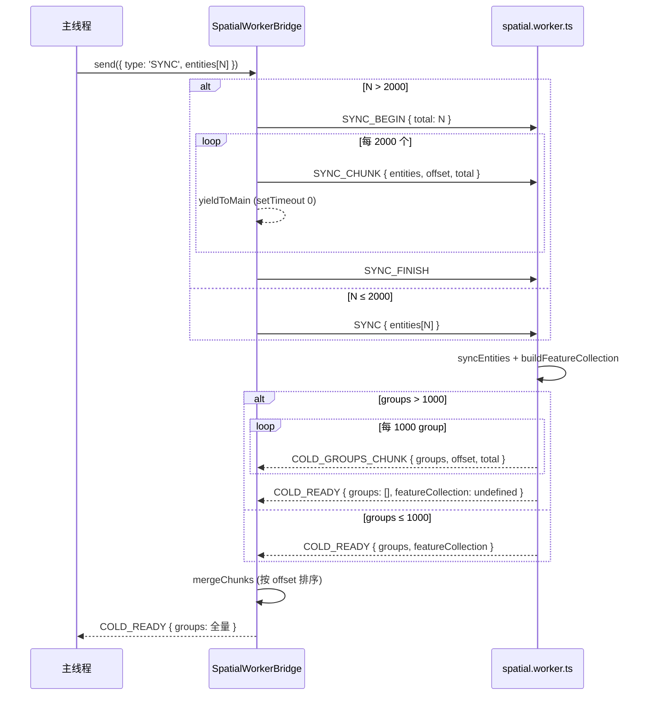
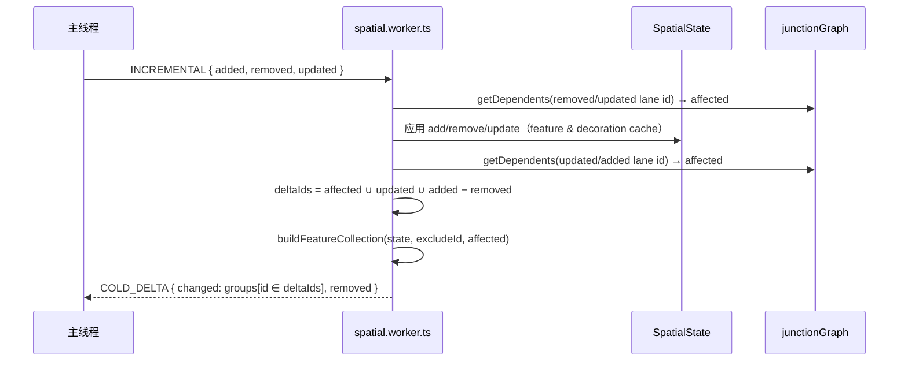
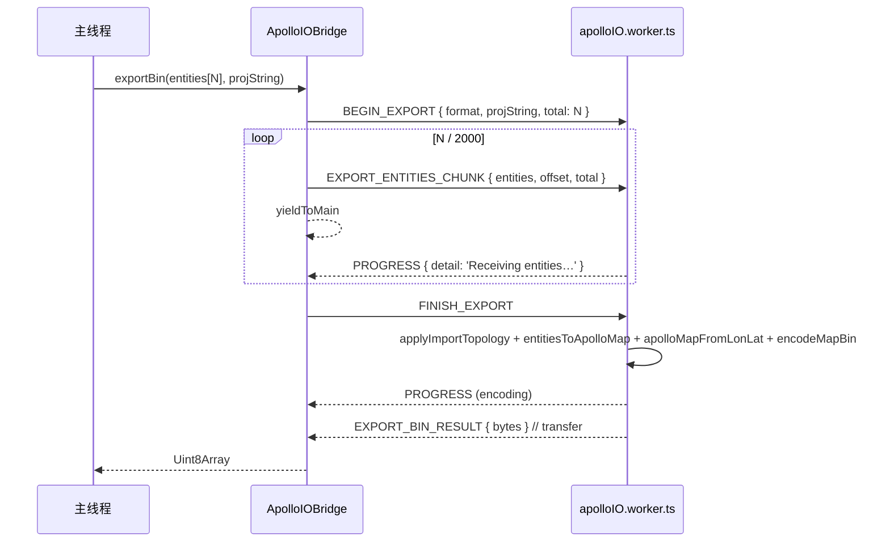

# Worker 通信协议 (Worker Protocol)

> 关键文件：
>
> - `src/core/workers/protocol.ts` —— spatial worker 协议定义
> - `src/core/workers/spatial.worker.ts`、`spatialBridge.ts`、`spatialRequests.ts`
> - `src/core/workers/overlap.worker.ts`、`overlapBridge.ts`
> - `src/io/apolloIOProtocol.ts`、`apolloIO.worker.ts`、`apolloIOBridge.ts`

## 1. 三个 Worker 边界

Apollo Map Studio 把"主线程不能阻塞 16ms"的部分外推到三个独立 Worker：

| Worker           | 文件                                 | 职责                                                        |
| ---------------- | ------------------------------------ | ----------------------------------------------------------- |
| Spatial worker   | `src/core/workers/spatial.worker.ts` | cold layer 特征编译、RBush 命中测试、lane junction 装饰缓存 |
| Overlap worker   | `src/core/workers/overlap.worker.ts` | 全量 overlap reconciliation                                 |
| Apollo IO worker | `src/io/apolloIO.worker.ts`          | protobuf 解/编码、投影、导入/导出 round trip                |

每个 worker 由独立的 bridge 包装，所有协议消息严格分离 —— 一个 worker
文件不复用另一个 worker 的协议（避免一个文件背两个职责）。

## 2. Spatial Worker 协议

### 2.1 请求 / 响应类型

```ts
// src/core/workers/protocol.ts:7-29
export type WorkerPublicRequest =
  | { type: 'SYNC'; requestId: string; entities: SerializedEntity[]; excludeId?: string | null }
  | {
      type: 'INCREMENTAL';
      requestId: string;
      added: SerializedEntity[];
      removed: string[];
      updated: SerializedEntity[];
      excludeId?: string | null;
    }
  | { type: 'HIT_TEST'; requestId: string; point: [number, number]; radius: number };

export type WorkerRequest =
  | WorkerPublicRequest
  | { type: 'SYNC_BEGIN'; requestId: string; total: number; excludeId?: string | null }
  | {
      type: 'SYNC_CHUNK';
      requestId: string;
      entities: SerializedEntity[];
      offset: number;
      total: number;
    }
  | { type: 'SYNC_FINISH'; requestId: string };
```

```ts
// src/core/workers/protocol.ts:41-67
export type WorkerResponse =
  | {
      type: 'COLD_GROUPS_CHUNK';
      requestId: string;
      groups: EntityFeatureGroup[];
      offset: number;
      total: number;
    }
  | {
      type: 'COLD_READY';
      requestId: string;
      featureCollection?: GeoJSON.FeatureCollection;
      groups: EntityFeatureGroup[];
    }
  | { type: 'COLD_DELTA'; requestId: string; changed: EntityFeatureGroup[]; removed: string[] }
  | { type: 'HIT_RESULT'; requestId: string; hits: HitResult[] };
```

### 2.2 时序图：SYNC 全量



### 2.3 INCREMENTAL —— Phase E 增量装饰



`affected` = pre-update dependents ∪ changed lanes ∪ post-update
dependents（`spatialRequests.ts:12-58`），通过
`LaneJunctionGraph.getDependents(id)` 在 O(K) 内取得（K = junction
fan-out，通常 2-4）。junction stitching 仍每次跑全量但单次 ~0.01ms 可
忽略。

### 2.4 HIT_TEST

```ts
// spatialRequests.ts:156-162
case 'HIT_TEST':
  respond({ type: 'HIT_RESULT', requestId: req.requestId,
            hits: hitTest(state, req.point, req.radius) });
```

返回的 `HitResult { id, entityType, distance }` 列表已经经过
RBush 候选 + Mercator-aware 几何距离修正排序。

## 3. SpatialWorkerBridge 主线程封装

`src/core/workers/spatialBridge.ts:16-142`：

| 关注点             | 实现                                                                                       |
| ------------------ | ------------------------------------------------------------------------------------------ |
| Request id 分配    | 单调计数器：`req_${++this.counter}`                                                        |
| 超时               | 默认 120s；大地图 SYNC 实测可达 10s+，留足余量                                             |
| Chunked SYNC       | `>2000` 实体分批；每批 `await this.yieldToMain()` (setTimeout 0)                           |
| Chunked COLD_READY | worker 端先 `COLD_GROUPS_CHUNK` 多发，最后空 COLD_READY 收尾；Bridge 在 `mergeChunks` 重组 |
| 超时清理           | `setTimeout` 失败时 `pending.delete(requestId)` 并 reject                                  |
| 错误传播           | `worker.onerror` reject 所有 pending                                                       |
| Dispose            | `worker.terminate()` + reject 所有 pending（`Worker terminated`）                          |

## 4. Overlap Worker 协议

```ts
// overlap.worker.ts:18-35
interface OverlapRequest {
  type: 'RECONCILE_FULL';
  requestId: string;
  entities: MapEntity[];
}
interface OverlapResponse {
  type: 'RECONCILE_RESULT';
  requestId: string;
  changes: Array<[string, MapEntity]>;
  removedOverlapIds: string[];
  stats: { pairsTested; pairsMatched; overlapsCreated; overlapsRemoved; durationMs };
}
```

抓手语境：导入完成 / 用户手动"Recompute overlaps" / 导出前的全量重建走
worker；增量编辑（单次 < 6ms）仍在主线程，避免 worker 通信开销。
`OverlapWorkerBridge` 给 `reconcileFull(entities)` 暴露 Promise，30s
超时。

## 5. Apollo IO Worker 协议

`src/io/apolloIOProtocol.ts` 定义请求/响应：

| 请求类型                | 备注                                                 |
| ----------------------- | ---------------------------------------------------- |
| `IMPORT_BIN`            | bytes (Uint8Array, transferable)                     |
| `IMPORT_TEXT`           | bytes                                                |
| `RESOLVE_PROJECTION`    | 当 header 缺 PROJ 时 worker 回问主线程               |
| `BEGIN_EXPORT`          | 启动 chunked 导出（`format`, `projString`, `total`） |
| `EXPORT_ENTITIES_CHUNK` | 每 2000 个实体一批                                   |
| `FINISH_EXPORT`         | 触发实际编码                                         |
| `CLEAR`                 | 清空 worker 缓存的 raw lonLat map                    |

| 响应类型                | 用途                                                        |
| ----------------------- | ----------------------------------------------------------- |
| `PROGRESS`              | `{ label, detail, progress: 0..1 \| null }`                 |
| `NEEDS_PROJECTION`      | 主线程通过 `useProjDialogStore` 弹窗交互                    |
| `IMPORT_ENTITIES_CHUNK` | 分批回灌实体（每 2000）                                     |
| `IMPORT_RESULT`         | `{ info, header, bounds, stats }`                           |
| `EXPORT_BIN_RESULT`     | `bytes`（用 `postMessage(msg, [bytes.buffer])` 转移所有权） |
| `EXPORT_TEXT_RESULT`    | 同上                                                        |
| `CLEARED`               | 同步 ack                                                    |
| `ERROR`                 | `{ message, stack? }`                                       |

### 5.1 chunked export 时序



## 6. Clone 边界与 Transfer 优化

`postMessage` 默认 **structuredClone** 拷贝。三种数据规模建议：

| 数据                             | 处理方式                                              |
| -------------------------------- | ----------------------------------------------------- |
| `entities: MapEntity[]` (大)     | structuredClone（每个 ~1KB，5w 总 50MB 已实测可承受） |
| `bytes: Uint8Array`（导入/导出） | **Transferable**：`postMessage(msg, [bytes.buffer])`  |
| `groups: EntityFeatureGroup[]`   | structuredClone；增量路径只克隆 changed 子集          |

Apollo IO 的导出输出 / 导入输入都通过 transfer，省一次拷贝。

## 7. requestId 与 pending map

所有三个 bridge 都维护一个 `pending: Map<requestId, PendingEntry>`：

```ts
type PendingEntry = {
  resolve;
  reject;
  timer;
  chunks?: ColdGroupsChunk[]; // 仅 spatial
  onProgress?: (p) => void; // 仅 apolloIO
  entities?: MapEntity[]; // 仅 apolloIO import 累积
};
```

收到响应：

1. 找到 `pending[msg.requestId]` —— 找不到丢弃（worker 复活 race
   防御）；
2. PROGRESS / 中间 chunk 不消费 entry，只更新 buffer；
3. 终结消息：`clearTimeout`、`pending.delete`、resolve/reject。

## 8. Cold Layer 主线程胶水

`src/hooks/useColdLayer.ts` 是 spatial worker 的唯一消费者：

- 监听 `mapStore.entities` 变化（diff 判断 add/remove/update）
- 用 RAF 合并多次变更
- 调用 `spatialBridge.send({ type: 'INCREMENTAL', ... })`
- `COLD_DELTA` 到达后 merge 进本地 cache，再 `setData()` MapLibre source

详见 [Cold/Hot Layers](./cold-hot-layers.md)。

## 9. 错误与超时

| 失败类                   | 处理                                                 |
| ------------------------ | ---------------------------------------------------- |
| Worker 内部 throw        | catch 后 `post({ type: 'ERROR' })`，bridge reject    |
| Worker `onerror`         | bridge reject 所有 pending，spatial bridge 不重启    |
| Bridge `setTimeout` 超时 | `pending.delete` + reject `Worker request timed out` |
| Bridge dispose           | `worker.terminate()`，reject 所有 pending            |
| Apollo IO disposeWorker  | 错误后 `this.worker = null`，下次调用懒重建          |

## 10. 安全与性能注意

- worker 内部不持有 `useStore` 引用 —— store mutation 仅由主线程 patch。
- worker 与主线程共用 `MapEntity` 类型定义；改类型必须同步两端。
- `structuredClone` 不能传 Function / DOM；entities 内嵌的回调一定要在
  序列化前剥掉。
- `excludeId` 用于 hot layer 占用某个实体时让 cold layer 跳过它，避免
  双层重影。

## 11. 陷阱

1. **请求 id 复用**会让 `pending` 错位 —— `${++counter}` 严格自增，
   不要让外部传入 id。
2. **遗漏 `await yieldToMain`** 会让 chunked SYNC 在主线程产生数百
   `postMessage` 排队，依然阻塞。
3. **没 transfer Uint8Array.buffer** 会让 50MB 导出双倍内存。
4. **HIT_TEST 频率**应受 `useMapEventRouter` 节流；高频 mousemove
   直接打到 worker 会被排队。
5. **跨 worker 复用协议**会让一个 worker 文件吃两个职责 —— overlap
   worker 故意没复用 spatial 的 protocol。

## 12. 测试

`src/core/workers/__tests__/` 包含 spatialRequests 与 hit test 的纯函数
单元测试。`src/io/__tests__/endToEnd.test.ts` 端到端跑导入→编辑→导出
round trip，覆盖 IO worker 协议。

## 13. 源码地图

```
src/core/workers/
├── protocol.ts                   ← spatial 协议定义
├── spatial.worker.ts             ← worker 入口（onmessage）
├── spatialRequests.ts            ← handleRequest 主分派
├── spatialState.ts               ← entityMap / featureCache / decorationCache
├── spatialFeatures.ts            ← buildFeatureCollection / groupFeaturesByEntity
├── spatialHitTest.ts             ← RBush + Mercator distance
├── spatialBridge.ts              ← 主线程包装
├── overlap.worker.ts             ← overlap reconcile worker
├── overlapBridge.ts              ← overlap 主线程包装
└── laneJunctionGraph.ts          ← 端点依赖图

src/io/
├── apolloIOProtocol.ts           ← IO 协议定义
├── apolloIO.worker.ts            ← worker 入口
└── apolloIOBridge.ts             ← 主线程包装
```

## 14. See also

- [Cold/Hot Layers](./cold-hot-layers.md)
- [Junction Graph](./junction-graph.md)
- [Spatial Index](./spatial-index.md)
- [Export Engine](./export-engine.md)
- [Overlap Derivation](./overlap-derivation.md)
