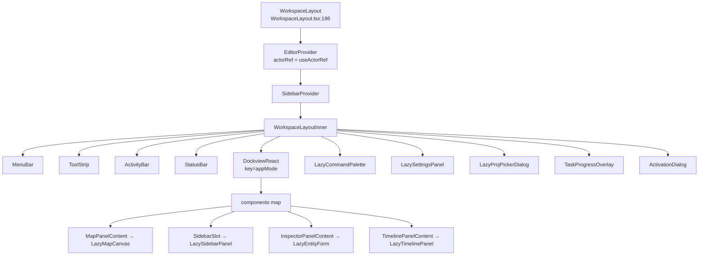
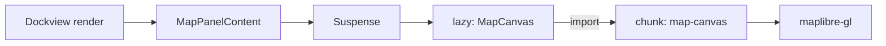
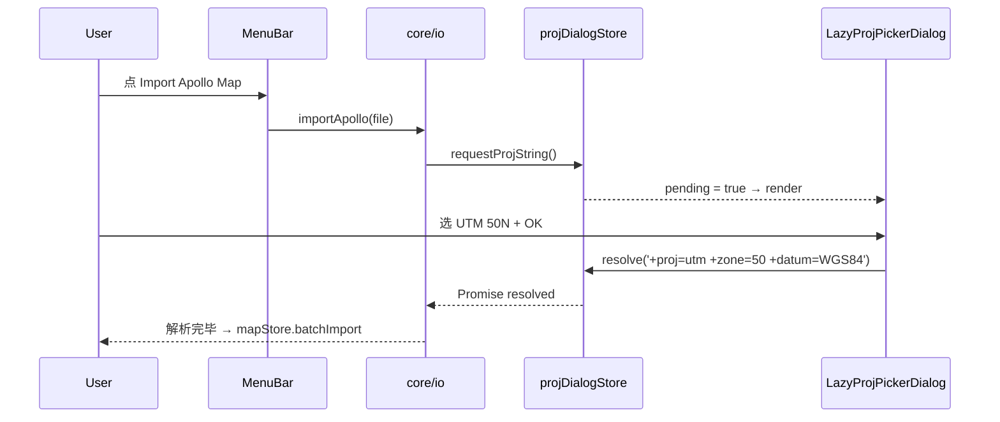

# 工作区布局

Apollo Map Studio 的应用外壳是 `WorkspaceLayout` —— 仿 Photoshop / QGIS 的多面板桌面级
界面。它把 MenuBar、ToolStrip、ActivityBar、StatusBar 与一个 **Dockview** 容器组合到
单一 React 树。本页解释面板注册、懒加载、布局持久化、按 AppMode (drawing/scene) 分
storage key 的策略，以及"重置布局"如何工作。

## 1. 设计目的与不变量

::: tip 设计目标

- 面板可拖、可分屏、可保存到 localStorage
- 切换 AppMode (绘图模式 ↔ 场景模式) 互相隔离布局
- 子面板按需懒加载 (Map / Inspector / Sidebar / Timeline / CommandPalette / SettingsPanel / ProjPickerDialog)
- 顶层组件只有一个 actor (FSM)；所有 panel 共享同一份 actorRef
  :::

::: warning 不变量

- `WorkspaceLayoutInner` 必须在 `EditorProvider` + `SidebarProvider` 之内 —— 见
  `WorkspaceLayout.tsx:186-195`。
- `useEditorActor()` 必须返回同一个 `actorRef`；任何 `useActorRef(editorMachine)`
  在子面板内重新创建都会得到独立 actor，FSM 状态会分裂。
- Dockview `key={appMode}` —— mode 切换会强制重建 Dockview 实例，因此 `onReady` 闭包
  捕获的 `appMode` 不会过期。
  :::

## 2. 模块地图



## 3. 公共表面 (导出符号)

| 符号                                | 文件                                                         | 角色                                        |
| ----------------------------------- | ------------------------------------------------------------ | ------------------------------------------- |
| `WorkspaceLayout`                   | `src/components/layout/WorkspaceLayout.tsx:186`              | 顶层导出，整个 App 的根                     |
| `WorkspaceLayoutInner`              | 同文件:41                                                    | 私有；接受 `EditorProvider` 注入的 actorRef |
| `createDefaultLayout`               | `src/components/layout/WorkspaceLayout/dockviewLayout.ts:34` | 第一次进入 / Reset Layout 时调用            |
| `loadLayout`                        | 同文件:21                                                    | 启动时尝试还原                              |
| `saveLayout`                        | 同文件:13                                                    | `onDidLayoutChange` 事件持久化              |
| `clearSavedLayout`                  | 同文件:9                                                     | 清除 storage                                |
| `LazyCommandPalette`                | `WorkspaceLayout/lazyPanels.tsx:21`                          | command palette lazy import                 |
| `LazySettingsPanel`                 | 同文件:26                                                    | 设置面板                                    |
| `LazyProjPickerDialog`              | 同文件:31                                                    | PROJ.4 选择器                               |
| `MapPanelContent`                   | 同文件:57                                                    | 地图主面板                                  |
| `makeSidebarPanel`                  | 同文件:69                                                    | 工厂：注入 `onOpenSettings` 回调            |
| `InspectorPanelContent`             | 同文件:79                                                    | 检查器（依赖 FSM 选中态）                   |
| `TimelinePanelContent`              | 同文件:114                                                   | 时间线（仅 scene mode）                     |
| `OverlayFallback` / `PanelFallback` | 同文件:41-55                                                 | Suspense fallback                           |

## 4. Dockview 面板注册

```ts
// WorkspaceLayout.tsx:56-61
const components = useRef({
  map: MapPanelContent,
  sidebar: makeSidebarPanel(openSettings),
  inspector: InspectorPanelContent,
  timeline: TimelinePanelContent,
}).current;
```

- 必须 `useRef` 锁住 components map —— Dockview 把它视作 _稳定_ 引用；每次 render 给新对象会触发 panel re-mount。
- `makeSidebarPanel(openSettings)` 是工厂模式：它把"打开设置"回调闭包进 panel，避免给每个 panel 单独写 prop pipe。

## 5. 布局持久化

```ts
// dockviewLayout.ts:4-7
const LAYOUT_KEY_BY_MODE: Record<AppMode, string> = {
  drawing: 'ams-layout-v3-drawing',
  scene: 'ams-layout-v3-scene',
};
```

- 每个 AppMode 用独立 key —— 切换模式时不会污染对方布局。
- `v3` 后缀是 schema 版本：未来 dockview 升级或我们调整面板结构时 bump 一次，让旧用户的 storage 自动失效。
- `loadLayout` 在异常时静默 `clearSavedLayout` —— 不阻塞用户进入 App。

## 6. Reset Layout

`handleResetLayout` (`WorkspaceLayout.tsx:80-86`)：

1. `clearSavedLayout(appMode)`
2. `apiRef.current.clear()` —— 清空所有 panel
3. `createDefaultLayout(apiRef.current, appMode)` —— 按当前 mode 重建

`drawing` mode 默认布局：`map` 居中，`sidebar` 左 240px，`inspector` 右 280px。
`scene` mode 在此之上叠加 `timeline` 底部 180px。

## 7. 懒加载策略



| 面板                   | 触发时机                 | 估算 chunk 大小               |
| ---------------------- | ------------------------ | ----------------------------- |
| `LazyMapCanvas`        | 首次进入 App             | 主要：maplibre-gl ~250KB gzip |
| `LazySidebarPanel`     | 首次进入                 | small                         |
| `LazyTimelinePanel`    | 切到 scene mode          | small                         |
| `LazyCommandPalette`   | 第一次按 Cmd+K           | cmdk ~30KB                    |
| `LazySettingsPanel`    | 第一次打开设置           | small                         |
| `LazyProjPickerDialog` | 导入无投影的 Apollo 地图 | small                         |
| `LazyEntityForm`       | 第一次选中实体           | RHF + zod 解析器              |

::: warning panel-level Suspense
每个 panel 自己包 Suspense (`MapPanelContent` 在 `lazyPanels.tsx:60`)，避免一个面板
加载失败 / 慢时拖累整个 dockview。
:::

## 8. 与全局 store 的交互

| store            | 在 WorkspaceLayout 中的用法                                           |
| ---------------- | --------------------------------------------------------------------- |
| `useMapStore`    | `WorkspaceLayout.tsx:46` 取 `entities.size` 给 StatusBar              |
| `useUIStore`     | `:47` 取 `appMode`；切换会触发 Dockview 重建                          |
| `useEditorActor` | `:43` 取 `actorRef` 与 `currentState` (state.value) / `activeElement` |
| `useLicenseSync` | `:42` 注入：与 main 进程双向同步 license state                        |

## 9. 内部细节：Cmd/Ctrl+K 打开 palette

```ts
// WorkspaceLayout.tsx:63-77
useEffect(() => {
  const handleKeyDown = (event: KeyboardEvent) => {
    if (event.key === 'k' && (event.metaKey || event.ctrlKey)) {
      event.preventDefault();
      setCommandPaletteOpen((open) => !open);
    }
    if (event.key === 'Escape') setCommandPaletteOpen(false);
  };
  document.addEventListener('keydown', handleKeyDown);
  return () => document.removeEventListener('keydown', handleKeyDown);
}, []);
```

虽然 Cmd+K 也在 `ACTION_DEFS` 里 (`registry/definitions.ts:134-141`)，但 palette 自己
独立处理打开 / 关闭 —— 避免 palette 关闭后立即重新打开的循环。

## 10. 顺序图：导入 Apollo 地图触发 PROJ picker



## 11. 常见陷阱

::: danger 不要在 WorkspaceLayoutInner 之外创建第二个 actor
`useActorRef(editorMachine)` 应该 **只** 在 `WorkspaceLayout.tsx:187` 出现一次。
其他地方需要 actorRef 的，请通过 `useEditorActor()` 拿。
:::

::: danger Dockview 的 components map 不能每次 render 都重建
违反会导致每次 render 都 unmount + remount panel，丢失内部状态。本仓库用
`useRef({...}).current` 锁住一份。
:::

::: danger 切换 AppMode 时 Dockview 实例销毁
`key={appMode}` 让 React 销毁旧实例。`apiRef.current` 在切换瞬间会指向旧 api，但
新的 `onReady` 会立即覆盖它。任何持有 `apiRef.current` 的 setTimeout 必须先做空检查。
:::

## 12. Source map (file:line refs)

- `src/components/layout/WorkspaceLayout.tsx:1-37` — imports
- `:41-115` — `WorkspaceLayoutInner` (state、effects、回调)
- `:117-181` — JSX 主体
- `:186-195` — 顶层包装 + Provider
- `src/components/layout/WorkspaceLayout/dockviewLayout.ts:1-60` — 布局存取
- `src/components/layout/WorkspaceLayout/lazyPanels.tsx:1-120` — 懒加载与 panel content
- `src/store/uiStore.ts:29` — `AppMode`

## 13. ToolStrip 与 currentState 的关系

```ts
// WorkspaceLayout.tsx:127-133
<ToolStrip
  currentTool={currentState}
  currentElement={activeElement as MapElementType | null}
  onSelectTool={handleSelectTool}
  onOpenCommandPalette={() => setCommandPaletteOpen(true)}
  onExecuteAction={execute}
  getToggleState={getToggleState}
/>
```

`currentTool` 来自 `useSelector(actorRef, s => s.value as string)`，因此
`drawPolyline` / `drawArc` / `idle` 等都直接驱动 ToolStrip 的"激活按钮"高亮。
`currentElement` 让 ToolStrip 知道用户在画 Apollo lane 还是普通 polyline，从而
显示正确的子分类指示。

## 14. ActivityBar 与 SidebarContext

`ActivityBar` 是左侧的 tab 栏 (Project / Layer / Search ...)。它走 `SidebarContext`
而不是 store —— 因为侧栏 tab 切换 **不应** 触发 mapStore re-render。`SidebarProvider`
(`src/context/SidebarContext.tsx`) 是 React Context，仅在 WorkspaceLayoutInner 树内
有效。

## 15. StatusBar 数据源

```ts
// WorkspaceLayout.tsx:149
<StatusBar mode={currentState} entityCount={entityCount} />
```

`entityCount = useMapStore(s => s.entities.size)` —— 单字段 selector 让 StatusBar
只在实体计数变化时重渲染。`mode` 同步 FSM state.value。

## 16. License sync 的位置

`useLicenseSync()` 必须在 `WorkspaceLayoutInner` 顶层调用一次 (`:42`)。它内部
注册 `licenseBridge.onChange` 把 main 进程 state 镜像到 `licenseStore`。如果在
子面板调用会出现两个独立 listener，导致 license 改变时双倍 setState。

## 17. ActivationDialog 始终挂载

```ts
// WorkspaceLayout.tsx:179
<ActivationDialog />
```

不走 lazy。原因：`licenseStore.promptActivation` 是**任意**地方都可能触发的回调，
若 dialog 是 lazy 的，第一次激活请求会等 chunk 加载完再弹，UX 体感很差。Dialog
本身体积小 (≈3 KiB)，eager 挂载没有性能成本。

## 18. AppMode 切换的副作用

| 副作用               | 来源                                                                        |
| -------------------- | --------------------------------------------------------------------------- |
| Dockview 重建        | `key={appMode}` 强制 React 销毁旧实例                                       |
| 布局还原             | `loadLayout(api, appMode)` 读对应 storage key；失败则 `createDefaultLayout` |
| Timeline 出现 / 消失 | `createDefaultLayout` 仅在 scene mode 添加                                  |
| FSM 状态保留         | actor 不重建；`drawPoints` 等不丢                                           |
| mapStore 保留        | 实体不动；只是布局变                                                        |

## 19. 性能笔记

| 操作                 | 估算耗时                                        |
| -------------------- | ----------------------------------------------- |
| 切换 AppMode         | ~50–80 ms (Dockview 重建 + lazy panel 重 mount) |
| Reset Layout         | ~20–30 ms                                       |
| 拖动 split bar       | < 1ms / frame (Dockview 内部用 transform)       |
| 第一次开 Cmd+K       | ~80 ms (cmdk chunk 加载)                        |
| 选中 entity 第一次开 | ~120 ms (LazyEntityForm chunk + RHF 初始化)     |

## 20. 与 ARCHITECTURE.md 的字段对齐

`ARCHITECTURE.md` 顶层把 `WorkspaceLayout` 列为"应用外壳"。本页是它的展开版：

- 单页表说"基于 dockview-react"，本页给出具体 panel 注册细节；
- 单页表说"reset layout 走 menu action"，本页给出 `clearSavedLayout` + `clear` +
  `createDefaultLayout` 的三步流程；
- 单页表说"appMode 控制 panel 集合"，本页解释 `key={appMode}` 触发 Dockview 重建。

## 21. 进一步阅读：DESIGN.md §3

`DESIGN.md §3` 把整个系统划分为 5 层 (数据 / 计算 / 控制 / 渲染 / UI)。WorkspaceLayout
属于第 5 层 (App UI)；它通过 props pipe 把第 1-4 层的能力暴露给用户。本页所说的
"挂 Dockview / FSM Provider / License Hooks" 三件事，正是第 5 层的"组装职责"。

## 22. 调试技巧

::: tip 检查布局 JSON
按 F12 → console → `localStorage.getItem('ams-layout-v3-drawing')` 可看当前布局序列化结果。
怀疑 panel 错位时直接清掉再 reload。
:::

::: tip 检查 actor 状态
`actorRef.getSnapshot()` 在控制台返回 FSM state.value + context。验证 `drawPoints` /
`activeElement` 是否符合预期。
:::

::: tip Dockview 不显示 panel
通常因为 panel 注册名与 `addPanel({ component })` 不一致；检查 `WorkspaceLayout.tsx:56-61`。
:::

## 23. See also

- [架构总览](./overview.md)
- [状态管理](./state-management.md) — uiStore 中的 appMode
- [Action Registry](./action-registry.md) — Reset Layout、Settings、Command Palette
- [FSM 设计](./fsm-design.md)
- [License 系统](./license-system.md) — useLicenseSync
