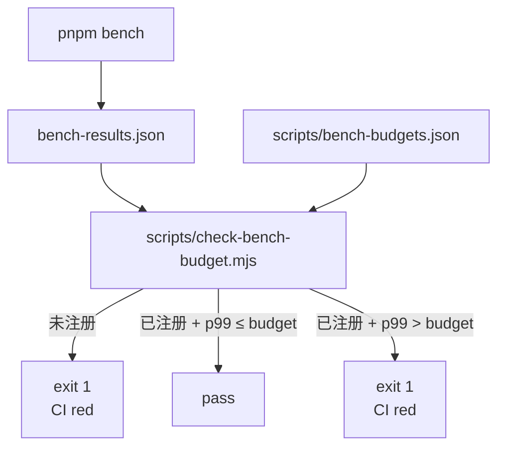

# 基准测试

性能不是模糊感觉，是 **数字**。`pnpm bench` 跑 vitest bench，
`scripts/check-bench-budget.mjs` 在 CI 把 p99 与 `bench-budgets.json`
对比，超预算 = CI 红。

::: tip 三段

1. **写 bench** —— `*.bench.ts` 用 `bench()`。
2. **跑 bench** —— `pnpm bench`，看本地数。
3. **看预算** —— `node scripts/check-bench-budget.mjs bench-results.json`，
   超了就改算法或调预算。
   :::

## 命令速查

```bash
pnpm bench                                              # 稳定门禁模式，单 worker 跑全部
pnpm bench:fast                                         # 本地尽量使用所有 worker
pnpm bench src/core/workers                             # 子目录
pnpm bench --outputJson bench-results.json              # 写 JSON
node scripts/check-bench-budget.mjs bench-results.json  # 预算检查
```

`pnpm bench` 显式传 `--maxWorkers=1`，用于 CI 和本地预算门禁，避免多个
benchmark 文件抢满 CPU 后放大 p99 抖动。`bench:fast` 显式传
`--maxWorkers=100%`，适合本地快速摸底，但不要用它的 p99 判定预算是否通过。

CI 步骤（[`.github/workflows/ci.yml`](https://github.com/SakuraPuare/apollo-map-studio/blob/main/.github/workflows/ci.yml)
`check` job）：

```yaml
- name: Benchmarks
  run: pnpm bench --outputJson bench-results.json

- name: Perf budget guard
  run: node scripts/check-bench-budget.mjs bench-results.json
```

## 写一个 bench

```ts
// src/core/geometry/offsetPolyline.bench.ts
import { bench } from 'vitest';
import { offsetPolyline } from './offsetPolyline';

const points: [number, number][] = Array.from({ length: 100 }, (_, i) => [i, 0]);

bench('offsetPolyline 100 points / 1m offset', () => {
  offsetPolyline(points, 1);
});
```

`bench()` 会跑多轮 warmup + 测量，Vitest 4 默认输出 mean / p50 / p99。

::: warning bench 输入要稳定
不要在 bench 里 `Math.random()`，每轮输入都不一样会让 p99 噪音爆表。
固定输入或种子化随机：

```ts
const seed = 12345;
let rng = seed;
function next() {
  return (rng = rng * 1664525 + 1013904223) >>> 0;
}
```

:::

## 预算文件 (bench-budgets.json)

```json
{
  "budgets": {
    "offsetPolyline 100 points / 1m offset": { "p99Ms": 0.5 },
    "spatial.worker SYNC 1k entities": { "p99Ms": 35 },
    "laneJunctionGraph rebuild 500 lanes": { "p99Ms": 12 }
  }
}
```

字段：

- 键 = bench `name`（必须精确匹配，含空格 / 标点）。
- `p99Ms` = 99 百分位毫秒上限。

::: tip p99 不是 p100
`p100 = max` 太抖，CI 上偶发会乱红。`p99` 容纳尾部，又不让明显回退过关。
:::

## CI 预算检查流程



未注册的 bench 会直接失败。新增 bench 时必须同步加预算，否则 CI 无法判断
它是否退化。

## 设一个预算

### 第一次

1. 写 `*.bench.ts`。
2. 本地跑 `pnpm bench --outputJson bench-results.json`。
3. 看 `name` 与 `p99` 数。
4. 在 `scripts/bench-budgets.json` 加一行，**比当前 p99 高 30%** 作为
   缓冲：

```json
"my new bench / 1k items": { "p99Ms": 13 }
```

::: warning 不要贴着实测设
当前 p99 = 10ms 就设 10ms = CI 一定红。预留 30% 缓冲应对机器波动。
:::

### 提交

```
chore(bench): seed budget for offsetPolyline / 1k items

Initial p99 = 9.8 ms on Apple M1; budget = 13 ms (~30 % headroom)
to absorb GitHub runner variance.
```

## 调一个预算

### 算法变快了 → 收紧

```json
"existing bench": { "p99Ms": 5 }   // was 10
```

提交：

```
perf(geometry): vectorize offset computation

Bench p99 drops from 9.2 ms to 3.1 ms.
Budget tightened from 10 ms to 5 ms.
```

::: tip 收紧预算是好事
保留低水位防回退；不要因为 "之后可能慢" 就留虚高预算。
:::

### 算法不得不变慢 → 放宽 + 解释

```
perf(workers): switch to dijkstra over a*

Bench p99 rises from 22 ms to 35 ms because the graph contains negative
edge weights now (PNCJunction). Budget raised from 25 ms → 40 ms with
a comment in bench-budgets.json explaining the trade-off.
```

::: danger 不要在 PR 里偷偷调预算
"算法没动但预算从 10 改成 50" 是危险信号。reviewer 必须问：你是 patch
了一个 regression 吗？解释或拒绝。
:::

## 现有 bench 区域

| 区域                       | 关注的契约                                   |
| -------------------------- | -------------------------------------------- |
| `offset polyline geometry` | 10 / 100 / 1000 点 offset 的 p99 上限        |
| `lane junction derivation` | 全量 stitch 与 1 / 3 lane 增量装饰 p99 上限  |
| `lane topology reconcile`  | 全量 / 单 dirty 拓扑派生在多规模下的 p99     |
| `overlap reconcile`        | full 重算随规模线性；dirty 增量近似常数      |
| `spatial index syncDirty`  | 单 dirty 更新不随全图实体数增长              |
| `interaction geometry`     | snap、hit-test 距离、polygon validation      |
| `lane boundary brush`      | 边界刷拖动命中扫描与 boundaryType 归一化     |
| `spatial worker pipeline`  | sync、cold feature rebuild、delta、hit-test  |
| `cold/hot/overlay/grid`    | 主线程 source diff/update 与预览构造         |
| `entityOps/mapStore`       | 引用清理、reparent、store 写事务             |
| `worker/IO chunking`       | 主线程 2k 分块 slice / progress 循环         |
| `proto pipeline`           | bridge、bounds、projection、roundtrip、codec |

详见 `scripts/bench-budgets.json`（[源码](https://github.com/SakuraPuare/apollo-map-studio/blob/main/scripts/bench-budgets.json)）。

## 预算文件结构

`scripts/check-bench-budget.mjs` 递归遍历 vitest 的 JSON：

```text
{ files: [{ groups: [{ benchmarks: [{ name, p99, ... }] }] }] }
```

收集 `(name, p99)` 叶子，对比预算。可以未来扩字段（比如 `p50Ms`、
`meanMs`），但当前只读 `p99`。

## 跨平台波动

CI 跑在 GitHub `ubuntu-latest`（虚拟机，性能波动 ±20%）。所以预算要：

- 留 30% 缓冲。
- 对 < 1ms 的 bench 放宽到 50% 缓冲（噪音绝对值占比大）。
- 跨 PR 复现 → 失败 → 复现 → 失败 = 真回退；偶尔单次失败 = 噪音，
  rerun。

::: warning 不要为 flaky 关 bench
如果一个 bench 经常 flaky 但偶尔捕捉到真回退，**调 budget 不删 bench**。
删了等于失明。
:::

## 何时 bench

| 改动                      | 加 bench？              |
| ------------------------- | ----------------------- |
| 新增几何算法              | ✅                      |
| 新增 worker pipeline      | ✅                      |
| 改 import / export 编解码 | ✅                      |
| 改 cold layer 编译        | ✅                      |
| UI 组件                   | ❌（用 React Profiler） |
| 文档                      | ❌                      |

::: tip 加 bench 的判断
"如果这块代码慢 10 倍，用户能感知吗？" 能 = 加 bench。
:::

## 与单测分离

`*.bench.ts` 用 `bench()`，`*.test.ts` 用 `it()`。

```ts
import { bench, expect, it } from 'vitest';
// bench 文件可以 import test 工具，但不要 mix 在一个文件里。
```

`pnpm test` 不跑 bench，`pnpm bench` 不跑 test，互不干扰。

## 用 Profiler 配合 bench

bench 给数字，Profiler 给火焰图。

DevTools Performance：

1. `pnpm dev` 启动。
2. Performance 面板 Record 5s。
3. 跑你的复现操作。
4. 看 Bottom-Up 视图找最贵的函数。
5. 加 bench 锚住该函数。

::: tip 火焰图里看到的常见 hot spot

- `JSON.parse` / `structuredClone` 大对象 — 用 transferable 替换。
- `Array.prototype.push` 在大循环里 — preallocate。
- `Object.assign` / 展开运算符 — 直接写 mutation（在 immer producer 里）。
  :::

## 常见坑 (Common pitfalls)

### bench 不报数

`bench()` 名字与 `bench-budgets.json` 不一致 = 视为未注册并失败。
精确复制 name 字符串（含空格）。

### p99 跟 p50 差异巨大

输入抖动太大。固定输入或种子化。或用 `iterations` 增加样本：

```ts
bench('foo', () => foo(input), { iterations: 10000 });
```

### "本地快但 CI 慢"

GitHub runner ~50% 性能 of M1 / Ryzen 工作站。预算按 CI 设，不按本地。

### bench 卡住

某个 bench 跑超过 30s = 算法退化或死循环。先 `vi.setConfig({ testTimeout: 5000 })`，
然后定位。

## 相关源码 (Source links)

- [`scripts/check-bench-budget.mjs`](https://github.com/SakuraPuare/apollo-map-studio/blob/main/scripts/check-bench-budget.mjs)
- [`scripts/bench-budgets.json`](https://github.com/SakuraPuare/apollo-map-studio/blob/main/scripts/bench-budgets.json)
- [`vite.config.ts`](https://github.com/SakuraPuare/apollo-map-studio/blob/main/vite.config.ts) — vitest bench 配置
- [Vitest bench docs](https://vitest.dev/api/#bench)

## 进阶 (Advanced)

### 历史轨迹

可以把每次 CI 的 `bench-results.json` 上传到 artifact，再写脚本画
trend。当前未启用。

### bench diff

PR 模板里加一段 "before / after" p99 表，让 reviewer 直观看。

```
| Bench                                  | Before | After |
| -------------------------------------- | ------ | ----- |
| offsetPolyline 100 points / 1m         |   0.5  |  0.3  |
| spatial.worker SYNC 1k entities        |  32    | 23    |
```

::: tip 一句话
**性能改动必须用数字证明**。bench 是真相，feel 是噪音。先有数字，再
讨论 trade-off。
:::
