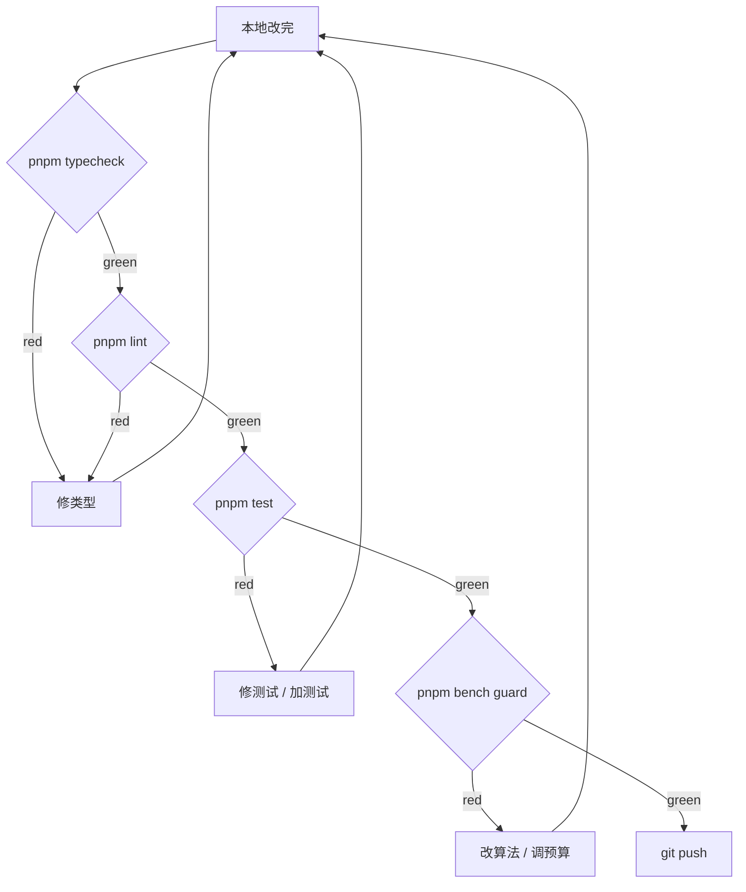

# PR 清单

本清单是 **必须** 在请求 review 前自检的项目。CI 会跑大部分，但
**人** 必须先看一遍——否则 reviewer 等 CI 红再返工，节奏被打断。

::: tip 三段式

1. **机器能验的** —— 自动跑通（typecheck、lint、test、bench）。
2. **人脑要想的** —— 范围、命名、可读性、设计。
3. **架构纪律** —— 分层、anti-corruption、撤销路径。
   三者过齐才请求 review。
   :::

## 机器自检 (Automated checks)

```bash
pnpm typecheck       # tsc + tsc -p tsconfig.electron.json
pnpm lint            # ESLint
pnpm format:check    # Prettier
pnpm test            # Vitest run
pnpm bench           # Vitest bench
node scripts/check-bench-budget.mjs bench-results.json
pnpm build:web       # 验生产构建
pnpm docs:build      # 改 docs 的话
```



`pnpm typecheck` 包含两个 tsc 调用 —— web 与 electron 各一份 config。
新 electron API 用法漏网很常见，记得跑 electron 那份。

## 范围纪律 (Scope discipline)

### 一个 PR = 一件事

- 改 bug 不要顺手 refactor。
- 加 feature 不要把无关 dep 升级捎带。
- 重命名遍布 50 文件单独 PR。

::: warning 跨 scope 的"清理"
看到不顺眼的代码？记下 issue 编号，**不要** 在当前 PR 里改。理由：

- review 时焦点分散。
- 回滚时连无辜代码一起退。
- 责任归属乱（你这 PR 测试到底覆盖了 feature 还是清理？）。
  :::

### PR 大小经验值

| 规模          | 影响                                |
| ------------- | ----------------------------------- |
| ≤ 200 行 diff | review 1 小时内反馈，merge 当日     |
| 200-500 行    | review 半天到一天                   |
| 500-1000 行   | 拆，否则进度走形                    |
| > 1000 行     | **必须拆**（除非自动重命名 / 升级） |

## 提交信息 (Commit messages)

每个 commit 都符合 [Commit Conventions](./commit-conventions)：

- type + scope + subject。
- body 写"为什么"。
- 一个提交 = 一件事。
- 没有 `Co-Authored-By`。
- husky `commit-msg` 全部通过。

## 分层规则 (Layering)

```
components/  ← UI
  ↓
hooks/
  ↓
store/
  ↓
lib/
  ↓
core/
```

**禁** 反向 import。审查命令：

```bash
grep -R "from '@/components/" src/core/ src/lib/ src/store/ src/hooks/
grep -R "from '@/hooks/"      src/core/ src/lib/ src/store/
grep -R "from '@/store/"      src/core/ src/lib/
grep -R "from '@/lib/"        src/core/
# 应当全部为空
```

## Anti-corruption 审查

任何触碰 Apollo proto 的逻辑必须经 `entityOps`，不能直接 import
`@/core/geometry/apolloCompile`。

```bash
git grep "from '@/core/geometry/apolloCompile'" -- 'src/components/**' 'src/hooks/**'
# 应当为空
```

非空 = 你引入了新泄漏，先修。详见
[Architecture: Anti-corruption Layer](../architecture/anti-corruption)。

## 撤销路径 (R1)

任何改 mapStore entities 的代码：

- [ ] zundo 记录到了？
- [ ] 撤销后 FSM 不残留状态？
- [ ] 跑 `undoCancel.test.ts` 通过？
- [ ] 手测 mid-draw Ctrl+Z 不崩？

详见 [State Management R1](../architecture/state-management#r1-undo-fix)。

## 性能 (Perf)

- [ ] 跑 `pnpm bench`，predicate 触发的 bench 没有 > 10% 退化。
- [ ] 1k entities 操作 p99 帧时间 < 16ms。
- [ ] 改 worker 的 PR：附 DevTools Performance 截图（before/after）。
- [ ] 引入新依赖的 PR：`pnpm build:web` 后 dist 总大小变化 < 100kb 或附理由。

## 测试 (Tests)

新功能：

- [ ] 单测覆盖 happy path + 1 个 edge case。
- [ ] 涉及 FSM 的：FSM 路径测试。
- [ ] 涉及 import/export：round-trip 测试。
- [ ] 涉及 worker：分离纯函数 + 单测，OR 端到端 worker 测。

修 bug：

- [ ] **必须** 加回归测试。bug 没有测试 = bug 会再来。
- [ ] 测试名引用 issue 或 commit hash。

## UI 改动

- [ ] **截图** 贴在 PR description（亮 + 暗主题各一）。
- [ ] 涉及交互：录屏 5 秒。
- [ ] 命中 ams token，不写 hex（见 [Theming](../recipes/theming-with-ams-tokens)）。
- [ ] 键盘可达 / 鼠标焦点可见。

::: tip 截图工具

- macOS：`Cmd+Shift+4` 截区域。
- Linux：`gnome-screenshot -a` 或 `flameshot`。
- 录屏：`peek` (Linux) / `Cmd+Shift+5` (macOS)。
  :::

## 文档 (Docs)

- [ ] 新增公共 API：在 `docs/reference/` 加条目。
- [ ] 改架构：`ARCHITECTURE.md` 与 `docs/architecture/*` 同步。
- [ ] 改命令：`docs/contributing/development-setup.md` 表格更新。
- [ ] 双语保持一致：`docs/...` (zh) 与 `docs/en/...` 都更新。

::: warning 双语漂移
zh 与 en 必须同步。改一边不改另一边一周后必有人发 issue。如果你只能写
一边，明确在 PR 标题加 `[zh-only]` 或 `[en-only]`，并开 follow-up issue。
:::

## License & 法务 (Licensing)

- [ ] 没引入 GPL / AGPL 依赖（与 CC-BY-NC-4.0 不兼容）。
- [ ] 没拷贝外部代码（哪怕注释了）。
- [ ] proto 改动：注明源自 Apollo（保留 Apache 2.0 头）。

## CI 红怎么办

按顺序：

1. **type 错** —— 改类型，不要 `as any`。
2. **lint 错** —— `pnpm lint:fix`，剩余手改。
3. **format 错** —— `pnpm format`。
4. **测试错** —— 看 stderr，本地复现，修。
5. **bench 退化** —— 改算法，或证明退化合理后调预算。
6. **build 错** —— 跨平台 case 问题（路径、行尾）多。

::: danger 不要 `--no-verify`
绕过 husky / 强 push 到 main = 团队信任的耗损。修问题再 push。
:::

## PR 描述模板

```markdown
## Summary

- 一句话目标
- 关键改动 1
- 关键改动 2

## Motivation / 为什么

- 背景或 issue 链接

## Implementation notes

- 选择此方案的原因
- 与 alternative 的对比
- 已知 trade-off

## Screenshots / 录屏

（UI 改动必填）

## Test plan

- [ ] pnpm test
- [ ] pnpm bench guard
- [ ] 手测 X / Y / Z
- [ ] 跨平台（如适用）

## Checklist

- [ ] 双语 docs 同步（如适用）
- [ ] 新增依赖 < 100kb（如适用）
- [ ] anti-corruption audit clean
- [ ] 撤销路径手测
```

## 自查清单 (Self-review checklist)

提 PR 前 **看一遍自己的 diff**：

- [ ] 没残留 `console.log` / `debugger`。
- [ ] 没残留 `// TODO` 没注明 issue 编号。
- [ ] 没注释掉的死代码（删掉，不要留）。
- [ ] 没 `it.only` / `describe.only`。
- [ ] 没新增测试覆盖率为 0 的导出（要么删，要么测）。

::: tip 一个习惯
`git diff main` 然后 **从头到尾读一遍**。读不下去说明 diff 太大或者
逻辑太绕，先拆 PR / 简化。
:::

## 常见拒绝原因 (Common review rejections)

| 原因                        | 修复                     |
| --------------------------- | ------------------------ |
| 单 PR 改太多                | 拆                       |
| 没有撤销测试                | 加 `undoCancel`-style 测 |
| 直接 import apolloCompile   | 走 entityOps             |
| 函数 > 80 行                | 拆函数                   |
| 文件 > 400 行               | 拆兄弟模块               |
| 单测只跑 happy path         | 加 1 个 edge case        |
| `as unknown as`             | 改类型守卫               |
| 提交信息 `wip` / `fix typo` | 改 conventional          |
| 双语 docs 漂移              | 同步另一边               |

## 相关源码 (Source links)

- [`.husky/`](https://github.com/SakuraPuare/apollo-map-studio/tree/main/.husky/)
- [`.github/workflows/ci.yml`](https://github.com/SakuraPuare/apollo-map-studio/blob/main/.github/workflows/ci.yml)
- [Commit Conventions](./commit-conventions)
- [Code Style](./code-style)
- [Architecture: Anti-corruption](../architecture/anti-corruption)

::: warning 不要为了通过 review 而通过 review
如果 reviewer 提的问题你只是为了 merge 而表面应付，6 个月后还会出现
同样的 bug。把 review 当成学习机会，认真理解再修。
:::
