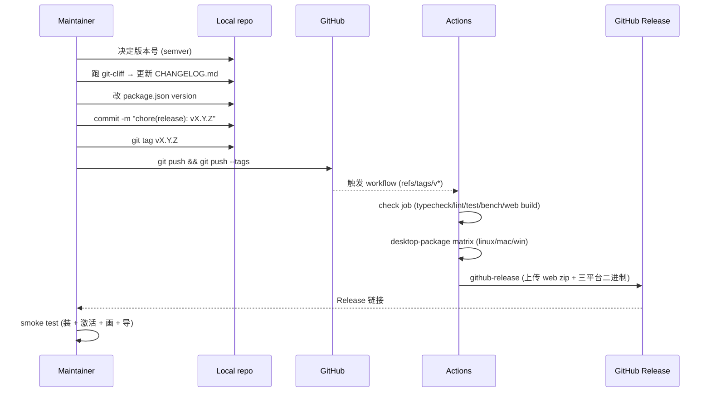
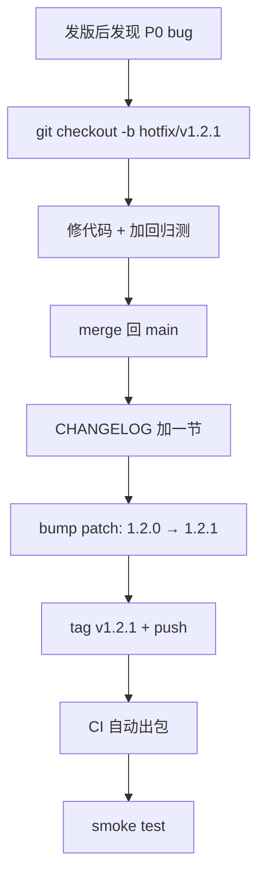

# 发版流程

发版 = bump version + 生成 CHANGELOG + tag + push + 等 CI 出包 +
smoke test。整个过程 **30 分钟内** 走完，无需手动上传。

::: tip 三个核心

1. **CHANGELOG 自动生成** —— `cliff.toml` 解析 conventional commits。
2. **CI 自动打包** —— `tags: [v*]` 触发 desktop-package + github-release。
3. **smoke test** —— 装包跑 5 步保证用户能用。
   :::

## 发版总览



## 步骤 (Step-by-step)

### 1. 决定版本号 (semver)

| 改动                       | 等级  | 例            |
| -------------------------- | ----- | ------------- |
| 仅 docs / chore / refactor | patch | 1.0.0 → 1.0.1 |
| feat / perf 不破坏 API     | minor | 1.0.1 → 1.1.0 |
| BREAKING CHANGE            | major | 1.1.0 → 2.0.0 |

::: warning 看 `git log` 决定
跑 `git log v<last>..HEAD --oneline`，看是否有 `feat:` / `BREAKING`。
不要凭印象决定。
:::

### 2. 检查 main 干净

```bash
git checkout main
git pull
git status        # working tree clean
git log --oneline v<last>..HEAD   # 确认要发的 commits
```

### 3. 跑预检 (Pre-flight checks)

```bash
pnpm typecheck
pnpm lint
pnpm format:check
pnpm test
pnpm bench --outputJson bench-results.json
node scripts/check-bench-budget.mjs bench-results.json
pnpm build:web
pnpm docs:build
pnpm build:desktop      # 验主进程编译
```

任一红就停。回去修，不要 release 一个坏版本。

### 4. 生成 CHANGELOG

```bash
pnpm exec git-cliff -o CHANGELOG.md
```

`cliff.toml` 自动归类：

```markdown
## [1.2.0] - 2026-05-15

### 🚀 Features

- _(actions)_ Add edit.duplicateSelection
- _(fsm)_ Add drawEllipse FSM state

### 🐛 Bug Fixes

- _(fsm)_ Cancel before temporal.undo() in dispatcher

### ⚡ Performance

- _(workers)_ Incremental cold-layer update
```

::: tip 检查输出
看一遍 CHANGELOG，确认没有 unconventional commits 漏归类（cliff 默认
丢到 "💼 Other"）。如果看到 Other 节有内容，说明历史里有 unconventional
commit；要么修，要么手动归类后再写一次。
:::

### 5. bump 版本号

改三处：

```jsonc
// package.json
{
  "version": "1.2.0",
}
```

```jsonc
// tools/license-gen/package.json (可选；如果 issue.mjs 里嵌入了 version)
```

```yaml
# electron-builder.yml 通常自动从 package.json 读，无需改
```

::: warning 不要用 npm version
`npm version` 会自动 commit + tag，但 message 不是 conventional 格式。
手动 commit 才能控制信息。
:::

### 6. 提交 & tag

```bash
git add CHANGELOG.md package.json
git commit -m "chore(release): v1.2.0

- 关键变更摘要 1
- 关键变更摘要 2

See CHANGELOG.md for full details."

git tag v1.2.0
```

::: danger tag 必须以 `v` 开头
CI workflow 配置 `tags: [v*]`，没 `v` 不触发 release job。
:::

### 7. push

```bash
git push origin main
git push origin v1.2.0
```

### 8. 等 CI

打开 GitHub Actions 页：
`GitHub Actions`

Workflow 三个 job：

| Job               | 时长    | 失败影响               |
| ----------------- | ------- | ---------------------- |
| `check`           | ~5 min  | 所有后续 job block     |
| `desktop-package` | ~15 min | 只该平台艺术品缺失     |
| `github-release`  | ~2 min  | 二进制不上传到 Release |

::: tip 失败如何回滚？
`git push --delete origin v1.2.0` 删 tag，本地 `git tag -d v1.2.0`，修
完再 tag。已发的 GitHub Release 手动删（页面有 "Delete this release"）。
:::

### 9. Release 页校验

到 `releases/tag/v1.2.0`：

- [ ] CHANGELOG 节有内容（自动从 commit 生成 release notes 可选）。
- [ ] `apollo-map-studio-web.zip` 存在。
- [ ] `Apollo Map Studio-1.2.0-mac-x64.dmg` 等 mac 制品存在。
- [ ] `*.exe` 与 `*.zip` Windows 制品存在。
- [ ] `*.AppImage` 与 `*.deb` Linux 制品存在。

### 10. Smoke test

每个平台至少一台真机：

1. **下载** 安装包。
2. **安装** —— Linux 双击 AppImage / `dpkg -i deb`，macOS 拖到
   Applications / Windows 跑 .exe。
3. **激活** —— 用测试激活码（[签发](../recipes/issuing-license-keys)）。
4. **导入** —— 打开 `map_data/sample/` 里的示例 map。
5. **画一条 lane** —— ToolStrip 选 polyline，点几个点，回车 commit。
6. **导出** —— File → Export → Apollo Binary，输出文件大小合理。
7. **卸载** —— Linux `dpkg -r` / macOS 拖回收 / Windows 控制面板。

5 步通过 = 用户能跑。一步挂了 = hot fix 紧急发版。

### 11. 通知

- 内部：发频道，附 release 链接 + CHANGELOG 节选。
- 外部：博客 / X / 邮件，按市场流程。
- 文档站：banner 公告（可选）。

## 紧急 hot fix 流程



时间预算：4 小时内出 hot fix。超过 = 团队 retrospect。

## 版本撤回 (revert)

::: danger 极少做
GitHub Release 一旦下载分发出去，撤回不会让用户没装。撤回只是阻止
**新** 用户拿到坏版本。

撤回操作：

1. GitHub UI → Edit release → 标记 "Pre-release" 或删除。
2. 在 README / 文档站 banner 警告。
3. 立即发 vX.Y.Z+1 hot fix。
4. 在新 release notes 顶部说明 "v1.2.0 has been retracted, please use 1.2.1."
   :::

## CHANGELOG 风格

`cliff.toml` 已配，但仍有人工裁量：

- 同一 scope 多条合并？
  - **不合并**。每条都是独立可回滚单元。
- 写出每个 PR / issue 编号？
  - cliff 默认不渲染。需要的话改 `cliff.toml.changelog.body`。
- 中文 release notes？
  - CHANGELOG 用英文（开发记录）。中文 release notes 在博客 / 文档站
    单独写。

## 与 `tools/license-gen` 协调

主版本升级（1.x → 2.x）通常意味着：

- 新公钥（旧激活码作废）。
- proto schema breaking changes（旧 map 文件需 migration）。
- electron 升级（新 Node ABI）。

**不要** 在 minor 里做这些事。强制用户感知 = major 信号。

## 文档站发版

```bash
pnpm docs:build
# 部署 docs/.vitepress/dist 到静态托管 (GitHub Pages / Netlify / 自建)
```

CI 已配 `docs-preview.yml`（PR 预览）。生产部署看团队配置。

## 相关源码 (Source links)

- [`cliff.toml`](https://github.com/SakuraPuare/apollo-map-studio/blob/main/cliff.toml)
- [`.github/workflows/ci.yml`](https://github.com/SakuraPuare/apollo-map-studio/blob/main/.github/workflows/ci.yml)
- [`electron-builder.yml`](https://github.com/SakuraPuare/apollo-map-studio/blob/main/electron-builder.yml)
- [`package.json`](https://github.com/SakuraPuare/apollo-map-studio/blob/main/package.json) — scripts
- [Packaging Desktop Builds](../recipes/packaging-desktop-builds)
- [Issuing License Keys](../recipes/issuing-license-keys)

## 进阶 (Advanced)

### 多 channel (stable / beta)

```bash
git tag v1.3.0-beta.1
git push origin v1.3.0-beta.1
```

CI 一样触发，但可以在 release notes 标 "Pre-release"。
electron-updater 配多 channel 后能让 beta 用户接收 beta 包。

### 自动 release notes

GitHub 的 "Auto-generate release notes" 功能可以从 PR 标题自动拼。
但与 cliff 重复且不归类，关掉用 cliff 输出更可控。

### 签名 + 公证 自动化

CI 上做 macOS 公证：

- secrets：MAC_CSC_LINK / MAC_CSC_KEY_PASSWORD / APPLE_ID /
  APPLE_APP_SPECIFIC_PASSWORD / APPLE_TEAM_ID。
- workflow `desktop-package` job 在 macos-latest 跑时设置环境变量。

未启用，启用前请确认证书 + 公证流程在本地走通。

::: tip 一句话
**版本号是承诺，CHANGELOG 是合约**。bump 之前确认 commit history 干净，
push 之后确认 smoke test 通过，发布之后才算结束。
:::
